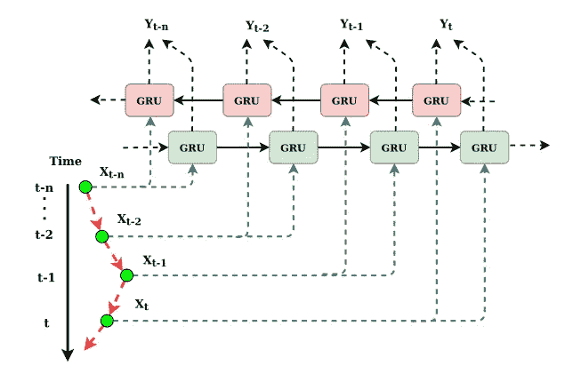
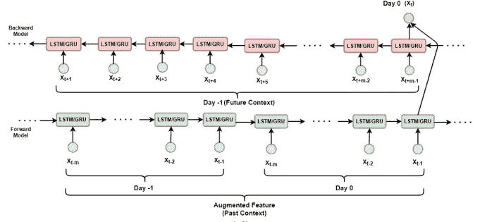
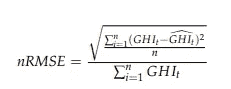
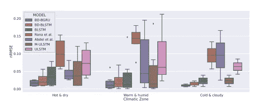

# 用于太阳能预测的特征工程和深度学习

> 原文：<https://towardsdatascience.com/feature-engineering-and-deep-learning-b90fc863b07>

## 特征工程对 DL 模型有帮助吗

来源:https://unsplash.com/photos/yETqkLnhsUI

当经典的 ML 模型受到非结构化数据的挑战时，它会受到影响。一个特殊的例子是 ImageNet Challenge，最初最先进的技术将使用一些智能的手工制作的功能，然后像 SVM 一样使用强大的分类器。后来这些都被 CNN 的模特超越了。

现在这种手工制作特征的推导是非常直观的，并且是一个费力的试错过程。这是 CNN 模型在自动提取特征方面得分的地方。如果你真的从 30，000 英尺的高度来看深度学习，那么它的核心就是学习表征。隐藏图层是从输入数据中学习新表示的完美示例。到目前为止一切顺利。但是一个懒惰的头脑会用不同的想法来挑战你，也就是说，为什么不混合搭配。也许使用旧世界的直觉，然后将它们与习得的表征结合起来。

这就是我们在太阳能预测的背景下试图回答的问题。这是一个领域(太阳能预测)，加尔各答大学数据科学实验室与国家风能研究所合作了一段时间，也是 LISA 实验室活动的一部分(【https://www.lisa2020.org/】T2)。)

我们已经发表了一篇关于太阳能预测的博客，其中描述了基本的问题公式以及一些设计问题和建议。([https://towards data science . com/building-lstm-based-model-for-solar-energy-forecasting-8010052 f0f 5a](/building-lstm-based-model-for-solar-energy-forecasting-8010052f0f5a))。快速回顾一下动机是，太阳能预测的准确预测对于可持续利用是必不可少的。通常，全球水平辐照度(GHI)是实际太阳能电池输出的良好代表。GHI 测量水平面从上方接收的辐射量。这包括直接接收的辐射以及散射的辐射。根据预测的窗口，问题可以分为短期、中期和长期。事实证明，基于可信的天气波动的短期预测(以小时为单位)是最具挑战性的。

为简单起见，我们将此视为单变量预测问题，即 GHI 的先前值用作预测值。LSTM 和 GRU 作为模型最近被广泛用作预测机器。现在，有一个 LSTM 的流行变体，GRUs，被称为双向模型。这些带来了出色的结果以及语义，尤其是在语言预测方面。如果你试图预测一个句子中间的一个单词，你基本上要使用这个单词前面的单词和后面的单词。

在时间序列的情况下，我们没有这种奢侈，因为我们没有后继值，即未来值。有趣的是，如果我们简单地用前一个值代替后一个值，我们仍然会得到更好的结果。典型的设置如下图 1 所示。

图 1:时间序列的双向 GRU(图片来源:作者)

基本上，假设您有一个序列 15，20，22，24，并且您想要预测下一个值，您有一个 GRU，它接受输入 15，20，22，24，通常称为前向 GRU。然后您以相反的顺序使用同一序列的另一种表示，即 24，22，20 和 15，它由另一个 GRU 使用，称为后向 GRU。最终预测是两个 gru 预测的函数。前向模型的输入序列通常被称为前向上下文，后向模型的输入序列被称为后向上下文。

对我们来说，这似乎有点站不住脚，我们想的是我们能不能找到一个比前面的值更好的替代品。因此，我们想用前一天的来代替。例如，如果我们试图预测 5 月 24 日上午 08:00 的 GHI 值，我们可以使用 5 月 24 日上午 07:00、07:15 和 07:45 的值，以及 5 月 23 日上午 08:15、08:30 和 08:45 的值。

事实上，在更一般的设置中，前向输入和后向输入的长度可能不相等。下图显示了这样的设置，我们称之为具有真正双向特征的双向预测模型。

实际上，在我们提出的方法中，我们使用了更长的向前上下文，其中我们不仅使用了 5 月 24 日的 07:00 AM、07:15 AM、07:45 AM 值，还使用了 5 月 23 日的 07:00 AM、07:15 AM、07:45 AM 值。

图 2:具有真正双向特征的双向预测模型(图片来源:作者)

光有直觉是不够的，你需要通过大量的研究/实验来建立直觉。在这个实验中，2016 年的数据用于三个气候带(炎热和干燥，温暖和潮湿，寒冷和多云)，六个站分别位于钦奈(泰米尔纳德邦)，豪拉(西孟加拉邦)，贡图尔(安得拉邦)，科达达皮塔(古吉拉特)和阿杰梅尔(拉贾斯坦邦)。

这些结果和实验设置是非常广泛的。要获得“超载”版本，您可以在此访问期刊文章[。我们还对提议的具有真正双向特征的双向模型(BD-BLSTM)与称为 ULSTM 的普通单向模型进行了其他几项比较，ul STM 是单向模型的一种变体，具有一些丰富的输入特征，称为 MLSTM，前向和后向模型(BLSTM)具有相同的前置序列的普通双向模型，以及 Rana 和 Abdel 最近的几项工作。](https://www.mdpi.com/2504-4990/3/4/47)

所有模型的结果都用 nRMSE 度量。nRMSE 因其与比例无关而闻名，由下式给出。

nRMSE

图 3:模型对比(图片来源:作者)

如果你在上面的箱线图中观察，很明显，具有双向特征的双向模型在所有气候带中给出了最低的平均误差(偏差)和最低的误差可变性(方差)。

这个故事的寓意是什么？显而易见的是，具有双向功能的双向模型确实有点酷，但这不是我们想要的。相反，重要的是，如果你想称赞你从 ML 到 DL 的理解(智慧的珍珠)，你可以改进你的模型，而不是简单地盲目部署深度学习模型。