# 从图像数据中提取特征的系统方法

> 原文：<https://towardsdatascience.com/feature-engineering-for-machine-learning-with-picture-data-d7ff8554920>

## 对于机器学习算法

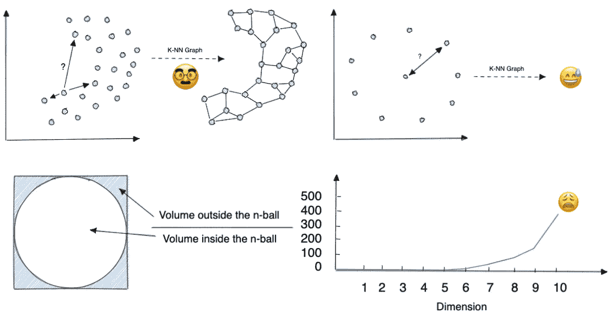

解释维数灾难的插图(作者图片)

特征工程是获取原始数据并提取对建模有用的特征的过程。对于图像，这通常意味着提取颜色、纹理和形状等信息。进行特征工程有多种方法，您采用的方法将取决于您正在处理的数据类型和您试图解决的问题。

但是我们为什么需要它的图片呢？

图像封装了大量信息，但这是有代价的:高维数。例如，具有 3 个通道(红、绿、蓝)的尺寸为 200×100 像素的小图片已经表示了 60000 维的特征向量。

这需要处理很多事情，而且我们正面临着维数灾难。我们稍后会对此进行更多的讨论。

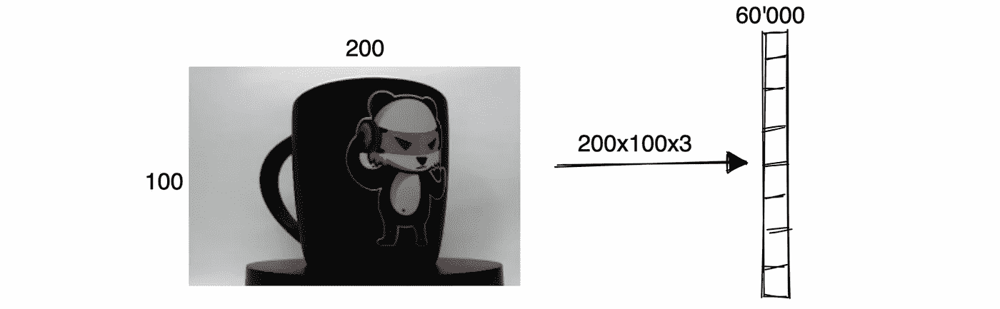

图片的维数示例(图片由作者提供)

在这篇文章中，我们将看看如何降低图片的维度来对抗维度的诅咒。

# 维度的诅咒

“维数灾难”是一个术语，用来描述在处理具有大量维度的数据集时出现的问题。

一个原因是，准确了解数据的基本分布所需的数据点的数量随着维度的数量呈指数增长。换句话说，如果我们有一个包含 100 个特征的数据集，我们可能需要大约 1000 甚至 10000 个数据点才能有很好的机会准确学习。

为了更好地理解维数灾难，我喜欢举一个二维 k 近邻图的例子，如下图所示。

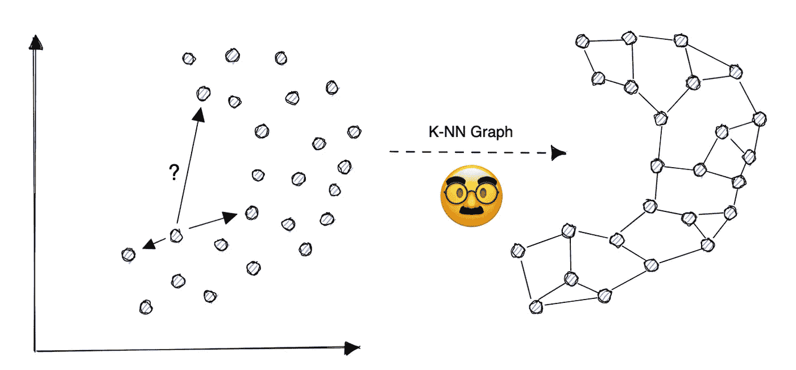

k 近邻图可视化(图片由作者提供)

但是如果所有的点都是等距的，会发生什么呢？这是一个非常不可能的场景，但它(在某种程度上)显示了当我们试图计算具有许多维度的特征之间的欧几里德距离时通常会发生什么。

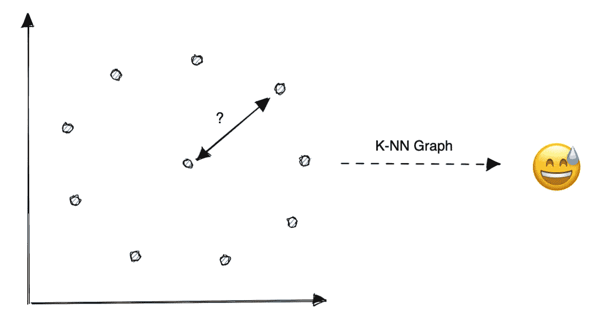

等距点的最近邻问题(图片由作者提供)

为了理解维度的数量如何影响我们的距离度量，我们可以看一下内接在超立方体中的 n 维球(n 球)内部和外部的体积之比。

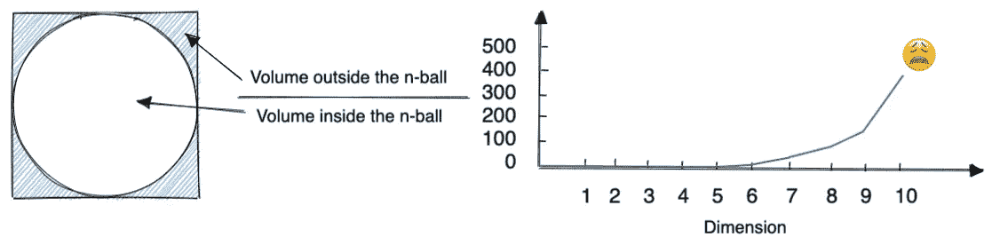

超立方体中 n 球内外的体积(图片由作者提供)

我们可以在此图中观察到，n 球外部的体积将占据大部分空间。这是非常违反直觉的，不像我们习惯掌握的二维或三维空间。

> 如果我们在超立方体中均匀分布点，它们中的任何一个都不太可能落入内接的 n 球中。

这将给人这样的印象，即超立方体中的所有点将离 n 球的中心非常远，并且看起来是等距离的，并且集中在超立方体的长尖角上。这将导致我们的基于距离的算法容易受到输入特征上的噪声的影响。

那么，如何才能解决呢？

# 缩小图像尺寸

降低特征向量维数的一个简单方法是通过降低图像的分辨率，利用抽取(下采样)来减小图像的大小。

如果颜色分量不相关，我们也可以将图片转换为灰度，以将数字维度除以三。但是还有其他方法可以减少图片的尺寸，并潜在地提取特征。例如，我们可以使用小波分解。

小波分解是一种在空间和频率上分解信号的方法。就图片而言，这意味着将图像分解成水平、垂直和对角线分量。

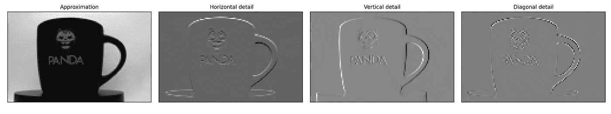

小波分解示例(图片由作者提供)

# 方向梯度直方图

HOG 特征描述符是在计算机视觉和图像处理中用于检测数字图像中的对象的流行技术。在 Dalal 和 Triggs 于 2005 年展示了这种描述符的效率之后，HOG 描述符变得流行起来，该描述符专注于静态图像中的行人检测。

HOG 描述符是一种特征描述符，它通过计算图像中亮度梯度的分布来编码对象的形状和外观。

在我们的情况下，最重要的参数是每个单元的像素数，因为它将为我们提供一种方法来找到维度数量和图片中捕捉的细节数量之间的最佳平衡。

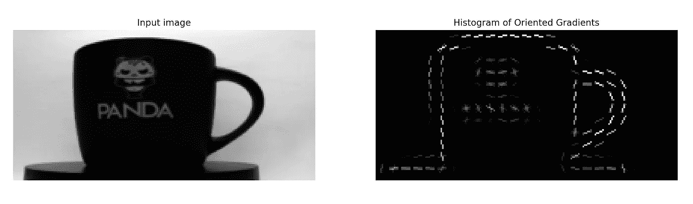

8×8 像素单元的方向渐变直方图示例(图片由作者提供)

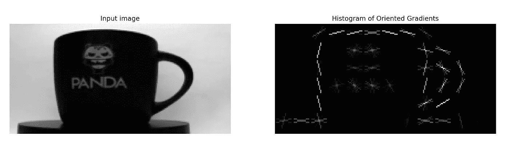

16 乘 16 像素单元的方向渐变直方图示例(图片由作者提供)

对于上面的示例，输入图像具有 20，000 个维度(100×200 像素), HOG 特征对于 8×8 像素单元具有 2，400 个维度，对于 16×16 像素单元具有 576 个维度。分别减少了 88%和 97%。

# 主成分分析

我们还可以使用主成分分析(PCA)来降低特征向量的维数。PCA 是一种统计技术，可用于寻找最大化方差和最小化数据集中投影误差的方向(分量)。

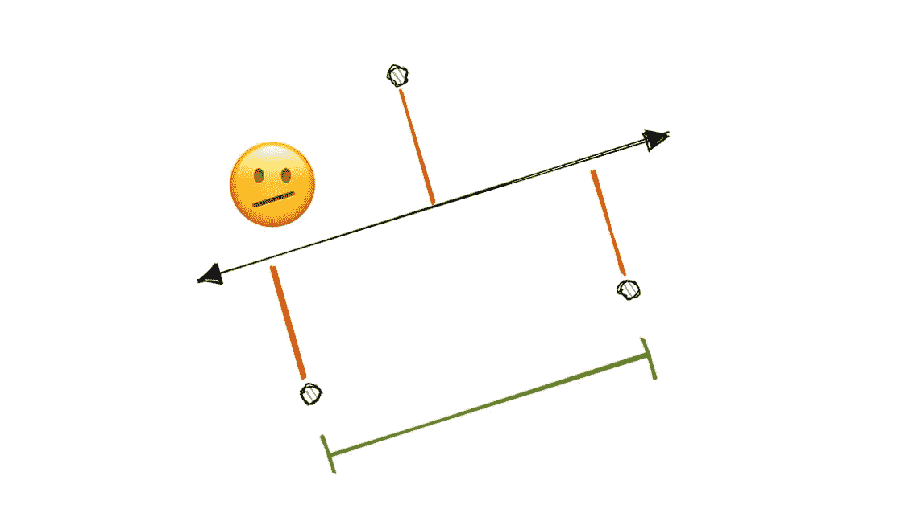

方差最大的轴(绿色)和投影误差较小的轴(红色)(图片由作者提供)

换句话说，主成分分析可用于寻找代表数据中最多信息的方向。

使用 PCA 时，需要记住以下几点:

*   PCA 最好是作为降维的工具，而不是用于特征选择。
*   使用 PCA 进行降维时，首先对数据进行归一化是很重要的。
*   PCA 是线性变换，因此它不能捕捉数据中的非线性关系。
*   为了减少到 N 维，你至少需要 N-1 次观察

我建议阅读以下文章，以便更好地理解 PCA 及其局限性:

  

# 流形学习

流形学习在某些方面是线性方法(如 PCA)的扩展，用于降低维数，但用于数据中的非线性结构。

流形是局部欧几里得的拓扑空间，这意味着在每个点附近它都类似于欧几里得空间。流形自然地出现在数学和物理的许多领域，流形的研究是微分几何的一个中心课题。

使用多方面学习时，有几件事要记住:

*   流形学习是降维的有力工具。
*   它可以用来发现数据中隐藏的模式。
*   流形学习通常是一项计算密集型任务，因此在使用这些算法之前对它们有一个很好的理解是很重要的。

现实生活中的流程很少使用其所有维度来描述其底层结构。例如下面的图片，只需要几个维度来描述杯子的位置和旋转。

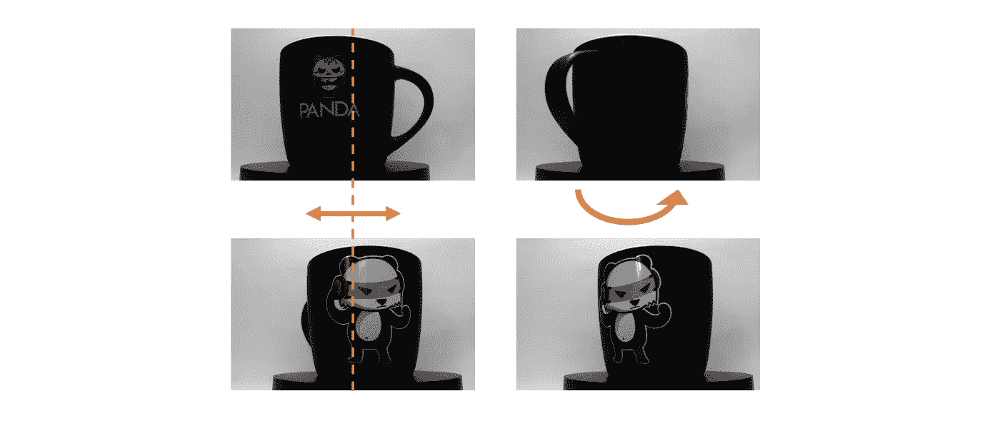

具有不同位置和旋转的杯子数据集(图片由作者提供)

这种情况下，一旦使用流形学习算法(如 t-分布式随机邻居嵌入(t-SNE ))进行投影，只有两个维度能够编码杯子的位置和旋转。

**编码位置:**

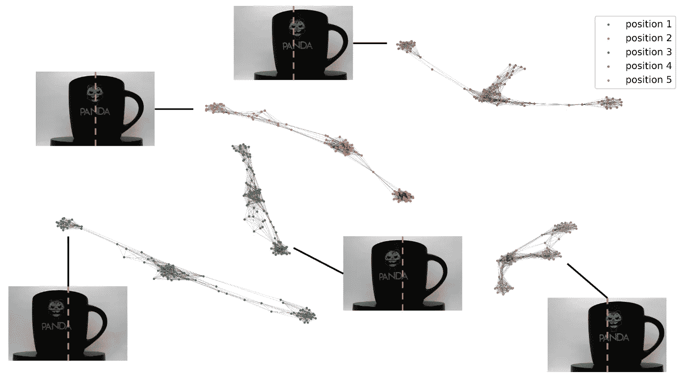

30-cup 数据集的最近邻图(图片由作者提供)

**编码旋转:**

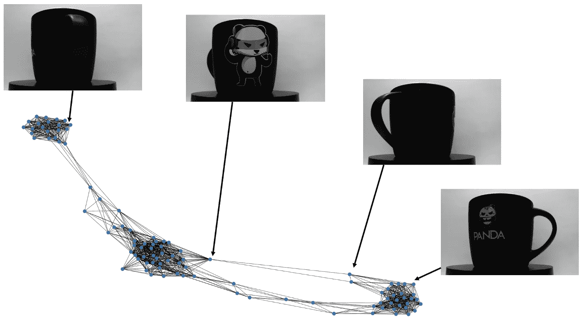

第一个位置的编码旋转(图片由作者提供)

# 结论

在这篇文章中，我们看到了如何使用图片的特征工程来对抗维数灾难。我们已经了解了如何通过抽取、小波分解、HOG 描述符和 PCA 来降低图片的维度。我们还看到了如何使用流形学习来发现数据中隐藏的模式。

还有许多其他方法可以减少图片的尺寸，您采用的方法将取决于您正在处理的数据类型和您试图解决的问题。

特征工程是一个迭代的过程，它有助于对不同的可能性和可用的方法有一个总体的了解。

我希望这篇文章对你有帮助！如果您对如何构建 k-NN 图有任何疑问，我建议您阅读以下文章:

  

好奇想了解更多关于 Anthony 的工作和项目吗？在[媒体](https://medium.com/@anthonycvn)、 [LinkedIn](https://www.linkedin.com/in/anthonycavin/) 、 [Twitter](https://twitter.com/Anthony66333223) 上关注他。

*需要技术作家？将您的请求发送到*[*https://amigo CCI . io*](https://amigocci.io/blog/mlops-at-medium-scale/)*。*