# 使用图像数据的特征工程

> 原文：<https://towardsdatascience.com/feature-engineering-with-image-data-14fe4fcd4353>

## 裁剪、灰度、RGB 通道、强度阈值、边缘检测和颜色过滤器

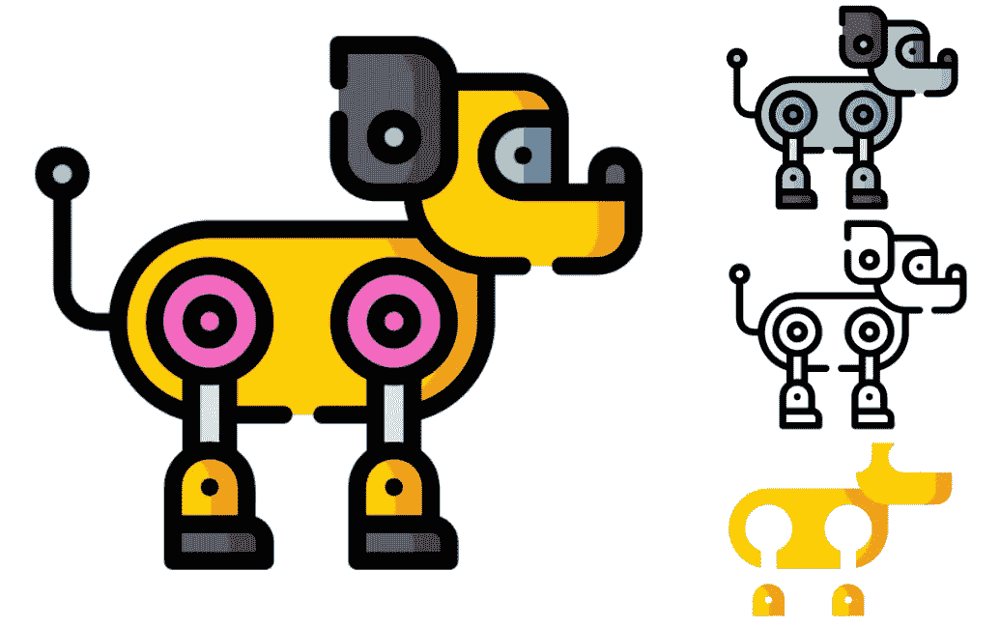

(来源: [flaticon](https://www.flaticon.com/free-icon/robotic-dog_9004669?related_id=9004669&origin=pack) )

有了特征工程，我们马上会想到表格数据。然而，我们也可以获得图像数据的特征。目标是提取图像中最重要的部分。这样做将更容易找到我们的数据和目标变量之间的映射。

这意味着您可以使用更少的数据和训练更小的模型。较小的模型减少了进行预测所需的时间。这在边缘设备上部署时特别有用。一个额外的好处是，您可以更加确定您的模型使用什么来进行这些预测。

我们将介绍使用 Python 进行影像要素工程的一些方法:

*   种植
*   灰色鳞片
*   选择 RGB 通道
*   强度阈值
*   边缘检测
*   滤色器(即提取给定颜色范围内的像素)

为了让事情变得有趣，我们将为自动驾驶汽车做这件事。如下图所示，我们想用一条赛道的图片来训练一个模型。然后，该模型将被用于预测指导汽车。最后，我们将讨论来自图像数据的特征工程的局限性。


装有摄像头传感器自动驾驶汽车(来源:作者)

# 特征工程与增强

在我们深入研究之前，有必要讨论一下图像增强。这种方法与特征工程有相似的目标。然而，它以不同的方式实现它们。

## 什么是数据增强？

数据扩充是指我们使用代码系统地或随机地改变数据。对于图像，这包括翻转、调整颜色和添加随机噪声等方法。这些方法允许我们人为地引入噪声并增加数据集的大小。如果你想了解更多关于图像增强的细节，我推荐这篇文章:

[](/augmenting-images-for-deep-learning-3f1ea92a891c) [## 增强深度学习的图像

### 使用 Python 通过翻转、调整亮度、颜色抖动和随机噪声来增加数据

towardsdatascience.com](/augmenting-images-for-deep-learning-3f1ea92a891c) 

在生产中，模型需要在不同的条件下运行。这些条件由照明、摄像机角度、房间颜色或背景中的物体等变量决定。

数据扩充的目标是创建一个对这些条件的变化具有鲁棒性的模型。它通过添加模拟真实世界条件的噪声来做到这一点。例如，改变图像的亮度类似于在一天的不同时间收集数据。

通过增加数据集的大小，增强还允许我们训练更复杂的架构。换句话说，它有助于模型参数收敛。

## 使用图像数据的特征工程

特征工程的目标是相似的。我们想创建一个更强大的模型。除了现在，我们去除任何对准确预测不必要的噪音。换句话说，我们去掉了随不同条件而变化的变量。

通过提取图像中最重要的方面，我们也简化了问题。这允许我们依赖更简单的模型架构。这意味着我们可以使用更小的数据集来找到输入和目标之间的映射。

一个重要的区别是在生产中如何处理这些方法。您的模型不会对增强图像进行预测。然而，通过特征工程，您的模型将需要对其接受训练的相同特征进行预测。这意味着你必须能够在生产中进行特征工程。

# 使用 Python 进行影像特征工程

好了，记住所有这些，让我们继续特征工程。我们会检查代码，你也可以在 [GitHub](https://github.com/conorosully/medium-articles/blob/master/src/image_tools/image_features.ipynb) 上找到这个项目。

首先，我们将使用下面的导入。我们有一些标准包装(第 2-3 行)。 **Glob** 用于处理文件路径(第 5 行)。我们还有一些用来处理图像的包(第 7-8 行)。

```
#Imports 
import numpy as np
import matplotlib.pyplot as plt

import glob

from PIL import Image
import cv2
```

如前所述，我们将使用用于驱动自动汽车的图像。你可以在 [Kaggle](https://www.kaggle.com/datasets/conorsully1/jatracer-images?select=object_detection) 上找到这些例子。我们用下面的代码加载其中一个图像。我们首先加载所有图像的文件路径(第 2–3 行)。然后加载(第 8 行)并显示(第 9 行)第一个路径的图像。你可以在**图 1** 中看到这个图像。

```
#Load image paths
read_path = "../../data/direction/"
img_paths = glob.glob(read_path + "*.jpg")

fig = plt.figure(figsize=(10,10))

#Display image
img = Image.open(img_paths[0])
plt.imshow(img) 
```

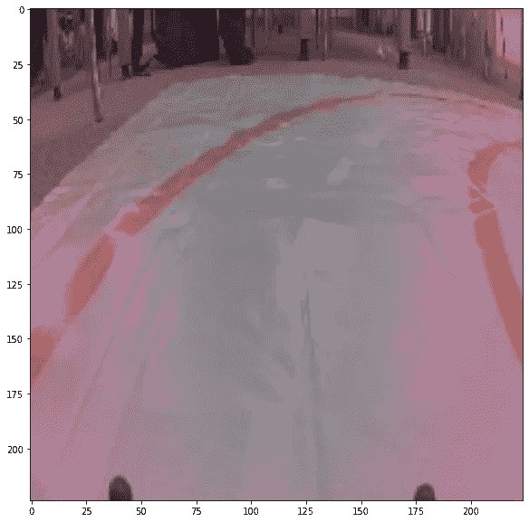

图 1:轨迹图像示例(来源:作者)

## 种植

一个简单的方法是裁剪图像以移除不想要的外部区域。目的是仅移除预测不需要的图像部分。对于我们的自动汽车，我们可以从背景中去除像素。

为此，我们加载一个图像(第 2 行)。然后，我们将这个图像转换成一个数组(第 5 行)。该阵列的尺寸为 224 x 224 x 3。图像的高度和宽度是 224 像素，每个像素有一个 R G B 通道。为了裁剪图像，我们只选择 y 轴上从位置 25 开始的像素(第 8 行)。你可以在**图 2** 中看到结果。

```
#Load image
img = Image.open(img_paths[609])

#Covert to array
img = np.array(img)

#Simple crop
crop_img = img[25:,]
```

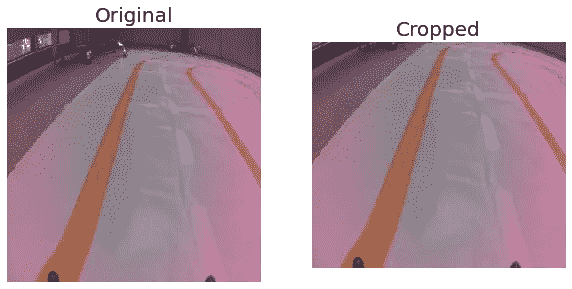

图 2:裁剪图像(来源:作者)

你可能想保持长宽比。在这种情况下，您可以通过将不需要的像素变黑(第 3 行)来获得类似的结果。

```
#Change pixels to black
crop_img = np.array(img)
crop_img[:25,] = [0,0,0]
```

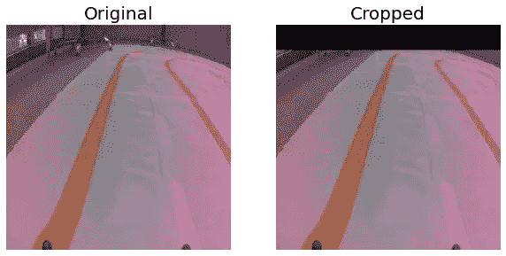

图 3:通过改变像素颜色进行裁剪(来源:作者)

通过裁剪，我们删除了不必要的像素。我们还可以避免模型过度拟合训练数据。例如，背景中的椅子可能出现在所有左转处。因此，模型可以将这些与左转预测相关联。

看着上面的图像，你可能会忍不住进一步裁剪它。也就是说，您可以在不移除任何轨道的情况下裁剪图像的左侧。然而，在**图 4** 中，你可以看到，对于其他图像，我们将移除轨道的重要部分。

```
#Additional cropping 
crop_img = np.array(img)
crop_img[:25,] = [0,0,0]
crop_img[:,:40] = [0,0,0]
```

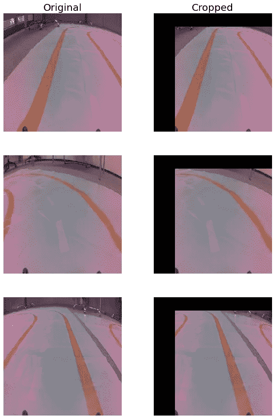

图 4:糟糕的裁剪示例(来源:作者)

这又回到了特性工程需要在产品中完成的问题上。这里你不知道什么图像将在什么时间显示给模型。这意味着相同的裁剪功能将需要应用于所有图像。你需要确保它永远不会删除图像的重要部分。

## 灰度等级

对于某些应用，图像的颜色并不重要。在这种情况下，我们可以对图像进行灰度处理。我们用 OpenCV 中的 **cvtColor** 函数来做这件事(第 2 行)。

```
#Gray scale
gray_img = cv2.cvtColor(img,cv2.COLOR_RGB2GRAY)
```

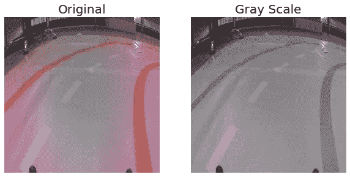

图 5:图像灰度(来源:作者)

灰度是通过捕捉图像的颜色强度来实现的。这是通过对 RGB 通道进行加权平均来实现的。具体来说，上面的函数使用以下公式:

**Y**= 0.299 ***R**+0.587 ***G**+0.114 ***B**

我们可以通过查看每个图像的输入值的数量来理解这样做的好处。如果我们使用所有 RGB 通道，它将由 **150，528** 个值组成(224*224*3)。对于灰度图像，我们现在只有 **50，176** 个值(224*224)。更简单的输入意味着我们需要更少的数据和更简单的模型。

## RGB 通道

其中一个渠道可能更重要。我们可以只使用那个通道，而不是灰度。下面，我们选择 R(线 6)、G(线 7)和 B(线 8)通道。每个结果数组的大小都是 224 x 224。您可以在**图 6** 中看到各自的图像。

```
#Load image
img = Image.open(img_paths[700])
img = np.array(img)

#Get rgb channels
r_img = img[:, :, 0]
g_img = img[:, :, 1]
b_img = img[:, :, 2]
```

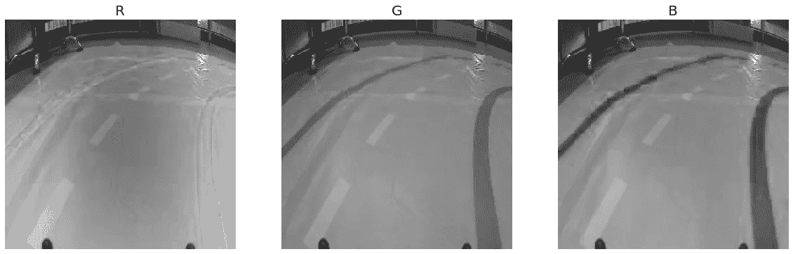

图 6: RGB 通道(来源:作者)

您也可以使用**通道 _ 过滤器**功能。这里，通道参数(c)将根据您想要的通道取值为 0、1 或 2。请记住，有些包会以不同的顺序加载频道。我们使用的是 RGB 的 PIL。但是，如果用 cv2.imread()加载图像，通道将按照 BGR 顺序排列。

```
def channel_filter(img,c=0):
    """Returns given channel from image pixels"""
    img = np.array(img)
    c_img = img[:, :, c]

    return c_img
```

通过这些转换，您需要考虑是否从图像中删除了重要信息。对于我们的应用程序，轨道是橙色的。换句话说，轨道的颜色有助于将其与图像的其他部分区分开来。

## 强度阈值

使用灰度时，每个像素的值将在 0 到 255 之间。我们可以通过将输入转换成二进制值来进一步简化输入。如果灰度值高于截止值，像素值为 1，否则为 0。我们称这个截止点为强度阈值。

下面的函数用于应用该阈值。我们首先对图像进行灰度处理(第 5 行)。如果像素高于截止值，则其值为 1000(第 8 行)。如果我们将像素设置为 1，它将低于截止值。换句话说，在下一步(第 9 行)中，所有像素都将被设置为 0。最后，我们缩放所有像素，使它们取值为 0 或 1(第 11 行)。

```
def threshold(img,cutoff=80):
    """Apply intesity thresholding"""

    img = np.array(img)
    img = cv2.cvtColor(img,cv2.COLOR_RGB2GRAY)

    #Apply cutoff
    img[img>cutoff] = 1000 #black
    img[img<=cutoff] = 0 #white

    img = img/1000

    return img
```

自动汽车项目的一部分是避开障碍物。这些是涂成黑色的罐子。在**图 7** 中，您可以看到如何应用强度阈值函数将 tin 从图像的其余部分中分离出来。这是唯一可能的，因为锡是黑色的。换句话说，它的强度大于图像的其余部分。

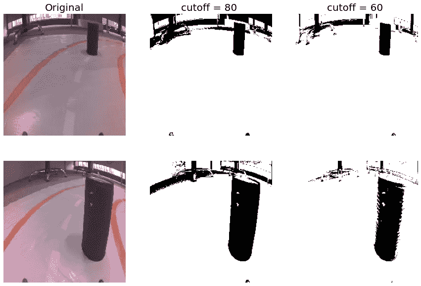

图 7:具有强度阈值的特征工程(来源:作者)

截止值可以被视为一个超参数。参见图 7，截止值越大，意味着我们包含的背景噪声越少。不利的一面是我们捕获的罐头更少了。

## 边缘检测

如果我们想分离轨迹，我们可以使用 canny 边缘检测。这是一种用于检测图像边缘的多阶段算法。如果你想了解它是如何工作的，我建议阅读[索菲安·萨希尔](https://medium.com/u/4c917479ce84?source=post_page-----14fe4fcd4353--------------------------------)关于[精明边缘检测](/canny-edge-detection-step-by-step-in-python-computer-vision-b49c3a2d8123)的文章。

我们将该算法应用于 **cv2。Canny** ()函数。**阈值 1** 和**阈值 2** 参数用于迟滞程序。这是边缘检测算法的最后一步，用于确定哪些线实际上是边缘。

```
#Apply canny edge detection
edge_img = cv2.Canny(img,threshold1 = 50, threshold2 = 80)
```

你可以在图 8 中看到一些例子。像强度阈值处理一样，我们只剩下一个二值图——白色代表边缘，黑色代表其他。希望这个轨迹现在更容易与图像的其他部分区分开来。但是，您可以看到背景中的边缘也被检测到。

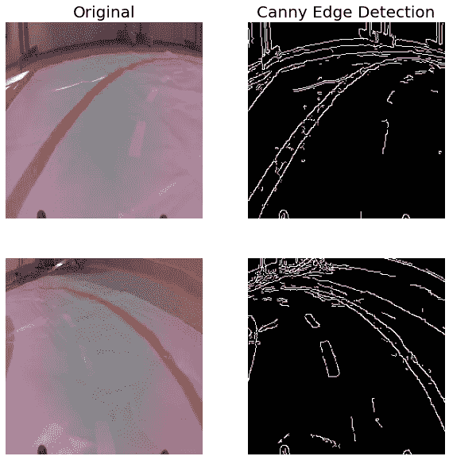

图 8: canny 边缘检测(来源:作者)

## 滤色器

我们可能会有更好的运气，通过使用像素颜色来隔离轨迹。我们使用下面的 **pixel_filter** 函数来实现。使用 **cv2.inRange** ()我们将图像转换成二进制图(第 10 行)。这个函数检查一个像素是否落在下面(第 5 行)和上面(第 6 行)列表给定的范围内。具体来说，每个 RGB 通道必须在各自的范围内(例如 134-t ≤ R ≤ 194+t)。

```
def pixel_filter(img, t=0):

    """Filter pixels within range"""

    lower = [134-t,84-t,55-t]
    upper = [192+t,121+t,101+t]

    img = np.array(img)
    orange_thresh = 255 - cv2.inRange(img, np.array(lower), np.array(upper))

    return orange_thresh
```

简单地说，该函数确定像素颜色是否足够接近轨道的橙色。你可以在**图 9** 中看到结果。测试参数引入了一些灵活性。使用较高的值，我们可以捕捉更多的轨迹，但保留更多的噪声。这是因为背景中的像素将落在该范围内。

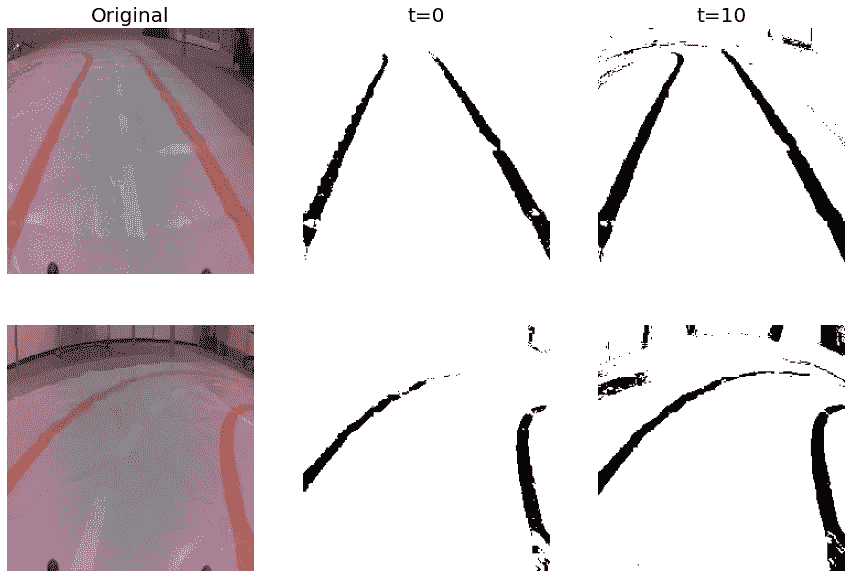

图 9:过滤橙色像素(来源:作者)

你可能想知道我们从哪里得到下限和上限。这就是我们如何知道通道将落在[134，84，55]和[192，121，101]之间？嗯，我们使用 Python 创建的颜色选择器。我们在下面的文章中概述了这是如何创建的。

[](/building-a-color-picker-with-python-55e8357539e7) [## 用 Python 构建颜色选择器

### 创建一个从图像像素中选择 RGB 通道的工具

towardsdatascience.com](/building-a-color-picker-with-python-55e8357539e7) 

在**图 10** 中，您可以看到拾取器正在工作。我们从多个图像中选择像素，并尝试在轨道上的不同位置选择它们。这是为了在不同条件下获得全范围的像素值。

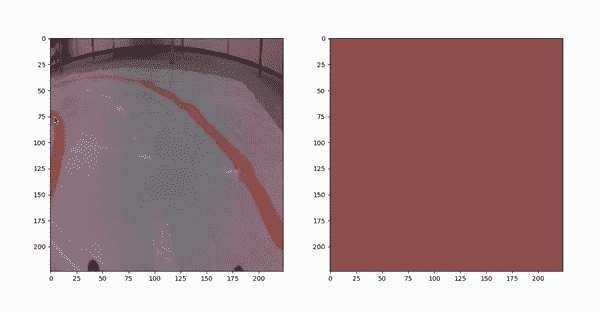

图 10:从轨道上挑选颜色(来源:作者)

我们总共选择了 60 种颜色。这些你都可以在**图 11** (带加成视错觉)中看到。所有这些颜色的 RGB 通道都存储在一个名为“颜色”的列表中。

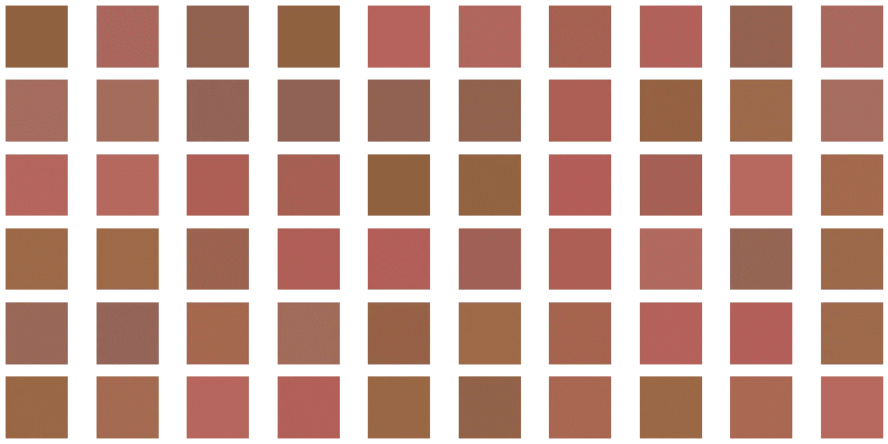

图 11:用拾色器选择的 60 个轨迹像素

最后，我们取每个 RGB 通道的最小值和最大值。这给出了下限和上限。

```
lower = [min(x[0] for x in colours),
              min(x[1] for x in colours),
              min(x[2] for x in colours)]

upper = [max(x[0] for x in colours),
              max(x[1] for x in colours),
              max(x[2] for x in colours)]
```

# 特征工程的局限性

经过这一切，你可能不相信。深度学习的一个主要好处是，它可以识别复杂的模式，而不需要特征工程。这是一个很好的观点。

特征工程需要批判性思维。你需要弄清楚图像的哪些方面是重要的。然后，您需要编写代码来提取这些方面。对于某些应用程序来说，完成所有这些所需的时间毫无意义。

此外，对于一些方法，我们已经看到，我们不能消除所有的噪音。例如，强度阈值中的黑色背景。与直觉相反的是，残留的噪音现在可能更难区分什么是重要的。也就是说，剩余的噪声和对象像素具有相同的值(1)。

真的，当处理相对简单的计算机视觉问题时，好处就来了。我们的轨迹从不改变，物体的颜色也总是一样。对于更复杂的问题，你将需要更多的数据。或者，您可以在较小的数据集上微调预训练模型。

我希望你喜欢这篇文章！你可以成为我的 [**推荐会员**](https://conorosullyds.medium.com/membership) **:)** 来支持我

[](https://conorosullyds.medium.com/membership) [## 通过我的推荐链接加入 Medium 康纳·奥沙利文

### 作为一个媒体会员，你的会员费的一部分会给你阅读的作家，你可以完全接触到每一个故事…

conorosullyds.medium.com](https://conorosullyds.medium.com/membership) 

| [推特](https://twitter.com/conorosullyDS) | [YouTube](https://www.youtube.com/channel/UChsoWqJbEjBwrn00Zvghi4w) | [时事通讯](https://mailchi.mp/aa82a5ce1dc0/signup) —注册免费参加 [Python SHAP 课程](https://adataodyssey.com/courses/shap-with-python/)

## 图像来源

所有图片都是我自己的或从[www.flaticon.com](http://www.flaticon.com/)获得。在后者的情况下，我拥有他们的[保费计划](https://support.flaticon.com/hc/en-us/articles/202798201-What-are-Flaticon-Premium-licenses-)中定义的“完全许可”。

## 资料组

**JatRacer 图片** (CC0:公共领域)[https://www.kaggle.com/datasets/conorsully1/jatracer-images](https://www.kaggle.com/datasets/conorsully1/jatracer-images)

## 参考

OpenCV，**颜色转换**[https://docs . OpenCV . org/3.4/de/d25/imgproc _ Color _ conversions . html](https://docs.opencv.org/3.4/de/d25/imgproc_color_conversions.html)