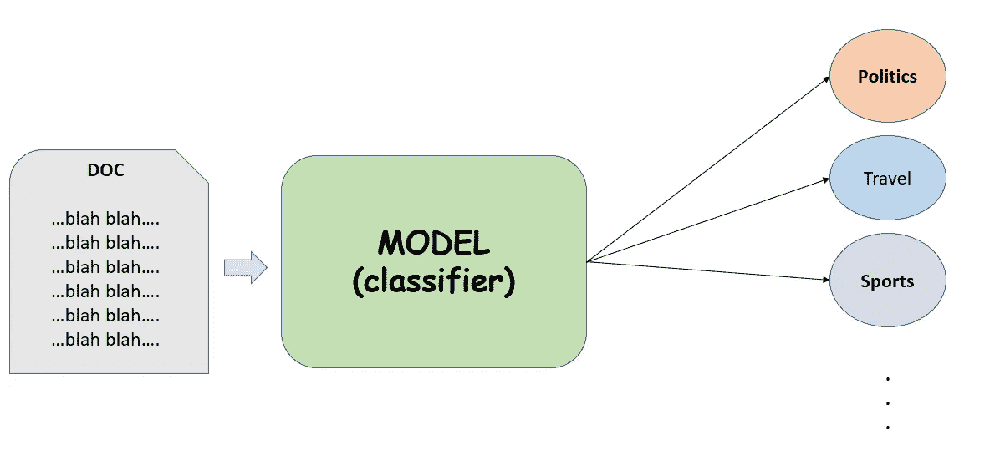
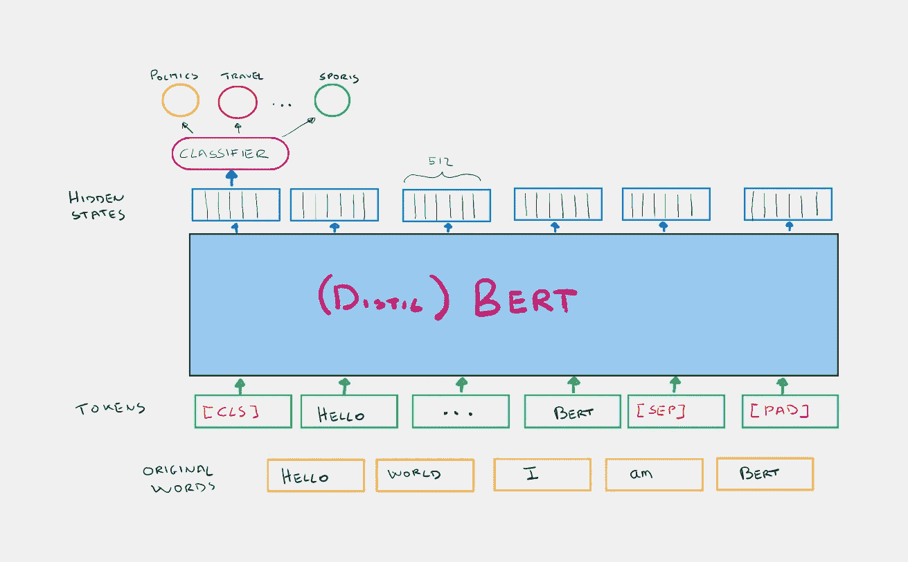

# 基于 BERT 的文本分类特征提取

> 原文：<https://towardsdatascience.com/feature-extraction-with-bert-for-text-classification-533dde44dc2f>

照片由[西格蒙德](https://unsplash.com/@sigmund?utm_source=medium&utm_medium=referral)在 [Unsplash](https://unsplash.com?utm_source=medium&utm_medium=referral) 拍摄

## 使用 Pytorch 和拥抱脸从预训练的模型中提取信息

## 目标

让我们从定义这篇实践文章的目的开始。我们希望建立一个模型，将一个或多个文档作为输入，并设法根据它们的内容对它们进行分类。
一些类别例如:政治、旅游、体育等。
为了做到这一点，我们想使用一个预训练模型，如 BERT。

作者图片

## **背景**

BERT 是一种基于 Transformer 编码器的语言模型。如果你对变形金刚不熟悉，我推荐你阅读[这篇惊人的文章](https://jalammar.github.io/illustrated-transformer/)。

**伯特简单地说**:

*   它将一个或多个句子的嵌入标记作为输入。
*   第一个令牌始终是一个名为**【CLS】**的特殊令牌。
*   句子之间由另一个叫做**【SEP】**的特殊记号分隔。
*   对于每个令牌，BERT 输出一个称为**隐藏状态**的嵌入。
*   伯特接受了**掩蔽语言模型**和**下一句预测**任务的训练。

在**屏蔽语言模型(MLM)** 中，一个输入单词(或标记)被屏蔽，伯特必须试图找出被屏蔽的单词是什么。对于**下一个句子预测(NSP)** 任务，输入给 BERT 两个句子，他必须弄清楚第二个句子是否在语义上跟随第一个句子。

对于像我们这样的分类问题，**我们只对与初始标记【CLS】**相关联的隐藏状态感兴趣，不知何故**比其他的更好地捕捉了整个句子**的语义。因此，我们可以使用这种嵌入作为分类器的输入，我们在它的基础上构建分类器。

作者图片

从上面的图片中，你可以看到我们将使用一个叫做 **DistilBERT** 的较轻版本的 BERT。这个经过提炼的模型比原来的**小了 40%**,但是在各种 NLP 任务上仍然保持了大约 97%的性能。
你可以注意到的另一件事是，伯特的输入不是原始单词，而是标记。简单地说，BERT 关联了一个预处理文本的记号化器，以便它对模型有吸引力。单词通常被分成子词，此外还会添加特殊的标记**【CLS】**来指示句子的开始，**【SEP】**来分隔多个句子，以及**【PAD】**来使每个句子具有相同数量的标记。

如果您想了解更多关于 Bert 或他的 wordpartickizer 的信息，请查看以下资源:

*   [https://jalammar.github.io/illustrated-bert/](https://jalammar.github.io/illustrated-bert/)
*   [https://huggingface.co/blog/bert-101](https://huggingface.co/blog/bert-101)
*   [https://towards data science . com/word piece-sub word-based-token ization-algorithm-1 FBD 14394 ed 7](/wordpiece-subword-based-tokenization-algorithm-1fbd14394ed7)
*   [https://huggingface.co/docs/transformers/tokenizer_summary](https://huggingface.co/docs/transformers/tokenizer_summary)

# 我们来编码吧！

## 资料组

我们要用的数据集叫做 [*BBC 全文文档分类*](https://www.kaggle.com/datasets/shivamkushwaha/bbc-full-text-document-classification) ，可以在 Kaggle 上公开获取。

> 该数据集包含 2225 条记录，总共包含 5 个类别。我们想要确定的五个类别是体育、商业、政治、科技和娱乐。

直接从 colab 下载 kaggle 数据集。(记得上传您的个人密钥)

我不会详细介绍如何读取这些数据并将其转换成 dataframe，但我假设您可以创建一个包含两列的 data frame:*short _ description*和 *category。*

## 编码标签

数据集的标签有:*政治、体育*、*等……*。
我们需要**通过简单地使用标签编码器将这些标签转换成数字**。

## 生成文本嵌入

为每个文本生成一个嵌入向量，它可以用作我们最终分类器的输入。与每个文本相关联的**矢量嵌入只是 Bert 为[CLS]令牌输出的隐藏状态。**

先从 [**HuggingFace**](https://huggingface.co/models) **导入模型和分词器开始。**

现在我们必须对文本进行标记。记住定义填充符*，这样每个标记化的句子将具有相同的长度，并且 ***截断*** 因此如果句子太长，它将被截断。最后一个参数是返回 PyTorch 张量。*

*对文本进行标记化的结果将是一个字典，其中包含以数字表示的标记**input _ id**，以及告诉我们该标记是否为[PAD]的 **attention_mask** 。*

*通过运行模型获得文本([CLS])隐藏状态。*

## *构建分类器*

*至此，你可以使用你最喜欢的分类器，给它输入隐藏状态，并让它预测标签。在这种情况下，我将使用随机森林。*

*这个分类器的性能不会很好，因为我们使用了很少的数据，并且没有在分类器上做很多工作。但是出于好奇，我建议你将它与一个随机预测标签的虚拟分类器进行比较。*

# *最后的想法*

*在这篇动手实践文章中，我们看到了如何利用预训练模型的功能在很短的时间内创建一个简单的分类器。请记住，我们训练的只是最终的分类器，即随机森林。
另一方面，Bert 只在推理中用于生成嵌入，以某种方式捕捉文本的主要特征，这就是为什么我们说我们使用了特征提取方法。但是我们能训练 Bert 自己教他如何在我们的具体案例中创建更好的文本嵌入吗？当然可以！在下一篇文章中，我将向你展示如何微调(蒸馏)伯特！*

# *结束了*

**马赛洛·波利蒂**

*[Linkedin](https://www.linkedin.com/in/marcello-politi/) ， [Twitter](https://twitter.com/_March08_) ， [CV](https://march-08.github.io/digital-cv/)*