# 决策树中的特征重要性

> 原文：<https://towardsdatascience.com/feature-importance-in-decision-trees-e9450120b445>

## 基于树的机器学习算法中测量特征重要性背后的计算的完整 Python 实现和解释


约书亚·戈尔德在 [Unsplash](https://unsplash.com?utm_source=medium&utm_medium=referral) 上拍摄的照片

这篇文章的目的是让读者熟悉如何在决策树中计算特征的重要性。就我个人而言，我没有找到对这个概念的深入解释，因此本文诞生了。

本文中使用的所有代码都是公开的，可以通过以下途径找到:

【https://github.com/Eligijus112/gradient-boosting 

在深入研究特性重要性计算之前，我强烈建议您复习一下什么是树，以及我们如何使用这些文章将它们组合成随机森林的知识:

[](/decision-tree-algorithm-in-python-from-scratch-8c43f0e40173)  [](/regression-tree-in-python-from-scratch-9b7b64c815e3)  [](/random-forest-algorithm-in-python-from-scratch-487b314048a8)  

我们将使用决策树模型，使用各种回归变量( **X** )来创建加利福尼亚州中值房价( **Y** )之间的关系。可以使用 scikit-learn 包加载数据集:

加载加州住房数据集；作者代码

我们将在模型中使用的特性 **X** 是:

* **MedInc** —过去 12 个月的家庭收入中位数(十万)

* **房龄** —房龄(年)

* **平均房间数**——每个住所的平均房间数

* **AveBedrms** —每个住宅的平均卧室数量

***ave occupation**——平均家庭成员数

响应变量 **Y** 是加州各区的中值房价，以几十万美元表示。

数据的形状如下:

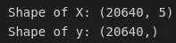

数据的形状；按作者分类的表格

快速浏览特征变量:

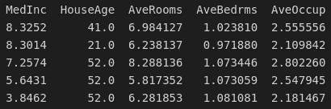

X 变量的头；按作者分类的表格

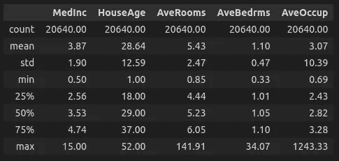

特征的描述性统计；按作者分类的表格

Y 变量的分布:

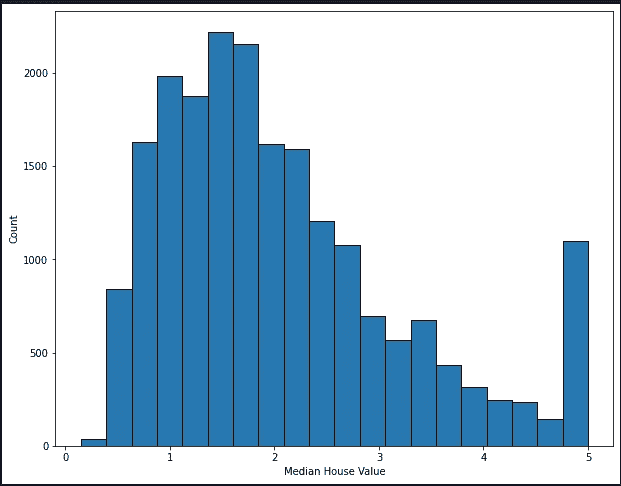

响应变量的分布；按作者分类的图表

为了匿名化数据，数据中有一个 50 万美元的收入上限:超过这个上限的仍被标记为 50 万美元的收入。这是为了确保没有人可以识别具体的家庭，因为早在 1997 年没有多少家庭是如此昂贵。

我们将数据分为训练集和测试集，拟合回归树模型，并推断训练集和测试集的结果。

拟合回归树；作者代码

打印输出如下:

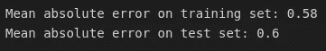

准确性结果；作者照片

长成的树不会过度生长。这篇文章是关于特征的推断，所以我们不会尽力减少错误，而是试图推断哪些特征是最有影响的。

训练集上的成年树:

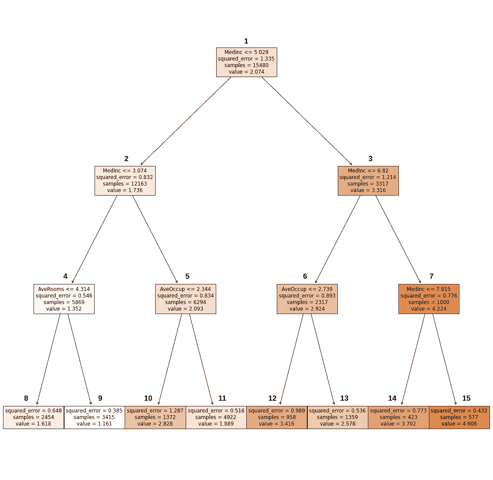

全回归树；按作者分类的图表

决策树由**个节点、**个节点组成，每个节点由一个分割规则链接。分割规则涉及一个要素和它应该分割的值。

术语“分割”是指如果满足分割规则，数据集的观测值将位于节点的左侧。如果不满足规则，则观察向右进行。

从 1 到 15 枚举每个节点。

让我们检查第一个节点和其中的信息。**所有节点的逻辑都是一样的。**

**MedInc ≤ 5.029** —节点的拆分规则。如果一个观察的 MedInc 值小于或等于 5.029，那么我们向左遍历树(转到节点 2)，否则，我们转到右边的节点(节点 3)。

**squared_error** —用作分割标准的统计数据。squared_error 的计算公式如下:

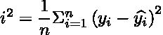

均方误差公式

在第一个节点中，统计值等于 1.335。

**样本** —节点中观察值的数量。因为这是根节点，所以 15480 对应于整个训练数据集。

**值** —节点的预测值。换句话说，如果观察路径在此节点停止，则该节点的预测值将为 2.074。

让我们创建一个保存所有节点中所有观察值的字典:

```
n_entries = {
“node 1”: 15480,
“node 2”: 12163,
“node 3”: 3317,
“node 4”: 5869,
“node 5”: 6294,
“node 6”: 2317,
“node 7”: 1000,
“node 8”: 2454,
“node 9”: 3415,
“node 10”: 1372,
“node 11”: 4922,
“node 12”: 958,
“node 13”: 1359,
“node 14”: 423,
“node 15”: 577
}
```

在计算特征重要性时，使用的度量之一是观察值落入某个节点的概率。概率是为决策树中的每个节点计算的，计算方法是将节点中的样本数除以数据集中的观察总数(在我们的例子中是 15480)。

让我们将字典表示为 **n_entries_weighted** :

```
n_entries_weighted = {
'node 1': 1.0,  
'node 2': 0.786,  
'node 3': 0.214,  
'node 4': 0.379,  
'node 5': 0.407,  
'node 6': 0.15,  
'node 7': 0.065,  
'node 8': 0.159,  
'node 9': 0.221,  
'node 10': 0.089,  
'node 11': 0.318,  
'node 12': 0.062,  
'node 13': 0.088,  
'node 14': 0.027,  
'node 15': 0.037
}
```

为了使特性重要性的定义具有数学上的严格性，让我们在本文中使用数学符号。

让我们将每个节点表示为

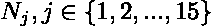

节点符号

每个节点，直到最终深度，都有一个左子节点和一个右子节点。让我们将它们表示为:

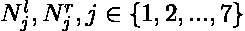

左右子符号

每个节点都有特定的属性。让我们将上一节中计算的重量表示为:

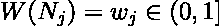

节点权重

让我们将均方误差(MSE)统计量表示为:

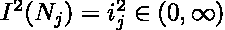

节点均方误差统计

有子节点的节点的一个非常重要的属性是所谓的节点重要性:

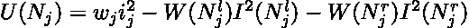

节点计算的重要性

上述等式的直觉是，如果子节点中的 MSE 较小，则该节点尤其是其分裂规则特征的重要性较大。

让我们用每个节点的 MSE 统计数据创建一个字典:

```
i_sq = {
“node 1”: 1.335,
“node 2”: 0.832,
“node 3”: 1.214,
“node 4”: 0.546,
“node 5”: 0.834,
“node 6”: 0.893,
“node 7”: 0.776,
“node 8”: 0.648,
“node 9”: 0.385,
“node 10”: 1.287,
“node 11”: 0.516,
“node 12”: 0.989,
“node 13”: 0.536,
“node 14”: 0.773,
“node 15”: 0.432
}
```

作者 Trevor Hastie、Robert Tibshirani 和 Jerome Friedman 在他们的巨著***The Elements of Statistical Learning:Data Mining，Inference，and Prediction*** 中用以下等式定义了特征重要性计算:

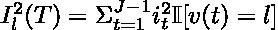

布雷曼特征重要性方程

在哪里

t——是整个决策树

l —有问题的特征

J —决策树中内部节点的数量

I——用于分割的度量的减少

II —指示器功能

v(t)-用于分割节点的特征 t 用于分割节点

这个等式背后的直觉是，对树中所有特征的度量的所有减少进行求和。

Scikit-learn 使用前面提出的节点重要性公式。主要区别在于，在 scikit-learn 中，引入了节点权重，即观察值落入树中的概率。

让我们放大一点，进一步检查节点 1 到 3。

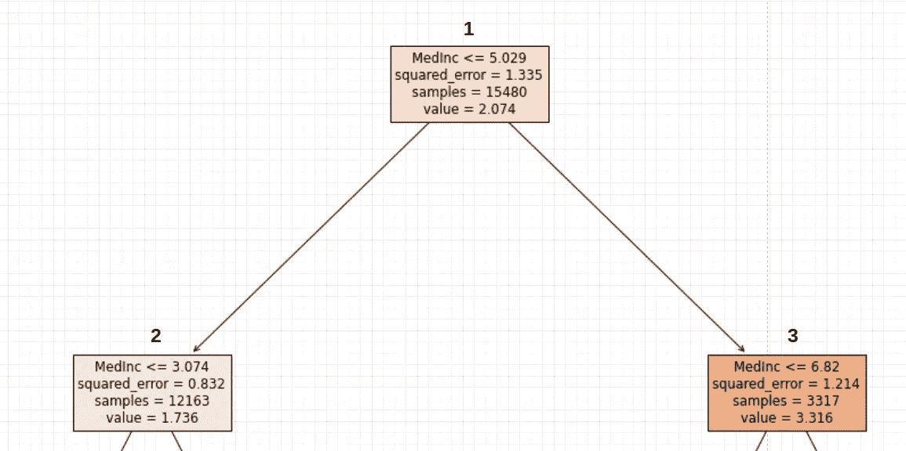

前三个节点；按作者分类的图表

节点重要性(以及要素重要性)的计算一次只考虑一个节点。为节点号 1 解释的后续逻辑适用于以下级别的所有节点。

**只有具有分裂规则的节点才有助于特征重要性的计算。**

第二个节点是节点 1 的左子节点，第三个节点是右子节点。

特征重要性背后的直觉始于分裂标准中的总体减少的想法。换句话说，我们想要测量给定的特征及其分裂值(尽管该值本身在任何地方都不使用)如何减少系统中的均方误差。上一节中定义的节点重要性等式反映了这种影响。

如果我们在根节点中使用 MedInc，将有 12163 个观察值到达第二个节点，3317 个观察值到达右节点。这转化为左节点的权重为 0.786 (12163/15480)，右节点的权重为 0.214 (3317/15480)。左侧节点中的均方误差等于 0.892，右侧节点中的均方误差为 1.214。

我们需要计算节点重要性:

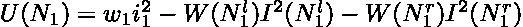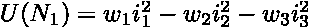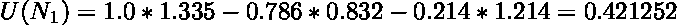

现在我们可以将节点重要性保存到字典中。字典键是在节点的分裂标准中使用的特征。这些值是节点的重要性。

```
{
  "**MedInc**": 0.421252,
  "**HouseAge**": 0,
  "**AveRooms**": 0,
  "**AveBedrms**": 0,
  "**AveOccup**": 0}
```

**上述计算过程需要对所有具有分裂规则的节点重复进行。**

让我们再做一些节点计算，以完全掌握算法:

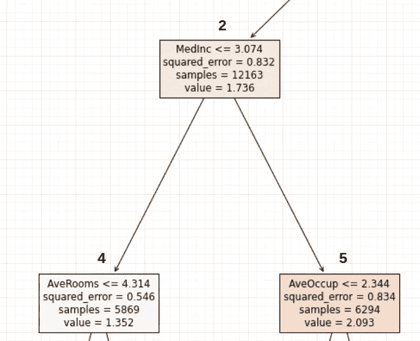

更多的平方误差减少；按作者分类的图表

如果我们在节点 2 中使用 MedInc 特性，误差平方为:

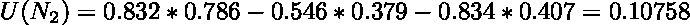

第二节点重要性

特征重要性字典现在变成了:

```
{
  "**MedInc**": 0.421 + 0.10758
  "**HouseAge**": 0,
  "**AveRooms**": 0,
  "**AveBedrms**": 0,
  "**AveOccup**": 0}
```

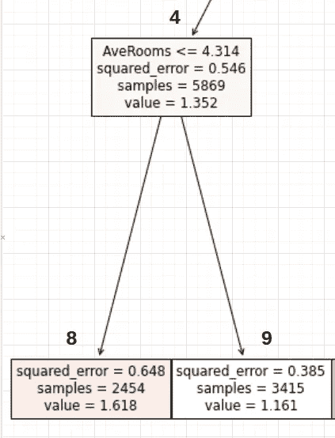

要拆分的新功能；按作者分类的图表

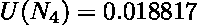

节点 4 的重要性

```
{
  "**MedInc**": 0.558,
  "**HouseAge**": 0,
  "**AveRooms**": 0.018817,
  "**AveBedrms**": 0,
  "**AveOccup**": 0}
```

我们不能更进一步，因为节点 8 和 9 没有分裂规则，因此不会进一步减少均方误差统计。

让我们对上面几节中给出的实现进行编码。

用于重要性计算的数据

现在让我们定义一个计算节点重要性的函数。

节点重要性计算函数

将所有这些放在一起:

计算节点的代码段

上述代码片段中的内容如下:

```
Node importance: {
‘node 1’: 0.421, 
‘node 2’: 0.108, 
‘node 3’: 0.076, 
‘node 4’: 0.019, 
‘node 5’: 0.061, 
‘node 6’: 0.025, 
‘node 7’: 0.013
} Feature importance before normalization: {
‘MedInc’: 0.618, 
‘AveRooms’: 0.019, 
‘AveOccup’: 0.086, 
‘HouseAge’: 0, 
‘AveBedrms’: 0
} **Feature importance after normalization: {
‘MedInc’: 0.855, 
‘AveRooms’: 0.026, 
‘AveOccup’: 0.119, 
‘HouseAge’: 0.0, 
‘AveBedrms’: 0.0
}**
```

归一化后的最终特征字典是具有最终特征重要性的字典。根据字典，到目前为止最重要的特征是 MedInc，其次是 ave occupation 和 AveRooms。

特征 HouseAge 和 AveBedrms 没有在任何分割规则中使用，因此它们的重要性为 0。

让我们将我们的计算与功能重要性计算的 scikit-learn 实现进行比较。

Sklearn 特性重要性的实现

上面写着:

```
Feature importance by sklearn: 
{
‘MedInc’: 0.854, 
‘HouseAge’: 0.0, 
‘AveRooms’: 0.027, 
‘AveBedrms’: 0.0, 
‘AveOccup’: 0.12
}
```

与我们的计算相比:

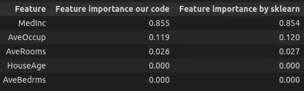

特征重要性比较

差异很小，但这是由于舍入误差。

在本文中，我非常详细地演示了决策树的特性重要性计算。一个非常相似的逻辑适用于分类中使用的决策树。唯一的区别是度量——我们不使用平方误差，而是使用 GINI 杂质度量(或其他分类评估度量)。所有关于节点重要性的计算保持不变。

我希望在读完所有这些之后，你会对如何解释和计算特性的重要性有一个更清晰的了解。

编码快乐！

[1]作者:**佩斯，r .凯利和罗纳德·巴里**
年份: **1997 年**
书名:**稀疏空间自回归**
网址:**[**http://archive.ics.uci.edu/ml**](https://www.dcc.fc.up.pt/~ltorgo/Regression/cal_housing.html)
期刊:**统计与概率快报****

**[2]作者:**特雷弗·哈斯蒂、罗伯特·蒂布拉尼和杰罗姆·弗里德曼**
年份: **2017**
书名:**统计学习的要素:数据挖掘、推断和预测**
网址:**[**http://archive.ics.uci.edu/ml**](https://hastie.su.domains/ElemStatLearn/)
页面:**368–370******