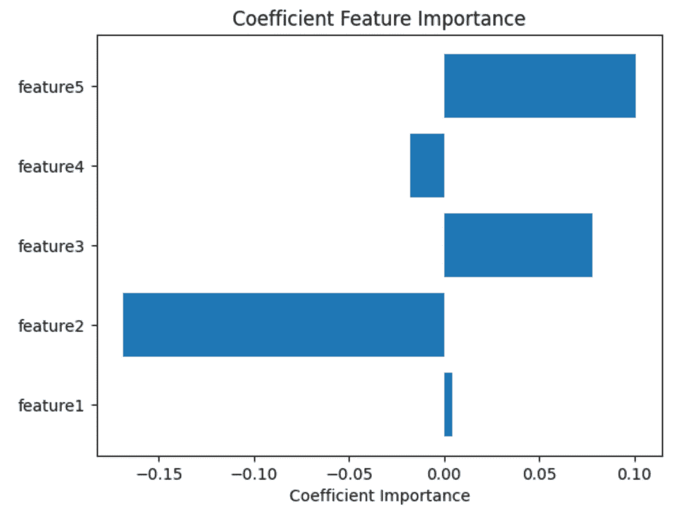
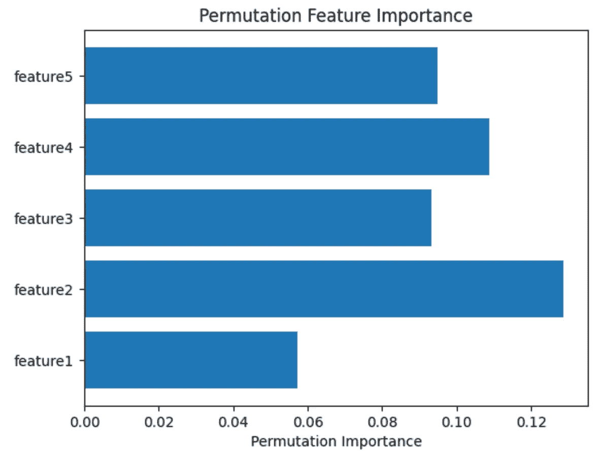
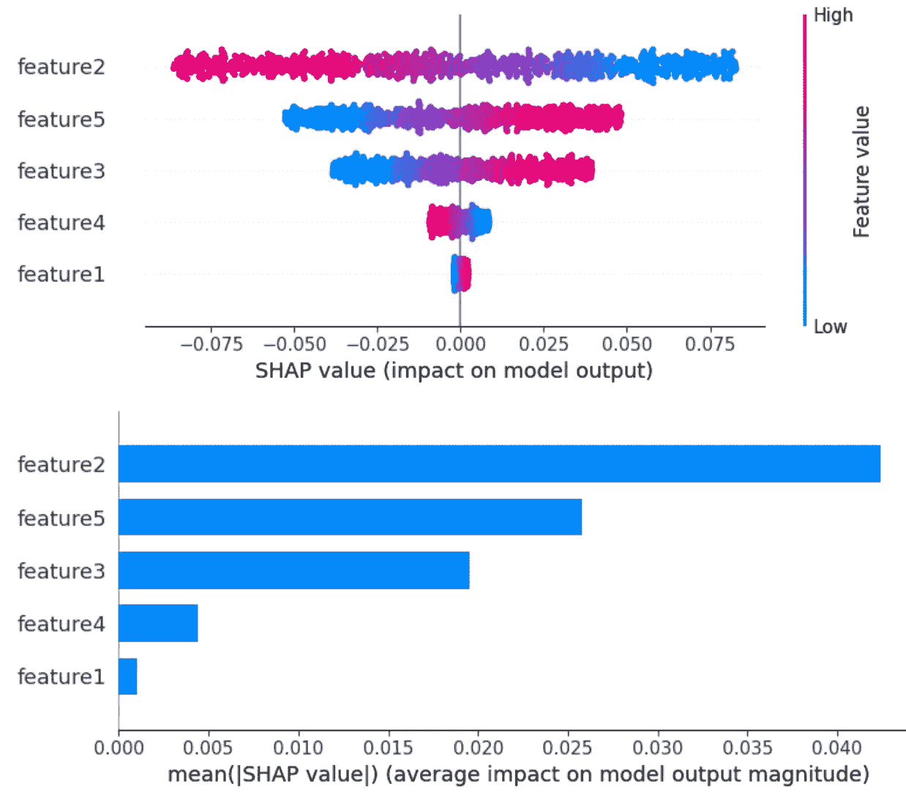
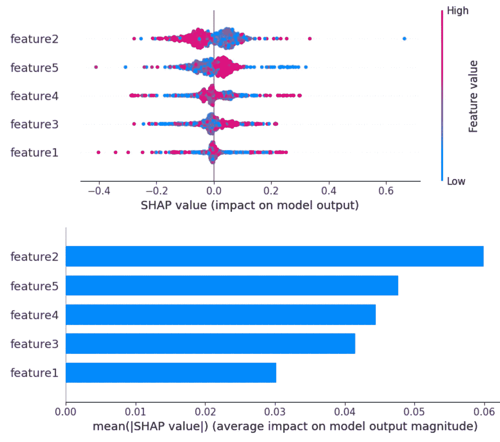

# 机器学习中的特征重要性，已解释

> 原文：<https://towardsdatascience.com/feature-importance-in-machine-learning-explained-443e35b1b284>

## 使用 SHAP 和 Sci-Kit Learn 识别与 Python 中的模型相关的重要特性


图片由[约书亚·戈德](https://unsplash.com/@joshgmit)从 [Unsplash](https://unsplash.com/photos/qIu77BsFdds) 拍摄

本文将重点介绍与各种方法相关的直觉和 Python 实现，以识别与机器学习模型相关的重要特性。以下是文章的结构。

**目录**

*   机器学习中的特征重要性是什么？
*   基于系数的特征重要性
*   置换特征重要性
*   树特征重要性
*   SHAP 特征重要性
*   实现
    -需求
    -合成数据&生成模型
    -系数
    -排列
    -树
    - SHAP
*   结束语
*   资源

# 机器学习中的特征重要性是什么？

特征重要性是模型开发中不可或缺的组成部分。它突出显示了传递到模型中的哪些要素对生成预测的影响程度高于其他要素。识别重要特征的结果可以直接反馈到模型测试和模型可解释性中。有多种方法可以计算特征的重要性，例如:

1.  基于系数的特征重要性
2.  基于排列的特征重要性
3.  树特征重要性
4.  SHAP

请注意，并非所有计算特征重要性的方法都适用于所有类型的模型。这些方法主要适用于监督经典机器学习问题(如分类和回归)中的大多数模型。

# 基于系数的特征重要性

基于系数的特征重要性可能是最容易理解的。直观上，基于系数的特征重要性指的是将预测生成为输入值的加权和的模型。

并非所有模型都可以计算特征的重要性。这适用于线性模型，如线性回归、逻辑回归、岭回归、支持向量机(仅当核是线性时)。这些类型的模型的主要共同点是它们识别与一组系数相关联的权重，我们可以将其解释为特征重要性。您可以从高到低对与这些系数相关的特征进行排序，最高的是最重要的特征，最低的是最不重要的特征。

# 置换特征重要性

> 基于置换的特征重要性被定义为当单个特征值被随机打乱时模型得分的减少。该过程打破了特征和目标之间的关系，因此模型分数的下降指示了模型对特征的依赖程度。[2]
> 
> [-http://sci kit-learn . org/stable/modules/permutation _ importance . html](http://scikit-learn.org/stable/modules/permutation_importance.html)

置换特征重要性的结果可以是负的和正的。当置换分数对于某些特征为负时，它表明从混洗数据生成的预测碰巧比真实数据更准确。当模型认为特性应该具有重要性，但却没有时，就会发生这种情况。发生这种情况是因为随机机会导致从混洗数据生成的预测更加准确。这意味着这些特征有噪声。

# 树特征重要性

sci-kit 中基于树的模型学习，如决策树、随机森林、梯度增强、ada 增强等。嵌入了它们自己的特性重要性。他们根据用于选择分裂点的标准(如基尼系数或熵)的减少来计算他们的重要性分数[1]。可以通过训练模型后可用的`feature_importances_`属性引用这些分数。

# SHAP 特征重要性

SHAP 是一个流行的研究论文，重点是模型的可解释性。SHAP 特征重要性是置换特征重要性的替代方法[3]。排列法和 SHAP 的区别在于，SHAP 着眼于特征属性的大小，而排列法着眼于模型性能的下降[3]。SHAP 图书馆内置了一系列的`explainer`类。它支持线性模型、内核、树、深度学习模型等的可解释性。

# 履行

## 要求

```
Python=3.9.12
pandas>=1.4.3
numpy>=1.23.2
shap>=0.41.0
matplotlib>=3.5.1
sklearn>=1.1.2
```

## 综合数据并生成模型

请注意，因为我们使用的是随机生成的数据，所以特性重要性的结果几乎没有意义。这只是为了展示如何通过代码为您正在处理的问题实现这些不同类型的特性重要性度量。下面的脚本将合成一个具有 5 个特征的随机数据集，并从中训练 2 个基于回归的模型。即梯度推进回归器和支持向量回归器。

## 系数



系数特征重要性。图片由作者提供。

## 排列



置换特征重要性。图片由作者提供。

## 树


基于树的特征重要性。图片由作者提供。

## SHAP



线性核 SVM 回归模型的 SHAP 特征重要性。图片由作者提供。



SHAP 特征对梯度推进回归器的重要性。图片由作者提供。

SHAP 库中的汇总绘图功能允许您根据 SHAP 值直观地查看模型的最重要功能。第一个图显示了每个要素的影响分布，而第二个图是由 SHAP 值的 MAE(平均绝对值)生成的条形图。

# 结束语

基于对识别特征重要性的各种方法如何与模型的训练数据相关联的直观理解，以及所提供的相关代码，您应该能够为您正在处理的模型实现这一点，以查看哪些特征具有最高的影响。这对于模型测试和可解释性非常有用。

请在我的 GitHub 页面[这里](https://github.com/vatsal220/medium_articles/blob/main/feature_importance/feature_importance.ipynb)查看与本教程相关的资源库。

如果你想转型进入数据行业，并希望得到经验丰富的导师的指导和指引，那么你可能想看看最敏锐的头脑。Sharpest Minds 是一个导师平台，导师(他们是经验丰富的实践数据科学家、机器学习工程师、研究科学家、首席技术官等。)将有助于你的发展和学习在数据领域找到一份工作。在这里查看。

# 资源

*   [1][https://machine learning mastery . com/calculate-feature-importance-with-python/](https://machinelearningmastery.com/calculate-feature-importance-with-python/)
*   [2][http://sci kit-learn . org/stable/modules/permutation _ importance . html](http://scikit-learn.org/stable/modules/permutation_importance.html)
*   [3][https://christophm . github . io/interpretable-ml-book/shap . html](https://christophm.github.io/interpretable-ml-book/shap.html#:~:text=SHAP%20feature%20importance%20is%20an,on%20magnitude%20of%20feature%20attributions)

如果你觉得这篇文章有用，这里有一些我写的其他文章，你可能也会觉得有用。

</word2vec-explained-49c52b4ccb71>  </link-prediction-recommendation-engines-with-node2vec-c97c429351a8>  </recommendation-systems-explained-a42fc60591ed>  </text-summarization-in-python-with-jaro-winkler-and-pagerank-72d693da94e8> 