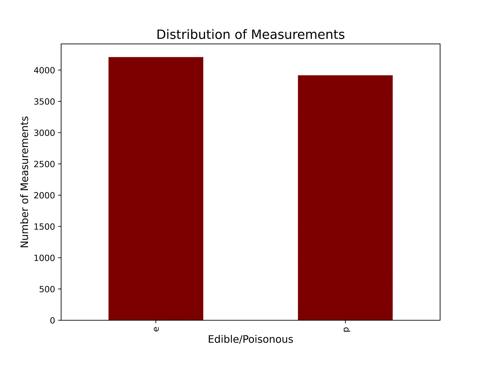
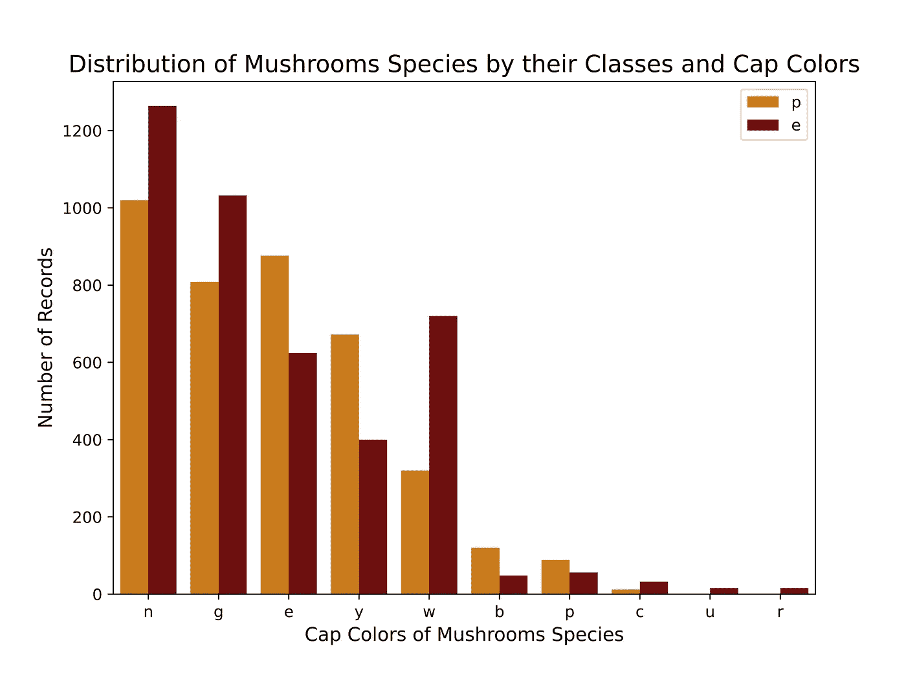
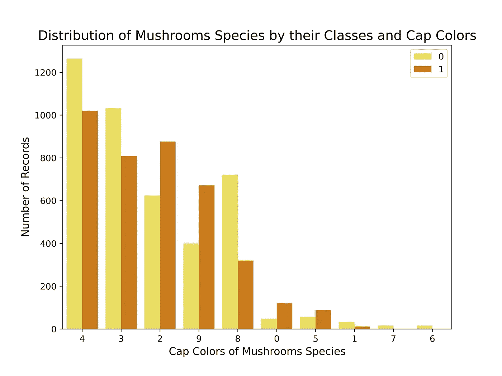
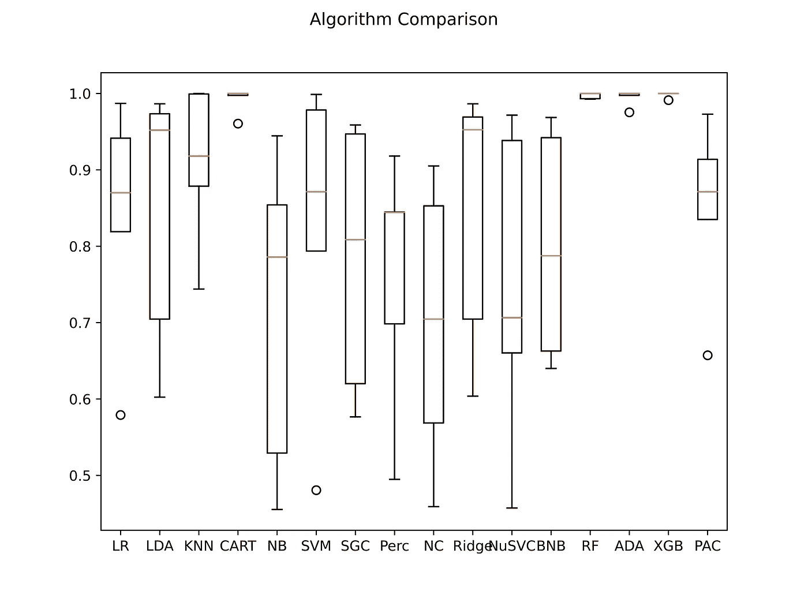

# 利用特征重要性预测 Python 中蘑菇的可食用性

> 原文：<https://towardsdatascience.com/feature-importance-to-predict-mushrooms-edibility-in-python-5aa133fea3f8>

## 利用特征重要性来预测蘑菇种类是可食用的还是有毒的


照片由 [Jannik Selz](https://unsplash.com/@selzcc?utm_source=medium&utm_medium=referral) 在 [Unsplash](https://unsplash.com?utm_source=medium&utm_medium=referral) 上拍摄

# 介绍

T 本文旨在利用特征重要性来评估**数据集中的所有列**是否需要用于**预测**。

秋天快到了。想象一下，你正在树林中散步，发现路边有一些蘑菇。将它们的一些特性输入到一个 ML 驱动的应用程序中不是很好吗？我个人不喜欢吃蘑菇，但我绝对喜欢食物，走了很长一段路后，我已经可以闻到面前有一道美味的“tagliolini ai funghi”。

蘑菇是真菌，是独立于植物和动物的独立王国的一部分。正如你可能想象的那样，在决定一个人是否可以食用之前，他们会给出无数的特征来评估。

您的徒步旅行团队正在离开，我们需要尽快做出决定。

> 哪个信息是舒适地评估蘑菇品种的可食用性的基础？

让我们找出答案

## 数据

**数据集**可以在[机器学习 UCI 知识库](https://archive.ics.uci.edu/ml/datasets/mushroom)【1】中检索。它包括关于**蘑菇**和**蘑菇**家族中 **23 种蘑菇**的假设信息。这些记录是假设的，因为根据蘑菇指南，它们是人工输入的。作者确定了 **22 个独特的特征**，不包括可食用或有毒的特征，其中一些是:

1.  `cap-shape`:钟形=b，锥形=c，凸形=x，扁平=f，圆球形=k，凹形=s
2.  `cap-surface`:纤维状=f，凹槽=g，鳞状=y，光滑=s
3.  `cap-color`:棕色=n，浅黄色=b，肉桂色=c，灰色=g，绿色=r，粉色=p，紫色=u，红色=e，白色=w，黄色=y
4.  `bruises?`:淤青=t，no=f
5.  `odor`:杏仁=a，茴香=l，杂酚油=c，鱼腥味=y，恶臭=f，霉味=m，无=n，刺鼻=p，辛辣=s
6.  `gill-attachment`:附着=a，下降=d，自由=f，缺口=n
7.  `gill-spacing`:近=c，挤=w，远=d
8.  `gill-size`:宽=b，窄=n
9.  `gill-color`:黑色=k，棕色=n，浅黄色=b，巧克力色=h，灰色=g，绿色=r，橙色=o，粉色=p，紫色=u，红色=e，白色=w，黄色=y
10.  `stalk-shape`:放大=e，缩小=t
11.  `stalk-root`:球根=b，球杆=c，杯子=u，等号=e，根茎=z，有根=r，缺失=？
12.  `stalk-surface-above-ring`:纤维状=f，鳞状=y，丝状=k，光滑=s
13.  `stalk-color-above-ring`:棕色=n，浅黄色=b，肉桂色=c，灰色=g，橙色=o，粉色=p，红色=e，白色=w，黄色=y
14.  `spore-print-color`:黑色=k，棕色=n，浅黄色=b，巧克力色=h，绿色=r，橙色=o，紫色=u，白色=w，黄色=y

## 特征重要性

您可以将一个要素标识为数据集中的多个列之一。计算**特征重要性**是指每个特征在训练一个模型后所拥有的分数。你会同意我的观点，即**并不是**所有的特征都是**相等的**，它们对输出预测有贡献。

我们可以看到与**帕累托法则**的相似之处，其中某件事情的 **20%** 负责结果的 **80%** ，或者称为 20:80 法则。在**销售环境**中，帕累托原则的一个例子是，你的 20%的客户创造了你 80%的销售额。在一个**机器学习场景**中，我们可以把这个原则翻译成“ **20%** 的特征负责 **80%** 的正确预测”。特征重要性允许从业者识别出 **20%** 。

你是如何解读乐谱的？一个**较高的分数**表明一个特性对你的模型更有**影响**，而一个**较低的分数**表明信息**对模型来说不那么重要**。对于我们的项目，我们有 21 个特征，我们想计算每个特征的重要性分数，并且只选择几个[2]。

# 模特们

特征选择考虑的模型有两个:**随机森林**和**梯度提升**。每一种都有自己的特点，我将简要解释一下。

## 随机森林

“**随机决策森林**属于**集成学习**算法的范畴。“**森林**这个名字来自于它“组成”的个体实体:**决策树**。在训练阶段，多个决策树从数据中学习，一个**投票**机制确保最常见的结果也是最终输出。该模型同时用于**分类**和**回归**任务。

**随机森林**在有大量变量时表现出了显著的**性能**。鉴于需要调整的超参数很少，企业认为这是一个“**黑箱**”。很难解释为什么一个**随机森林**会做出某些预测。另一方面，该特征提供了**适应性**和**高精度**，而不会陷入过度拟合的风险【3】。

## 梯度推进

**梯度提升**也是一种**集成学习**算法，可用于**分类**和**回归任务**。类似于随机森林，梯度增强预测基于应用于决策树的**投票**机制。根本区别在于，这些决策树被定义为“**弱**或“**浅**”，这意味着一个模型具有**高偏差**和**低方差**。换句话说，它利用了**一致的预测**(具有所有相似的结果)，但是不准确(显示错误的结果)。集合的目标是**减少偏差**同时保持**方差低**，使模型输出更接近目标结果【4】。

你可以把它想象成一束指向镖靶的激光。起初，模型做出的所有预测都远离靶心，但它们都彼此接近，它们是一致的。梯度提升以**减少误差**为目标依次构建弱学习器，使目标越来越接近靶心，即最佳模型。与直觉相反，梯度推进仍然保留了很大的**泛化**能力，这使得它成为一个**计算昂贵的**但总体上很棒的学习模型。

# Python 中的代码部署

## 数据探索

与大多数数据科学项目一样，代码部署的第一部分侧重于**数据探索**和**可视化**。一个好的早期测试，检查数据集**是否平衡。在分类问题中，重要的是两个目标变量呈现相似的计数。**探索性数据分析**因此是项目的第一步。**

*   我们根据需要导入`pandas`和`matplotlib`库
*   我们将 csv 文件作为熊猫**数据帧**读取
*   `category_dist`统计可食用或有毒的记录数量
*   此时，可以定义图表及其**大小**、**颜色**、**字体**、**大小**，以及我们是否想要一个网格。

```
#Importing libraries
import matplotlib.pyplot as plt
import pandas as pd#Reading dataset
df = pd.read_csv('mushrooms.csv')#Counting values within each class
category_dist = df['class'].value_counts()#Defining chart
plt.figure(figsize=(8,6))
category_dist.plot(kind='bar', color = '#89b4a1')
plt.grid()
plt.xlabel("Edible/Poisonous", fontsize = 12)
plt.ylabel("Number of Measurements", fontsize = 12)
plt.title("Distribution of Measurements", fontsize = 15)
plt.grid(False)#Generating chart
plt.show()
```



蘑菇可食用性的秋季主题分布——作者图表

对于蘑菇数据集，可食用物种的数量彼此之间只相差几百个。我们可以断定数据集是**平衡的**，我们可以继续进行项目的下一部分，标签编码。

## 标签编码

处理**分类变量**可能是几个机器学习算法的问题。在预处理阶段，标签编码通过将标签转换成数字来解决问题，以便机器**能够读取它们。**

流程是如何运作的？让我们以 cap-color 特性为例，有十种可能性:

*   棕色=n，
*   buff=b，
*   肉桂=c，
*   灰色=g，
*   绿色=r，
*   粉色=p，
*   紫色=u，
*   红色=e，
*   白色=w，
*   黄色=y

标签编码算法按照字母顺序对它们进行分类:b、c、e、g……然后给每个字母分配一个从 0 开始的数字。字母“b”对应于 0，“c”对应于 1，“e”对应于 2，依此类推。

多亏了`sklearn`，这个过程相当容易。从业者需要导入`LabelEncoder`包，创建一个名为`labelencoder`的对象，并编写一个 for 循环语句，该对象将每一列的记录转换成一个**数字**形式。

```
from sklearn.preprocessing import LabelEncoderlabelencoder=LabelEncoder()for col in df.columns:
    df[col] = labelencoder.fit_transform(df[col])
```

为了更直观地了解这一过程，下面的图表显示了每一类(可食用或有毒)蘑菇的**颜色。你可以看到大多数棕色和灰色蘑菇是可以食用的，但是你应该远离黄色蘑菇。**



热编码前蘑菇种类的颜色和类别的秋季主题分布-作者图表

在我们对数据集进行标签编码后，你会注意到类和帽颜色特征都已经被**转换成数字**。食用的字母“e”现在对应于数字 0，而“p”对应于 1。关于帽子的颜色，所有的棕色蘑菇现在被归类为 4，因为它是按字母顺序排列的第 5 个字母。



热编码后蘑菇种类按颜色和类别的秋季主题分布-作者图表

## 型号选择

对于**模型选择**部分，我强烈推荐你看一下我之前的一篇文章中的[，在这篇文章中，我解释了如何**部署流水线**并评估几个机器学习**模型的性能**。对于这个项目，我在将以下内容设置为输入和目标变量后应用了相同的管道:](/model-selection-and-hyperparameter-tuning-on-amazon-kindle-book-reviews-with-python-6d17ec46d318)

```
#Defining input and target variablesx = df.drop('class', axis=1)
y = df['class']
```

我们的输入变量最初是数据集的所有 21 个特征。因此`x` 由除`class`之外的所有列组成。既然我们想预测一个蘑菇是否可以食用，那么目标变量就是 class，它包含了我们需要的信息。

我决定交叉验证 **16 种不同的算法**，以在评估特性的重要性之前识别出具有最高性能的算法**(yo-yo Eminem)。**

****

**模型选择过程后算法的准确性比较—作者提供的图表**

**特别地，四个以最小的方差显示出最高的准确度:**决策树分类器(CART)** ，**随机森林(RF)** ， **AdaBoost 分类器** **(ADA)** ，**梯度增强(XGB)** 。**

```
LR: 0.839369 (0.142382) 
LDA: 0.843812 (0.159062) 
KNN: 0.908047 (0.094523) 
CART: 0.991626 (0.015547) 
NB: 0.713839 (0.189206) 
SVM: 0.824590 (0.187337) 
SGC: 0.782230 (0.159755) 
Perc: 0.760104 (0.150632) 
NC: 0.698081 (0.167803) 
Ridge: 0.843319 (0.158079) 
NuSVC: 0.746827 (0.189874) 
BNB: 0.800220 (0.136547) 
RF: 0.997168 (0.003473) 
ADA: 0.994582 (0.009653) 
XGB: 0.998277 (0.003446) 
PAC: 0.850076 (0.106792)
```

**值得一提的是，这样的**高性能**可能是**过度适应**的迹象，这个问题我们不打算在本文中讨论。不过，在未来的项目中，这将是一个很好的解释主题。现在，让我们考虑一下将被带到下一阶段的两个最好的模型:**随机森林**和**梯度提升**。**

## **特征重要性:随机森林**

**在这个阶段，我们知道**随机森林**的表现已经很出色了，下一步就是评估**的表现**是否能在更少的信息下保持不变。这可以通过选择**几个特征**来完成，这些特征是进行预测的基础:**

*   **首先，让我们导入所有我们需要的`sklearn`子包:`train_test_split`、`classification_report`、`RandomForestClassifier`和`GradientBoostingClassifier`**

```
#Importing libraries
from sklearn.model_selection import train_test_split
from sklearn.metrics import classification_report
from sklearn.ensemble import RandomForestClassifier,
GradientBoostingClassifier
```

*   **在运行单元之前，需要再次设置输入和目标变量，以避免任何问题**
*   **我们可以通过分配 **80%** 训练数据和 **20%** 测试来分割数据集。我决定将`random_state=56`设置为结果再现性。它可以是你想要的任何自然数。**
*   **我们用`RandomForestClassifier()`函数创建一个对象。**
*   **此时，命令 RE.fit 开始特征(`X_train`)和目标变量(`y_train`)的训练阶段**
*   **一旦在 80%的数据集上训练了分类器，我们就可以通过创建`predicted_RF`对象在剩余的 20%上测试它的准确性**
*   **最后，分类报告告诉我们经过训练的分类器的性能**

```
#Defining input and target variable
x = df.drop('class', axis=1)
y = df['class']#Splitting dataset between training and testing with a 80-20 #allocation
X_train, X_test, y_train, y_test = train_test_split(x, y, test_size = 0.2, random_state = 56)#Classifier Object
RF = RandomForestClassifier()#Fitting classifier to data
RF.fit(X_train, y_train)#Predicting testing records
predicted_RF = RF.predict(X_test)#Printing classification report
print(classification_report(y_test, predicted_RF))
```

**从我们在选型阶段看到的情况来看，**精度**有了进一步的提高。该算法能够在 100%的情况下识别蘑菇是可食用的还是有毒的。产生输出的信息目前来自**所有特征**。**

**现在的问题是:**

> **“有没有比其他更根本的特征？当我看到一个我想收集的蘑菇时，我需要特别注意什么？”**

```
 precision    recall  f1-score   support

           0       1.00      1.00      1.00       841   
           1       1.00      1.00      1.00       784 accuracy                           1.00      1625  
   macro avg       1.00      1.00      1.00      1625
weighted avg       1.00      1.00      1.00      1625
```

**运行下面的代码单元格后，可以确定上面的答案。这看起来很复杂，但我们可以一点一点地分解它:**

*   **单元格创建两列:一列名为`feature`，另一列名为`feature_importance`，第一列列出了数据集中包含的所有列:`Cap-shape`、`Cap-surface`、`Cap-color` …**
*   **第二列包含数据集每一列的所有关联要素重要性值。如果你只是想要这个值，你需要对随机森林算法使用命令`RF.feature_importances_`(其他分类器可能有不同的名字)**
*   **然后这两列一起被转换成熊猫数据帧**
*   **结果以我可以用命令`to_markdown`复制和粘贴的格式打印出来**

```
##RF feature importancefeature_importance = pd.DataFrame(
{'feature':list(X_train.columns),
'feature_importance':[abs(i) for i in RF.feature_importances_]}
)print(feature_importance.to_markdown())
```

**可以看出，要素重要性报告的值从 0 到 0.002 一直到 0.2。没有特别的原因，我选择了报告值至少为 0.1 或接近 0.1 的行。截止日期留给我们 4 个特征用于下一个模型:`odor`、`gill-size`、`gill-color`和`spore-print-color`。**

```
|    | feature                  |   feature_importance |
|---:|:-------------------------|---------------------:|
|  0 | cap-shape                |           0.00488162 |
|  1 | cap-surface              |           0.00917991 |
|  2 | cap-color                |           0.013382   |
|  3 | bruises                  |           0.054723   |
|  4 | odor                     |           0.183597   |
|  5 | gill-attachment          |           0.00193266 |
|  6 | gill-spacing             |           0.03089    |
|  7 | gill-size                |           0.101708   |
|  8 | gill-color               |           0.122184   |
|  9 | stalk-shape              |           0.0202438  |
| 10 | stalk-root               |           0.0601195  |
| 11 | stalk-surface-above-ring |           0.0411767  |
| 12 | stalk-surface-below-ring |           0.040044   |
| 13 | stalk-color-above-ring   |           0.0141602  |
| 14 | stalk-color-below-ring   |           0.0147517  |
| 15 | veil-type                |           0          |
| 16 | veil-color               |           0.00194969 |
| 17 | ring-number              |           0.0151127  |
| 18 | ring-type                |           0.0839357  |
| 19 | spore-print-color        |           0.0978179  |
| 20 | population               |           0.0604895  |
| 21 | habitat                  |           0.0277208  |
```

**现在我们知道了最重要的特性，我们可以重复训练和测试过程。这次`x`只有**四列**我们确定为最重要的特性。目标变量`y`保持不变。**

*   **我们使用相同的方法将数据集分为训练和测试。**
*   **创建`RF`对象**
*   ****训练**模型**测试**20%的数据**
*   **打印**分类报告****

```
##RF after feature selection #Defining input and target variable while dropping unimportant #features
x = df[['odor', 'gill-size', 'gill-color', 'spore-print-color']]
y = df['class']#Splitting dataset into training and testing
X_train, X_test, y_train, y_test = train_test_split(x, y, test_size = 0.2, random_state = 56)#Calling classifier
RF = RandomForestClassifier()#Fitting classifier to data
RF.fit(X_train, y_train)#Predicting testing records
predicted_RF = RF.predict(X_test)#Printing classification prediction
print(classification_report(y_test, predicted_RF))
```

**足够令人惊讶的是，该模型保持了与处理 **21 特征**时相同的精度，这一次仅通过**使用 4 个**。这向我们表明，尤其是当我们将模型投入生产时，模型所依赖的特性的数量应该限制在最重要的特性上。一般来说，更多的特性对应于部署计算成本更高的模型。**

```
 precision    recall  f1-score   support

           0       1.00      1.00      1.00       841   
           1       1.00      1.00      1.00       784 accuracy                           1.00      1625  
   macro avg       1.00      1.00      1.00      1625
weighted avg       1.00      1.00      1.00      1625
```

## **特征重要性:梯度推进分类器**

**在这个最后阶段，我们必须重复随机森林模型的过程，但使用不同的算法，梯度推进，在模型选择阶段表现最好。**

*   **在前一个单元中，我们重新定义了`x`和`y`，使它们只包含最重要的特性。我们需要重新分配所有数据集列，以评估模型的整体性能。**
*   **数据集遵循通常的 80/20 分割比率，具有相同的`random_state`。**
*   **对象`XGB`包含函数`GradientBoostingClassifier()`**
*   **使用命令`fit`，分类器开始基于训练数据进行学习**
*   **命令`predict()`执行测试阶段**
*   **我们最终可以打印分类报告来评估**性能****

```
#Defining input and target variable
x = df.drop('class', axis=1)
y = df['class']#Splitting dataset between training and testing with a 80-20 #allocation
X_train, X_test, y_train, y_test = train_test_split(x, y, test_size = 0.2, random_state = 56)#Calling classifier
XGB = GradientBoostingClassifier()#Fitting classifier to data
XGB.fit(X_train, y_train)#Predicting testing records
predicted_XGB = XGB.predict(X_test)#Printing classification report
print(classification_report(y_test, predicted_XGB))
```

**当对所有特征进行训练时，**梯度增强**分类器报告与随机森林分类器相同的分数。在这个阶段，我们可以问自己以前的问题:**

> **“有没有比其他更根本的特征？当我看到一个我想收集的蘑菇时，我需要特别注意什么？”**

**两个不同的分类器可能通过使用最相关的不同特征来得到相同的结果。**

```
 precision    recall  f1-score   support

           0       1.00      1.00      1.00       841   
           1       1.00      1.00      1.00       784 accuracy                           1.00      1625  
   macro avg       1.00      1.00      1.00      1625
weighted avg       1.00      1.00      1.00      1625
```

**获取梯度增强算法的特征重要性的命令对于随机森林模型是相同的:`feature_importances_`。代码背后的逻辑和以前一样。它创建了两列，一列包含所有的特性名称，另一列包含所有的**特性重要性分数**。**

```
##XGB feature importance#Calculating feature importances
feature_importance=pd.DataFrame({'feature':list(X_train.columns),'feature_importance':[abs(i) for i in XGB.feature_importances_]})#Printing dataframe
print(feature_importance.to_markdown())
```

**你可能会注意到这些值非常相似，如果我们使用我们之前建立的 **> 0.1 截止值**规则，同样的四个特征被确定为最相关:`odor`、`gill-size`、`gill-color`和`spore-print-color`。**

```
|    | feature                  |   feature_importance |
|---:|:-------------------------|---------------------:|
|  0 | cap-shape                |           0.00458413 |
|  1 | cap-surface              |           0.0146785  |
|  2 | cap-color                |           0.0127857  |
|  3 | bruises                  |           0.0573168  |
|  4 | odor                     |           0.181369   |
|  5 | gill-attachment          |           0.00358367 |
|  6 | gill-spacing             |           0.0492609  |
|  7 | gill-size                |           0.115759   |
|  8 | gill-color               |           0.0958662  |
|  9 | stalk-shape              |           0.0229765  |
| 10 | stalk-root               |           0.0531794  |
| 11 | stalk-surface-above-ring |           0.0495843  |
| 12 | stalk-surface-below-ring |           0.0367454  |
| 13 | stalk-color-above-ring   |           0.0128033  |
| 14 | stalk-color-below-ring   |           0.0138009  |
| 15 | veil-type                |           0          |
| 16 | veil-color               |           0.00169852 |
| 17 | ring-number              |           0.0116543  |
| 18 | ring-type                |           0.0784959  |
| 19 | spore-print-color        |           0.104922   |
| 20 | population               |           0.0464761  |
| 21 | habitat                  |           0.0324597  |
```

**我们已经为**梯度增强**模型确定了四个最相关的特征，所以让我们重复我们为随机森林所做的相同过程。**

```
##XGB after feature selection#Defining input and target variable while dropping unimportant #features
x = df[['odor', 'gill-size', 'gill-color', 'spore-print-color']]
y = df['class']#Splitting dataset between training and testing with a 80-20 #allocation
X_train, X_test, y_train, y_test = train_test_split(x, y, test_size = 0.2, random_state = 56)#Calling classifier
XGB = GradientBoostingClassifier()#Fitting classifier to data
XGB.fit(X_train, y_train)#Predicting testing records
predicted_XGB = XGB.predict(X_test)#Printing classification report
print(classification_report(y_test, predicted_XGB))
```

**具有 **4 个基本特征**的更新型号比具有所有 21 个特征的型号稍差。差异是 0.01，一个难以置信的小实体，这意味着大约有 **16 个记录**在超过 1600 个记录中被**错误分类**。**

```
 precision    recall  f1-score   support

           0       0.99      1.00      1.00       841   
           1       1.00      0.99      1.00       784 accuracy                           1.00      1625  
   macro avg       1.00      1.00      1.00      1625
weighted avg       1.00      1.00      1.00      1625
```

**同样，结果与上一个极其接近。主要区别在于使用的特征数量，因此我们可以假设该模型在计算上应该**更便宜**，因此从 ML 操作的角度来看更好。**

**跟踪所有不需要进行预测和运行模型的要素可以节省万亿字节的空间。在目前的设置中，这没有什么区别，但对于大型科技公司来说，取消一整列可以节省数百万美元。**

# **结论**

**很明显，在有很多特性的情况下，选择几个是很重要的。我们能够通过在两种情况下保持相同的性能来降低**计算成本**。我们用较少的努力获得了类似的结果。**

**当然，这并非没有挑战，需要解决这些挑战以进一步改进。**

**首先，一些基本特征甚至连专家都很难识别**。更具体地说，值得一提的是“**气味**”。你能认出“茴香”和“杂酚油”的区别吗？我真的不会。****

**最重要的是，我们不要忘记**过度配合**。所有模型都有令人难以置信的高总体精度分数，接近完美。明确建议将模型部署在相似数据集中的未知记录上，以进一步测试其可靠性。**

****需要物种 id**来将模型的范围扩展到除了蘑菇和蘑菇以外的新蘑菇家族。**

**我确实有一个**最终免责声明**给那些读完这篇文章后想尝试**蘑菇狩猎**的人。没有专家陪你一起采摘蘑菇是**根本不推荐的**。美国的一些州和一些国家要求有执照才能练习。除了法律，一个好的经验法则是不要碰它，除非你 100%确定它可以食用。每种蘑菇对生态系统都有一定的贡献，所以如果不确定，最好让它留在原地！**

***最后，如果您喜欢该内容，请考虑添加一个关注，以便在新文章发布时得到通知。如果你对这篇文章有什么要考虑的，写在评论里吧！我很想读读它们:)谢谢你的阅读！***

***PS:如果你喜欢我写的东西，如果你能通过* [*这个链接*](https://giovanni-valdata.medium.com/membership) *订阅一个中等会员，那对我来说就是全世界。有了会员资格，你就获得了媒体文章提供的惊人价值，这是支持我的内容的一种间接方式！***

**参考**

**[1] UCI 机器学习知识库:蘑菇数据集。(2022).检索于 2022 年 9 月 13 日，来自 Uci.edu 网站:[https://archive.ics.uci.edu/ml/datasets/Mushroom](https://archive.ics.uci.edu/ml/datasets/Mushroom)**

**[2]兹恩，a .，克雷默，n .，索南堡，s .，和勒施，G. (2009 年 9 月)。特征重要性排序度量。在*关于数据库中的机器学习和知识发现的欧洲联合会议*(第 694–709 页)。斯普林格，柏林，海德堡。**

**[3] Biau，g .，& Scornet，E. (2016)。随机森林导游。*测试*， *25* (2)，197–227。[https://doi.org/10.1007/s11749-016-0481-7](https://doi.org/10.1007/s11749-016-0481-7)**

**[4]j . h .弗里德曼(2002 年)。随机梯度增强。*计算统计&数据分析*， *38* (4)，367–378。[https://doi . org/10.1016/s 0167-9473(01)00065-2](https://doi.org/10.1016/s0167-9473(01)00065-2)**