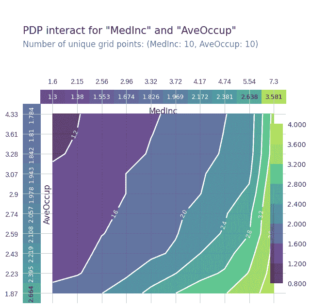
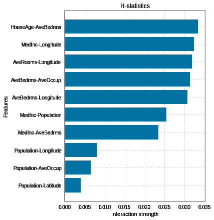
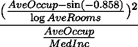

# 功能交互:概述

> 原文：<https://towardsdatascience.com/feature-interactions-524815abec81>

# 介绍

> 当预测模型中的要素相互作用时，预测不能表示为要素效果的总和，因为一个要素的效果取决于另一个要素的值。克里斯托弗·莫尔纳尔

特征对变量预测的复杂协同效应称为特征相互作用。特征交互的另一个方面是一个特征相对于与之交互的另一个特征的变化。这些变量通常被称为**交互变量**。

通常，我们会在数据集中遇到**成对的特征交互**，其中特征以 2 个为一组进行交互。例如，患心脏病的风险取决于你的身体质量指数，它被定义为*体重/身高*。这里， *{体重，身高}* 是成对交互。不太常见的**高阶特征相互作用**，我们看到两个以上的特征相互作用，在科学中它们有如此复杂的关系。例如， *{x₁，x₂，x₃，x₄}* 是 *log(x₁ + x₂ + x₃*x₄ )* 中的四阶互动。

识别数据集中存在的要素交互非常有用，原因有多种，包括:

*   了解数据集中要素之间的关系及其对预测的影响，避免仅使用主要影响而不使用交互影响来解释模型的偏见
*   使用关于交互的信息来显式地构建表达模型
*   提高模型性能的工程特征

# 分析功能交互

一种用于可视化交互效应的流行方法是**部分相关图(PDP)** 。我们可以使用 PDP 来可视化 2 个特征如何随预测而变化。像 [ICE](https://github.com/AustinRochford/PyCEbox) 和 [shapley](https://shap.readthedocs.io/en/latest/index.html) 这样的变体也以类似的方式帮助你可视化交互效果。下面我们看一个加州住房数据集的例子(使用 [pdpbox](https://github.com/SauceCat/PDPbox) ),随着中值收入和房屋平均占有者的增加，房价也随之上涨。



PDP 交互图示例

虽然这些方法在解释交互效应方面很棒，但在自动识别数据中的所有特征交互方面，它们是相当乏味的工具，尤其是如果您有一个大的特征空间。我们可以使用的一种简单方法是对基于 F 统计的所有特征和过滤器交互组合应用 2-way **ANOVA** 方法。但是，它们在捕捉复杂关系方面效率不高。然而， **Friedman 的 H 统计量**使用之前讨论的部分相关性来识别数据集中给定要素顺序的交互强度。下图显示了加州住房数据集中前 10 个交互的 H 统计数据(使用 [sklearn_gbmi](https://github.com/ralphhaygood/sklearn-gbmi) 计算):



虽然这些方法对于成对的相互作用非常有效，但是它们很难用于识别更高阶的相互作用。我遇到的一个有趣的方法是**神经交互检测**。该方法分析前馈神经网络的权重，以识别任意阶的相互作用。从他们的[例子](https://github.com/mtsang/neural-interaction-detection)中，给出了以下合成数据

```
X1, X2, X3, X4, X5, X6, X7, X8, X9, X10 = X.transpose()interaction1 = np.exp(np.abs(X1-X2))                        
interaction2 = np.abs(X2*X3)  
interaction3 = -1*(X3**2)**np.abs(X4) 
interaction4 = (X1*X4)**2
interaction5 = np.log(X4**2 + X5**2 + X7**2 + X8**2)
main_effects = X9 + 1/(1 + X10**2)Y =              interaction1 + interaction2 + interaction3 + interaction4 + interaction5 + main_effects
ground_truth = [     {1,2},        {2,3},         {3,4},         {1,4},        {4,5,7,8}     ]
```

该方法检测以下交互

```
Pairwise interactions              Arbitrary-order interactions
(1, 2)        7.8430                      (1, 2)        6.8951        
(4, 8)        3.1959                      (2, 3)        2.0953        
(5, 8)        3.0521                      (7, 8)        1.7971        
(7, 8)        3.0290                      (4, 5, 8)     1.6026        
(4, 5)        2.8506                      (1, 4)        1.5912        
(2, 3)        2.6294                      (5, 7)        1.5261        
(1, 4)        2.5037                      (3, 4)        1.3500        
(5, 7)        2.4460                      (4, 7)        1.0580        
(4, 7)        2.2369                      (4, 7, 8)     0.7727        
(3, 4)        1.8870                      (4, 5, 7, 8)  0.5467
```

虽然该算法并不完美，但它确实提供了很多信息。

然而，这些方法仍然没有给我们任何关于相互作用的**本质的信息。如果您试图设计有助于模型性能的特性，识别交互的本质可能会特别有用。如果我们对关系有了初步的猜测，我们可以使用一些简单的试探法来选择交互。例如， [pycaret 库](https://pycaret.org/)获取所有可能的特征对的乘积(以及可选的比率),并使用随机森林、lightgbm 或相关性等方法识别最重要的交互。对于 california housing 数据集，pycaret 选择了以下交互阈值为 5%的交互:**

```
['Longitude_multiply_MedInc', 'Latitude_multiply_AveOccup',
 'AveBedrms_multiply_MedInc', 'MedInc_multiply_Longitude',
 'HouseAge_multiply_MedInc', 'Longitude_multiply_Latitude',
 'Latitude_multiply_MedInc']
```

更复杂的方法是使用基于遗传算法的符号回归方法。您甚至可以在这些算法中使用自定义函数集。对于同一数据集， [gplearn 的](https://gplearn.readthedocs.io/)符号回归器生成以下关系:



符号回归器生成的表达式

该方法的随机性和生成表达式的复杂性是其主要缺点。类似的方法如[专长](https://github.com/cavalab/feat)或[规则适应](https://github.com/christophM/rulefit)也可以使用。这些方法倾向于产生更易解释的表达式。

# 结论

识别和理解特征间的相互作用对于开发和解释模型至关重要。然而，上面介绍的所有识别功能交互的自动化方法都远非完美，应该谨慎使用并进行严格分析。还有很多其他工具可以直接或间接地帮助检测功能交互。