# 特性选择:一个全面的策略列表

> 原文：<https://towardsdatascience.com/feature-selection-a-comprehensive-list-of-strategies-3fecdf802b79>


里卡多·戈麦斯·安吉尔在 [Unsplash](https://unsplash.com?utm_source=medium&utm_medium=referral) 上的照片

## 11 种特征选择技术的清单

假设您有一个包含 25 列和 10，000 行的数据集。经过一些特征工程，最终你得到了 45 列。在这 45 个特征中，你能保留几个？过多的特征会增加模型的复杂性和过度拟合，过少的特征会使模型欠拟合。因此，您优化您的模型，使其足够复杂，以便其性能可以推广，但又足够简单，以便易于训练、维护和解释。

“特性选择”意味着你可以保留一些特性，放弃一些其它的特性。问题是——如何决定保留哪些特征，去掉哪些特征？本文的目的是概述一些特性选择策略:

*   删除未使用的列
*   删除缺少值的列
*   不相关特征
    —数字
    —分类
*   低方差特征
*   多重共线性
    —数字
    —分类
*   特征系数
*   p 值
*   差异通货膨胀系数(VIF)
*   基于特征重要性/杂质的特征选择
*   利用 sci-kit learn 进行自动特征选择
    —基于卡方的技术
    —正则化
    —顺序选择
*   主成分分析

你不太可能在一个项目中同时使用这些策略，但是，手边有这样一个清单可能会很方便。

## 数据描述

在[麻省理工学院许可](https://github.com/pycaret/pycaret/blob/master/LICENSE)下发布，本次演示的数据集来自[py caret](https://raw.githubusercontent.com/pycaret/pycaret/master/datasets/automobile.csv)——一个开源的低代码机器学习库。

数据集相当干净，但我做了一些预处理，我在这里跳过了。请注意，我使用这个数据集来演示不同的特征选择策略是如何工作的，而不是构建一个最终的模型，因此模型性能是不相关的(但这将是一个有趣的练习！).

让我们加载数据集:

```
import pandas as pddata = '[https://raw.githubusercontent.com/pycaret/pycaret/master/datasets/automobile.csv'](https://raw.githubusercontent.com/pycaret/pycaret/master/datasets/automobile.csv')
df = pd.read_csv(data)df.sample(5)
```

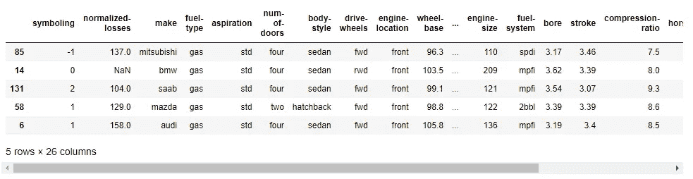

数据集的前几行(图:作者)

该数据集包含 202 行和 26 列，每行代表一辆汽车的实例，每列代表其功能和相应的价格。这些列包括:

```
df.columns>> Index(['symboling', 'normalized-losses', 'make', 'fuel-type', 'aspiration', 'num-of-doors', 'body-style', 'drive-wheels', 'engine-location','wheel-base', 'length', 'width', 'height', 'curb-weight', 'engine-type', 'num-of-cylinders', 'engine-size', 'fuel-system', 'bore', 'stroke', 'compression-ratio', 'horsepower', 'peak-rpm', 'city-mpg', 'highway-mpg', 'price'], dtype='object')
```

现在，让我们深入研究特性选择的 11 个策略。

# 移除未使用的列

当然，最简单的策略是运用你的直觉。有时很明显，一些列在最终的模型中不会以任何形式使用(如“ID”、“FirstName”、“LastName”等列)。如果您知道某个特定的列不会被使用，那么可以直接删除它。在我们的数据中，没有一列如此突出，所以在这一步中我不会删除任何列。

# 删除缺少值的列

具有缺失值在机器学习中是不可接受的，因此人们应用不同的策略来清理缺失数据(例如，插补)。但是，如果一列中丢失了大量数据，一种策略是将其完全删除。

在我们的数据集中，有显著缺失值的列是`normalized-losses`，我将删除它。

```
# total null values per column
df.isnull().sum()>>
symboling             0
normalized-losses    35
make                  0
fuel-type             0
aspiration            0
num-of-doors          2
body-style            0
drive-wheels          0
engine-location       0
wheel-base            0
length                0
width                 0
height                0
curb-weight           0
engine-type           0
num-of-cylinders      0
engine-size           0
fuel-system           0
bore                  0
stroke                0
compression-ratio     0
horsepower            0
peak-rpm              0
city-mpg              0
highway-mpg           0
price                 0
dtype: int64
```

# 不相关的特征

无论算法是回归(预测一个数)还是分类(预测一个类)，特征都必须与目标相关。如果某个特征没有表现出相关性，那么它就是一个主要的淘汰目标。您可以分别测试数值特征和分类特征的相关性。

## a)数字特征

```
# correlation between target and features
(df.corr().loc['price']
 .plot(kind='barh', figsize=(4,10)))
```

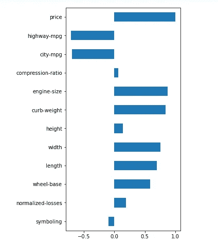

数字特征和目标之间的相关性(图:作者)

在这个例子中，诸如*峰值转速*、*压缩比、冲程、缸径、高度*和象征的*等特征与*价格*的相关性很小，因此我们可以忽略它们。*

您可以手动删除列，但是我更喜欢使用相关阈值(在本例中为 0.2)以编程方式来完成:

```
# drop uncorrelated numeric features (threshold <0.2)
corr = abs(df.corr().loc['price'])
corr = corr[corr<0.2]
cols_to_drop = corr.index.to_list()
df = df.drop(cols_to_drop, axis=1)
```

## b)分类特征

同样，您可以使用箱线图来查找目标特征和分类特征之间的相关性:

```
import seaborn as snssns.boxplot(y = 'price', x = 'fuel-type', data=df)
```


按燃料类型分类的汽车价格(图:作者)

*柴油*型车的中位价格高于*燃气*型车。这意味着这个分类变量可以解释汽车价格，所以我不会放弃它。您可以像这样单独检查每个分类列。

# 低方差特征

举个极端的例子，我们假设所有的车都有相同的公路——mpg(mpg:英里每加仑)。你觉得这个功能有用吗？没有，因为它的方差正好为 0。我们可以选择放弃这样的低方差特性。让我们检查一下我们的功能差异:

```
import numpy as np# variance of numeric features
(df
 .select_dtypes(include=np.number)
 .var()
 .astype('str'))
```

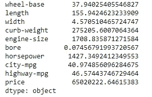

数字特征的方差(图:作者)

这里“bore”具有极低的方差，因此这是消除的理想候选。然而，在这种特殊情况下，我不愿意放弃它，因为它的值介于 2.54 和 3.94 之间，因此方差预计较低:

```
df['bore'].describe()
```

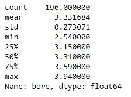

一个特性的统计概要(图:作者)

# 多重共线性

当任何两个要素之间存在相关性时，就会出现多重共线性。在机器学习中，期望每个特征应该独立于其他特征，即它们之间没有共线性。正如你将在下面看到的，马力大的车辆往往有大的*发动机尺寸*并不奇怪。所以你可能想去掉其中一个，让另一个决定目标变量——*价格*。

您可以分别测试数值要素和分类要素的多重共线性:

## a)数字特征

热图是直观检查和寻找相关要素的最简单方法。

```
import matplotlib.pyplot as pltsns.set(rc={'figure.figsize':(16,10)})
sns.heatmap(df.corr(),
            annot=True,
            linewidths=.5,
            center=0,
            cbar=False,
            cmap="PiYG")
plt.show()
```

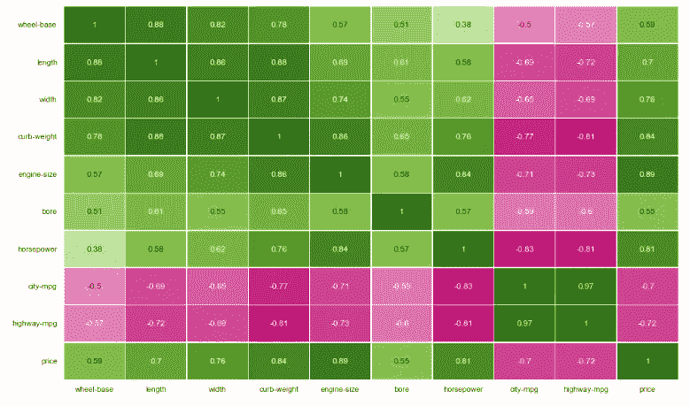

用于检查数字要素间多重共线性的热图(图:作者)

正如你所看到的，大多数特征在某种程度上是相互关联的，但有些特征具有非常高的相关性，例如*长度*对*轴距*和*发动机尺寸*对*马力*。

您可以基于关联阈值手动或以编程方式删除这些功能。我将手动删除共线性阈值为 0.80 的要素。

```
# drop correlated features
df = df.drop(['length', 'width', 'curb-weight', 'engine-size', 'city-mpg'], axis=1)
```

请注意，您还可以使用一种称为方差膨胀因子(VIF)的方法来确定多重共线性，并根据高 VIF 值删除要素。稍后我会展示这个例子。

## b)分类变量

与数值要素类似，您也可以检查分类变量之间的共线性。像卡方独立性检验这样的统计检验对它来说是理想的。

让我们检查一下数据集中的两个分类列— *燃料类型*和*车身样式* —是独立的还是相关的。

首先，我们将选择感兴趣的分类特征:

```
df_cat = df[['fuel-type', 'body-style']]
df_cat.sample(5)
```


为独立性测试选择的两个分类特征(图:作者)

然后，我们将在每一列中创建类别的交叉表/列联表。

```
crosstab = pd.crosstab(df_cat['fuel-type'], df_cat['body-style'])
crosstab
```

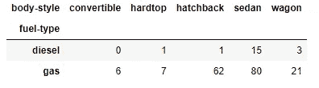

两个分类特征的交叉表/列联表(图:作者)

最后，我们将对列联表进行卡方检验，这将告诉我们这两个特征是否独立。

```
from scipy.stats import chi2_contingencychi2_contingency(crosstab)
```

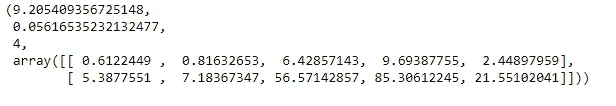

独立性卡方检验的结果(图:作者)

按照出现的顺序，输出是卡方值、 *p 值*、自由度和一组预期频率。

p 值是<0.05, thus we can reject the null hypothesis that there’s no association between features, i.e., there’s a statistically significant relationship between the two features.

Since there’s an association between the two features, we can choose to drop one of them.

**我现在将换档一点……**

到目前为止，我已经展示了在实现模型之前*应用的特性选择策略。这些策略在构建初始模型的第一轮特征选择中非常有用。但是，一旦构建了模型，您将获得关于模型性能中每个特征的适合度的进一步信息。根据这些新信息，您可以进一步确定要保留哪些功能。*

下面我将展示其中的一些方法。

但是首先，我们需要使模型适合数据集，因此需要一些数据预处理。我正在做最少的数据准备，只是为了演示特征选择方法。

```
# drop columns with missing values
df = df.dropna()from sklearn.model_selection import train_test_split# get dummies for categorical features
df = pd.get_dummies(df, drop_first=True)# X features
X = df.drop('price', axis=1)# y target
y = df['price']# split data into training and testing set
X_train, X_test, y_train, y_test = train_test_split(X, y, test_size=0.3, random_state=42)from sklearn.linear_model import LinearRegression # scalingfrom sklearn.preprocessing import StandardScaler
scaler = StandardScaler()
X_train = scaler.fit_transform(X_train)
X_test = scaler.fit_transform(X_test)# convert back to dataframe
X_train = pd.DataFrame(X_train, columns = X.columns.to_list())
X_test = pd.DataFrame(X_test, columns = X.columns.to_list())# instantiate model
model = LinearRegression()# fit
model.fit(X_train, y_train)
```

现在我们已经拟合了模型，让我们做另一轮的特征选择。

# 特征系数

如果你正在运行一个回归任务，那么特征适合度的一个关键指标是回归系数(所谓的 *beta* 系数)，它显示了特征在模型中的相对贡献。有了这些信息，您就可以删除贡献很小或没有贡献的功能。

```
# feature coefficients
coeffs = model.coef_# visualizing coefficients
index = X_train.columns.tolist()(pd.DataFrame(coeffs, index = index, columns = ['coeff']).sort_values(by = 'coeff')
 .plot(kind='barh', figsize=(4,10)))
```

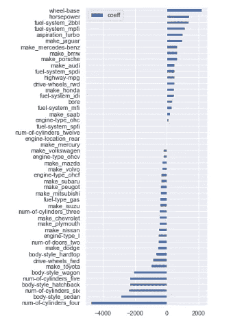

每个特性的 Beta 值/系数(图:作者)

如你所见，有些贝塔系数很小，对汽车价格的预测贡献不大。您可以过滤掉这些特征:

```
# filter variables near zero coefficient value
temp = pd.DataFrame(coeffs, index = index, columns = ['coeff']).sort_values(by = 'coeff')
temp = temp[(temp['coeff']>1) | (temp['coeff']< -1)]# drop those features
cols_coeff = temp.index.to_list()
X_train = X_train[cols_coeff]
X_test = X_test[cols_coeff]
```

# p 值

在回归中，p 值告诉我们预测值和目标值之间的关系是否具有统计显著性。`statsmodels`库用特征系数和相关的 *p* 值给出了回归输出的漂亮摘要。

如果一些特性不重要，您可以逐个删除它们，每次都重新运行模型，直到您找到一组具有重要的 *p* 值并通过更高的调整 R2 提高了性能的特性。

```
import statsmodels.api as sm
ols = sm.OLS(y, X).fit()
print(ols.summary())
```

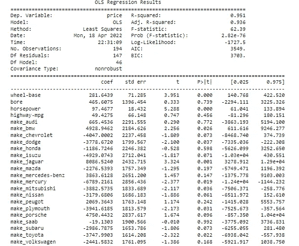

具有 beta 值和统计显著性的回归结果的部分摘要(图:作者)

# 差异通货膨胀系数(VIF)

正如我前面提到的，方差膨胀因子(VIF)是测量多重共线性的另一种方法。它被测量为总模型方差与每个独立特征方差的比率。某个功能的高 VIF 表明它与一个或多个其他功能相关。根据经验法则:

VIF = 1 表示无相关性，
VIF = 1–5 中度相关，
VIF > 5 高度相关

可以想象，VIF 是一种消除多重共线性要素的有用技术。在我们的演示中，让我们大方一点，保留所有 VIF 低于 10 的特性。

```
from statsmodels.stats.outliers_influence import variance_inflation_factor# calculate VIF
vif = pd.Series([variance_inflation_factor(X.values, i) for i in range(X.shape[1])], index=X.columns)# display VIFs in a table
index = X_train.columns.tolist()
vif_df = pd.DataFrame(vif, index = index, columns = ['vif']).sort_values(by = 'vif', ascending=False)
vif_df[vif_df['vif']<10]
```


基于低 VIF 选择的特征(图:作者)

# 基于特征重要性/杂质的选择

决策树/随机森林使用最大程度减少杂质的特征来分割数据(根据基尼杂质或信息增益来衡量)。这意味着，找到最佳特征是算法在分类任务中如何工作的关键部分。然后，我们可以通过`feature_importances_`属性访问最佳特性。

让我们在数据集上实现一个随机森林模型，并过滤一些要素。

```
from sklearn.ensemble import RandomForestClassifier# instantiate model
model = RandomForestClassifier(n_estimators=200, random_state=0)
# fit model
model.fit(X,y)
```

现在我们来看看特性的重要性:

```
#  feature importance
importances = model.feature_importances_# visualization
cols = X.columns
(pd.DataFrame(importances, cols, columns = ['importance'])
 .sort_values(by='importance', ascending=True)
 .plot(kind='barh', figsize=(4,10)))
```

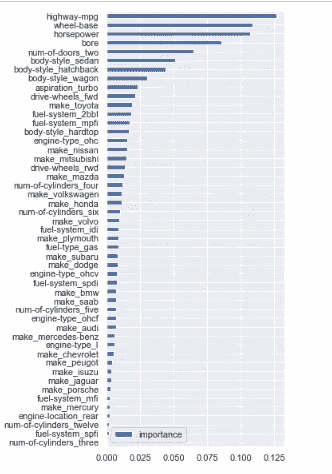

随机森林实现中的特性重要性(图:作者)

上面的输出显示了每个特性在减少每个节点/分裂处的杂质方面的重要性。

由于随机森林分类器有许多估计器(例如，在上面的例子中有 200 棵决策树)，我们可以用置信区间来计算相对重要性的估计。让我们想象一下。

```
# calculate standard deviation of feature importances 
std = np.std([i.feature_importances_ for i in model.estimators_], axis=0)# visualization
feat_with_importance  = pd.Series(importances, X.columns)
fig, ax = plt.subplots(figsize=(12,5))
feat_with_importance.plot.bar(yerr=std, ax=ax)
ax.set_title("Feature importances")
ax.set_ylabel("Mean decrease in impurity")
```

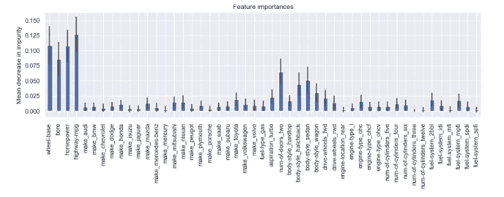

随机森林实现中具有置信区间的特征重要性(图:作者)

既然我们知道了每个特性的重要性，我们就可以手动地(或者编程地)决定保留哪些特性，放弃哪些特性。

# 通过 Scikit Learn 实现自动特征选择

幸运的是，在`sklearn`库中有一个完整的模块，只用几行代码就可以处理特性选择。

在`sklearn`中有许多自动化的流程，但在这里我只演示几个:

```
# import modules
from sklearn.feature_selection import (SelectKBest, chi2, SelectPercentile, SelectFromModel, SequentialFeatureSelector, SequentialFeatureSelector)
```

## a)基于卡方的技术

基于卡方的技术基于一些预定义的分数选择特定数量的用户定义的特征(k)。这些分数是通过计算 X(自变量)和 y(因变量)之间的卡方统计来确定的。在`sklearn`中，你需要做的就是确定你想要保留多少功能。如果您想保留 10 个特性，实现将如下所示:

```
# select K best features
X_best = SelectKBest(chi2, k=10).fit_transform(X,y)# number of best features
X_best.shape[1]>> 10
```

如果有大量的特性，你可以指定你想要保留的特性的百分比。假设我们想保留 75%的特性，放弃剩下的 25%:

```
# keep 75% top features 
X_top = SelectPercentile(chi2, percentile = 75).fit_transform(X,y)# number of best features
X_top.shape[1]>> 36
```

## b)正规化

正则化减少了过度拟合。如果有太多的特征，正则化会通过收缩特征系数(称为 L2 正则化)或将一些特征系数设置为零(称为 L1 正则化)来控制它们的效果。

一些模型内置了 L1/L2 正则化作为惩罚特征的超参数。使用元转换器`SelectFromModel`可以消除这些特征。

让我们用*惩罚=‘L1’*来实现一个`LinearSVC` 算法。然后我们将使用`SelectFromModel` 删除一些功能。

```
# implement algorithm
from sklearn.svm import LinearSVC
model = LinearSVC(penalty= 'l1', C = 0.002, dual=False)
model.fit(X,y)# select features using the meta transformer
selector = SelectFromModel(estimator = model, prefit=True)X_new = selector.transform(X)
X_new.shape[1]>> 2# names of selected features
feature_names = np.array(X.columns)
feature_names[selector.get_support()]>> array(['wheel-base', 'horsepower'], dtype=object)
```

## c)顺序选择

顺序特征选择是一种经典的统计技术。在这种情况下，您可以一次添加/删除一个特征，并检查模型性能，直到它根据您的需要进行了优化。

顺序选择有两种变体。正向选择技术从 0 个特征开始，然后添加一个最大程度地减小误差的特征；然后添加另一个特性，以此类推。

反向选择的工作方向相反。该模型从包括所有特征开始，并计算误差；然后，它消除了一个进一步减少误差的特征。重复该过程，直到剩余期望数量的特征。

```
# instantiate model
model = RandomForestClassifier(n_estimators=100, random_state=0)# select features
selector = SequentialFeatureSelector(estimator=model, n_features_to_select=10, direction='backward', cv=2)
selector.fit_transform(X,y)# check names of features selected
feature_names = np.array(X.columns)
feature_names[selector.get_support()]>> array(['bore', 'make_mitsubishi', 'make_nissan', 'make_saab',
       'aspiration_turbo', 'num-of-doors_two', 'body style_hatchback', 'engine-type_ohc', 'num-of-cylinders_twelve', 'fuel-system_spdi'], dtype=object)
```

# 主成分分析

主成分分析的主要目的是降低高维特征空间的维数。在这种情况下，原始特征被重新投影到新的维度(即主成分)。最终目标是找到最能解释数据方差的分量数。

```
# import PCA module
from sklearn.decomposition import PCA# scaling data
X_scaled = scaler.fit_transform(X)# fit PCA to data
pca = PCA()
pca.fit(X_scaled)
evr = pca.explained_variance_ratio_# visualizing the variance explained by each principal componentsplt.figure(figsize=(12, 5))
plt.plot(range(0, len(evr)), evr.cumsum(), marker="o", linestyle="--")plt.xlabel("Number of components")
plt.ylabel("Cumulative explained variance")
```

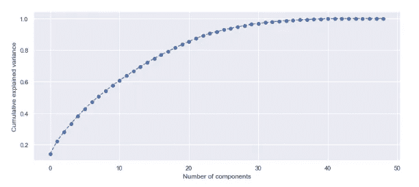

主成分分析解释的累积方差(图:作者)

如您所见，20 个主成分解释了 80%以上的方差，因此您可以将您的模型与这 20 个成分相匹配。您可以预先确定方差阈值，并选择所需的主成分数。

# 一锤定音

希望这是一个有用的指南，可以应用于特征选择的各种技术。一些技术在之前*应用于拟合模型，例如删除具有缺失值的列、不相关的列、具有多重共线性的列以及使用 PCA 进行降维，而其他技术在*基础模型实施之后*应用，例如特征系数、p 值、VIF 等。你可能永远不会在一个项目中使用所有的策略，但是，你可以把这个列表作为一个清单。*

我已经在 [GitHub](https://github.com/mabalam/feature_selection) 上传了这里描述的所有技术的 Jupyter 笔记本。

感谢您的阅读。请随意[订阅](https://mab-datasc.medium.com/subscribe)以获得我即将发表的文章的通知，或者通过 [LinkedIn](https://www.linkedin.com/in/mab-alam/) 与我联系。