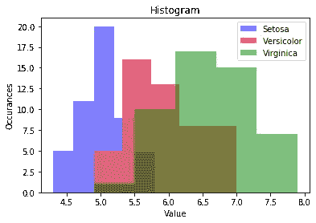
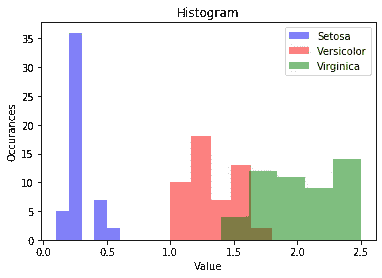
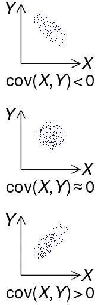
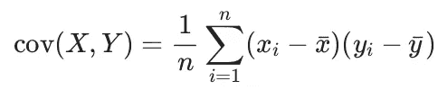
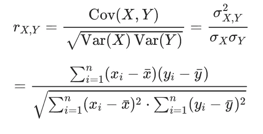
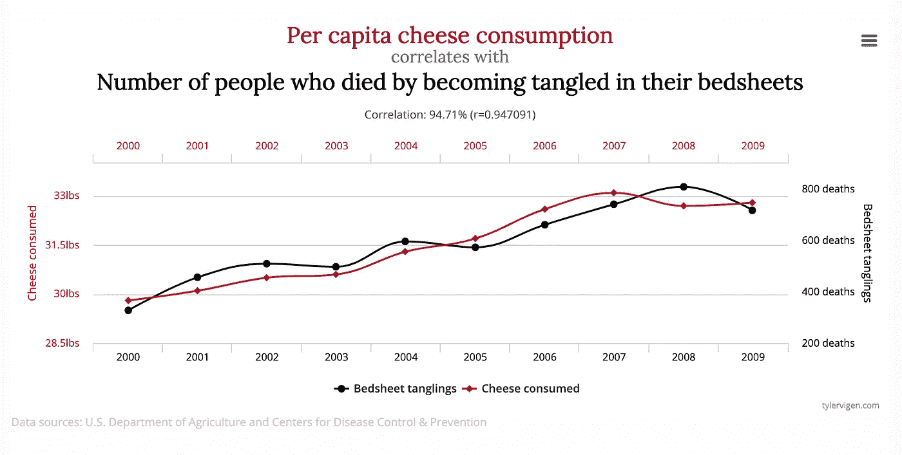
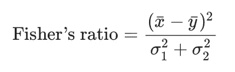
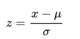

# 特征选择:为你的机器学习算法选择正确的特征

> 原文：<https://towardsdatascience.com/feature-selection-choosing-the-right-features-for-your-machine-learning-algorithm-379bda9f3e05>

## 有时候，少即是多


选择，还是不选择…照片由[edu·格兰德](https://unsplash.com/@edgr?utm_source=unsplash&utm_medium=referral&utm_content=creditCopyText)在 [Unsplash](https://unsplash.com/s/photos/selection?utm_source=unsplash&utm_medium=referral&utm_content=creditCopyText) 上拍摄

## 为什么我们要选择一些特征而忽略其余的呢？拥有更多的特征不是对我们模型的准确性有好处吗？

选择正确的特征，忽略不合适的特征，是任何机器学习项目中至关重要的一步。这可以产生良好的模型性能，并节省您的时间。它还可以帮助您更容易地解释模型的输出。但是拥有更多的特征将意味着模型有更多的数据来训练，并且应该意味着模型将更加准确，对吗？不完全是。

拥有太多的特征会导致算法容易陷入**过度拟合。**过度拟合是指模型推广到不相关的数据或异常值。另一个仔细选择特性的好理由是所谓的维度诅咒。通常每个特征都存储在一个维度中。算法在高维情况下变得更难设计，因为运行时间往往随着维数呈指数增长。因此，当我们选择最合适的特征而忽略其他特征时，这是有意义的，并且提供了好处。

# 我们如何选择最佳特征进行训练？

有两种选择特征的方法。首先，人们可以通过直方图等用图形表示来人工观察特征。第二种方式是通过自动选择最佳特征。

## 手动做事…

我们可以通过直方图等图形表示来手动观察特征。然后，通过识别可以相互区分的特征和相互重叠的特征，我们可以决定哪一个将是最好的。让我们看一个例子。

我们将看看[虹膜数据集](https://www.kaggle.com/datasets/uciml/iris)。它有 150 朵鸢尾花的数据，包括 3 个品种(鸢尾、海滨鸢尾和杂色鸢尾)。花的四个特征在数据集中可用(花的萼片和花瓣的宽度和长度)。数据集的摘录如下所示。

```
Here, you can see the **four available features** in the iris dataset for the iris flower species known as Setosa. 
(the first 5 rows of the dataset are shown) **Sepal.Length  Sepal.Width  Petal.Length  Petal.Width** Species 
1          5.1          3.5           1.4          0.2    setosa
2          4.9          3.0           1.4          0.2    setosa
3          4.7          3.2           1.3          0.2    setosa
4          4.6          3.1           1.5          0.2    setosa
5          5.0          3.6           1.4          0.2    setosaNote: When we set **dim = 0** in the below code, we are selecting the feature: **Sepal.Length**
```

代码加载虹膜数据集和绘制直方图的基础上，我们想要的功能。

使用上面的代码，我们为虹膜数据集的三个种类中的每一个绘制了直方图，为使用变量' **dim'** 选择的特定特征绘制了直方图。

我们可以使用 **'iris.target'** 来选择特定的物种，例如，在上面的代码中: **iris.data[iris.target == 0，dim]** 给出了鸢尾物种**和**的数据特征:萼片长度。

通过查看生成的直方图，我们意识到特征重叠。这意味着我们选择的特征(萼片长度)，由 **dim = 0** 给出，可能不足以区分不同类型的鸢尾花(Setosa，Versicolor 和 Virginica)。



上面代码的结果，功能是重叠的。

现在，让我们选择一个不同的特性。我们将使用 **dim=3** 选择特征 4(花瓣宽度)。下图显示了生成的直方图。



从上面的代码中获得的特性 3 的直方图。

如你所见，与我们观察到的另一个特征相比，这个特征在三种类型的花之间提供了足够好的分离。以这种方式观察直方图可以帮助我们对正在处理的数据获得更好的感觉或直觉，并识别合适的特征以及不太有用的特征。

当我们处理更多的功能时，手工的方法可能不合适。在这种情况下，我们可以利用自动特征选择方法。

*注意:在我们使用的数据集中，长度用于特征。每个要素都有相同的单位(厘米)。但是一些数据集可能具有互不相同的要素。例如，一个要素可能以米为单位，而另一个要素可能是颜色。这可以引入它自己的一套复杂功能，我们将需要* ***标度*** *特性，这些我们将在本文的最后讨论。*

## 自动特征选择

特征选择的一般程序是:

*   通过与地面实况进行比较或通过比较每个要素的类之间的方差来计算每个要素的质量。
*   接下来，根据计算出的质量对特征进行排序，只保留最好的。可以通过使用质量阈值或者通过简单地选择最佳 *n* 个特征来选择最佳特征。

为了选择特征子集，我们可以执行 ***正向特征选择、*** 逐步添加最佳尺寸或特征，或者执行 ***反向特征选择、*** 从所有特征开始，继续删除质量最差的特征。

**我们如何计算一个特性的*质量*？**

我们要看的第一个质量指数叫做*相关系数*(又名*皮尔逊相关*)。相关系数是两个变量之间的**协方差**和**标准差**之比。作为比值的结果，我们得到一个介于-1 和 1 之间的结果。

*什么是* ***协方差*** *？*

> 如果一个变量的较大值主要与另一个变量的较大值相对应，并且较小值也是如此(即变量往往表现出相似的行为)，则协方差为正。
> 
> 在相反的情况下，当一个变量的较大值主要对应于另一个变量的较小值时，协方差为负。
> 
> [——魏斯斯坦，埃里克 W.](https://en.wikipedia.org/wiki/Eric_W._Weisstein) [【协方差】](https://mathworld.wolfram.com/Covariance.html)。 [*数学世界*](https://en.wikipedia.org/wiki/MathWorld) 。

这一点通过观察下图可以看得很清楚。



[两个随机变量的协方差的符号 *X* 和*Y*](https://en.wikipedia.org/wiki/Covariance)

协方差可通过以下等式计算，其中 x̄和 ȳ分别代表 x 和 y 的平均值:



计算协方差的方程。来源:[协方差](https://en.wikipedia.org/wiki/Covariance)

因此，相关系数可以计算如下:



计算[相关系数](https://en.wikipedia.org/wiki/Pearson_correlation_coefficient)的方程式

如果这两个特征是随机独立的，它们的相关性将为 0。然而，请记住，即使相关性为 0，也不一定意味着变量是独立的。可能存在相关性未捕捉到的潜在依赖关系。

还要注意，相关性并不意味着因果关系。看下面的图表。由于两起事件相似，关联度极高。但这是否意味着如果你吃了更多的奶酪，你很可能会被你的床单勒死？这里的数据纯属巧合。



[食用奶酪与床单纠缠致死之间的关系。](https://www.freecodecamp.org/news/why-correlation-does-not-imply-causation-the-meaning-of-this-common-saying-in-statistics/)作者:[泰勒·维根](http://tylervigen.com/spurious-correlations)

**特征选择相关性的缺点:**

*   相关性只查找线性关系
*   这也只适用于两个类的问题

另一个可以使用的质量指标是*费希尔比率*。它测量变量的线性辨别能力，并具有以下公式。



[计算费雪比的方程式。](http://www.statistics4u.com/fundstat_eng/cc_fisher_ratio.html#:~:text=Fisher's%20ratio%20is%20a%20measure,and%20v2%20the%20variances.)

这里，x̄和ȳ分别代表第 1 类和第 2 类的平均值，两类的方差以分母表示。这种方法的好处是，它为更复杂的标准提供了更快的计算速度。

还有许多其他可用的质量测量工具，如 Kullback-Leibler 散度、ANOVA 等，这里不做讨论。

# 特征选择可能存在的问题

尽管大多数算法相对简单和容易，但它们并不总是适用的。当试图确定使用哪种质量度量时，以及当试图在单个维度不产生任何结果的情况下初始化贪婪算法时，会出现困难。

此外，即使特性被看作是独立的，相互独立的，它们也常常相互依赖。结果，基于质量测量的特征选择将永远不会提供当两个特征被组合时可以观察到的相同信息。因此，利用不同维度之间共享的信息是有好处的。这可以通过变换特征空间(也称为压缩)来实现。为了实现这一点，可以使用*主成分分析(PCA)* 。我们将在另一篇文章中讨论 PCA。

# 具有非常不同的特征的问题

上面，我们讨论了拥有彼此不同的特性会带来问题。例如，一个特征的长度以厘米为单位，另一个特征是颜色。为了减轻这种情况，我们可以使用特征缩放。

## 缩放比例

*   在 Iris 和 Digits 数据集中，所有要素的比例相等(单位为厘米)
*   如果不是这样，单个特征可能会使结果产生偏差。
*   例如，具有高方差的特征支配距离测量。

## 解决方案:

*   将要素缩放至平均值为 0，方差为 1

如果已知总体平均值和总体标准偏差，则通过以下公式将原始分数 *x* 转换为标准分数:



[用方程式计算标准分数。](https://en.wikipedia.org/wiki/Standard_score)

其中: *μ* 为总体的[均值](https://en.wikipedia.org/wiki/Mean)， *σ* 为总体的[标准差](https://en.wikipedia.org/wiki/Standard_deviation)。

# 结论

拥有大量特征会在训练机器学习模型时引入复杂性，例如使算法易于过度拟合并增加训练次数。因此，选择运行良好的特性，忽略不能提供足够好处的特性是非常重要的。这可以通过可视化数据并观察要素如何相互作用来手动完成。此外，当可用的特征太大时，可以使用自动技术来完成。这两种方法都有好处和优点，选择合适的方法取决于手头的问题。