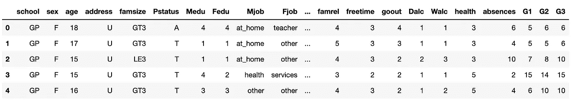
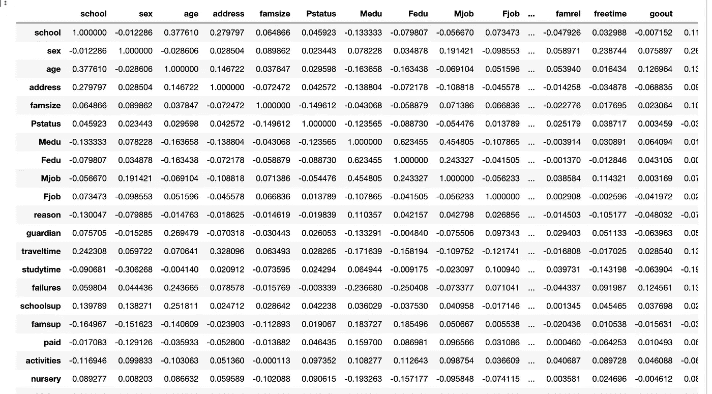
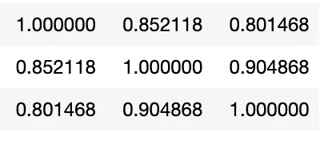
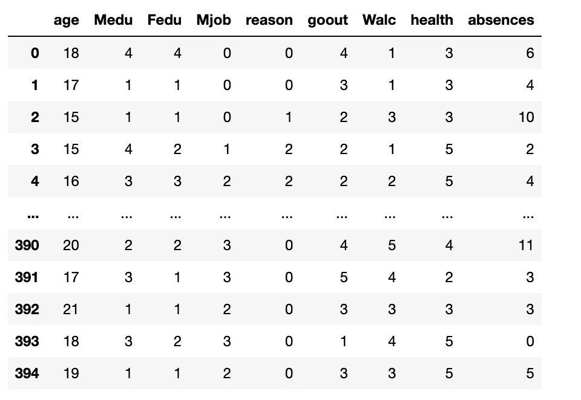

# 数据科学的特征选择:简单方法

> 原文：<https://towardsdatascience.com/feature-selection-for-data-science-simple-approaches-e1f2527cb363>

## 通过去除与数据集无关的特征，我们可以创建更好的预测模型。

每一个数据科学家都曾经或者将要遇到这个问题；一个庞大的数据集，有如此多的功能，他们甚至不知道从哪里开始。虽然有许多高级方法可用于为数据集选择最佳要素集合，但有时简单的方法可以为您的分析提供很好的基线，甚至是选择数据集最佳要素所需的唯一必要方法。


照片由[UX](https://unsplash.com/@uxindo?utm_source=medium&utm_medium=referral)在 [Unsplash](https://unsplash.com?utm_source=medium&utm_medium=referral) 上拍摄

# 特征选择:为什么重要？

要素选择非常重要，因为包含太多要素的数据集可能会导致高计算成本以及使用冗余或不重要的属性进行模型预测。通过去除与我们的数据集无关的特征，我们可以创建一个建立在强大基础上的更好的预测模型。虽然有使用机器学习算法进行特征选择的高级方法，但今天我想探索两种简单的方法，它们可以帮助引导任何分析的方向。

# 资料组

我们今天将使用的数据集是来自 Kaggle.com 的[学生表现数据集。该数据集中有 33 个要素，它们是:](https://www.kaggle.com/datasets/devansodariya/student-performance-data?resource=download)

*学校，性别，年龄，地址，家庭大小，p 状态，Medu，Fedu，Mjob，Fjob，原因，监护人，旅行时间，学习时间，失败，schoolsup，famsup，付费，活动，托儿所，高等，互联网，浪漫，famrel，自由时间，goout，Dalc，Walc，健康，缺勤，G1，G2，G3*

如果你还没数过，这个数据集有 33 个不同的特征！让我们采取一些简单的方法来挑选出最适合我们的！

## 预处理

在开始之前，我们需要对数据集做一些预处理。首先，让我们看一下数据集。

```
import pandas as pd 
df = pd.read_csv('student_data.csv')
df.head()
```



从视觉上看，似乎有一些列在本质上是分类的。在转换这些列之前，我们还想检查是否有任何丢失的值。

```
#Checkign for null values -- False means no null values
df.isnull().values.any()
```

运行此代码返回“False ”,因此不需要填写空值。

```
df.dtypes
```

键入上面的代码显示了每一列的所有类型，这表明实际上有分类列需要转换成数字。我创建了一个简单的映射函数，可以很快地帮你做到这一点。

```
#Function that converts the categorical to numerical through a dictionary. 
def mapper(df_column):
    map_dict = {}

    for i, x in enumerate(df_column.unique()):
        map_dict[x] = i 

    print(map_dict) #Print this out to see 
    df_column.replace(map_dict, inplace = True)

    return df_column
```

使用这个函数，我们可以将所有的对象列都改为数字。

```
def categorical_converter(df):
    for i in df.select_dtypes(include=['object']):
        mapper(df[i])

    return dfcategorical_converter(df)
```

# 方法 1:评估特性的相关性

如果两个或多个特征高度相关，这可能意味着它们都以相同的方式解释因变量。这引出了从模型中移除这些特征之一的理由。如果您不确定要删除哪个特性，您可以考虑构建两个模型，每个模型包含一个特性。要获得相关矩阵，只需调用*。数据框上的 corr*

```
df.corr()
```



Img:相关矩阵的一部分

显然，有了这么多的特征，相关矩阵将是巨大的。



G1、G2 和 G3 的相关性

要素 *G1、G2 和 G3* 具有高度相关性，因此我们希望从数据集中移除其中两个要素。我去掉了 *G2* 和 *G3。*此外，我将我的 *X* 数据设置为等于除了 *G1* 之外的所有列，这些列成为我的 Y 数据。

```
df.drop(['G2','G3'], axis=1, inplace=True)
X = df.drop(['G1'], axis=1)
Y = df['G1']
```

# **方法 2:移除低方差特征**

任何具有低方差的要素都应被视为从数据集中移除。为什么？首先，我们来思考一下。如果我试图比较谁是更好的学生，并且两个学生每个月一起上完全相同的课，那么学生之间的“班级”特征几乎没有差异，这将归因于为什么一个学生比另一个学生表现得更好。当一个特征变得接近恒定时，我们可以保持该特征恒定并将其从数据集中移除(一如既往，这取决于！).为此，我们将使用 Scikit 学习特征选择库中的 VarianceThreshold()。

```
from sklearn.feature_selection import VarianceThreshold
```

下面的代码将创建一个方差阈值对象，该对象将转换我们的 X 数据并返回给定的最佳特性。

```
vthresh = VarianceThreshold(threshold=.05)selector = vthresh.fit(X)selected = vthresh.get_support()X = X.loc[:, selected]
```

运行此代码将返回一个包含 9 个要素的 X 数据框！



具有选定特征的 x 数据

选定的功能包括:

*年龄，Medu(母亲教育)，Fedu(父亲教育)，Mjob(母亲工作)，reason，goout，Walc，heath，*和*缺勤。*

虽然这些可能不是我们最终得出的结论，但这让我们对影响学生成绩的因素有了初步的了解。我们仅仅通过相关性和方差就能做到这一点！这两个简单的初步方法允许将数据集从 33 个特征减少到 10 个特征(不能忘记 Y！)现在我们可以开始用较小的数据集构建模型了！

如果你喜欢今天的阅读，请关注我，让我知道你是否还有其他话题想让我探讨(这对我的帮助超乎你的想象)！另外，在[**LinkedIn**](https://www.linkedin.com/in/benjamin-mccloskey-169975a8/)**上加我，或者随时联系！感谢阅读！**

# 引文

[学生成绩数据集](https://www.kaggle.com/datasets/devansodariya/student-performance-data?resource=download) - [CC0:公共领域](https://creativecommons.org/publicdomain/zero/1.0/)，经批准公开使用，作者放弃所有权利，无版权限制。