# 懒惰的数据科学家的特征选择

> 原文：<https://towardsdatascience.com/feature-selection-for-the-lazy-data-scientist-c31ba9b4ee66>

## 关于基于过滤器的特征选择方法的综合文献综述和代码


内森·杜姆劳在 [Unsplash](https://unsplash.com/?utm_source=medium&utm_medium=referral) 上的照片

如果你是一名数据科学家，并且维数灾难袭击了你，这篇文章是为你准备的。这是一个关于特征选择算法的综合调查(有例子)。我们通过整合和评估不同特征选择器的集合来结束讨论，以得到一个全面的结论。

首先，让我们从定义什么是特征选择开始。如果你面临高维数的问题，你可能听说过“降维(或 PCA/自动编码器)”和“特征选择”在我们深入研究特性选择之前，这里有一个降维的简短描述，它将帮助您决定是否应该采用这种方法。

## 降维

降维通过将数据从特征空间转换到潜在空间来帮助我们减少特征的数量。这个更小的空间应该以更压缩的方式来表示学习到的特征。如果我们正确地选择了潜在空间的维数，那么我们甚至可以降低噪声，去除不相关的信息。这种方法的最大缺点是它的可解释性。从特征空间转移到潜在空间，我们不再直接看特征，只看它们的表示，它们通常不像特征那样有直观的解释或逻辑。在处理图像或信号等非结构化数据时，这种方法变得非常方便。关于潜在空间含义的进一步讨论，见[此处](/understanding-latent-space-in-machine-learning-de5a7c687d8d)和[此处](https://hackernoon.com/latent-space-visualization-deep-learning-bits-2-bd09a46920df)。

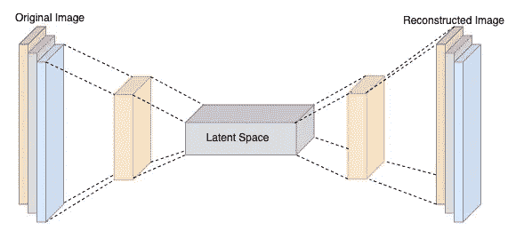

一个自动编码器架构中潜在空间的例子，作者图片

总之，如果可解释性对你的项目是必不可少的，或者出于某种原因，你可能想保持原来的表示，降维不适合你，你在正确的地方。

## 特征选择

要素选择方法允许您根据某些标准选择数据集中的最佳要素。听起来很明显，对吧？尽管如此，还是有很多不同的方法，每种方法都以稍微不同的方式定义了一个特性的优点，为了正确地选择最佳特性，您可能需要不止一种方法。

首先，一些术语:特征选择方法可以分为三类:

(1) **过滤方法**:特征选择是预处理的一部分，即我们训练一个模型之前的*。我们根据一些标准过滤掉表现不佳的特性。简单的标准是简单的相关性。这种方法在我们拥有大量数据集时大放异彩，尤其是当我们拥有大量要素时。 [Hoph 和 Reifenrath (2021)](https://arxiv.org/abs/2111.12140) 在他们的工作中发现(这将在下一节深入讨论)*

> ..三个属性使得[filter]方法看起来特别适合某些数据集场景。这些是对噪声的鲁棒性、抵消类别不平衡的成本敏感性以及考虑用于检测冗余特征的特征组合(多变量方法)。

(2) **包装器方法:**迭代选择一个特征子集，训练你的模型，选择最佳组合。正如您已经想到的，这种方法非常昂贵，而且几乎不切实际。

(3) **嵌入方法:**不要与[嵌入](https://datascience.stackexchange.com/questions/53995/what-does-embedding-mean-in-machine-learning)相混淆，矢量表示单词。嵌入式方法利用了算法中*嵌入*的特征重要性估计。例如，随机森林选择不同的特征子集，以避免过度拟合。模型定型后，我们可以查看有多少特征使预测性能受益。然而，就像在分类任务中一样，仅依赖于嵌入式方法，我们可能会使特征选择过度适应给定的算法，限制我们使用不同的算法和不同的数据集，特别是在使用像决策树这样的高方差方法时。

方法(2)和(3)成本更高。他们需要一个训练有素的模型，并隐含地假设我们可以使用全部数据来训练一个模型，但情况并非总是如此。下图显示了不同特征选择方法之间的区别。

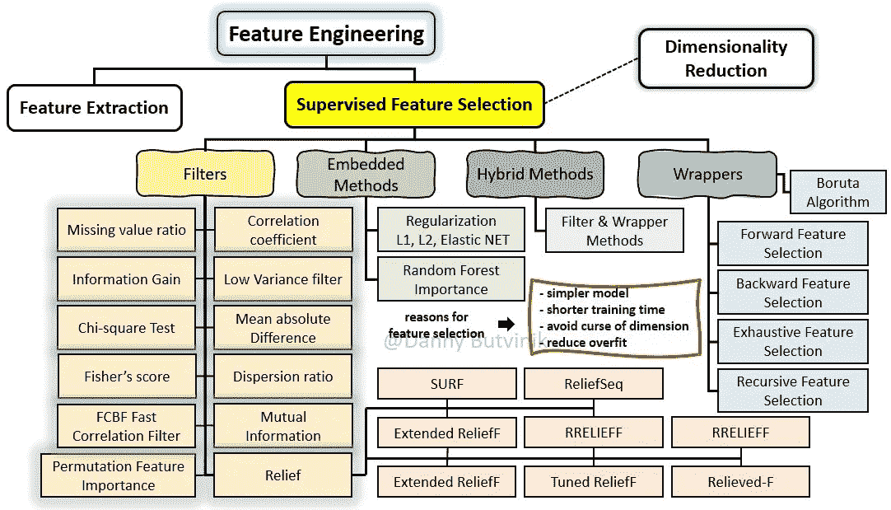

图 4:监督特征选择方法和技术的扩展分类法， [Danny Butvinik](https://medium.com/@dannybutvinik) ，此处[为](https://medium.com/analytics-vidhya/feature-selection-extended-overview-b58f1d524c1c)。

我们的介绍到此结束，可以开始处理今天让我们来到这里的紧迫问题了。

# 过滤方法

过滤方法基本上是根据特定标准来衡量功能性能。有些功能在某些设置下会很出色，而在其他设置下则表现不佳。因此，使用多种标准并整合特征分数对于全面掌握我们的数据至关重要。我尽量做到兼容并蓄，从文献中收集了不同的过滤方法([ [1](https://arxiv.org/abs/2111.12140) ，[ [2](https://www.sciencedirect.com/science/article/pii/S016794731930194X?via%3Dihub#sec2.4) ，[ [3](https://www.aaai.org/Papers/ICML/2003/ICML03-111.pdf) ，[ [4](https://www.mdpi.com/1999-5903/12/3/54) )。最终，我以这篇长文章结束，由于我想添加一些代码和示例，所以我必须过滤掉一些过滤方法(见我在那里做了什么？).换句话说，如果您想对不同的技术有更深刻的理解，我建议您浏览一下本文中的适度的文献综述。

## 过滤方法—方法:)

Bommert 等人[ [2](https://www.sciencedirect.com/science/article/pii/S016794731930194X?via%3Dihub#sec2.4) ]将基于滤波器的特征选择器分为单变量、多变量、基于 MI 的方法和基于 Relief 的方法。我在这里也会这样做。

所涉及的大多数方法都可以通过 FSM 来使用，这可以在我的 Github [这里](https://github.com/DavidHarar/FSM)找到。

**单变量方法**

根据特征与结果变量的关系对特征进行单独排序，不考虑其他变量。单变量方法可以使用统计检验，如 ANOVA，或使用预测性能，如 AUC，通过一次仅使用一个特征来预测结果。

*方差分析***【ANOVA】**:ANOVA 特征选择器使用 F 统计量作为每个特征的得分。一般来说，F 统计量询问给定特征的均值在不同类别的结果变量之间有多远。更详细的解释可以在 [Kasra Manshaei](https://datascience.stackexchange.com/users/8878/kasra-manshaei) 的回答[这里](https://datascience.stackexchange.com/questions/74465/how-to-understand-anova-f-for-feature-selection-in-python-sklearn-selectkbest-w)，或者在[这篇](/anova-for-feature-selection-in-machine-learning-d9305e228476)专门的博文中找到。简而言之，在区分不同类别时，一个特性越好，这个特性的 F 值也就越大。

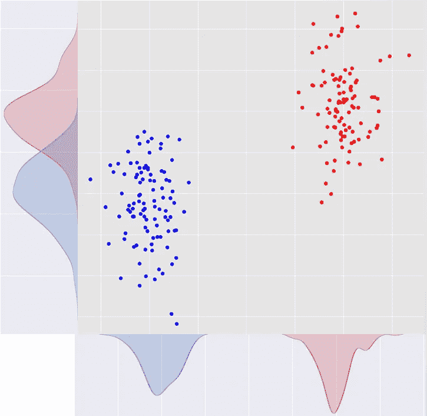

每个特征的类之间的间隔，X 轴上的 X 和 Y 轴上的 Y，[源](https://datascience.stackexchange.com/questions/74465/how-to-understand-anova-f-for-feature-selection-in-python-sklearn-selectkbest-w)

在这种情况下，使用 sklearn 实现非常简单。

```
**from** **sklearn.feature_selection** **import** [SelectKBest](https://scikit-learn.org/stable/modules/generated/sklearn.feature_selection.SelectKBest.html#sklearn.feature_selection.SelectKBest), [f_classif](https://scikit-learn.org/stable/modules/generated/sklearn.feature_selection.f_classif.html#sklearn.feature_selection.f_classif)
anova_filter = [SelectKBest](https://scikit-learn.org/stable/modules/generated/sklearn.feature_selection.SelectKBest.html#sklearn.feature_selection.SelectKBest)([f_classif](https://scikit-learn.org/stable/modules/generated/sklearn.feature_selection.f_classif.html#sklearn.feature_selection.f_classif), k=3)
```

以及一个使用有限状态机的示例:

```
selectors = FSM.FSM(k=20, filler = -1)
selectors.anova_inference(X_,y_)# Results# array(['member_id', 'loan_amnt', 'funded_amnt', 'funded_amnt_inv',
#        'int_rate', 'annual_inc', 'dti', 'inq_last_6mths',
#        'mths_since_last_record', 'pub_rec', 'revol_util', 'out_prncp',
#        'out_prncp_inv', 'total_pymnt', 'total_pymnt_inv',
#        'total_rec_prncp', 'total_rec_late_fee', 'recoveries',
#        'collection_recovery_fee', 'last_pymnt_amnt'], dtype=object)
```

***Kruskal****:*对每个特征应用 Kruskal-Wallis 秩和检验[ [5](https://www.sciencedirect.com/topics/mathematics/rank-sum-test) ]，这是方差分析的非参数等价(即，它不假设我们的特征是正态分布的)。在我们计算 Kruskal 统计量之前，我们首先必须从最小到最大排列我们的观察值(不考虑它们相应的结果)。然后，我们对每个 I 类中的等级求和。然后，克鲁斯卡尔统计量由下式给出

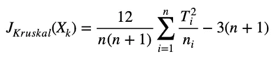

克鲁斯卡尔试验

其中 T 是类(I)内秩的总和，n_i 是属于类(I)的观测值的数目，n 是观测值的总数。

同样，该统计值越高，意味着不同类别的对应特征值越不同。我们可以使用 scipy 实现 Kruskal Wallis 测试。

```
**from** scipy **import** stats
stats**.**kruskal**(**x_j**,** y**)**
```

在有限状态机中:

```
selectors = FSM.FSM(k=20, filler = -1)
selectors.kruskal_inference(X_,y_)# Results:# Index(['recoveries', 'collection_recovery_fee', 'out_prncp_inv', 'out_prncp',
#        'delinq_2yrs', 'pub_rec', 'total_rec_late_fee', 'acc_now_delinq',
#        'collections_12_mths_ex_med', 'inq_last_6mths', 'policy_code',
#        'revol_bal', 'dti', 'last_pymnt_amnt', 'total_rec_int',
#        'total_rec_prncp', 'total_pymnt', 'total_pymnt_inv', 'member_id',
#        'installment'],
#       dtype='object')
```

***卡方*** :以χ2 统计值作为得分。

```
**from** **sklearn.feature_selection** **import** [SelectKBest](https://scikit-learn.org/stable/modules/generated/sklearn.feature_selection.SelectKBest.html#sklearn.feature_selection.SelectKBest), chi2
chi2_filter = SelectKBest(chi2, k=2)
```

在有限状态机中:

```
selectors = FSM.FSM(k=20, filler = -1)
selectors.chi2(X_,y_)# Results:# array(['member_id', 'loan_amnt', 'funded_amnt', 'funded_amnt_inv',
#        'int_rate', 'installment', 'annual_inc', 'mths_since_last_record',
#        'revol_bal', 'revol_util', 'out_prncp', 'out_prncp_inv',
#        'total_pymnt', 'total_pymnt_inv', 'total_rec_prncp',
#        'total_rec_int', 'total_rec_late_fee', 'recoveries',
#        'collection_recovery_fee', 'last_pymnt_amnt'], dtype=object)
```

**多元方法**

*最大关联最小冗余(****MRMR****):*2005 年推出，最近重新流行起来[ [6](/mrmr-explained-exactly-how-you-wished-someone-explained-to-you-9cf4ed27458b) ]。MRMR 算法是一种贪婪的迭代算法。根据下面的规则，每次迭代选择最佳的特性，并将其添加到先前选择的特性中。它被称为最大相关性-最小冗余，因为在每次迭代中，我们都希望选择与目标变量最大相关的特征，以及与先前迭代中所选特征最小冗余的特征。

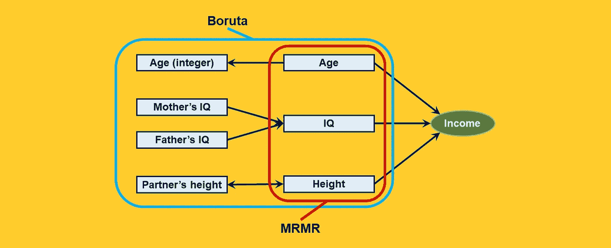

由 MRMR vs 博鲁塔选择的特写，由[塞缪尔·马赞蒂](https://medium.com/@mazzanti.sam?source=post_page-----9cf4ed27458b-----------------------------------)制作的人物，取自此处。在这个例子中，年龄(整数)机械地依赖于年龄；智商和父母的智商有很大的相关性，还有伴侣的身高和自己的身高。考虑到特征之间的高度相关性，通过分母归一化，MRMR 将导致上述三个特征，这三个特征用红线圈出。

虽然有许多方法来计算 MRMR，我只介绍 FCQ 方法。访问[ [7](https://arxiv.org/pdf/1908.05376.pdf) ]了解更多策略。

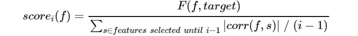

图由[塞缪尔·马赞蒂](https://medium.com/@mazzanti.sam?source=post_page-----9cf4ed27458b-----------------------------------)所作，取自[此处](/mrmr-explained-exactly-how-you-wished-someone-explained-to-you-9cf4ed27458b)。

在第 *i* 次迭代中特征 *f* 的相关性(分子)被计算为特征和目标变量之间的 [F 统计量](https://en.wikipedia.org/wiki/F-test)。冗余(分母)计算为该特征和在先前迭代中选择的所有特征之间的皮尔逊相关的绝对值的平均值。

```
from mrmr import mrmr_classif
data = pd.read_csv('/Users/davidharar/Downloads/data_loan.csv')
X = data._get_numeric_data().drop(['default_ind'], axis = 1)
y = data['default_ind']selected_features = mrmr_classif(X, y, K = 14)
# K is the size of the desired subset.selected_features
```

**预测性能**

这是一种介于过滤方法和嵌入方法之间的中间地带。在这种方法下，我们迭代地运行一个模型，比方说一个随机森林，一次只有一个特征。然后，我们根据熟悉的 KPI(如 AUC 和准确性)对我们的功能进行排名。AUC 通常是首选的，因为它对不平衡的数据集更有弹性，并且通过多种阈值选择进行评估。AUC 的缺点是它仅适用于二元预测。

**相互信息**

互信息是两个特征之间相互依赖的度量。与皮尔逊相关不同，它不限于单调关系。*互信息决定了联合分布与两个边际分布的乘积有多大的不同*。回想一下，如果两个变量是独立的，它们的联合分布等于它们的边际分布的乘积。

熵是另一个重要的结构，它来源于互信息。[熵测量](https://www.sciencedirect.com/topics/computer-science/entropy-measure)变量的不确定性。当所有可能的值以大约相同的概率出现时，熵是高的，如果出现的概率非常不同，熵是低的。它与互信息相关—高互信息值表明不确定性大大降低，因为当我们认识到一个变量的值时，我们对另一个变量的期望值有相对较高的确定性。如果互信息为零，那么两个随机变量是*独立的，我们无法推断出一个给定另一个的值的合理性。*

在我们能够计算互信息或熵之前，连续特征必须被离散化。

设 X 和 Y 是两个离散变量，具有(经验的)[概率质量函数](https://www.sciencedirect.com/topics/computer-science/probability-mass-function)s。Y 的(无条件的)熵由下式给出

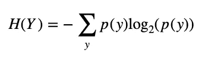

给定 X，Y 的条件熵由下式给出

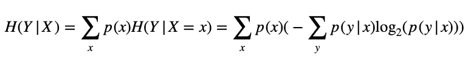

交互信息可以由下面的等式表示:

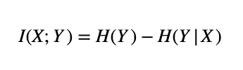

上述等式的证明可以在[这里](https://en.wikipedia.org/wiki/Mutual_information)找到，这在上述等式的上下文中给出了交互信息的极好直觉:

> ..如果熵 H(Y)被视为关于随机变量的不确定性的度量，那么 H(Y|X)是 X *没有说关于 Y 的*的度量。这是“在 X 已知之后关于 Y 剩余的不确定性的量”，因此这些等式中的第二个等式的右侧可以被解读为“Y 中的不确定性的量减去 X 已知之后 Y 中剩余的不确定性的量”。

几种方法使用上述理论结构并探索信息的概念，以及不同特征之间的冗余。在这一部分，我们将讨论其中的一些。

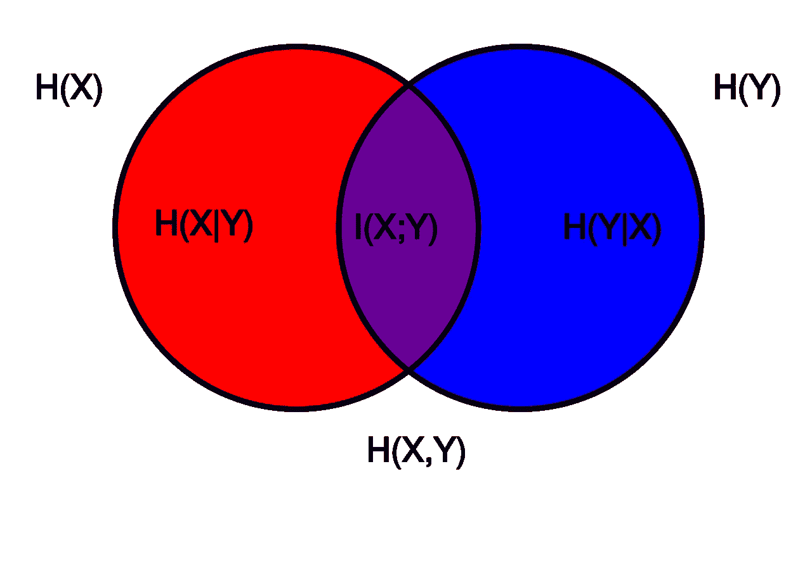

[维恩图](https://en.wikipedia.org/wiki/Venn_diagram)显示与相关变量 X 和 Y 相关的各种信息测量的加法和减法关系，来源:[维基百科](https://en.wikipedia.org/wiki/Mutual_information)

**基于互信息得分的贪婪方法**

***在我们开始之前，请注意以下大多数算法的计算复杂度取决于(有时是二次)所需的特征数量。大多数实现包括用于期望数量的特征的指定参数。探索它，为自己节省大量时间。***

*联合互信息*:尽管它不是一种贪婪的或迭代的方法，我还是把它加在这里，因为你会不时地看到一些文章使用 JMI 作为特征选择的方法。JMI 有些天真，他提醒人们使用简单的相关性进行过滤。我们只计算目标和我们的每个特征之间的联合互信息，然后我们保留 k 个最高的。**在 JMIM 下实施**

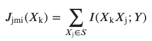

JMI 功能排名，[来源](https://www.nature.com/articles/s41598-021-00854-x)。

*联合互信息最大化(****JMIM****)和归一化联合互信息最大化(****NJ mim****)*[[8](https://www.sciencedirect.com/science/article/pii/S0957417415004674)】*:*作为 MRMR 和 CMIM，这两种算法对与目标互信息最大化的特征做贪婪的搜索。JMIM 和 CMIM 的主要区别在于，后者最大化候选特征*对预选特征*的信息量，而 JMIM 选择最大化新特征+预选特征与目标特征的联合互信息的特征。这里的主要观点是 JMIM 也考虑了特征的冗余，而 CMIM 只是试图最大化加入的互信息。

***关于实现的注意事项*** *:* 找到一个详细的实现并不容易，但我很幸运地在这里找到了这个伟大的。`mifs`包允许`JMI, JMIM`和`MRMR`。在我的实验中，相应子部分的`MRMR`实现更快，总体来说`JMI`比`JMIM`更快。最后，当你设置软件包时，记得把`from sklearn.feature_selection.base import SelectorMixin`改成`from sklearn.feature_selection._base import SelectorMixin`。除此之外，`mifs`灵活清晰。

```
import mifs# define MI_FS feature selection method
feat_selector = mifs.MutualInformationFeatureSelector(method = "JMIM", n_jobs=8)# Few important params for MutualInformationFeatureSelector:
# 1\. method, self explenatory, could be "JMI", "JMIM" and "MRMR"
# 2\. n_features: desired number of features after filtering.
# 3\. n_jobs: How many CPUs should run parallelly.
# 
# Important attributs:
# 1\. feat_selector.get_support(): Boolean vector of length p that
#    indicates whether a feature has been selected.
# 2\. feat_selector.ranking_: Vector of length p that is ordered by
#    importance, for example [52,1,53,...] indicates that feature 52 
#    was the most important one.# Both JMI and JMIM arn't compatible with NaNs
X_filled = X.fillna(-1)
feat_selector.fit(X_filled, y)# call transform() on X to filter it down to selected features
X_filtered = feat_selector.transform(X_filled)
X_filtered = pd.DataFrame(X_filtered, columns = X_filled.columns[feat_selector.ranking_])
```

*基于快速相关性的过滤(****【FCBF】)***:一种基于相关性的过滤方法，考虑了特征之间的冗余。如果某个特征和目标之间的相关性足够高，使其与预测相关，则该特征适合于分类任务。它和任何其他相关特征之间的相关性没有达到任何其他相关特征可以预测它的水平。由于线性相关性有一些主要的局限性，FCBF 的相关性是基于熵，特别是对称不确定性，苏。

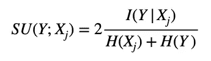

该算法的工作原理如下:

1.  *相关特征*:首先，我们为我们的每个 p 特征计算 SU。我们选择安苏门槛。让我们假设安苏分数高于阈值的特征集合。让我们按降序排列这些功能。
2.  *冗余特征*:从第一个排序后的特征开始，我们为 s 中的 l 计算 SU(j，l)，如果 SU(j，l) ≥SU(target，j)，我们从 s 中移除 l，被移除的特征称为“特征 j 的冗余对等体”

```
selectors = FSM.FSM(k=20, filler = -1)
selectors.fcbf(X_,y_)# Results: (fcbf has a lower bound on SU rather than k features. The default is 0).# selectors = FSM.FSM(k=20, filler = -1)
# selectors.fcbf(X_,y_)
```

*条件互信息最大化****【CMIM】***:基于特征与目标变量的联合互信息选择特征的贪婪算法。给定预先选择的特征，每次迭代选择与目标*共享最大互信息的特征。也就是说，我们选择与目标变量尚未描述的部分互信息最大化的特征，而不考虑冗余(即忽略当前特征与预选特征之间的高相关性)。*

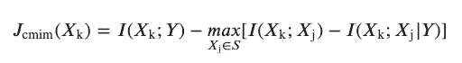

CMIM 功能排名，[来源](https://www.nature.com/articles/s41598-021-00854-x)。

*关于实现的说明* : [scikit-feature](https://github.com/jundongl/scikit-feature) 是用 Python 2 编写的。在[这里](https://github.com/CharlesGaydon/Fast-CMIM)的作者将大部分的 utils 函数转换成 Python 3，所以我最终使用了它的 utils 以及稍微修改过的 [scikit-feature](https://github.com/jundongl/scikit-feature) 原始函数。代码和工作示例在附带的笔记本中。

用有限状态机实现:

```
selectors = FSM.FSM(k=20, filler = -1)
selectors.cmim(X_,y_)# Results:# Index(['member_id', 'funded_amnt_inv', 'installment', 'open_acc', 'revol_util',
#        'total_pymnt', 'delinq_2yrs', 'annual_inc', 'dti', 'revol_bal',
#        'total_acc', 'total_pymnt_inv', 'total_rec_prncp', 'total_rec_int',
#        'total_rec_late_fee', 'recoveries', 'inq_last_6mths',
#        'mths_since_last_record', 'collections_12_mths_ex_med',
#        'mths_since_last_major_derog'],
#       dtype='object')
```

*双输入对称相关(****DISR****)*[[9](https://medium.com/r?url=https%3A%2F%2Fwww.researchgate.net%2Fprofile%2FGianluca-Bontempi%2Fpublication%2F220867410_On_the_Use_of_Variable_Complementarity_for_Feature_Selection_in_Cancer_Classification%2Flinks%2F09e4150588ffc5cd32000000%2FOn-the-Use-of-Variable-Complementarity-for-Feature-Selection-in-Cancer-Classification.pdf)]:DISR 依赖于这样的性质，即变量的组合可以返回比每个单独变量产生的信息总和更多的输出类信息。在 DISR 下，每个要素的 JMI 根据给定要素与其他要素的互补程度进行归一化。

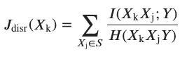

DISR 专题排名，[来源](https://www.nature.com/articles/s41598-021-00854-x)。

用有限状态机实现:

```
selectors = FSM.FSM(k=20, filler = -1)
selectors.disr(X_,y_)# Results:# Index(['member_id', 'dti', 'recoveries', 'collection_recovery_fee',
#        'collections_12_mths_ex_med', 'mths_since_last_major_derog',
#        'policy_code', 'annual_inc_joint', 'total_rec_late_fee',
#        'total_rec_prncp', 'dti_joint', 'acc_now_delinq', 'tot_coll_amt',
#        'tot_cur_bal', 'total_pymnt', 'total_pymnt_inv', 'revol_bal',
#        'open_acc_6m', 'open_il_6m', 'open_il_12m'],
#       dtype='object')
```

*基于互信息的特征选择(***)*[10](https://www.researchgate.net/publication/3301850_Using_Mutual_Information_for_Selecting_Features_in_Supervised_Neural_Net_Learning)】*:*使用最佳特征 w.r.t. I(i，target)的贪婪选择和对预选特征冗余的惩罚。*

*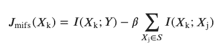*

*MIFS 功能排名，[来源](https://www.nature.com/articles/s41598-021-00854-x)。*

*这一系列基于信息的特征选择方法的其他发展包括自适应 MIFS (AMIFS) [ [11](https://ieeexplore.ieee.org/document/1379918) ]，条件 MIFS (CMIFS) [ [12](https://www.semanticscholar.org/paper/Conditional-Mutual-Information%E2%80%90Based-Feature-for-Cheng-Qin/ed090e62f2df266ddef21d1b9fb9156c4a3f62ed) ]，以及更多方法，由于篇幅限制，这些方法留给读者作为练习。*

*用有限状态机实现 MIFS:*

```
*selectors = FSM.FSM(k=20, filler = -1)
selectors.mifs(X_,y_)# Results:# Index(['member_id', 'collections_12_mths_ex_med',
#        'mths_since_last_major_derog', 'policy_code', 'annual_inc_joint',
#        'dti_joint', 'acc_now_delinq', 'tot_coll_amt', 'tot_cur_bal',
#        'open_acc_6m', 'open_il_6m', 'open_il_12m', 'open_il_24m',
#        'mths_since_rcnt_il', 'total_bal_il', 'il_util', 'open_rv_12m',
#        'open_rv_24m', 'max_bal_bc', 'all_util'],
#       dtype='object')*
```

***基于救济的方法***

*Relief [ [13](https://www.sciencedirect.com/science/article/pii/B9781558602472500371) 于 1992 年引入，用于二进制目标的特征选择，自从 ReliefF 将其推广到多类目标后，它开始流行。RReliefF 是一种基于 Relief 的方法，用于回归[ [14](https://link.springer.com/content/pdf/10.1023/A:1025667309714.pdf) ]、I-RELIEF、Tuned ReliefF、VLSReliefF、SURF 和 ReliefSeq。这里有一个很好的关于 RBMs 的调查。原始算法如下。假设我们有 p 个不同的特征和一个二元目标。然后，我们开始初始化一个权重向量 w，长度为 p，全为 0。然后，对于 B 次，我们*

*   *从我们的数据中随机抽取一个例子，比如从 0 班。*
*   *找出欧氏距离最接近的例子，属于同一类。我们称这个例子为“近击”类似地，我们取最接近的点，它属于对立的类，称之为“接近失误”*
*   *更新 w:对于 m 次迭代和 p 个特征，我们按下式更新 w_j。*

*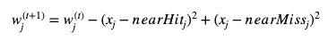*

*注意，我们通过每个示例与同类的最近示例的(平方)距离来惩罚特征 j(由 w_j 表示)的重要性。也就是说，Relief 更喜欢稀疏度较低的要素，并且同一类的示例之间距离较近的要素受到的惩罚会更少。相反，Relief 赋予来自一个类的示例离属于另一个类的示例更远的特征更高的重要性。*

*与通常的 KNN 估计器一样，只考虑几个邻居可能会导致有噪声的预测和过度拟合。ReliefF 算法除了将 ReliefF 推广到多类目标之外，还在估计重要性时纳入了来自 k 个邻居的信息。一般来说(对其他 RBA 也是如此)，在某种程度上，更多的邻居导致更准确的分数，但是需要更长的时间来收敛。*

*与以前的方法相比，这种方法完全是非参数化的，并且与以前依赖于信息论的方法相比，Relief 的重要性来自于距离的概念。*

*I-RELIEF 建议对整个命中和未命中实例集使用实例加权函数，而不是只对每个类的关闭实例使用加权函数。SURF 采用距离阈值 *T* 来将实例定义为邻居(其中 *T* 等于数据中所有实例对之间的平均距离)。然而，与迭代救济相反，SURF 对定义为邻居的所有实例使用相同的实例权重[【15】](https://www.sciencedirect.com/science/article/pii/S1532046418301400#b0195)。还有其他变体，如 VLSReliefF 和 ReliefSeq，这里不做介绍。这篇中篇文章对基于救济的方法做了更深入的介绍。*

*虽然它们不相同，但是基于起伏的方法与用于特征选择的拉普拉斯方法有相似之处。拉普拉斯方法也假设相同类别的观测值倾向于彼此更接近。在拉普拉斯特征选择中，我们通过测量任意距离和计算权重矩阵来将数据嵌入到最近邻居的图中。然后，我们计算每个特征的拉普拉斯准则，并获得这样一个性质，即最小值对应于最重要的维度。然而，在实践中，当选择特征子集时，通常使用不同的聚类算法(k-means 方法)，在该算法的帮助下，选择最有效的组[ [源](https://raevskymichail.medium.com/feature-selection-overview-of-everything-you-need-to-know-598c53c01d46) ]。*

*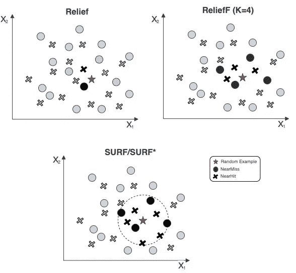*

*三个版本的浮雕，由作者绘制。上图展示了在不同的地貌算法下，哪些邻域被考虑在内。左上面板显示了我们在上面介绍过的基本版本。在这个版本中，当更新权重时，我们仅采用最接近的接近命中和接近未命中情况。右上面板显示了 ReliefF，它考虑了 k 个不同的邻居，在本例中为 4 个。底部面板显示了在 SURF/SURF*算法下更新权重时考虑的邻居。在这些算法中，我们不是考虑特定数量的邻居，而是定义一个边界，通过该边界将比它更近的邻居考虑在内。*

*关于起伏算法的两点注意事项:*

*python 中有几个 Relief(及其变体)的实现(例如， [sklearn-relief](https://gitlab.com/moongoal/sklearn-relief) ， [16](https://medium.com/@yashdagli98/feature-selection-using-relief-algorithms-with-python-example-3c2006e18f83) )，但这个似乎是最详细的 [scikit-rebate](https://epistasislab.github.io/scikit-rebate/using/) 。或许 RBA 如此受欢迎的原因之一是其灵活性。RBA 兼容分类和连续特征的混合，以及多类分类和回归。然而，由于他们依赖于距离(和 KNN)，他们深受维数灾难之苦。用户指南说:*

> *在非常大的特征空间中，用户可以预期基于核心起伏的算法分数在自己运行时变得不太可靠。这是因为随着特征空间变得非常大，最近邻居的确定变得更加随机。因此，在非常大的特征空间(例如> 10，000 个特征)中，用户应考虑将基于核心起伏的算法与迭代方法(如 TuRF(此处实现)或 VLSRelieF 或迭代起伏)相结合。*

*和*

> *当扩展到大数据问题时，请记住，使折扣方法速度最慢的数据方面是训练实例的数量，因为救济算法与功能的数量成线性比例，但与训练实例的数量成二次比例。这是基于起伏的方法需要计算距离数组(即训练数据集中实例之间的所有成对距离)的结果。如果您有大量可用的训练实例，那么在运行任何折扣方法时，可以考虑利用该数据集的类平衡随机采样来节省内存和计算时间。*

*而对于基于 Relief 的算法的具体时间复杂度，参见[ [15](https://arxiv.org/pdf/1711.08421.pdf) 中的表 5。*

*用有限状态机实现:*

```
*selectors = FSM.FSM(k=20, filler = -1)
selectors.ReliefF(X_,y_)
selectors.SURF(X_,y_)
selectors.SURFstar(X_,y_)
selectors.MultiSURF(X_,y_)# Note: X_ and y_ have N=10,000, which may lead to a long computation time.* 
```

## *其他方法*

*虽然我们已经讨论了大量的算法，但我们只能触及皮毛。我们还没有介绍用于特征选择的无监督算法[ [17](https://ieeexplore.ieee.org/document/8315427) 和[ [18](https://ieeexplore.ieee.org/abstract/document/7592899) ]，用于特征选择的谱方法[ [19](https://www.routledge.com/Spectral-Feature-Selection-for-Data-Mining/Zhao-Liu/p/book/9781138112629) ]，以及基于图的方法[ [20](https://ieeexplore.ieee.org/document/9357067) ， [21](http://citeseerx.ist.psu.edu/viewdoc/download?doi=10.1.1.422.9135&rep=rep1&type=pdf) 和[ [22](https://drive.google.com/file/d/1Jyzcc8fCQDBEyq6q2jWRnSLgQuufvXFx/view) ]。其他过滤方法包括 Burrata、信息片段(IF)、SOA 等。正如标题所说，这篇文章是为懒惰的数据科学家写的。如果你不懒，我希望你会对这篇文章的参考书目感兴趣。*

# *综合*

*好的，如果你已经到这里了，你可能有一个问题一直困扰着你——你尝试了不同的方法，得到了不同的分数，这些分数不一定彼此一致。你该怎么办？*

*根据[ [23](https://www.sciencedirect.com/science/article/pii/S1566253518303440) ]，当集合不同的选择方法时，我们必须考虑以下几点:*

*   *使用哪种方法和多少种方法？他们发现越多越好。*
*   *要使用的训练集的数量和大小—我们应该对数据进行子集划分吗？自举？正如我们在上面看到的，我们的一些算法在观察次数上是二次的。总体来说，答案是*是的；我们应该重新采样并选择特征。最终，我们可以将这些信息与下面的评分方法结合起来。**
*   *我们最终想要多少功能？这个数字可以定义为我们拥有的或之前被决定的所有特征的百分比。*
*   *如何评估聚合方法？我将用这一部分来回答这个问题。*

*假设您有不同的选定功能列表，您可以执行以下一项或多项操作。*

1.  *根据选择规则将你的电子邮件列表合并成一个列表(如下例)。然后，使用组合列表训练一个模型。*
2.  *使用特征选择器集成—在不同的“瘦”模型中训练 E，稍后，当新的数据集到达时，将通过使用 E 个不同的模型预测结果来进行预测。*
3.  *介于 1 和 2 之间的中间点——根据 E '不同的规则，将 E 个特征列表转换为 E '组合特征列表，然后训练 E' ( <*

***对不同列表中的特征进行排序**)可通过以下方式完成*

*   *Min:给每个元素分配它所达到的最小(最好)等级。*
*   *中位数:为每个元素分配它所达到的中位数等级。*
*   *算术平均数:给每个元素分配它所达到的等级的平均数。*
*   *几何平均值:给每个元素分配它所达到的等级的几何平均值。*

*我们可以使用投票[[24](https://medium.com/@vatvenger/combining-feature-selection-methods-cdb4ae5be979)]:*

```
*counter = Counter(features_selected_lists) # list of lists
features_voted = [k for k, v in counter.items() if v >= min_votes]*
```

*虽然 FSM 没有告诉您如何对您的特征进行排序，但它附带了一个方便的推理函数，该函数使用 bootstrap 并返回一个特征列表，该列表根据每个分类器和每个采样的重要性进行排序。所有的预处理(离散化、规范化(例如，回想一下 chi2 不能处理负值)，以及编码)都在内部完成。在下面的例子中，我只使用了 too 抽样，每个样本有 100 个观察值。*

```
*selectors = FSM.FSM(k=20, filler = -1)
results = selectors.Bootstrapper(X_, y_, B=2,Sample_size=100)# Results:# {'ANOVA': [array(['loan_amnt', 'int_rate', 'annual_inc', 'delinq_2yrs',
#          'inq_last_6mths', 'mths_since_last_delinq',
#          'mths_since_last_record', 'open_acc', 'pub_rec', 'revol_bal',
#          'total_acc', 'out_prncp', 'out_prncp_inv', 'total_pymnt',
#          'total_pymnt_inv', 'total_rec_prncp', 'total_rec_late_fee',
#          'recoveries', 'collection_recovery_fee', 'last_pymnt_amnt'],
#         dtype=object),
#   array(['member_id', 'loan_amnt', 'funded_amnt', 'funded_amnt_inv',
#          'int_rate', 'annual_inc', 'inq_last_6mths',
#          'mths_since_last_record', 'open_acc', 'pub_rec', 'revol_bal',
#          'revol_util', 'out_prncp', 'out_prncp_inv', 'total_pymnt',
#          'total_pymnt_inv', 'total_rec_prncp', 'recoveries',
#          'collection_recovery_fee', 'last_pymnt_amnt'], dtype=object)],
#  'chi2': [array(['member_id', 'loan_amnt', 'funded_amnt', 'funded_amnt_inv',
#          'annual_inc', 'mths_since_last_delinq', 'mths_since_last_record',
#          'open_acc', 'revol_bal', 'total_acc', 'out_prncp', 'out_prncp_inv',
#          'total_pymnt', 'total_pymnt_inv', 'total_rec_prncp',
#           ...*
```

***如何评估一组特征选择器***

*通常，我们会查看三个 KPI:*多样性* —例如在集成决策树中，我们不需要 K 个不同的树来给出总是相同的结果，我们不需要 K 个不同的选择器来选择相同的特征，而不管数据如何。另一个 KPI 是稳定性——我们必须确保集成将为相似的数据集返回相似的排名。最后是您的 KPI(可能是准确性、AUC 或其他)。使用冗余特征可能会导致更差的性能，我们应该期待使用所选子集和更快的训练会有更好的结果。*

***多样性** Kuncheva 和 Whitaker [ [25](https://link.springer.com/article/10.1023/A:1022859003006) ]提出了测量特征选择器集合多样性的附加测量的综合调查。设置是我们有两个或更多的训练模型，其中每一个都是在另一个特征子集上训练的。我们也有他们的预测，有些是正确的，有些是不正确的，有些是相同的，有些是不同的。他们提出并比较了 10 种多样性度量:Q 统计量、相关系数、不一致度量、双故障度量、Kohavi-Wolpart 方差、Interrator 一致性、熵度量、难度度量、广义多样性和重合故障多样性。然而，由于这篇文章变得太长了，我将检查一下 Q 统计，并将其余的留给好奇的读者。*

*Q 统计是成对检验。给定两个分类器，我们有两个 Di 预测，长度为 N(等于观察的数量)。我们交叉标记了他们的预测，并使用了以下符号:*

*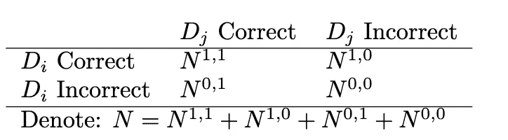*

*两个不同分类器预测的交叉表。表作者。*

*那么一对分类器的 Q 统计量将是*

*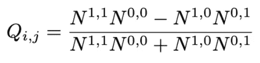*

*一对分类器的 q 统计量，由作者提供。*

*如果我们有 L 个不同的分类器，那么我们将返回平均 Q 统计量:*

*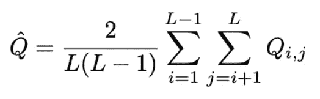*

*L 个不同分类器的平均 Q 统计量，由作者提供。*

*对于统计上独立的分类器，Q(i，j)的期望值是 0。q 在 1 和 1 之间变化。倾向于正确识别相同对象的分类器将具有正的 Q 值，而那些在不同对象上出错的分类器将使 Q 为负。*

***稳定性**确保集成将为相似的数据集返回相似的排名。*

*计算稳定性有几种方法(例如[ [26](https://dl.acm.org/doi/10.5555/1295303.1295370) ]，和[ [27](https://citeseerx.ist.psu.edu/viewdoc/download?doi=10.1.1.816.8821&rep=rep1&type=pdf#page=22) ])。我将从[ [28](https://jmlr.org/papers/volume18/17-514/17-514.pdf) 开始呈现一个更新的。使用[ [29](https://arxiv.org/pdf/2111.12140.pdf) ]演示:假设我们有 p 个原始特征，我们想从中选择总共 k 个特征。我们将数据分成 m 个不同的子集(或从中重新取样)。将 h_j 定义为特征 j 被选为整个 m 个子集中最重要的 k 个特征之一的次数。将 q 定义为 p 个特征的总和(即，它计算选择特征 1+选择特征 2+…+选择特征 p 的次数)，然后如下*

*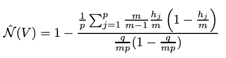*

*Nogueira 等人(2018 年)，来自 Hopf 和 Reifenrath 2021 年的公式*

*是完全定义的、严格单调的、有上下限的特征选择集合的稳定性度量，以及当所有特征集相等时它的最大值。*

***性能**是我们这里的主要目标，使用冗余功能或不重要的功能会降低我们模型的性能。我们可以通过查看选择下的 KPI，并与输入所有变量的基本场景进行比较，来衡量选择方法的成功。[ [24](https://medium.com/@vatvenger/combining-feature-selection-methods-cdb4ae5be979) ]进行 t 检验，比较选择后模型和没有选择后模型的 KPI。*

## *文献学*

1.  *霍普夫，康斯坦丁和萨沙·莱芬拉斯。"监督机器学习应用中特征选择的过滤方法——综述和基准测试."arXiv 预印本 arXiv:2111.12140 (2021)。*
2.  *《高维分类数据中特征选择的过滤方法的基准》*计算统计&数据分析* 143 (2020): 106839。*
3.  *余、雷、。“高维数据的特征选择:一种快速的基于相关性的过滤器解决方案。”*第 20 届机器学习国际会议论文集(ICML-03)* 。2003.*
4.  *皮尔宁斯基尼基塔和伊万·斯梅坦尼科夫。"作为 python 数据分析工具之一的特征选择算法."*未来互联网* 12.3 (2020): 54。*
5.  *谢尔登·m·罗斯*统计学导论*。学术出版社，2017。*
6.  *“MRMR”准确地解释了你希望别人如何向你解释。*
7.  *赵，陈振宇，拉迪卡·阿南德和马洛里·王。"营销机器学习平台的最大相关性和最小冗余特征选择方法." *2019 IEEE 数据科学与高级分析国际会议(DSAA)* 。IEEE，2019。*
8.  *Bennasar，Mohamed，Yulia Hicks 和 Rossitza Setchi。"使用联合互信息最大化的特征选择."*专家系统与应用*42.22(2015):8520–8532。*
9.  *迈耶、帕特里克·e 和吉安卢卡·邦坦皮。"在癌症分类中使用可变互补性进行特征选择."*进化计算应用研讨会*。施普林格，柏林，海德堡，2006。*
10.  *罗伯托·巴蒂蒂。"使用互信息在监督神经网络学习中选择特征."IEEE 神经网络汇刊 5.4(1994):537–550。*
11.  *特斯默、米歇尔和巴勃罗·埃斯特韦斯。" AMIFS:利用互信息的自适应特征选择."2004 年 IEEE 国际神经网络联合会议。№04CH37541) 。第一卷。IEEE，2004 年。*
12.  *基于条件互信息的协同和冗余特征选择分析。Etri 期刊 33.2(2011):210–218。*
13.  *基拉，肯吉和拉里·a·伦德尔。"一种实用的特征选择方法."《机器学习学报》1992 年。摩根·考夫曼，1992 年。249–256.*
14.  *rob Nik-iko nja、Marko 和 Igor Kononenko。"减免的理论和实证分析."机器学习 53.1(2003):23–69。*
15.  *基于地形的特征选择:介绍和评论。*生物医学信息学杂志*85(2018):189–203。*
16.  *Yash Dagli，使用起伏算法的要素选择与 python 示例。，中等。*
17.  *陈，，等，〈基于分层特征加权的监督特征选择方法〉。 *IEEE 访问*6(2018):15087–15098。*
18.  *王、石平、朱威廉。"稀疏图嵌入无监督特征选择." *IEEE 系统、人和控制论汇刊:系统*48.3(2016):329–341。*
19.  *赵，郑阿兰，。*用于数据挖掘的光谱特征选择*。泰勒弗朗西斯，2012 年。*
20.  *一种新的图形特征选择方法。 *2020 年第六届 IEEE 信息科学与技术大会(CiSt)* 。IEEE，2021。*
21.  *张志宏和埃德温·r·汉考克。“基于图形的特征选择方法。”*模式识别中基于图形表示的国际研讨会*。施普林格，柏林，海德堡，2011。*
22.  *胡，荣耀，等。“无监督特征选择的图自表示方法”*神经计算*220(2017):130–137。*
23.  *博隆-卡内多、韦尔尼卡和安帕罗·阿朗索-贝当佐斯。"特征选择的集成:回顾和未来趋势."*信息融合*52(2019):1–12。*
24.  *Cohen，Cohen 和 Atlas，结合特征选择方法， [vatvengers](https://medium.com/@vatvenger?source=post_page-----cdb4ae5be979--------------------------------) ，Medium。*
25.  *昆切娃，柳德米拉和克里斯托弗·惠特克。"分类器集成中多样性的测量及其与集成精度的关系."*机器学习*51.2(2003):181–207。*
26.  *《特征选择的稳定性指数》*人工智能及应用*。2007.*
27.  *排名列表中的堪培拉距离。*NIPS 09 研讨会进展会议录*。Citeseer，2009 年。*
28.  *诺盖拉、萨拉、康斯坦丁诺斯·塞希迪斯和加文·布朗。"特征选择算法的稳定性."j .马赫。学习。第 18.1 号决议(2017 年):6345 至 6398。*
29.  *霍普夫，康斯坦丁和萨沙·莱芬拉斯。"监督机器学习应用中特征选择的过滤方法——综述和基准测试." *arXiv 预印本 arXiv:2111.12140* (2021)。*