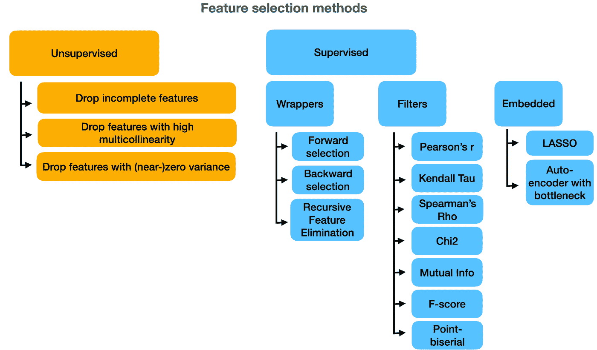
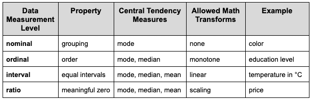
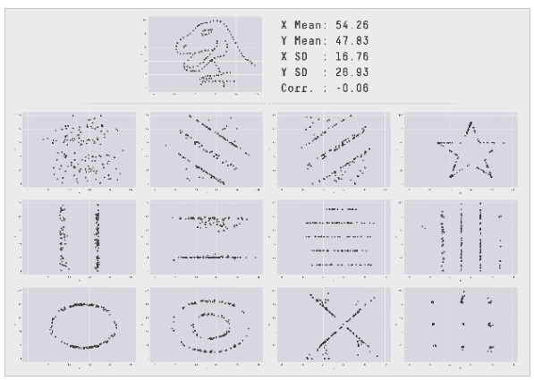
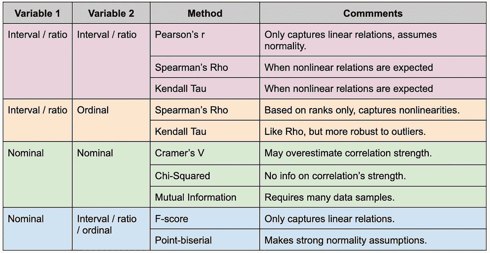
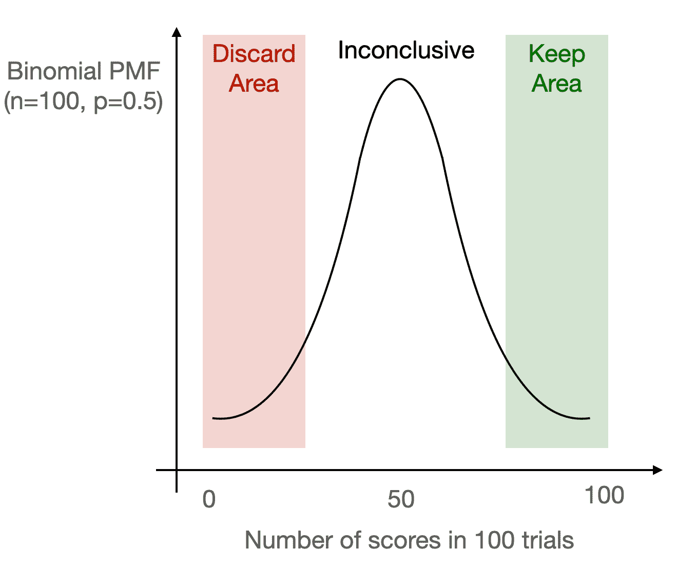

# 特征选择方法以及如何选择它们

> 原文：<https://towardsdatascience.com/feature-selection-methods-and-how-to-choose-them-1e7469100e7e>

## 特性选择的原因、方式和时机，以及一些方便的技巧和提示


*本文首发于* [*海王艾的博客*](https://neptune.ai/blog/feature-selection-methods) *。*

你有没有发现自己坐在屏幕前想知道什么样的功能将帮助你的机器学习模型最好地学习它的任务？我打赌你有。数据准备往往会消耗大量数据科学家和机器学习工程师的时间和精力，准备好数据以供学习算法使用是一项不小的壮举。

数据准备流程中的一个关键步骤是特征选择。你可能知道一句流行的谚语:垃圾进，垃圾出。你用什么来喂养你的模型至少和模型本身一样重要，如果不是更重要的话。

在本文中，我们将探讨特征选择在数据准备管道中其他与特征相关的任务中的位置，并讨论它对于任何机器学习项目的成功如此关键的多种原因。接下来，我们将回顾不同的特性选择方法，并讨论一些技巧和提示来改善它们的结果。然后，我们将一瞥 Boruta(最先进的特征选择算法)的幕后，最后看看一种结合不同特征选择方法的聪明方法。让我们开始吧！


# 什么是特征选择，什么不是？

让我们从定义感兴趣的对象开始。

什么是特征选择？简而言之，它是选择用于训练机器学习模型的特征子集的过程。

这就是特征选择是什么，但理解特征选择不是什么同样重要:它既不是特征提取，也不是特征工程，更不是降维。

特征提取和特征工程是描述基于领域知识从现有特征创建新特征的相同过程的两个术语。这会产生比原来更多的特性，应该在特性选择之前执行。首先，我们可以进行特征提取，以获得许多潜在有用的特征，然后我们执行特征选择，以挑选出确实会提高模型性能的最佳子集。

降维是另一个概念。它有点类似于特征选择，因为两者都旨在减少特征的数量。然而，它们在实现这一目标的方式上有很大的不同。虽然特征选择选择原始特征的子集来保留并丢弃其他特征，但是维度减少技术将原始特征投影到更少维度的空间上，从而创建全新的特征集。如果需要的话，降维应该在特征选择之后运行，但是在实践中，它不是这个就是那个。

现在我们知道了什么是特征选择，以及它如何对应于其他与特征相关的数据准备任务。但是我们为什么需要它呢？


# 我们需要特性选择的 7 个原因

一个流行的说法是，现代机器学习技术在没有特征选择的情况下做得很好。毕竟，一个模型应该能够知道特定的特性是无用的，它应该关注其他的特性，对吗？

嗯，这个推理在某种程度上是有道理的。理论上，线性模型可以给无用的特征分配零权重，而基于树的模型应该很快学会不对它们进行分割。然而，在实践中，当输入不相关或多余时，训练中会出现许多问题——这两个术语将在后面详述。除此之外，还有许多其他原因可以解释为什么简单地将所有可用的特性都转储到模型中可能不是一个好主意。我们来看看最突出的七个。

## 1:不相关和多余的功能

有些功能可能与手头的问题无关。这意味着它们与目标变量没有关系，与模型设计要解决的任务完全无关。丢弃不相关的特征将防止模型拾取它可能携带的虚假相关性，从而避免过度拟合。

冗余特征是另一种动物。冗余意味着两个或更多特征共享相同的信息，并且除了一个之外，所有特征都可以被安全地丢弃而不会丢失信息。注意，在存在另一个相关特征的情况下，一个相关特征也可以是冗余的。应丢弃冗余要素，因为它们可能会在训练过程中造成许多问题，例如线性模型中的多重共线性。

## 2:维度的诅咒

特征选择技术在特征很多但训练样本很少的场景中尤其不可或缺。这种情况存在所谓的维数灾难:在一个非常高维的空间中，每个训练样本与所有其他样本相距如此之远，以至于模型无法学习任何有用的模式。解决方案是降低特征空间的维数，例如通过特征选择。

## 3:培训时间

功能越多，训练时间越多。这种权衡的细节取决于所使用的特定学习算法，但是在需要实时进行再训练的情况下，人们可能需要将自己限制在几个最佳特性上。

## 4:部署工作

功能越多，机器学习系统在生产中就变得越复杂。这带来了多种风险，包括但不限于高维护成本、[纠缠、未申报的消费者或修正级联](/8-hazards-menacing-machine-learning-systems-in-production-5c470baa0163)。

## 5:可解释性

有了太多的特征，我们就失去了模型的可解释性。虽然并不总是主要的建模目标，但是解释和说明模型的结果通常是重要的，并且在一些受管制的领域中甚至可能构成法律要求。

## 6:奥卡姆剃刀

根据这个所谓的节俭定律，只要性能相同，简单的模型应该比复杂的模型更受青睐。这也和机器学习工程师的克星，过度拟合有关。不太复杂的模型不太可能过度拟合数据。

## 7:数据模型兼容性

最后，还有数据模型兼容性的问题。虽然原则上这种方法应该是数据优先，这意味着收集和准备高质量的数据，然后选择一个适合这些数据的模型，但现实生活可能正好相反。

你可能试图复制一篇特定的研究论文，或者你的老板可能建议使用特定的模型。在这种模型优先的方法中，您可能被迫选择与您开始训练的模型兼容的特性。例如，许多模型无法处理数据中的缺失值。除非你[非常了解你的插补方法](/handling-missing-data-5be11eddbdd)，否则你可能需要删除不完整的特征。


# 不同的特征选择方法

所有不同的特征选择方法可以分为四类，每一类都有其优点和缺点。有无监督和有监督的方法。后者可以进一步分为包装器、过滤器和嵌入式方法。让我们逐一讨论。



不同的特征选择方法。图片由作者提供。

## 无监督方法

就像无监督学习是在无标签数据中寻找模式的学习类型一样，无监督特征选择方法也是不利用任何标签的方法。换句话说，他们不需要访问机器学习模型的目标变量。

你可能会问，如果不分析一个特性与模型目标的关系，我们怎么能说它对模型不重要呢？嗯，在某些情况下这是可能的。我们可能希望放弃以下功能:

*   零或接近零的方差。(几乎)不变的特征提供的学习信息很少，因此是不相关的。
*   许多缺失值。虽然删除不完整的特征[不是处理缺失数据](/handling-missing-data-5be11eddbdd)的首选方式，但这通常是一个好的开始，如果缺失太多条目，这可能是唯一明智的做法，因为这些特征可能是不相关的。
*   高度多重共线性；多重共线性意味着不同要素之间的相关性很强，这可能表示存在冗余问题。

## 包装方法

包装器方法是指一系列受监督的特征选择方法，这些方法使用模型来对不同的特征子集进行评分，以最终选择最佳的一个。每个新的子集用于训练一个模型，然后在保留集上评估该模型的性能。选择产生最佳模型性能的特征子集。

包装方法的一个主要优点是，它们倾向于为特定的模型类型提供性能最佳的特性集。

然而，与此同时，这也是一种限制。包装器方法很可能会过度适应模型类型，如果想在不同的模型中尝试它们，它们产生的特性子集可能不会通用化。

包装器方法的另一个显著缺点是它们需要大量的计算。它们需要训练大量的模型，这可能需要时间和计算能力。

流行的包装方法包括:

*   **逆向选择**，我们从包含所有可用功能的完整模型开始。在随后的迭代中，我们一次删除一个特征，总是在模型性能度量中产生最大增益的那个，直到我们达到期望的特征数量。
*   **正向选择**，反向工作:我们从一个零特征的空模型开始，一次贪婪地添加一个特征，使模型的性能最大化。
*   **递归特征消除**，或 RFE，精神上类似于逆向选择。它也从一个完整的模型开始，一个接一个地迭代消除特征。区别在于选择要丢弃的特征的方式。RFE 并不依赖于拒不接受的模型性能指标，而是基于从模型中提取的特征重要性来做出决策。这可以是线性模型中的特征权重、基于树的模型中的杂质减少或排列重要性(适用于任何模型类型)。

## 过滤方法

受监督家族的另一个成员是过滤方法。可以认为它们是计算包装器的更简单、更快速的替代方法。为了评估每个特征的有用性，他们简单地分析其与模型目标的统计关系，使用诸如相关性或互信息之类的度量作为模型性能度量的代理。

过滤器方法不仅比包装器快，而且更通用，因为它们是模型不可知的；他们不会过度适应任何特定的算法。它们也很容易解释:如果一个特征与目标没有统计关系，它就会被丢弃。

然而，另一方面，过滤方法有一个主要缺点。他们孤立地看待每个特征，评估它与目标的关系。这使得它们倾向于丢弃有用的特征，这些特征本身是目标的弱预测器，但是当与其他特征结合时，为模型增加了很多价值。

## 嵌入式方法

我们将讨论的最后一种特征选择方法是将其嵌入学习算法本身。这个想法是结合两个世界的优点:过滤器的速度，同时获得特定模型的最佳子集，就像从包装器中一样。

最典型的例子是套索回归。它基本上只是正则化的线性回归，其中特征权重在损失函数中向零收缩。因此，许多要素的权重最终为零，这意味着它们将从模型中被丢弃，而权重非零的其余要素将被包括在内。

嵌入式方法的问题在于，没有多少算法内置了特征选择。LASSO 旁边的另一个例子来自计算机视觉:[带有瓶颈层的自动编码器](/autoencoders-from-vanilla-to-variational-6f5bb5537e4a)迫使网络忽略图像中一些最无用的特征，而专注于最重要的特征。除此之外，例子不多。


# 过滤方法:技巧和提示

正如我们所看到的，包装方法速度慢，计算量大，并且是特定于模型的，并且没有多少嵌入式方法。因此，过滤器通常是特征选择方法的首选。

同时，他们需要最专业的知识和对细节的关注。虽然嵌入式方法开箱即用，包装器实现起来也相当简单(尤其是当人们只调用 scikit-learn 函数时)，但过滤器需要一点统计复杂性。现在让我们把注意力转向滤波方法，并更详细地讨论它们。

## 复习一下你的统计数据

过滤方法需要评估每个特征和目标之间的统计关系。虽然听起来很简单，但事情远比看起来简单。有许多统计方法来衡量两个变量之间的关系。为了知道在特定情况下选择哪一个，我们需要回想一下我们的第一个 STATS101 类，并复习一下[数据测量级别](/data-measurement-levels-dfa9a4564176)。

## 数据测量级别

简而言之，变量的测量水平描述了数据的真实含义以及对这些数据有意义的数学运算的类型。有四种测量级别:标称、顺序、间隔和比率。



数据测量级别。来源:【[链接](/data-measurement-levels-dfa9a4564176)。

标称特征，例如颜色(“红”、“绿”或“蓝”)在值之间没有排序；他们只是根据他们对*群*的观察。

序数特征，如教育水平(“初级”、“中级”、“高级”)表示顺序，但不是特定水平之间的差异(我们不能说“初级”和“中级”之间的差异与“中级”和“高级”之间的差异相同)。

间隔要素(如以摄氏度为单位的温度)保持间隔相等(25 度和 20 度之间的差异与 30 度和 25 度之间的差异相同)。

最后，比率特性，如以美元表示的价格，以有意义的零为特征，这允许我们计算两个数据点之间的比率:我们可以说 6 美元是 2 美元的两倍。

为了选择正确的统计工具来度量两个变量之间的关系，我们需要考虑它们的度量水平。

## 测量各种数据类型的相关性

当我们比较的两个变量，即特征之一和目标，都是区间或比率时，我们可以使用最流行的相关性度量:T4 皮尔逊相关性，也称为皮尔逊相关性。

这很好，但是皮尔逊相关性有两个缺点:它假设两个变量都是正态分布的，并且它只测量它们之间的线性相关性。当相关性是非线性时，皮尔逊的 r 不会检测到它，即使它真的很强。

你可能听说过由 Alberto Cairo 编译的 Datasaurus 数据集。它由 13 对变量组成，每个变量都具有相同的非常弱的皮尔逊相关性-0.06。一旦我们把它们标绘出来，就很快变得显而易见，这些对实际上有很强的相关性，尽管是以非线性的方式。



Alberto Cairo 的 Datasaurus 数据集。

当预期非线性关系时，应考虑皮尔逊相关性的替代方法之一。最受欢迎的两个是:

*   **斯皮尔曼秩相关(斯皮尔曼ρ)，**
*   **肯德尔秩相关(Kendall Tau)。**

对于比率/区间变量，Spearman 等级相关是 Pearson 相关的替代方法。顾名思义，它只查看等级值，即它根据变量中特定数据点的相对位置来比较两个变量。它能够捕捉非线性关系，但没有免费的午餐:由于只考虑排名而不是确切的数据点，我们丢失了一些信息。

另一种基于等级的相关性度量是肯德尔等级相关性。它在精神上类似于 Spearman 的相关性，但表述方式略有不同(Kendall 的计算基于一致和不一致的值对，与 Spearman 基于偏差的计算相反)。肯德尔通常被认为对数据中的异常值更稳健。

如果至少有一个被比较的变量是序数型的，Spearman 或 Kendall 等级相关法是可行的。由于序数数据只包含关于等级的信息，所以它们都是完美的匹配，而皮尔逊的线性相关性用处不大。

另一种情况是两个变量都是名义变量。在这种情况下，我们可以从几个不同的相关性度量中进行选择:

*   **Cramer 的 V** ，它将两个变量之间的关联捕捉到一个从零(没有关联)到一(一个变量完全由另一个变量决定)的数字中。
*   **卡方统计量**，常用于检验两个变量之间的相关性。缺乏依赖性意味着特定的特性没有用。
*   **互信息**，衡量两个变量之间的相互依赖性，试图量化人们可以从一个变量中提取的关于另一个变量的信息量。

选哪个？没有放之四海而皆准的答案。通常，每种方法都有一些优点和缺点。众所周知，克拉默的 V 字高估了该协会的实力。互信息作为一种非参数方法，需要更大的数据样本来产生可靠的结果。最后，卡方检验不能提供关系强度的信息，而只能提供关系是否存在的信息。

我们已经讨论了这样的场景，其中我们比较的两个变量都是区间或比率，当它们中至少有一个是序数时，以及当我们比较两个名义变量时。最后可能遇到的是比较一个名义变量和一个非名义变量。

在这种情况下，两种最广泛使用的相关性度量是:

*   **ANOVA F-score** ，当一个变量是连续的而另一个是名义变量时的卡方当量。
*   **点-双列相关**，一种专门用于评估二进制变量和连续变量之间关系的相关性度量。

再说一次，没有灵丹妙药。F 分数只捕捉线性关系，而点-双列相关作出一些强正态假设，在实践中可能不成立，破坏了它的结果。

说了这么多，在特定情况下应该选择哪种方法呢？下表有望在这个问题上提供一些指导。



常见的相关措施，由作者编制。

## 转换您的变量

正如我们已经看到的，可以与过滤器特征选择方法一起使用的每个相关性度量适合于特定的数据类型。同时，每一种都有一些优点和缺点。如果您认为某个特定的方法非常适合您的用例，但是它不适合您的数据类型，或者它的假设没有得到满足，该怎么办？不用担心，一个聪明的数据转换将会扭转局面。

例如，假设您的数据集中有一个比率特征和一个比率目标。但是，您担心使用 Pearson 相关性不起作用，因为该特征是非正态分布的。在这种情况下，您可以使用 z 得分来归一化您的要素，以确保满足正态假设。

现在想象一个不同的情况:目标是名义上的，特征是一个比率。基于领域知识，你期望它们之间的关系是非线性的，这禁止了 F 分数的使用。同时，该特征是非正态的，这排除了使用点-双列相关。怎么办？您可以将要素离散化到多个条柱中，并尝试一种名义-名义测量方法，如互信息。

从这两个例子中可以看出，通过转换数据，我们可以获得比原来可行的更多的相关性度量。


# sci kit-学习和超越

就像大多数其他机器学习任务一样，scikit-learn 包很好地完成了特征选择，尤其是它的`sklearn.feature_selection`模块。然而，在某些情况下，一个人需要接触到其他地方。对于本文的其余部分，让我们用`X`来表示一个数组或数据框，所有潜在的特性都是列，观察值是行，用`y`来表示目标向量。

让我们从无监督的特征选择方法开始:

*   `sklearn.feature_selection.VarianceThreshold`变压器将默认移除所有零方差特性。我们还可以给它传递一个阈值，让它移除方差低于阈值的特征。

```
from sklearn.feature_selection import VarianceThresholdsel = VarianceThreshold(threshold=0.05)
X_selection = sel.fit_transform(X)
```

*   为了删除缺少值的列，可以在数据框上使用 pandas 的`dropna(axis=1)`方法。

```
X_selection = X.dropna(axis=1)
```

*   要移除具有高度多重共线性的要素，我们首先需要测量它。一种流行的多重共线性测量方法是方差膨胀因子或 VIF。它是在 statsmodels 包中实现的。

```
from statsmodels.stats.outliers_influence import variance_inflation_factorvif_scores = [
    variance_inflation_factor(X.values, feature)
    for feature in range(len(X.columns))
]
```

按照惯例，VIF 大于 10 的列被视为存在多重共线性，但如果另一个阈值看起来更合理，则可以选择该阈值。

谈到包装器方法，scikit-learn 为我们提供了:

*   向后和向前特征选择可以通过 SequentialFeatureSelector 转换器实现。例如，为了使用 k-最近邻分类器作为正向选择中的评分模型，我们可以使用以下代码片段:

```
from sklearn.feature_selection import SequentialFeatureSelectorknn = KNeighborsClassifier(n_neighbors=3)
sfs = SequentialFeatureSelector(knn, n_features_to_select=3, direction=”forward”)
sfs.fit(X, y)
X_selection = sfs.transform(X)
```

*   递归特征消除以非常相似的方式实现。下面是一个基于支持向量分类器的特征重要性实现 RFE 的片段。

```
from sklearn.feature_selection import RFEsvc = SVC(kernel=”linear”)
rfe = RFE(svc, n_features_to_select=3)
rfe.fit(X, y)
X_selection = rfe.transform(X)
```

现在让我们来看看如何实现各种过滤方法。这些将需要更多的粘合代码来实现。首先，我们需要计算每个特征和目标之间适当的相关性度量。然后，我们将根据结果对所有特征进行排序，并保留所需数量(前 K 个，或前 30%)的相关性最强的特征。幸运的是，scikit-learn 提供了一些实用程序来帮助这一努力。

*   为了保留与目标具有最强 Pearson 相关性的前两个特征，我们可以运行:

```
from sklearn.feature_selection import r_regression, SelectKBest
X_selection = SelectKBest(r_regression, k=2).fit_transform(X, y)
```

*   类似地，为了保留前 30%的特性，我们将运行:

```
from sklearn.feature_selection import r_regression, SelectPercentileX_selection = SelectPercentile(r_regression, percentile=30).fit_transform(X, y)
```

`SelectKBest`和`SelectPercentile`方法也适用于自定义或非 scikit-learn 相关性测量，只要它们返回长度等于特征数量的向量，每个特征的数量表示其与目标的关联强度。接下来，让我们看看如何计算我们之前讨论过的所有不同的度量。

*   Spearman 的 Rho、Kendall Tau 和点-双列相关都可以在 scipy 包中获得。这就是如何获得 x 中每个特征的值。

```
from scipy import statsrho_corr = [stats.spearmanr(X[:, f], y).correlation for f in range(X.shape[1])]tau_corr = [stats.kendalltau(X[:, f], y).correlation for f in range(X.shape[1])]pbs_corr = [stats.pointbiserialr(X[:, f], y).correlation for f in range(X.shape[1])]
```

*   卡方、互信息和 ANOVA F-score 都在 scikit-learn 中。请注意，互信息有一个单独的实现，这取决于目标是否是名义上的。

```
from sklearn.feature_selection import chi2
from sklearn.feature_selection import mutual_info_regression
from sklearn.feature_selection import mutual_info_classif
from sklearn.feature_selection import f_classifchi2_corr = chi2(X, y)[0]
f_corr = f_classif(X, y)[0]
mi_reg_corr = mutual_info_regression(X, y)
mi_class_corr = mutual_info_classif(X, y)
```

*   Cramer 的 V 可以从最近的 scipy 版本(1.7.0 或更高版本)获得。

```
from scipy.stats.contingency import associationv_corr = [association(np.hstack([X[:, f].reshape(-1, 1), y.reshape(-1, 1)]), method=”cramer”) for f in range(X.shape[1])]
```


# 不要俘虏:博鲁塔不需要人类的参与

说到特性选择，不能不提到 Boruta。早在 2010 年，当[首次将](https://www.jstatsoft.org/article/view/v036i11)作为 R 包发布时，它很快就因革命性的特征选择算法而闻名。

到目前为止，我们讨论的所有其他方法都需要人类做出任意的决定。无监督方法需要我们为特征移除设置方差或 VIF 阈值。包装器要求我们决定想要保留的特性的数量。过滤器需要我们选择相关度和要保留的特征数量。嵌入式方法让我们选择正则化强度。博鲁塔不需要这些。

Boruta 是一个简单但统计优雅的算法。它使用来自随机森林模型的特征重要性度量来选择特征的最佳子集，并且它通过引入两个聪明的想法来做到这一点。

首先，特性的重要性分数不能相互比较。相反，每个特征的重要性与其随机化版本的重要性相竞争。为了实现这一点，Boruta 随机排列每个特征来构建它的“影子”版本。然后，在整个特征集上训练随机森林，包括新的阴影特征。阴影特征中的最大特征重要性用作阈值。在原始特征中，只有那些重要性高于这个阈值的特征才得分。换句话说，只有比随机向量更重要的特征才会被加分。

上述过程迭代重复多次。由于每次随机排列不同，阈值也不同，因此不同的特征可能得分。经过多次迭代后，每个原始特征都有一些指向其名称的点。

最后一步是根据每个特性的得分来决定是保留还是丢弃它。博鲁塔的两个聪明想法中的另一个出现了:我们可以使用[二项式分布](/6-useful-probability-distributions-with-applications-to-data-science-problems-2c0bee7cef28)来模拟分数。

每一次迭代都被认为是一次独立的试验。如果该特性在给定的迭代中得了分，它就是一个保留它的投票；如果没有，那就投票决定放弃它。先验地，我们不知道某个特征是否重要，所以该特征得分的预期试验百分比是 50%。因此，我们可以用 p=0.5 的二项式分布来模拟分数。如果我们的特征得分明显高于这个次数，它就被认为是重要的并被保留。如果得分次数少得多，它就被认为不重要并被丢弃。如果它在大约 50%的试验中得分，它的状态是未解决的，但是为了保守起见，我们可以保留它。

例如，如果我们让 Boruta 运行 100 次试验，那么每个特性的预期得分将是 50。如果它接近零，我们丢弃它，如果它接近 100，我们保留它。



博鲁塔的决策过程。图片由作者提供。

Boruta 在许多 Kaggle 比赛中已经证明非常成功，总是值得尝试。它还被成功用于[预测建筑供暖能耗](https://www.mdpi.com/1996-1073/14/10/2779)或[预测空气污染](https://www.researchgate.net/publication/353955153_An_application_of_Machine_learning_with_Boruta_Feature_selection_to_Improve_NO2_pollution_prediction)。

有一个非常直观的 Python 包来实现 Boruta，叫做 [BorutaPy](https://github.com/scikit-learn-contrib/boruta_py) (现在是`scikit-learn-contrib`的一部分)。这个包的 GitHub readme 演示了用 Boruta 运行特性选择是多么容易。


# 为自己构建一个投票选择器

我们已经讨论了许多不同的特征选择方法。每一种都有自己的长处和短处，做出自己的假设，并以不同的方式得出结论。选哪个？还是我们必须选择？在许多情况下，将所有这些不同的方法组合在一起会使最终的特性选择器比它的每个子部分都更强大。

一种方法是受集合决策树的启发。在这类模型中，包括随机森林和许多流行的梯度增强算法，人们训练多个不同的模型，并让它们对最终预测进行投票。本着类似的精神，我们可以为自己构建一个投票选择器。

想法很简单:实现我们已经讨论过的几个特性选择方法。您的选择可能会受到您的时间、计算资源和数据测量水平的影响。只要你能负担得起，就尽可能多的运行不同的方法。

然后，对于每个特征，写下建议将该特征保留在数据集中的选择方法的百分比。如果超过 50%的方法投票支持保留该特性，那么就保留它——否则，就放弃它。

这种方法背后的思想是，虽然一些方法可能由于其固有的偏见而对一些特征做出错误的判断，但是方法的集合应该正确地得到有用的特征集。让我们看看在实践中如何实现！

让我们构建一个简单的投票选择器，它集成了三种不同的特征选择方法:基于 Pearson 相关性的过滤方法、基于多重共线性的非监督方法和包装器，即递归特征消除。让我们看看这样一个投票选择器可能是什么样子。接下来，我们将详细讨论代码。

我们的 VotingSelector 类在 init 构造函数之上包含四个方法。其中三个实现了我们想要集成的三种特征选择技术:`_select_pearson()`用于皮尔逊相关滤波，`_select_vif()`用于基于方差膨胀因子的无监督方法，`_select_rbf()`用于 RBF 包装器。

这些方法中的每一种都将特征矩阵 X 和目标 y 作为输入。基于 VIF 的方法不会使用目标，但是我们仍然使用这个参数来保持所有方法的接口一致，这样我们可以方便地在以后的循环中调用它们。除此之外，每个方法都接受一个关键字参数字典，我们将使用它来传递依赖于方法的参数。

解析完输入后，每个方法调用适当的 sklearn 或 statsmodels 函数，返回要保留的特性名称列表。

投票魔术发生在`select()`方法中。在这里，我们简单地迭代三个选择方法，对于每个特征，我们记录它是否应该根据这个方法被保留(1)或丢弃(0)。最后，我们对这些投票取平均值。对于每个特性，如果这个平均值大于投票阈值 0.5(这意味着三个方法中至少有两个投票保留了一个特性)，我们就保留它。

让我们看看它在实践中的效果。我们将加载臭名昭著的波士顿住房数据，这是内置的 w scikit-learn。

现在，运行特征选择就像这样简单:

```
vs = VotingSelector()
X_selection = vs.select(X, y)
```

结果，我们得到的特征矩阵只剩下三个特征。

```
 ZN  CHAS     RM
0    18.0   0.0  6.575
1     0.0   0.0  6.421
2     0.0   0.0  7.185
3     0.0   0.0  6.998
4     0.0   0.0  7.147
..    ...   ...    ...
501   0.0   0.0  6.593
502   0.0   0.0  6.120
503   0.0   0.0  6.976
504   0.0   0.0  6.794
505   0.0   0.0  6.030
[506 rows x 3 columns]
```

我们还可以通过打印`vs.votes`来一瞥我们的每个方法是如何投票的。

```
CRIM  ZN  INDUS  CHAS  NOX  RM  AGE  DIS  RAD  TAX  PTRATIO  B LSTAT
pearson  0   1   0   1   0   1   0   1   0   0   0   1   0
vif      1   1   0   1   0   0   0   0   0   0   0   0   0
rfe      0   0   0   1   1   1   0   0   0   0   1   0   1
```

最初的 13 个专栏只剩下 3 个，我们可能会不高兴。幸运的是，我们可以很容易地通过修改特定方法的参数来减少选择的限制。这可以通过简单地向 select 调用添加适当的参数来实现，这要感谢我们如何传递 kwargs。

皮尔逊和 RFE 方法需要保留预定数量的特征。默认值为 5，但我们可能希望将其增加到 8。我们还可以修改 VIF 阈值，该阈值是方差膨胀因子的值，高于该值时，由于多重共线性，我们会丢弃某个要素。按照惯例，这个阈值被设置为 10，但是增加到 15 会导致更多的特性被保留。

```
vs = VotingSelector()
X_selection = vs.select(X, y, n_features_to_select=8, vif_threshold=15)
```

这样，我们还剩下七个特征。

我们的 VotingSelector 类是一个简单但通用的模板，您可以将其扩展到任意数量的特征选择方法。作为一种可能的扩展，您还可以将传递给`select()`的所有参数视为您的建模管道的超参数，并对它们进行优化，以便最大化下游模型的性能。


# 大技术公司的功能选择

大型科技公司，如 GAFAM 等，拥有数以千计的生产中的机器学习模型，是如何在野外操作特征选择的主要例子。让我们看看这些科技巨头对此有什么看法！

ML 的规则是谷歌机器学习最佳实践的便利汇编。在其中，谷歌的工程师指出，该模型可以学习的参数数量大致为

与它可以访问的数据量成比例。因此，我们拥有的数据越少，需要丢弃的特征就越多。他们粗略的指导方针(来源于基于文本的模型)是使用十几个特征和 1000 个训练样本，或者 100，000 个特征和 1000 万个训练样本。

文档中的另一个关键点涉及模型部署问题，这也会影响特性选择。首先，可供选择的特性集可能会受到推理时产品中可用特性的限制。如果一个很棒的特性在模型上线时不存在，你可能会被迫放弃它。第二，一些特性可能容易出现[数据漂移](/dont-let-your-model-s-quality-drift-away-53d2f7899c09)。虽然解决漂移是一个复杂的话题，但有时最好的解决方案可能是从模型中完全删除有问题的特性。


# 参考

*   [sci kit-了解关于功能选择的文档](https://scikit-learn.org/stable/modules/feature_selection.html)
*   [boruta_py 的 GitHub 自述](https://github.com/scikit-learn-contrib/boruta_py/blob/master/README.md)
*   [机器学习的规则:ML 工程的最佳实践](https://martin.zinkevich.org/rules_of_ml/rules_of_ml.pdf)


感谢阅读！我希望这篇概述文章已经使您相信特性选择是数据准备过程中的一个关键步骤，并为您提供了一些关于如何实现它的指导。不要犹豫，在社交媒体上联系我，讨论这里涵盖的主题，或任何其他机器学习主题。快乐精选！

如果你喜欢这篇文章，为什么不订阅电子邮件更新我的新文章呢？并且通过 [**成为媒介会员**](https://michaloleszak.medium.com/membership) ，可以支持我的写作，获得其他作者和我自己的所有故事的无限访问权限。

需要咨询？你可以问我任何问题，也可以在这里 为我预约 1:1 [**。**](http://hiretheauthor.com/michal)

你也可以试试我的其他文章。不能选择？从这些中选择一个:

[](/reducing-pipeline-debt-with-great-expectations-f1afddbfdc0b)  [](/on-the-importance-of-bayesian-thinking-in-everyday-life-a74475fcceeb)  [](/8-tips-for-object-oriented-programming-in-python-3e98b767ae79) 