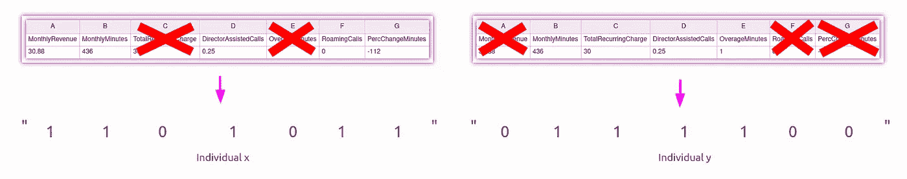
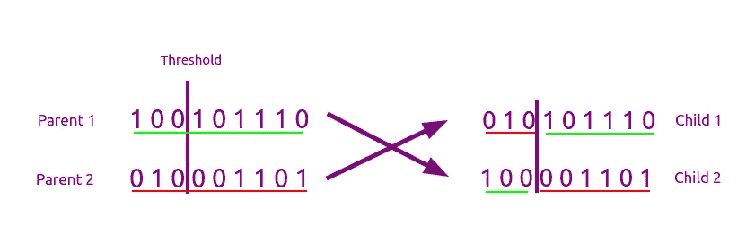
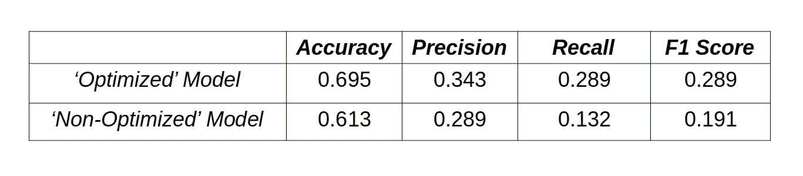

# 使用遗传算法的特征选择

> 原文：<https://towardsdatascience.com/feature-selection-using-genetic-algorithms-d3f5fc7bbef1>

## 通过将遗传算法应用于特性优化过程，了解其工作原理

[国家癌症研究所](https://unsplash.com/@nci?utm_source=medium&utm_medium=referral)在 [Unsplash](https://unsplash.com?utm_source=medium&utm_medium=referral) 上拍摄的照片

F 由于高维数据量的增加**【1】**，特征选择已经成为训练机器学习模型的数据处理的基本步骤。

有大量最先进的算法旨在优化特征选择(最佳性能技术的综述可在**【2】**中找到)，包括遗传算法。虽然遗传算法不是表现最好的技术，但它提供了一种基于进化(因此本质上是随机的)的令人兴奋的解决方案，并被广泛用于机器人、营销或医学等领域**【3】**，因此知道如何使用它们会非常有用。出于所有这些原因，本文展示了遗传算法的逻辑及其应用，特别是针对特性优化过程。

首先，所有需要的库都被导入以备将来使用。

# 遗传算法

遗传算法旨在复制遗传进化的行为，即最适合环境的个体的遗传基因会随着时间的推移而持续存在。

根据目标函数或启发法来评估群体中的个体，该目标函数或启发法用于在每次迭代中选择要繁殖的个体。从目标函数中获得更好结果的那些个体将以更高的概率被选择用于繁殖(在自然界中，具有更好遗传的个体活得更长更好，这允许他们繁殖更多他们的基因)。值得一提的是，选择个体进行繁殖是随机的，因此最好的个体不会总是被选择，这有助于算法不会陷入局部最小值。经过几代后，选出最佳个体作为最终结果。

既然已经在高层次上解释了算法，更多的焦点将放在进化过程的每一步上。

## ***个体的表象***

第一步是找到一种方法来代表每一个人。目标是从初始特征中找到特征的最佳子集，因此每个个体必须是其所具有的特征子集的代表。同样为了寻找尽可能低的内存成本，个体将被表示为长度等于特征数量的字符串，其中字符串的每个字符对应于一个特征，并且将具有值 1 或 0，这取决于该特征是否是活动的。这样，每个个体将占用 *n* 个字节，其中 *n* 是特性的初始数量(Python 需要 1 个字节来存储一个 char)。下面是 7 个要素的数据集如何表示个体的示例。

图片作者。个人代表

## ***生成人口***

下一步是生成一个具有一定数量个体的群体，作为算法的起点。个体的产生可以完全随机，也可以稍微控制。如果只找到特征的最佳子集，个体的产生可以是完全随机的。然而，如果除了寻找最佳子集之外，还需要减少数据集的维数，那么强制个体生成器创建最大数量为 1 的个体是很有趣的。通过这种方式，所有个体将拥有最大数量的活动要素，从而降低数据集的维度。下面的代码展示了随机生成和受控生成的个体生成器的实现。

个体的生产者

## ***获取群体中每个个体的权重***

为了获得权重，将使用仅包含该个体的活动要素的数据集为每个个体训练模型。

这种训练将通过用 *tensorflow* 构建的神经网络来进行，该神经网络由分别为 32、64 和 1 个神经元的 3 个密集层组成。前两个图层使用 ReLu 激活函数，而输出图层使用 sigmoid 函数，通常用于二元分类。损失度量是二进制交叉熵，Adam 用作优化器。关于模型的输入形状，这将根据个体子集中的特征数量而变化。因此，所有模型将具有相同的层，但它们的输入形状会有所不同。

模型的创建

一旦模型在每个个体的特征子集上被训练，每个模型的准确度被计算。因为这篇文章的目的是在介绍的水平上介绍遗传算法在特征选择中的应用，所以权重是以一种非常基本的方式从模型精度中计算出来的。为了计算个体的权重，其模型的精度将除以总体精度的总和。这样所有的权重加起来就是 1，我们可以用它们作为选择繁殖个体的概率。

在执行这个最后的函数( *fill_population()* )之后，得到的群体是元组的列表，每个个体(字符串)是元组的第一个元素，第二个元素是其相应的权重。

## ***繁殖个体***

按照从先前计算的权重获得的分布，选择 N 个个体，其中 N 是群体的大小，并且从每对个体中产生两个新的个体。这样，每一代都将拥有与上一代相同数量的个体，因此该算法可以根据需要运行多次迭代。

按照与进化的相似性，生殖包括结合父母的基因。为此，将随机生成一个介于 1 和 *n* -1 之间的数( *n* 仍然是群体的大小)。这个数字将被用来把父母的基因分成随机大小的块。第一个新个体将拥有来自父代 A 的第一个块和来自父代 B 的第二个块。第二个新个体将由父代 B 的第一个块和父代 A 的第二个块组成。下面显示了繁殖过程的直观解释。

图片作者。复制过程

一旦产生了两个新个体，就该对它们应用突变了。这些突变有助于在个体中产生轻微的变异，从而避免产生相同个体的群体(局部最小值)。每个个体的所有*字符*将被遍历，并根据作为参数设置的概率进行变异。例如，通过将概率设置为 0.15，每 100 个字符将发生大约 15 次突变。

## ***重复*** 的过程

一旦新的种群被创建，每个个体的权重被重新计算，繁殖和变异过程被再次执行。每次迭代产生具有更好个体的群体，并且在一定数量的代/迭代之后，将从所有生成的代中提取具有最佳特征子集的个体。

注意，当随机生成第一个群体时，特征的数量被设置为 65。这是因为用于的数据集有 65 个要素，但可以根据要优化的数据集将其更改为任何其他值。

# 特征优化的应用

首先应该提到的是，无论是数据的预处理还是模型超参数的选择都不在本文的考虑范围之内，因此将使用一个预处理的数据集(没有丢失值，所有变量都是数值型的，并在 0 到 1 之间归一化)和一个简单的二元分类器，该分类器与上一节中介绍的分类器非常相似。

通过使用上一节中介绍的遗传算法，在所有代中实现最高准确度的个体被提取出来。这个个体代表了特征的子集，所以剩下要做的就是从数据集中提取那些相关的特征，并训练提到的模型。

直观显示要素选择过程对模型的贡献的一个很好的方法是首先用整个数据集训练模型，而不移除任何要素。这样，可以在选择特征之前和之后比较模型的性能，从而获得可靠的结果。当使用相同的模型和数据集时，两个模型之间任何明显的性能差异都是由特征优化引起的，这使得它成为确认改进的非常有效的方法。

evaluate_model()函数显示 Keras 二元分类器的性能指标，因此它可用于评估使用完整数据集训练的模型和使用优化数据集训练的模型。

在我的例子中，我已经通过运行 GA 50 次迭代，并使用 20 个个体的群体，进行了特征优化。从两个训练模型获得的准确度、精确度、召回率和 F1 分数度量可以在下面看到。

图片作者。两种模型的指标

显然，在优化数据集上训练的模型所获得的结果已经改善了在完整数据集上训练的模型的结果。

# 结论

结果显示，使用优化数据集(已应用特征选择)训练的模型的准确性有了相当大的提高。通过对两次训练使用相同的模型架构和相同的超参数，结果中的差异以无偏的方式显示了特征优化过程的效果。所获得的度量，除了准确性之外，也显示出改进，因此可以确认算法的有效性。

值得注意的是，该模型的体系结构非常简单，因此无法充分捕捉特征之间的关系。因此，这两个模型获得的指标都不是最优的，事实上还有很多工作要做。然而，正如整篇文章中所提到的，要点是对遗传算法的介绍以及它们在特性优化中的应用，因此，度量中的可见改进足以证明优化方法的有效性，即使模型不是最优的。

# 完整代码

在上面显示的代码的某些部分中，调用了文章中不存在的函数。所有这些函数都可以在我的 GitHub 存储库中找到，还有一个真实的运行示例 Jupyter Notebook 和用于训练的数据集。

尽管如此，尝试理解缺少的函数所提供的功能，并亲自对它们进行编程，这是一个很好的练习！

如果你喜欢这篇文章和/或觉得它有用，请关注我以后的文章，分享这篇文章，这样其他人也可以学习。非常感谢您的阅读和支持！

**GitHub 库**:

 [## GitHub-Javier mtz 5/人工智能

### 此时您不能执行该操作。您已使用另一个标签页或窗口登录。您已在另一个选项卡中注销，或者…

github.com](https://github.com/JavierMtz5/ArtificialIntelligence) 

# 参考

**【1】**卡鲁西斯，亚历山大；朱利安·普拉多斯；希拉里奥，梅勒妮。特征选择算法的稳定性:高维空间的研究。*知识与信息系统*，2007 年，第 12 卷，第 1 期，第 95–116 页

**【2】**库马尔，Vipin 明兹索纳查里亚。特征选择:文献综述。 *SmartCR* ，2014 年，第 4 卷，第 3 期，第 211–229 页

**【3】**[https://www.baeldung.com/cs/genetic-algorithms-applications](https://www.baeldung.com/cs/genetic-algorithms-applications)

**本文和 GitHub 中使用的数据集是*电信客户流失(cell2cell)* 数据集的预处理版本，可在以下链接中找到:**

 [## 电信流失(cell2cell)

### 杜克大学客户关系管理 Teradata 中心。

www.kaggle.com](https://www.kaggle.com/datasets/jpacse/datasets-for-churn-telecom)