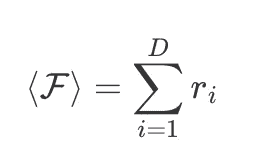
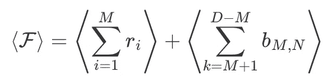
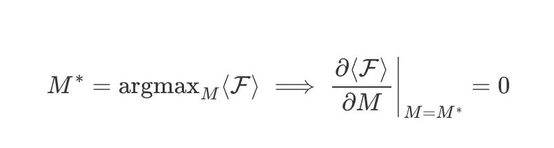
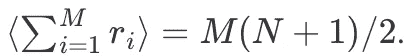
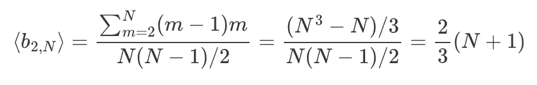
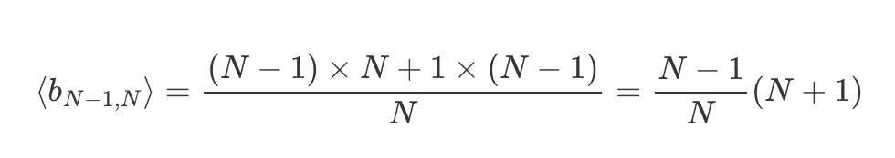
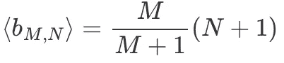
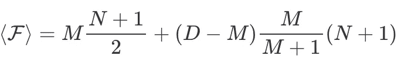
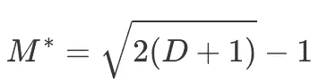
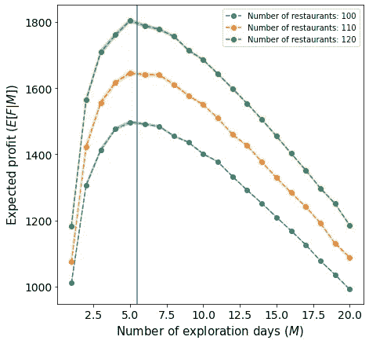

# 费曼的餐馆问题

> 原文：<https://towardsdatascience.com/feynmans-restaurant-problem-57121af0bb92>

## 从 RecSys 的角度介绍和解决费曼的餐馆问题


照片由 [shawnanggg](https://unsplash.com/@shawnanggg?utm_source=medium&utm_medium=referral) 在 [Unsplash](https://unsplash.com?utm_source=medium&utm_medium=referral) 上拍摄

你在度假，接下来的几天你将在太平洋的一个偏远岛屿上度过。这里有几家餐馆，你会喜欢品尝最地道的菜肴。你面临的问题是，先验的你不知道哪些餐厅是你要去享受的，哪些不是，你也找不到 Yelp 上的餐厅，所以你不能用别人的意见来决定去哪些餐厅。还有，餐馆的数量比你要在岛上呆的天数还多，所以你不可能试遍所有的餐馆，找到最好的一家。然而，由于你热爱数学，你决定寻找最佳策略来优化你的假期体验。这就是所谓的**费曼餐厅问题**。

同样的问题可以从餐厅的角度来解释，厨师想向客户推荐菜肴，但他们不知道客户会喜欢或不喜欢哪些菜肴。所以这个问题属于**推荐系统的范畴。**更一般地说，这是从一组评价未知的 *N* 个项目中推荐 *M* 个项目(有重复)的问题。

这篇文章的内容很大程度上受到了[这个解决方案](https://www.feynmanlectures.caltech.edu/info/solutions/restaurant_problem_sol_1.html)的启发。我试图解释一些对我来说晦涩难懂的细节，我还添加了一些情节和代码，让我对这个问题有更多的直觉。[在这里](https://www.feynmanlectures.caltech.edu/info/other/Feynmans_Restaurant_Problem_Revealed.html)你可以阅读更多关于这个问题的历史。

# 数学公式

让我们试着用数学来形式化这个问题。首先，让我们定义 *D* 为你要在这个城市待的天数，定义 *N* 为餐馆的数量。让我们假设你可以根据你的口味对所有的餐馆进行排名，让我们称 *r_i* 对餐馆 *i* 的排名。让我们假设你可以每天去同一家餐馆而不感到厌倦，这意味着如果你知道这个城市最好的餐馆，你会一直去那里。

请注意，因为你不能尝试这个城市的所有餐馆，所以你永远不会知道你是否去过最好的餐馆。

> *注意，你永远不会知道实际的评级 ri。你只有在那一刻才知道一家餐厅是不是最好的。你可以对某个时刻你尝试过的餐馆进行排名，但是这个“部分”排名可能和“绝对”排名不一样。例如，如果你只尝试了 10 家餐馆中的 4 家，你可以得到排名* `*[3, 2, 1, 4, ?, ?, ?, ?, ?, ?]*` *，但实际排名可能是* `*[5, 4, 3, 6, 1, 2, 7, 8, 9]*` *。*

您想要优化的函数是



其中 *r_i* 是您在 *i* 日去过的餐厅评分。

# 解决办法

## 分析的

你在这个城市的每一天都有两种选择:(1)尝试一家新餐馆，或者(2)去你之前去过的最好的餐馆。我们可以把这个问题想成一个*探索-开发*问题，也就是说，你在第一个 *M* 天探索这个城市，之后，在接下来的*D M*个晚上，你总是去那个时刻最好的地方。

因此，我们可以将函数拆分为



其中 *b_M，N* 是你在第 *M* 天尝试过的最好餐厅的排名。

我们方程中唯一的自由参数是 *M* ，所以你要求期望利润最大化的 *M* 的值。这是



对于第一项，应用线性并知道 *< r_i > = (N+1)/2* 我们得到



现在我们需要计算 *⟨b_M,N⟩* ，它是 m 从区间 *(1，N)* 中抽取后得到的期望最大值。

一方面，我们知道如果你只尝试一家餐馆，期望的排名是 *⟨b_1,N⟩ = (N+1) / 2。*另一方面，如果你尝试了所有的餐馆，期望的最高排名当然是 *⟨b_N,N⟩ = N.*

我们还可以计算出 *⟨b_2,N⟩* 在这种情况下，只存在 1 对餐厅，其中 2 是最大值，即您选择餐厅 *(1，2)。*最多只有 2 对餐厅，即 *(1，3)* 和 *(2，3)* 。只有 3 对餐厅，其中最大值为 4，即 *(1，4)* 、 *(2，4)* 、 *(3，4)* 。诸如此类。总共有*N(n1)/2*个可能的对。因此



现在考虑 *⟨b_N−1,N⟩* 。这是，你尝试了城市里所有的餐馆，除了一家。在这种情况下，你会在*n1*种情况下参观最好的餐馆，只有一种情况下你会跳过最好的餐馆。因此，预期值为



从所有这些结果中，人们可以看出模式并猜测



把这些放在一起，我们终于有了



其最大值在



> 注意，结果不依赖于 n。这意味着你不关心城市里有多少不同的餐馆，这听起来——至少对我来说——有点违反直觉。
> 
> *还要注意的是，如果你想在不降低预期利润的情况下尝试这个城市的所有餐馆，你需要在这个城市呆* D≥(N+1)^2/2−1 *天。因此，如果这个城市有 10 家餐馆，你需要在这个城市呆至少 60 天:头 10 天探索这个城市，在接下来的 50 天去最好的餐馆。* **请不要用这些结果来计划你接下来的假期。**

## 数字的

在上一节中，我们导出了问题的解析解。现在让我们运行一些模拟来获得关于这个问题的更多直觉。尤其令人惊讶的是，解决方案并不依赖于 *N* 。所以让我们看看模拟是否支持这种说法。

使用下面的代码片段，可以通过一组参数模拟预期利润 *⟨F⟩*

```
**import** numpy **as** np

**def** **expected_profit**(n_days: int, n_restaurants: int, n_experiments**=**10000):
    """
    Computes the average profit at each 
    possible m \in range(1, n_days) over n_experiments.

    :param n_days: number of times one can visit the restaurant.
    :param n_restaurants: number of restaurants in the city.
    :param n_experiments: number of experiments to perform.
    """

    results **=** {}

    **for** m **in** range(1, n_days **+** 1):
        results[m] **=** []
        **for** i **in** range(n_experiments):
            ranks **=** x **=** list(range(n_restaurants))
            np.random.shuffle(ranks)
            profit **=** sum(ranks[:m]) **+** (n_days **-** m) ***** max(ranks[:m])
            results[m].append(profit)
    results **=** {k: np.mean(v) **for** k, v **in** results.items()}
    **return** results
```

使用这个片段，我们生成了下面的图，使用了 *N=(100，110，120)* 和 *D=10* 。注意三条曲线的最大值是如何重合的，这支持了违反直觉的分析结果。



预期利润与勘探天数。[原著](https://www.amolas.dev/posts/feynman-restaurant-problem/)。

# 结论

在本帖中，我们探讨了费曼的餐馆问题。首先，我们导出了最优探索策略的解析解，然后我们用一些模拟来检验解析结果。尽管这些结果从数学的角度来看是有意义的，但没有一个头脑正常的人会遵循最优策略。这很可能是由我们做出的不切实际的假设造成的，即:你不可能一生中每天都去同一家餐厅而不感到厌倦。一个可能的解决方案是改变一家餐馆的评级，使之与你去过的次数挂钩，即 T21。然而，这超出了本文的范围，我们不打算这样做，但也许它可以作为另一篇文章的灵感。

这个故事最初贴在[这里](https://www.amolas.dev/posts/feynman-restaurant-problem/)。