# 2022 年世界杯:数据驱动的理想球队阵容

> 原文：<https://towardsdatascience.com/fifa-world-cup-2022-a-data-driven-approach-to-ideal-team-line-ups-f4c555dcd7a3>

## 使用 Python 为 2022 年世界杯的每个国家队找到梦之队、最佳阵型和理想的首发 XI


图片来自 Shutterstock，授权给 Frank Andrade

2022 年世界杯已经开始，我们可以从这场比赛的数据中获得许多见解。

像 2022 年世界杯梦之队，每个国家队的最佳 26 人阵容，以及他们理想的首发 XI 都可以使用 Python 获得。

但我们不仅会这么做！我们还将添加一些数据可视化，使这种分析更容易理解，甚至使用 Python 绘制一个具有理想阵容的足球场的图形。

```
**Table of Contents**
1\. [Dataset Overview](#8ac5)
2\. [Adjusting the Dataset FIFA 22 to the World Cup 2022](#a57d)
3\. [The Metric To Use for This Analysis](#409f)
4\. [Dream Team World Cup 2022](#92e8)
5\. [The Players with The Highest Rating on each National Team](#0017)
6\. [The Best 26-Man Squad for each National Team](#4e34)
7\. [Best Starting XI and Formation](#0c8f)
 - [Spain: Best Starting XI (4–2–3–1)](#0690)
 - [Portugal: Best Starting XI (4–2–3–1)](#12f5)
 - [England: Best Starting XI (4–4–2)](#7575)
 - [Brazil: Best Starting XI (4–3–3)](#d734)
 - [France: Best Starting XI (4–2–3–1)](#c481)
 - [Argentina: Best Starting XI (4–3–3)](#90d6)
 - [Germany: Best Starting XI (4–2–3–1)](#9c3c)
```

# 数据集概述

我们将用于此分析的数据来自游戏 FIFA 22，其中包含了世界上大多数足球运动员的信息。你可以点击下载这个数据集[。](https://drive.google.com/drive/folders/15BeVs7h0zDFHNSmZ0Zwyb92uL5L6woXL?usp=sharing)

```
import pandas as pd
import seaborn as sns
import matplotlib.pyplot as plt
sns.set_style('darkgrid')

df = pd.read_csv('players_22.csv', low_memory=False)
```

这个数据集包含 100 多列，但是对于这个分析，我们只使用其中的几列。

```
df = df[['short_name', 'age', 'nationality_name', 'overall', 'potential',
         'club_name', 'value_eur', 'wage_eur', 'player_positions']]
```

需要记住的是,`player_positions`列有多个位置，因此我们应该只选择一个位置进行分析。此外，我们必须丢弃 NaN 数据。

```
# selecting only one position
df['player_positions'] = df['player_positions'].str.split(',', expand=True)[0]

# dropping nan
df.dropna(inplace=True)
```

这里是`df`数据帧此时的样子。

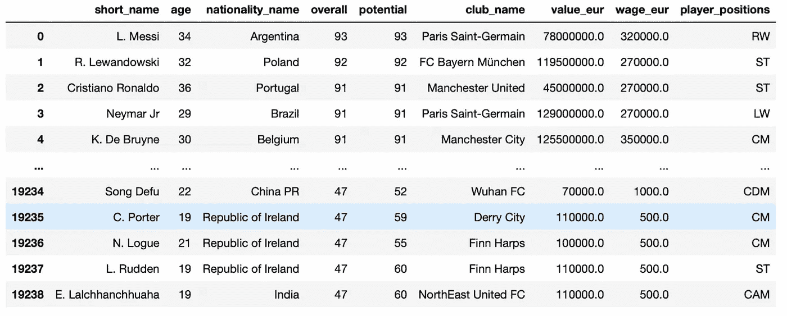

# 根据 2022 年世界杯调整数据集 FIFA 22

现在，我们将调整数据集 FIFA 22 以适应 2022 年世界杯。这意味着我们将只考虑那些有资格参赛的国家，以及那些被召入国家队的球员。

```
# dropping injured players
players_missing_worldcup = ['K. Benzema', 'S. Mané', 'S. Agüero', 'Sergio Ramos', 'P. Pogba',
                            'M. Reus', 'Diogo Jota', 'A. Harit', 'N. Kanté', 'G. Lo Celso', 'Piqué']

drop_index = df[df['short_name'].isin(players_missing_worldcup)].index
df.drop(drop_index, axis=0, inplace=True)

# filtering only national teams in the world cup
teams_worldcup = [
    'Qatar', 'Brazil', 'Belgium', 'France', 'Argentina', 'England', 'Spain', 'Portugal',
    'Mexico', 'Netherlands', 'Denmark', 'Germany', 'Uruguay', 'Switzerland', 'United States', 'Croatia',
    'Senegal', 'Iran', 'Japan', 'Morocco', 'Serbia', 'Poland', 'South Korea', 'Tunisia',
    'Cameroon', 'Canada', 'Ecuador', 'Saudi Arabia', 'Ghana', 'Wales', 'Costa Rica', 'Australia'
]

df = df[df['nationality_name'].isin(teams_worldcup)]
```

# 用于此分析的指标

在这个分析中，我们将使用国际足联对每个球员的评分。评级由`overall`列表示。

让我们按`overall`对数据帧进行排序(如果多个玩家评分相同，我们也将按`potential`和`value_eur`列进行排序)

```
df.sort_values(by=['overall', 'potential', 'value_eur'], ascending=False, inplace=True)
```

这是数据帧现在的样子。

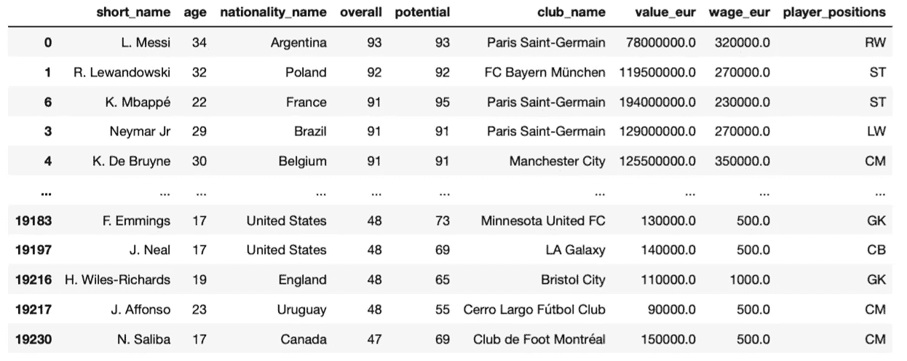

现在，让我们来看看 2022 年世界杯所有球员之间的收视率(又名整体)是如何分布的。

```
import numpy as np
fig, ax = plt.subplots(figsize=(12, 5), tight_layout=True)

sns.histplot(df, x='overall', binwidth=1)

bins = np.arange(df['overall'].min(), df['overall'].max(), 1)
plt.xticks(bins)
plt.show()
```

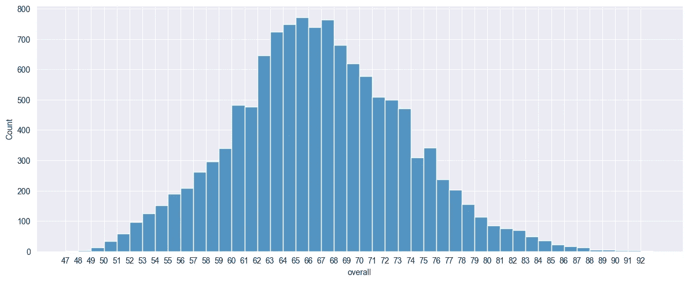

作者图片

似乎大多数玩家都有 65 和 67 的评分。对于我们的梦之队，我们将只考虑每个位置得分最高的球员。

# 2022 年世界杯梦之队

获得梦之队的一个简单方法是删除`player_positions`栏中的所有重复项(T7 是按整体排序的，因此“非重复项”将是那些评分最高的玩家)

```
df.drop_duplicates('player_positions')
```

如果我们只选择列`short_name`、`overall`、`club_name`和`player_positions`，我们会得到下面的数据帧，它代表我们的梦之队。

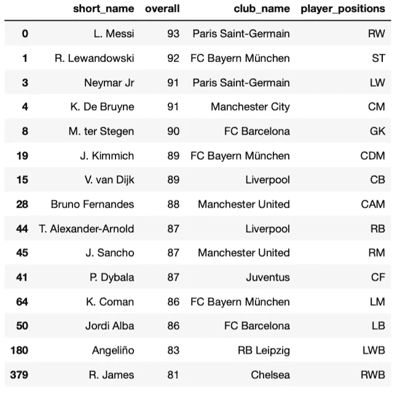

现在我们有了每个位置的最佳球员，我们可以使用[这个 Python 工具](https://trinket.io/python/0813ea96f6)来制作足球场的图形，并选择我们想要的任何球员(您只需要编辑脚本底部的球员姓名)

这是我的梦之队。

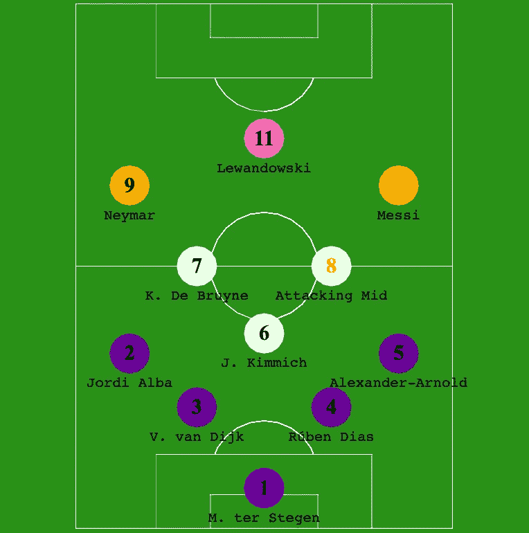

来源:小饰品

# 每个国家队中得分最高的运动员

现在让我们创建一个数据框架`df_best_players`，展示每个国家队的最佳球员。我们将提取`nationality_name`列的前 3 个字母，以了解每个玩家来自哪里。

```
df_best_players = df.copy()
df_best_players = df_best_players.drop_duplicates('nationality_name').reset_index(drop=True)
country_short =  df_best_players['nationality_name'].str.extract('(^\w{3})', expand=False).str.upper()
df_best_players['name_nationality'] = df_best_players['short_name'] +' (' + country_short + ')'
```

让我们制作一个柱状图来可视化`df_best_players`数据框架。

```
fig, ax = plt.subplots(figsize=(10, 6), tight_layout=True)

sns.barplot(df_best_players, x='overall', y='name_nationality',
            palette=sns.color_palette('pastel'), width=0.5)
plt.show()
```

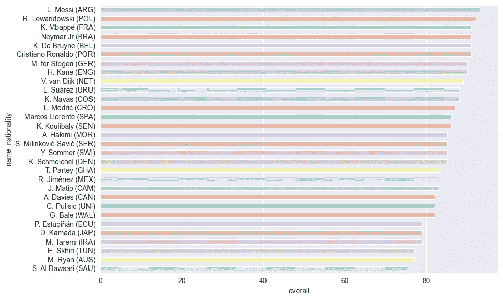

作者图片

# 每个国家队的最佳 26 人阵容

让我们创建一个函数，返回每个国家队的最佳阵容。为此，我们将为每个国家队的每个位置挑选最好的 2 名球员。一旦我们有了最佳阵容，我们将按`player_positions`、`overall`和`potential`排序。

```
def best_squad(nationality):
    df_best_squad = df.copy()
    df_best_squad = df_best_squad.groupby(['nationality_name', 'player_positions']).head(2)
    df_best_squad = df_best_squad[df_best_squad['nationality_name']==nationality].sort_values(['player_positions', 'overall', 'potential'], ascending=False)
    return df_best_squad
```

让我们来看看什么是最适合巴西的球队

```
best_squad('Brazil')
```

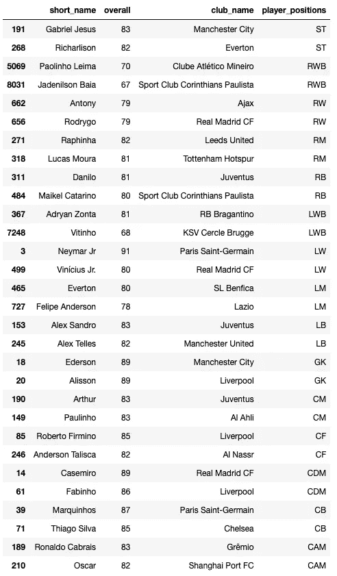

正如你所看到的，我们得到了超过 26 名球员，因为我们每个位置选择 2 名球员，大约有 15 个位置。你可以做一些调整，从这个数据框中只选择 26 名球员。

现在让我们看看每个国家队的平均得分是多少。然后我们按`average_overall`降序排序。

```
average_overall = [best_squad(team)['overall'].mean() for team in teams_worldcup]

df_average_overall = pd.DataFrame({'Teams': teams_worldcup, 'AVG_Overall': average_overall})
df_average_overall = df_average_overall.dropna()
df_average_overall = df_average_overall.sort_values('AVG_Overall', ascending=False)
df_average_overall
```

以下是总体平均得分最高的 10 支国家队。

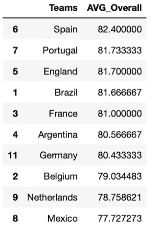

让我们用柱状图来想象一下。

```
fig, ax = plt.subplots(figsize=(12, 5), tight_layout=True)

sns.barplot(df_average_overall[:10], x='Teams', y='AVG_Overall',
            palette=sns.color_palette('pastel'))
plt.show()
```

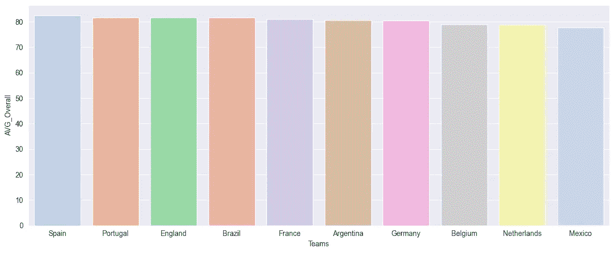

作者图片

# 最佳首发 XI 和阵型

现在我们有了每个国家队最好的 26 人阵容，我们可以看看什么是最好的首发 XI 和阵型。

这是我想出来的所有形式(如果你愿意，你可以添加更多)

```
dict_formation = {
    '4-3-3': ['GK', 'RB', 'CB', 'CB', 'LB', 'CDM', 'CM', 'CAM', 'RW', 'ST', 'LW'],
    '4-4-2': ['GK', 'RB', 'CB', 'CB', 'LB', 'RM', 'CM', 'CM', 'LM', 'ST', 'ST'],
    '4-2-3-1': ['GK', 'RB', 'CB', 'CB', 'LB', 'CDM', 'CDM', 'CAM', 'CAM', 'CAM', 'ST'],
}
```

现在我们创建一个`best_lineup`函数，根据我们想要的阵型返回最佳起始 XI。

```
def best_lineup(nationality, lineup):
    lineup_count = [lineup.count(i) for i in lineup]

    df_lineup = pd.DataFrame({'position': lineup, 'count': lineup_count})
    positions_non_repeated = df_lineup[df_lineup['count'] <= 1]['position'].values
    positions_repeated = df_lineup[df_lineup['count'] > 1]['position'].values

    df_squad = best_squad(nationality)

    df_lineup = pd.concat([
        df_squad[df_squad['player_positions'].isin(positions_non_repeated)].drop_duplicates('player_positions', keep='first'),
        df_squad[df_squad['player_positions'].isin(positions_repeated)]]
    )
    return df_lineup[['short_name', 'overall', 'club_name', 'player_positions']]
```

最后，让我们循环遍历世界杯前 7 名球队，返回平均得分最高的阵型。

```
for index, row in df_average_overall[:7].iterrows():
    max_average = None
    for key, values in dict_formation.items():
        average = best_lineup(row['Teams'], values)['overall'].mean()
        if max_average is None or average>max_average:
            max_average = average
            formation = key
    print(row['Teams'], formation, max_average)
```

太好了！现在我们有了每个国家队的最佳阵型。

```
Spain 4-2-3-1 85.1
Portugal 4-2-3-1 84.9
England 4-4-2 84.45454545454545
Brazil 4-3-3 84.81818181818181
France 4-2-3-1 83.9
Argentina 4-3-3 83.54545454545455
Germany 4-2-3-1 84.1
```

让我们来看看什么是最适合西班牙、葡萄牙、英国、巴西、法国、阿根廷和德国的 XI。

## 1.西班牙:最佳开局 Xi(4-2-3-1)

```
best_lineup('Spain', dict_formation['4-2-3-1'])
```

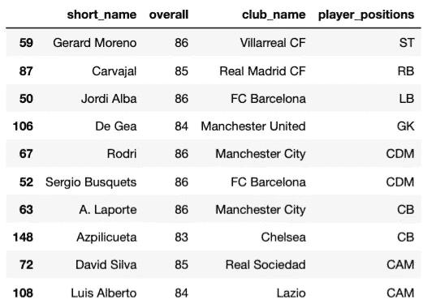

## 2.葡萄牙:最佳开局 Xi(4-2-3-1)

```
best_lineup('Portugal', dict_formation['4-2-3-1'])
```

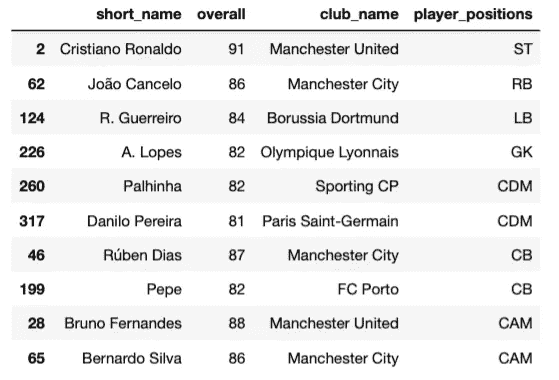

## 3.英国:最佳首发 Xi(4-4-2)

```
best_lineup('England', dict_formation['4-4-2'])
```

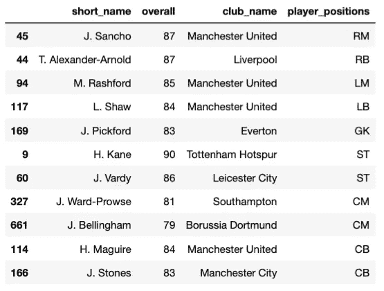

## 4.巴西:最佳开局 Xi(4-3-3)

```
best_lineup('Brazil', dict_formation['4-3-3'])
```

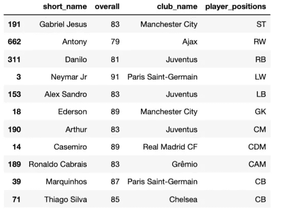

## 5.法国:最佳开局 Xi(4-2-3-1)

```
best_lineup('France', dict_formation['4-2-3-1'])
```

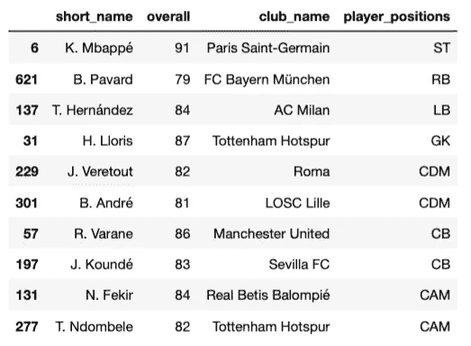

## 6.阿根廷:最佳开局 Xi(4-3-3)

```
best_lineup('Argentina', dict_formation['4-3-3'])
```

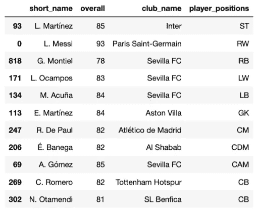

## 7.德国:最佳开局 Xi(4-2-3-1)

```
best_lineup('Germany', dict_formation['4-2-3-1'])
```

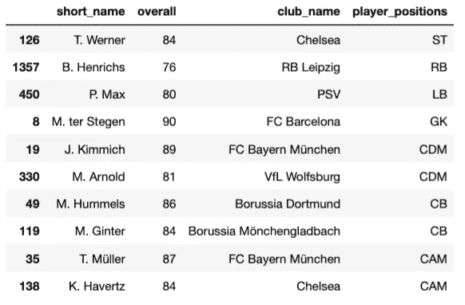

就是这样！你可以在我的 [GitHub](https://github.com/ifrankandrade/fifa-world-cup-2022-prediction) 上找到完整的代码。

用 Python 学习数据科学？ [**加入我的 20k+人电子邮件列表，获取我的免费 Python for Data Science 备忘单。**](https://frankandrade.ck.page/26b76e9130)

如果你喜欢阅读这样的故事，并想支持我成为一名作家，可以考虑报名成为一名媒体成员。每月 5 美元，让您可以无限制地访问数以千计的 Python 指南和数据科学文章。如果你使用[我的链接](https://frank-andrade.medium.com/membership)注册，我会赚一小笔佣金，不需要你额外付费。

[](https://frank-andrade.medium.com/membership) [## 通过我的推荐链接加入媒体——弗兰克·安德拉德

### 作为一个媒体会员，你的会员费的一部分会给你阅读的作家，你可以完全接触到每一个故事…

frank-andrade.medium.com](https://frank-andrade.medium.com/membership)