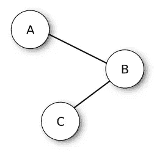
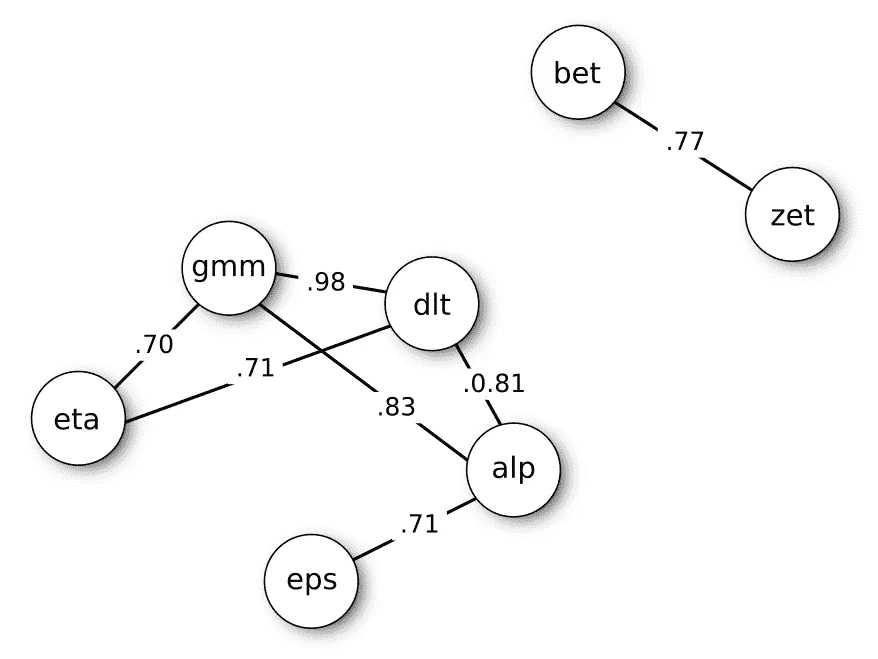
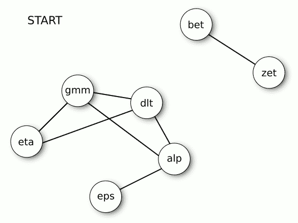

# 与二重身战斗

> 原文：<https://towardsdatascience.com/fighting-doppelg%C3%A4ngers-2fc28762e169>

## 如何去除数据中的邪恶双胞胎，减少特征空间


图片由[艾托夫](https://pixabay.com/users/aitoff-388338/)在 [Pixabay](https://pixabay.com/photos/stormtrooper-star-wars-lego-storm-1343772/) 上拍摄

## 摘要

给定一个包含许多变量的大型数据集，其中一些变量可能代表相同的现象，或者彼此带来重叠的信息。面对这个问题的一个常见的预处理策略是分析相关性。在本文中，我描述了一种策略，用于扫描线性相关性网络，搜索要保留的最佳变量，并丢弃多余的变量。此外，我提供了一个 R 包来轻松地执行这项工作。

当处理由记录机械事件的传感器产生的数据时，包含成百上千个变量的大型数据集是常见的。在这些情况下，许多变量可以作为预测某些目标度量的候选变量。然而，尤其是在工业环境中，数据可以包括完全**线性相关**或非常相关的变量。

例如，传感器可以从相同的过程中提取几个特征，作为相同基的线性变换(如一组记录的总和、它们的平均值等)。).在其他情况下，有真正不同的测量，但本质上相关，或代表同一现象的两个相反方面(想象一种化学混合物的两个互补元素)。

非常相关的变量是多余的，通常它们不会带来额外的信息。而且，完全因变量会让一些机器学习算法崩溃。一般来说，这些“分身”使模型构建过程变得复杂，增加了计算量，在某些情况下会产生过度拟合。

所以，问题是:如何修剪数据集以去除邪恶的二重身？

# 设置相关性的阈值

我们用来识别重复或近似重复变量的有力武器是线性相关指数。

当两个变量的相关性为~|1|时，保留其中一个变量从纯统计学的角度来看是无关紧要的。

当相关性低于|1|时，情况变得复杂，但是仍然相关，并且基于理论的选择是不切实际的。在这些情况下，我们需要一个标准来确定相关性**是否相关**。一种策略是对相关值设置阈值。

给定一个阈值，我们可以**关注**强关系来实施修剪策略。

# 修剪策略

修剪的关键思想是丢弃尽可能多的变量，保留尽可能多的信息。

想象一种情况，其中三个变量 A、B 和 C 有很强的关系。b 与 A 和 C 都具有超过阈值的相关性，而 A 和 C 彼此具有低于阈值的相关性。下图恢复了这些关系，将每个变量表示为网络的一个节点，如果两个变量的相关性高于设定的阈值，则连接这两个变量。



图片来自作者——在 CC0 许可下发布

面对这种情况，修剪的方法可以是去掉 *B* ，保留相关性较低的 *A* 和 *C* 。然而，还有一种更为节俭的方法:只保留 *B* ，去掉 *A* 和 *C* 。 *B* 可以被认为是网络的**代表**，它可以作为整个社区的代言人。

因此，正如您所看到的，选择并不是唯一的。

为了更好地理解这两种方法之间的差异，我引入了一个具有更复杂关系的数据集。

# 一个更复杂的例子

下图是七个模拟变量( *alpha* 、 *beta* 、 *gamma* 、 *delta* 、 *epsilon* 、 *zeta* 、 *eta* )得到的网络关联。变量在图中的空间分布是根据它们之间关系的强度:相邻的变量之间的相关性更强。仅表示高于**阈值|0.7|** 的关系。

源数据在我的 R 包[分身](https://github.com/DavideMassidda/doppelganger)中包含的数据帧*测量*中可用。



图片来自作者——在 CC0 许可下发布

我手工构建了上面的图，但是如果你是一个 R 用户，可以考虑使用包`[qgraph](http://sachaepskamp.com/qgraph/examples)`将一个关联矩阵可视化为一个网络。如果你是 Python 用户，我建议看一下[这篇关于 TDS](/visualizing-networks-in-python-d70f4cbeb259) 的文章。从现在开始，我使用 R 语言来构建例子。

我在下面报告完整的相关矩阵。

```
r <- cor(doppelganger::measures)
diag(r) <- NA
round(r, 3)
```

```
 alpha  beta gamma delta epsilon  zeta   eta
alpha      NA 0.129 0.833 0.815   0.715 0.207 0.645
beta    0.129    NA 0.152 0.108   0.056 0.770 0.097
gamma   0.833 0.152    NA 0.984   0.620 0.193 0.702
delta   0.815 0.108 0.984    NA   0.588 0.167 0.711
epsilon 0.715 0.056 0.620 0.588      NA 0.072 0.519
zeta    0.207 0.770 0.193 0.167   0.072    NA 0.137
eta     0.645 0.097 0.702 0.711   0.519 0.137    NA
```

该图显示了两个社区的存在:一个是对 *zeta* - *beta* 的社区，另一个包括剩余的变量。与前一个天真的例子相比，情况更加混乱。如何进行？

# 区分变量的优先级

我们可以根据变量的**中心度**对变量进行排序，中心度意为一个节点与其他节点的连接强度。最中心的节点对应于网络中最具代表性的变量。

我们可以将中心度计算为与变量相关的相关性绝对值的平均值。下面的 R 代码计算每个节点的中心性，并按降序排列。

```
sort(colMeans(abs(r), na.rm=TRUE), decreasing=TRUE)
```

```
 gamma     delta     alpha       eta   epsilon      zeta      beta 
0.5805754 0.5620824 0.5572697 0.4685961 0.4282394 0.2575334 0.2188217
```

根据中心度的排序允许我们在选择保留什么和丢弃什么时对变量进行**优先级排序。我们面前有两条路:**

1.  保留最中心的变量，以它们的代表性的名义(**中心性**准则)；
2.  保留最外围的变量，以它们独立的名义(**外围性**判据)。

无论如何，我们可以应用相同的修剪程序，但是:

> 在“中心性”情况下，我们按照中心性程度向量以降序扫描变量，而在“边缘性”情况下，我们按照升序扫描变量。

我们开始保留排名中的第一个变量，去掉它的二重身。然后，让我们保留第二个变量，去掉它的二重身。等等，直到结束。很简单，不是吗？

# 算法应用

现在，将这个过程应用到上面显示的例子中。我描述了遵循中心性标准的操作。

**第一步。**最中心的变量是*伽马*。因此，我们“开启”*伽马*和“关闭”*德尔塔*、*阿尔法*和*埃塔*，它们与*伽马*具有过阈值相关性。在下图中，“关闭”的变量用浅灰色标记，它们的修正用虚线表示。

**第二步。**在*伽玛*之后，按照优先级顺序，第一个未被丢弃的变量是*ε*。然而，*ε*与其余变量的相关性没有超过阈值。它的复制品已经被丢弃，所以不需要任何操作。

**步骤三。**以下变量为*ζ*，与 *beta* 有很强的相关性。所以，我们去掉了*贝塔*，保留了*泽塔*。



图片来自作者——在 CC0 许可下发布

在迭代结束时，我们将继续使用*伽玛*、*ε*和*泽塔*。三个变量而不是七个。

# 中心性对边缘性

中心性标准利用了变量总体中孤立社区的存在。从理论的角度来看，当我们在社区内部有强连接而在社区之间有弱连接时，这种方法发挥了最大的作用。相反，外围性标准可以在包含一些子群的更同质的网络中发挥最大作用。

中心性标准倾向于保留更少但更相关的变量。边缘性标准倾向于保留更多的变量，但相关性较低，然而，它们不一定是每个亚组的最具代表性的。

# R 的二重身套装

使用 R 包[二重身](https://github.com/DavideMassidda/doppelganger)只用一行代码就可以完成前面的步骤。

加载包和数据集:

```
library(doppelganger)
measures # comes with the package

# A tibble: 100 × 7
     alpha     beta   gamma  delta epsilon    zeta     eta
     <dbl>    <dbl>   <dbl>  <dbl>   <dbl>   <dbl>   <dbl>
 1  0.0185 -0.564   -0.526  -0.368  -0.934 -0.878   0.0913
 2  0.120   0.00233 -0.414  -0.515  -0.193 -0.464  -0.324 
 3 -0.767   0.0641  -1.51   -1.26   -1.25  -0.0825 -1.70  
 4 -2.12    0.105   -2.38   -2.37   -1.75  -0.323  -0.426 
 5 -1.48   -0.126   -0.681  -0.340  -1.87   0.0678 -0.791 
 6  1.69    0.268    2.39    2.59    1.06   0.115   1.44  
 7  1.26   -1.17     0.290   0.231   1.93  -0.683  -0.253 
 8  1.23    1.40     1.10    0.997   0.717  1.07    0.265 
 9  0.295  -0.0263  -0.0221 -0.115  -0.125  0.179  -0.978 
10  0.157   0.268    0.215   0.454   0.531  1.25   -0.0989
# … with 90 more rows
```

再现上述变量的修剪过程:

```
dg <- doppelganger(measures, priority="c", threshold=0.7)
```

同名函数`doppelganger`创建一个包含一些槽的列表对象，包括`keep`和`drop`，分别收集变量的名字来保存和删除。

```
dg$keep

[1] "gamma"   "epsilon" "zeta"
```

如果您需要检查特定变量的相关性，该包提供了函数`inspect_corrs`:

```
inspect_corrs(dg, "gamma")

# A tibble: 6 × 3
  variable is_alias   cor
  <chr>    <lgl>    <dbl>
1 delta    TRUE     0.984
2 alpha    TRUE     0.833
3 eta      TRUE     0.702
4 epsilon  FALSE    0.620
5 zeta     FALSE    0.193
6 beta     FALSE    0.152
```

# 非缺失数据的加权

软件包`doppelganger`通过用可用于指数计算的观察值数量对每个相关性进行加权来计算中心度。这种策略在存在缺失数据的情况下是有效的，因为它允许“奖励”具有许多与其他变量的填充记录相匹配的填充记录的变量。

我们希望保留最好的变量，但也保留尽可能多的记录！

对候选预测器池的修剪可以有效地帮助建立一个简单有效的模型，尤其是用于推理目的。最佳实践是将选择程序建立在潜在预测者的理论假设或预测能力的基础上。然而，通常，由于缺乏信息或数据集的维度，这是不切实际的。在这些情况下，一个不太精确的方法——就像本文中描述的方法——可以派上用场。