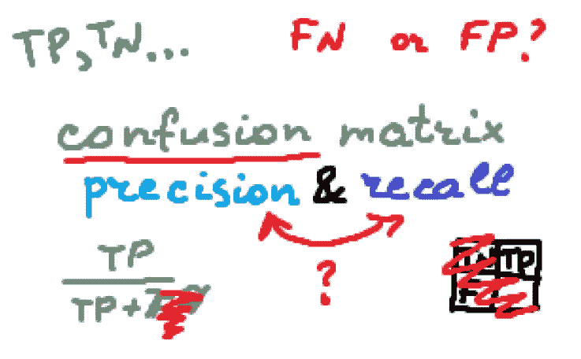
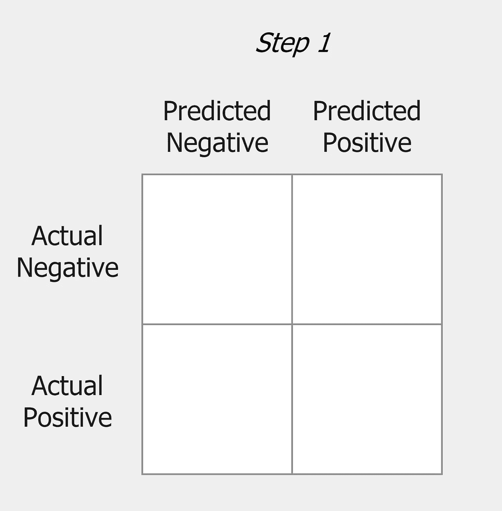
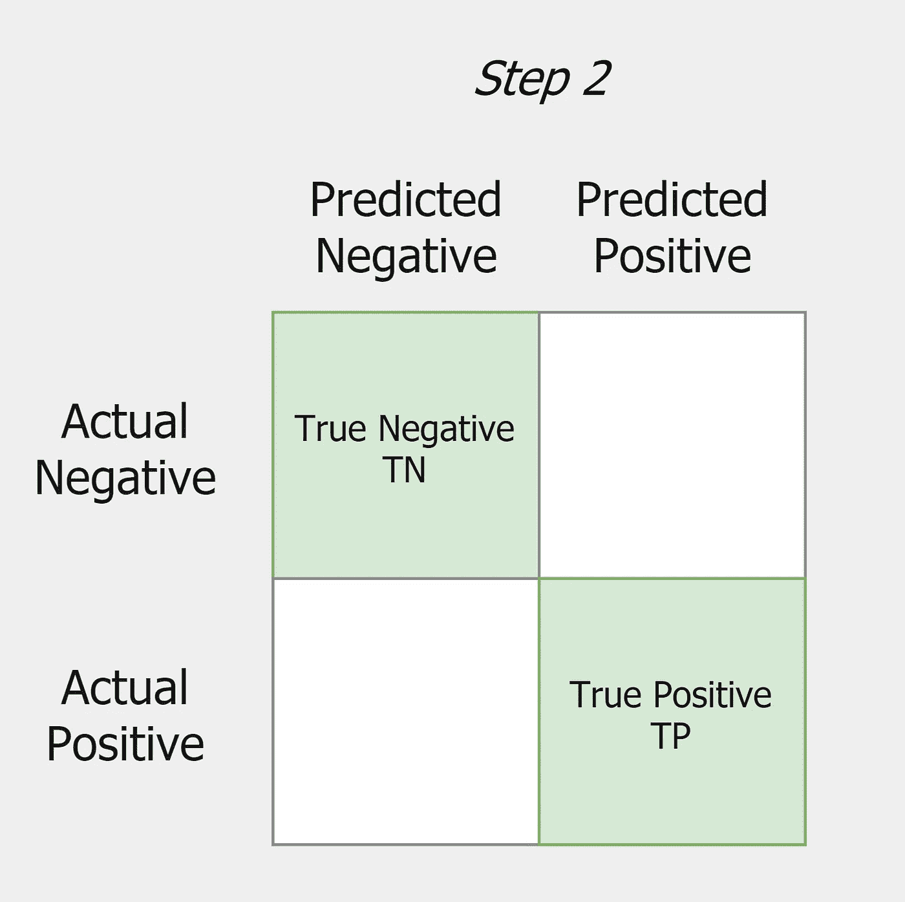
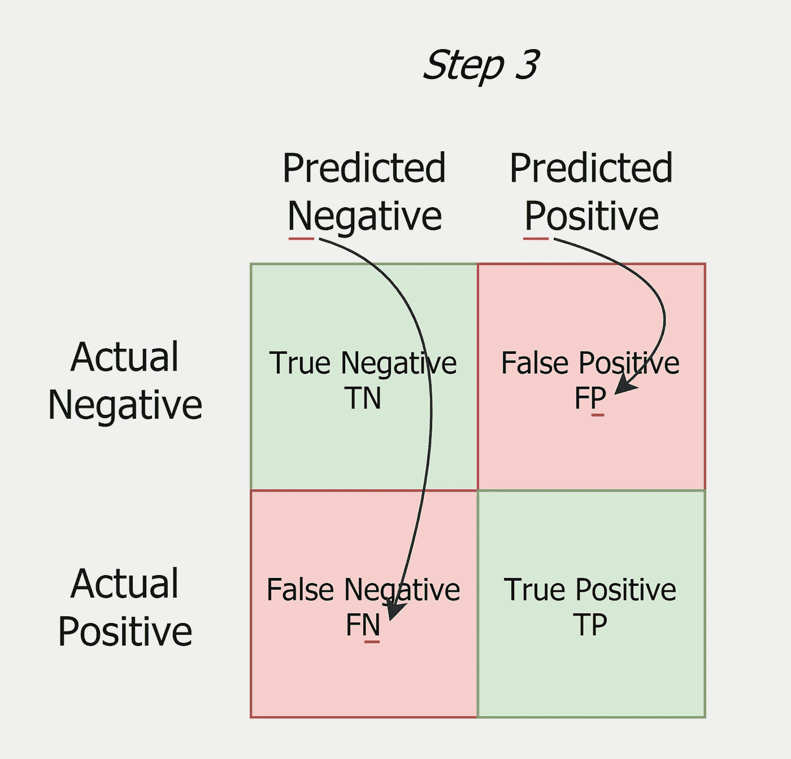
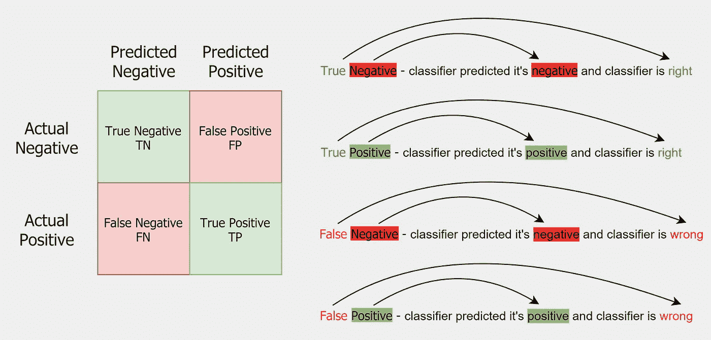
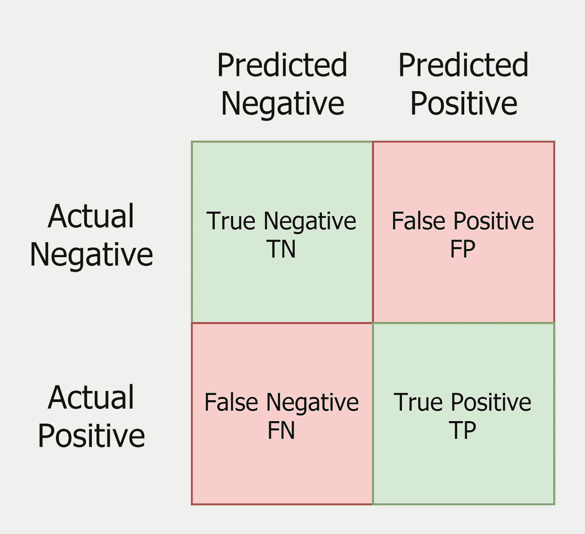
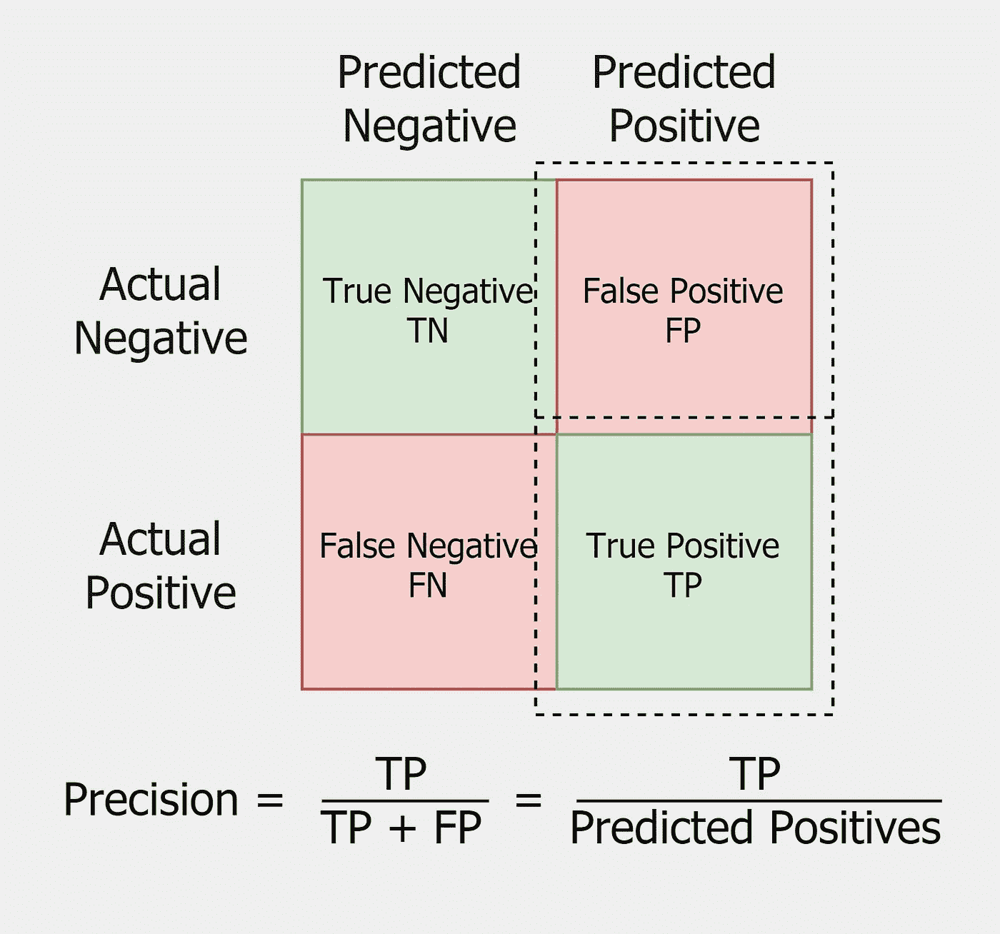
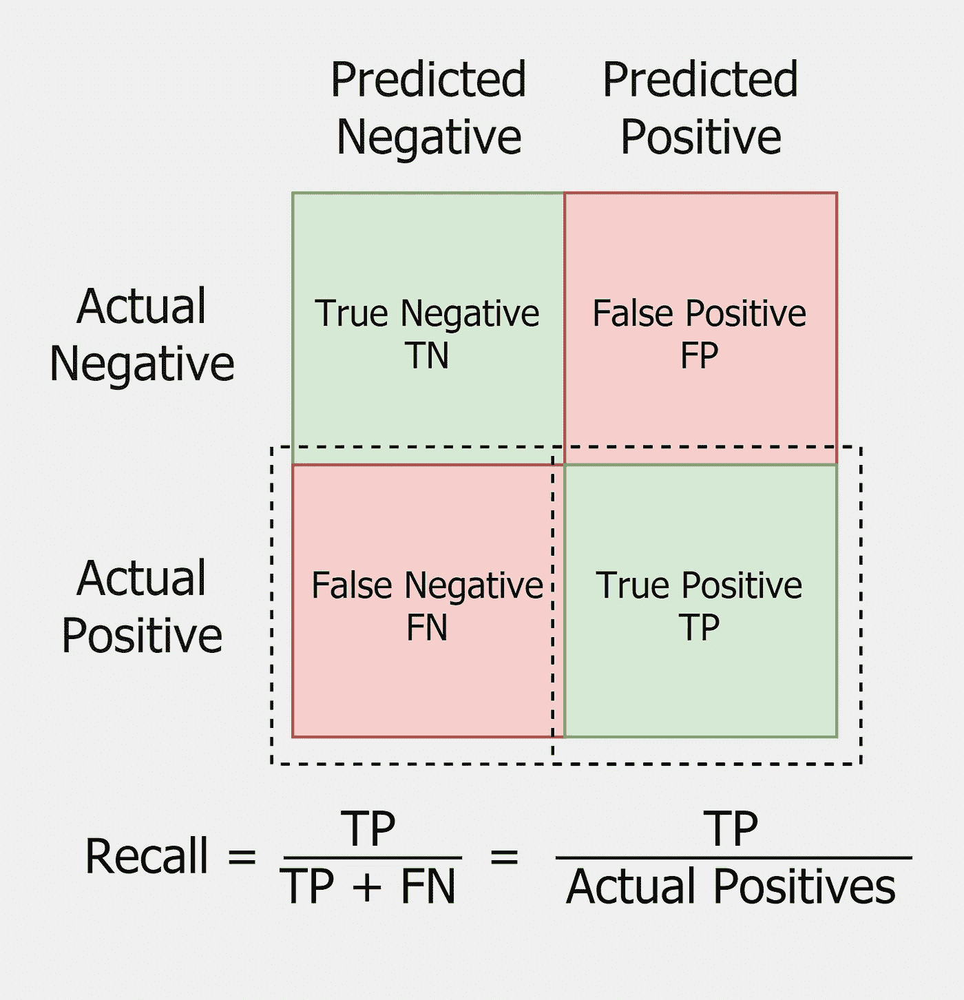
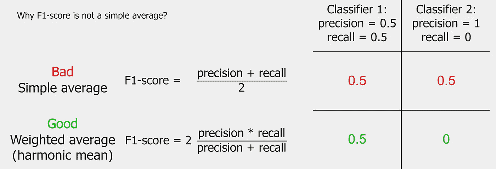
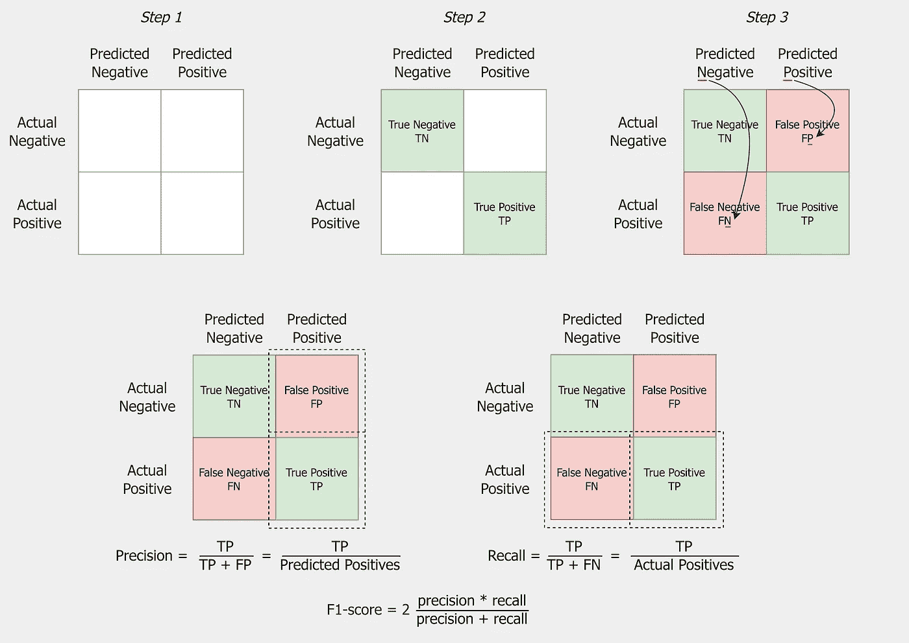

# 最后，记住什么是精确和回忆，不要在面试中害怕这些问题

> 原文：<https://towardsdatascience.com/finally-remember-what-precision-and-recall-is-and-stop-being-afraid-of-these-questions-in-f61981930c67>

# 最后，记住什么是精确和回忆，不要在面试中害怕这些问题

## 一个直观的指南，一步一步地绘制混淆矩阵，并推导出精确度、召回率和 F1 分数的定义

预览。作者图片

理解混淆矩阵、精确度和召回率的概念对于评估任何分类算法的质量是最重要的。而且虽然这在现实任务中并不那么重要(首先，你会在 90%的情况下使用 F1-score，其次，你会花 10 秒钟谷歌一下来刷新你的记忆)，但是理解这些东西还是很有用的。另外，这个问题在数据科学和机器学习职位面试中极其常见。

我(以及我认识的一些更有经验的人)仍然需要花几秒钟来记住什么是什么。因此，我向你展示我的一步一步的指导，如何记住如何绘制混淆矩阵，并从中推导出精确度、召回率和 F1 分数的定义。

如果你已经知道什么是精确或者回忆，但是仍然经常在定义上感到困惑，你应该读读这篇文章。

这篇文章并不解释什么是精确或召回。这篇文章解释了如何记住什么是精确或回忆。

# **一步一步画困惑矩阵**

当我们开始画混淆矩阵时，让我们画一个 2x2 的矩阵。

我们记得在某个地方一定有一个实际的类，和一个预测的类。取决于你如何排列它们，你的矩阵可能会相对于主对角线镜像。请记住，你在其他来源看到的矩阵可能与我画的不同。

为了避免混淆，让我们将**预测的类放在**的上面(使用直觉，单词*P*redirect 中的字母 *P* 是由一个竖条组成的，上面有一个圆圈**)。**

**之后，让第一个元素(实际类的情况下为上，预测类的情况下为左)为负例，第二个元素(实际类的情况下为下，预测类的情况下为右)为正例。这里我用的直觉是，我们是从左到右，从上到下，从一个较小的数向一个较大的数移动(而负类是 0，正类是 1)。**

****

**画出混淆矩阵。第一步。作者图片**

**第二步也很简单——让我们填充主对角线上的元素。这些是我们的分类器正确识别的元素——真阳性和真阴性(*真*在这里意味着我们的分类器是*对*)。**

****

**画出混淆矩阵。第二步。作者图片**

*   ****真阳性(TP)** 是被分类为阳性且实际为阳性的元素——预测*阳性*和实际*阳性*。**
*   ****真阴性(TN)** 是已经被归类为阴性的元素，实际为阴性——预测*阴性*和实际*阴性*。**

**之后，我们还要在矩阵中放置假阳性和假阴性(*假*这里指我们的分类器是*错的*)。这就是问题开始出现的地方。**

**为了记住假阳性和假阴性的位置，记住在这些预测中**分类器是错误的**。这意味着，尽管它们不正确，但它们是*预测的*值，因此它们对应于*预测的*类。**

****

**画出混淆矩阵。第三步。作者图片**

**让我们给出正式的定义:**

*   ****假阳性(FP)** (也称为 *I 型错误*)是一个已经被归类为阳性但实际为阴性的元素——预测*阳性*，实际*阴性*。**
*   ****假阴性(FN)** (又称 *II 型错误* ) 是已经被归类为阴性但实际为阳性的元素——预测*阴性*，实际*阳性*。**

**为了快速理解它们之间的区别，不至于混淆，只要记住**分类器的预测是包含在题目中的，并且这个预测是错误的**就够了。比如假*正*。它是*正的*，因为我们的分类器是这样预测的，但它是错误的。所以预测类是*正*，而实际类不是正的，所以*负*。**

**为了不混淆 TN、TP、FN 和 FP，问两个问题就足够了:**

1.  **分类器预测了什么？*负或正*。**
2.  **分类器正确吗？*真或假*。**

**两个答案都包含在问题中。**

****

**如何永远不要混淆 TN，TP，FN，FP？作者图片**

**现在我们有一个现成的混淆矩阵，这已经是一半了！**

****

**混乱矩阵。作者图片**

# ****如何停止恐惧，开始理解精密和回忆****

**精确度和召回率公式都很简单。它是真阳性与真阳性加上某个值的比率。分母(真阳性加上某个值)是实际阳性或预测阳性。那有什么意义？让我们弄清楚。**

## ****精度公式****

**记住精度公式中的所有项都包含字母 *P* ( *P* 精度— *P* ，很容易记忆)。
所以精度是 *TP* 与 *(TP + FP)* 的比值，其中 *(TP + FP)* 是*预测阳性*。**

****

**精确公式。作者图片**

## ****回忆公式****

**另一方面，召回是 *TP* 与 *(TP + FN)* 的比值，其中 *(TP + FN)* 是*实际阳性*。**

****

**回忆公式。作者图片**

## ****这些到底有什么意义？****

**我不认为有必要给出奇怪的定义来解释一切，但只会使其复杂化(比如*回忆是一种检测概率*)。我不否认它们是有用的，但它们往往弊大于利。最后，你可以很容易地发现他们在阅读其他文章。**

**我会尽可能直观地解释一切。我建议你在阅读下面两条语句时，保持精确度，并在眼前回忆公式。**

*   **如果 FP = 0，则精度等于 1。
    所以**精度高**关系到****假阳性率低**或者说**I 型错误量小**。****
*   ****如果 FN = 0，召回等于 1。
    所以**高召回率**与**低假阴性率**或**少量 II 型错误有关。******

****如何记住这些？高精度—很少的假阳性—很少的 I 型错误。记住精度总是精度-召回对中的第一个(*I 类型错误*)；我们已经记住的是——精度公式中的所有项都包含字母 *P* (很少有误*正*)。****

****这是让您理解何时使用特定指标的基础。****

*   ****如果 **FP 价格高**，用**精度**(预测借款人会还贷，虽然他破产了；“好”的借款人是正类)；****
*   ****而如果 **FN 价格高**，用**召回**(预测病人是健康的，虽然他生病了；病是正类)。****

****这些定义取决于对类的选择(哪个类是负的，哪个是正的)——所以**要时刻注意这个**。例如，交换上面例子中的类，看看会发生什么。****

## ****f1-分数****

****F1-score 是一种将精确度和召回率结合成一个指标的方法。我们需要这个，因为只用一个数字评估质量很容易，而不是两个。我们不能使用简单平均值，因为它不考虑极小的值。****

****例如，如果我们让 F1-score 是精度和召回率的平均值，则相同的值得到:
精度= 0.5 和召回率= 0.5 的分类器 1 和
精度= 1 和召回率= 0 的分类器 2。
两个分类器都将得到 F1 分数= 0.5，尽管很明显第一个分类器要好得多。当然，这是个玩具例子，但离真相不远。****

****事实上，我们想要这样一个表达式，如果两个元素中至少有一个比一个小得多，那么这个表达式就是小的。这样的表达式称为*加权平均值*，或*调和平均值*。****

********

****f1-得分公式。作者图片****

****这个表达式的分子是乘积，这是合乎逻辑的。如果其中一项比一项小得多，那么它们的乘积也将分别比一项小得多。需要乘以 2，以便 F1 分数像所有常用指标一样从 0 变为 1。****

****请记住，还有其他分类指标。比如非常受欢迎的**AUC-ROC**—*ROC(受试者工作特性)曲线下的区域*(你可以在这里[了解一下](/understanding-auc-roc-curve-68b2303cc9c5))或者不太受欢迎的 **AUC-PRC** — *精确召回曲线下的区域*。****

# ******结论******

****让我总结一下我们下面列出的所有概念:****

*   ******真阳性(TP)** 是被分类为阳性且实际为阳性的元素——预测*阳性*，实际*阳性*；****
*   ******真阴性(TN)** 是已经被归类为阴性的元素，实际上是阴性的——预测*阴性*和实际*阴性*；****
*   ******假阳性(FP)** (也称为 *I 型错误*)是已经被分类为阳性但实际为阴性的元素——预测*阳性*，实际*阴性*；****
*   ******假阴性(FN)** (也称 *II 型错误* ) 是已经被归类为阴性但实际为阳性的元素——预测*阴性*，实际*阳性*；****
*   ****高**精度**意味着**低 FP 率**(少数 *I 型错误*)；****
*   ****高**召回**意味着**低 FN 率**(少数 *II 型错误*)；****
*   ******F1-score** 是一个将精度和召回率结合成一个数字的好方法。****

********

****总结。作者图片****

## ****可能对你有用的资源****

*   ****[维基百科关于精度和召回的文章](https://en.wikipedia.org/wiki/Precision_and_recall)****
*   ****[谷歌的机器学习速成班](https://developers.google.com/machine-learning/crash-course/classification/precision-and-recall)****
*   ****[Scikit 学习官方文档](https://scikit-learn.org/stable/auto_examples/model_selection/plot_precision_recall.html)****

# ****感谢您的阅读！****

*   ****我希望这些材料对你有用。[在 Medium 上关注我](https://medium.com/@andimid)以获得更多类似的文章。****
*   ****如果您有任何问题或意见，我将很高兴得到任何反馈。在评论中问我，或者通过 [LinkedIn](https://www.linkedin.com/in/andimid/) 或 [Twitter](https://twitter.com/dimid_ml) 联系。****
*   ****为了支持我作为一名作家，并获得数以千计的其他媒体文章，使用[我的推荐链接](https://medium.com/@andimid/membership)获得媒体会员资格(不收取额外费用)。****