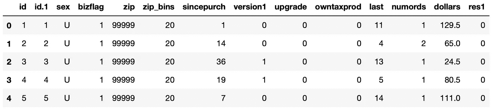
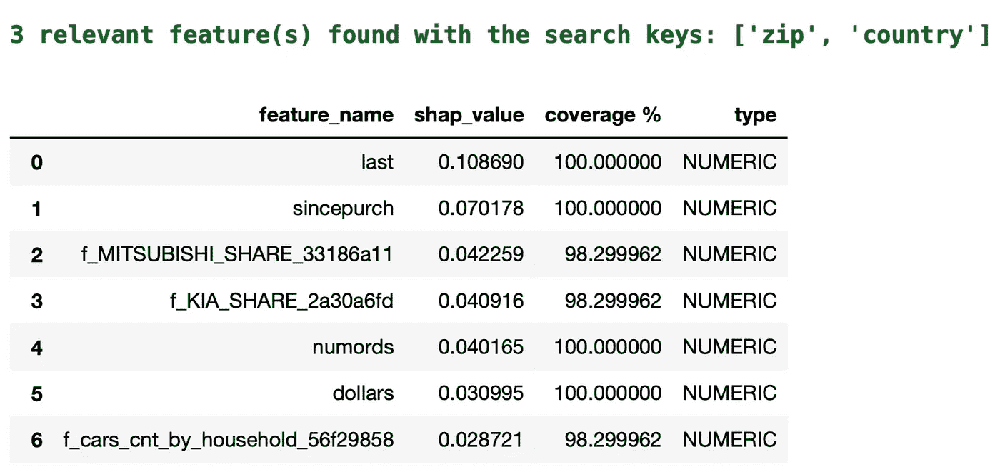
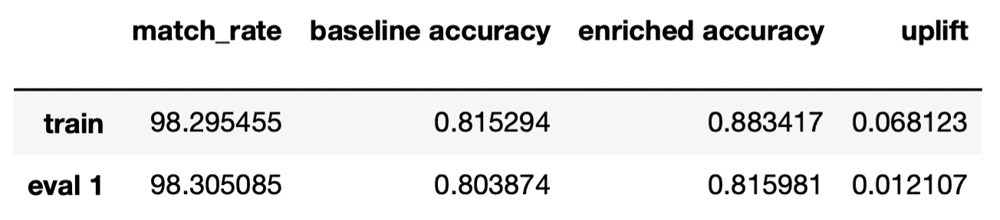

# 使用 Upgini 查找机器学习模型的信息特征

> 原文：<https://towardsdatascience.com/find-informative-features-for-machine-learning-models-with-upgini-17489158ffaa>

## 用于丰富特性的 Python 库


Kushagra Kevat 在 [Unsplash](https://unsplash.com/s/photos/boost?utm_source=unsplash&utm_medium=referral&utm_content=creditCopyText) 上拍摄的照片

特征工程是构建机器学习模型的重要组成部分。我们通常会花费大量时间来寻找新的功能，为机器学习模型增加信息能力。

找到一个有助于预测目标变量的特征并不是一件容易的事情。我们最终可能会创建出对模型没有或增加很少价值的特性。另一方面，如果我们最终创建了一个增强模型的准确性和健壮性的特征。找到这样的特征几乎总是比超参数优化更有帮助。

没有免费的午餐，所以我们可能需要搜索大量的数据源或执行广泛的探索性数据分析，以便能够找到将产生重大影响的功能。

[Upgini](https://upgini.com/) 正是为此目的而创建的开源 Python 库。它所做的是搜索成千上万的公共和社区数据源，然后创建将提高模型性能的要素。

特征工程可以被认为是一个两步任务。第一步是找到数据(即特征)，第二步是检查它与问题的相关性。Upgini 完成了这两个步骤。它不仅发现特征，而且评估它们。

Upgini 的 enricher 对象返回现有功能和新功能的 SHAP 值，以便我们了解新功能有多有用。SHAP 值经常用于机器学习模型的可解释性和可解释性。

让我们看一个例子来演示如何使用 Upgini 来丰富特性。第一步是安装 Upgini，可通过 pip 完成，如下所示:

```
pip install upgini
```

我们将使用 OpenML 网站上有 [CCO](https://creativecommons.org/share-your-work/public-domain/cc0/) 许可的 [intuit](https://www.openml.org/search?type=data&status=any&id=41041&sort=runs) 数据集。该任务是电子邮件响应预测，因此数据集包含一些要素和一个二进制目标变量。我们将使用 Pandas 来读取和清理数据集。

```
import pandas as pddata = pd.read_csv("csv_result-intuit.csv")data.head()
```



(图片由作者提供)

res1 是目标变量，取值为 0 和 1。数据集需要清理一下。

*   id 功能是多余的，因此我们将删除它们。
*   邮政编码 99999 无效，因此我们也将删除这些行。

```
data = data.drop(["id","id.1"], axis=1)data = data[data.zip != 99999]
```

## 搜索关键字

Upgini 通过搜索关键字找到特征。它目前支持以下功能:

*   日期/日期时间
*   邮政编码
*   国家
*   电话号码
*   散列电子邮件
*   IP 地址

当创建一个 enricher 对象时，我们需要指出包含搜索关键字的列，在我们的例子中是邮政编码。需要提及的重要一点是，在使用邮政编码时，我们还需要定义国家。因此，我们将创建一个列来显示这些邮政编码所在的国家，即美国。

```
data["country"] = "US"
```

## 数据清理和预处理

有些行具有重复的特征值，但目标值不同。我们还将使用 Pandas 的删除重复项功能来删除它们。

```
cols = list(data.columns)
cols.remove("res1")data = data.drop_duplicates(subset=cols)
```

原始数据集包含 20000 个观察值(即行)，就目标值而言，这是非常不平衡的。大约 95%的目标值为 0，这意味着没有响应。处理不平衡数据集有不同的方法，但这不是本文的主题。因此，我们将从数据集中提取一个不那么不平衡的样本。

```
data_1 = data[data.res1==1]
data_0 = data[data.res1==0].sample(n=4000)data = pd.concat([data_0, data_1], axis=0, ignore_index=True)data["res1"].value_counts(normalize=True)**Output**
0    0.807591
1    0.192409
```

现在% 80.76%的目标值是 0。

## 列车测试分离

下一步是将数据分成训练集和测试集。我们将通过使用 Scikit-learn 的列车测试分割功能来执行此操作。

```
from sklearn.model_selection import train_test_splitX = data.drop(columns=["res1"])
y = data["res1"]X_train, X_test, y_train, y_test = train_test_split(
    X, y, test_size=0.25, random_state=42
)
```

## 使用 Upgini 查找功能

我们现在将创建一个 Upgini 的 enricher 对象。

```
from upgini import FeaturesEnricher, SearchKeyenricher = FeaturesEnricher(
    search_keys = {
      "zip": SearchKey.POSTAL_CODE,
      "country": SearchKey.COUNTRY
    },
    api_key = "WRITE YOUR API KEY HERE"
)
```

搜索键是通过将列名和搜索键类型写成 Python 字典中的键值来定义的。另一个参数是 api 密匙，你可以通过注册 [Upgini](https://upgini.com/) 免费获得。

下一步是使训练集适合刚刚创建的 enricher 对象。

```
enricher.fit(X_train,
             y_train,
             eval_set=[(X_test, y_test)]
)
```



(图片由作者提供)

发现了 3 个新特性。我们还可以看到现有要素的 SHAP 值和 SHAP 值。其他特性的 SHAP 值为 0，所以我没有把它们包含在上面的截图中。

## 衡量绩效

最后一步是衡量新特性对模型性能的影响。我将使用一个随机的森林分类器来完成这个任务，但是你可以随意使用任何你喜欢的算法。让我们首先创建模型。

```
from sklearn.ensemble import RandomForestClassifierclf = RandomForestClassifier(
    n_estimators=100, 
    max_depth=3, 
    random_state=0
)
```

我们将使用 enricher 对象的计算度量方法来评估新特性。

```
enricher.calculate_metrics(
    X_train, y_train, 
    eval_set = [(X_test, y_test)],
    estimator = clf,
    scoring = "accuracy"
)
```



(图片由作者提供)

性能改进显示在提升列中。训练集的精度提高了%6.8，而测试集的精度提高了%1.2。考虑到获得这些特性是多么简单，这实际上是一个很大的改进。

## 结论

在某些任务中，1%的精度改进可能至关重要。考虑一个有数百个位置的零售连锁店。需求预测增加 1%可以在库存规划、供应链运营和其他运营工作中节省数千美元。

正如我们在上面的例子中所看到的，用 Upgini 搜索新特性只需要几个简单的步骤。因此，考虑到它的潜力和易用性，它绝对值得一试。

*你可以成为* [*媒介会员*](https://sonery.medium.com/membership) *解锁我的全部写作权限，外加其余媒介。如果你已经是了，别忘了订阅*[](https://sonery.medium.com/subscribe)**如果你想在我发表新文章时收到电子邮件。**

*感谢您的阅读。如果您有任何反馈，请告诉我。*