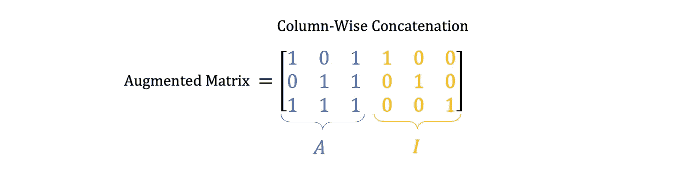
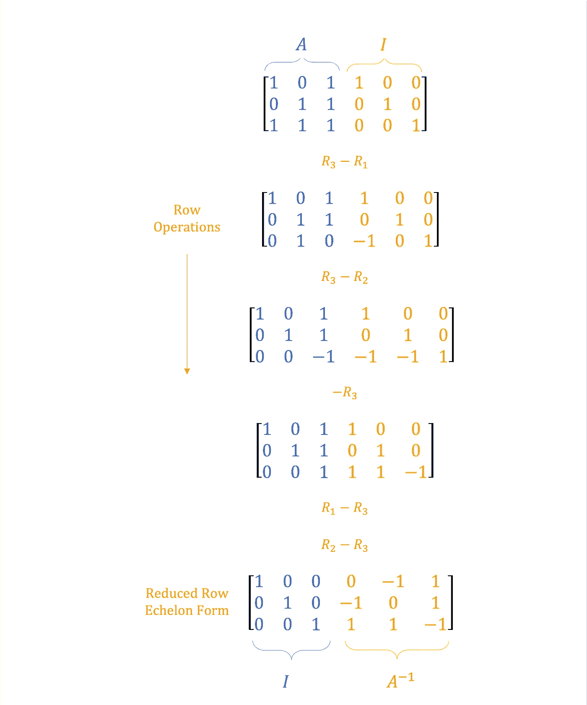
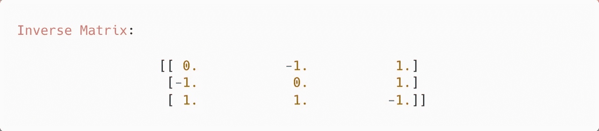

# 用 Python 求矩阵的逆矩阵

> 原文：<https://towardsdatascience.com/find-the-inverse-of-a-matrix-using-python-3aeb05b48308>

## 如何在 Python 中使用行运算求矩阵的逆矩阵

## 介绍

本文跟随*Python 中的高斯消去算法*。介绍了一种利用行归约求**逆矩阵**的方法。

*查看下面的文章，了解高斯消去法的必要介绍。*

 [## Python 中的高斯消去算法

### 关于如何在 Python 中使用高斯消去法求解线性方程组的教程

levelup.gitconnected.com](https://levelup.gitconnected.com/gaussian-elimination-algorithm-in-python-4e90cb3a0fd9) 

照片由 [Linus Mimietz](https://unsplash.com/@linusmimietz?utm_source=medium&utm_medium=referral) 在 [Unsplash](https://unsplash.com?utm_source=medium&utm_medium=referral) 上拍摄

## 背景

*矩阵代数基础|第二部分*呈现**逆矩阵**。回想一下*并非所有矩阵都是可逆的*。 ***A*** *必须是平方* ( **n×n** )且有一个*非零行列式*。

 [## Python 的矩阵代数基础|第 2 部分

### 使用 Python 理解和实现基本矩阵代数概念和运算

towardsdatascience.com](/fundamentals-of-matrix-algebra-with-python-part-2-833e447077d5) 

本质上，矩阵的**乘以它的*逆*得到**单位矩阵**， *I* ，如等式 1 所示。**

等式 1 —计算矩阵的逆矩阵(图片由作者提供)

以等式 2 中的 3×3 矩阵 **A** 为例。

等式 2 —矩阵 A(图片由作者提供)

等式 3 等同于等式 1，变量*替换为*。

等式 3 —参数替换(图片由作者提供)

*下面计算的* **结果** *是未知数* **A⁻** *。*

## 算法

从等式 3 的分量创建一个*扩充的*矩阵。这个新矩阵包含 ***A*** *串联的* *列式*与 ***I*** ，如等式 4 所示。

等式 4 —扩充矩阵(图片由作者提供)

通过对*增广矩阵*应用**行运算**获得*逆矩阵*。

> 对增广矩阵进行 ***高斯消去*** *型*过程，得到 ***中的 **A** 降排梯队形式****(*rref*)***同时跃迁 **I** 为 **A *⁻*** 。**

**总而言之:**

*   **将 **A** 转换成**rref。于是，A 变成了*单位矩阵。*****

****

**a .转换到单位矩阵(图片由作者提供)**

*   **对*I 运行上面的*等价*行运算，就变成了逆矩阵 *A* ⁻。***

******

***单位矩阵转换为逆矩阵(图片由作者提供)***

## ***例子***

***图 1 描述了*逐步* *操作*改变扩充矩阵的*前三列*以实现 ***rref*** 的必要步骤。***

******

***图 1 —实现简化的行梯队形式的行操作(图片由作者提供)***

***结果在意料之中。 *A* 成为*单位矩阵*，而 *I* 变换成*以前未知的*逆矩阵。***

## ***Python 实现***

***有了 Python 中的*编程*的**高斯消去**算法，代码只需要*微小的修改*就可以得到**的逆**。***

***使用 Gist 1 将等式 2 中的 **A** 定义为 NumPy 数组。***

***要点 1 —使用 Numpy 定义 A***

***同样，*实例化*一个新的变量 *I* ，与 **A** 相同的**方形**。***

***要点 2 —定义单位矩阵***

***使用 NumPy 的*列连接*操作创建**增广矩阵**，如要点 3 所示。***

***要点 3 —创建身份矩阵***

***在不考虑某些*边缘情况*的情况下，下面在要点 4 中提供的代码是获得 ***逆*** 所必需的行操作的*幼稚*实现。***

***要点 4 —在 Python 中寻找逆矩阵***

***与高斯消去算法相比，对代码的主要*修改*是*代替*的*终止于**行梯队形式**，操作继续到达**缩减行梯队形式**。****

***因此，不是*只迭代枢轴下面的*，而是枢轴上面的*行也被遍历*和*操作*。***

***执行*脚本*返回与图 1 中相同的答案。***

******

***图 2-逆矩阵 Python 控制台输出***

## ***结果***

***给定任意数量的*的*可逆矩阵*和任意大小的*，上述算法均适用。增加矩阵的大小也是可能的。***

***Gist 5 提供了在 NumPy 中创建一个*随机方阵*的代码。***

***要点 5 —大型随机矩阵***

***比较*自定义*算法*与*的**运行时**与 *NumPy 当量*突出了**速度差**。Gist 6 中的代码是一个简单的方法来*记录时间*。***

***要点 6 —比较方法运行时间***

***NumPy 比 T21 快一秒来反转矩阵。这个巨大的时差只会随着矩阵维度的扩大而增加。***

## ***结论***

***这篇文章概述了矩阵代数中使用的一个基本方法来*计算*一个矩阵的逆矩阵。***

***使用概述的理论矩阵代数方法和等效的 **Python** 代码*来理解操作如何工作*。然而，Python 中的 NumPy 等库经过优化，可以高效地解密逆矩阵。**在实践中**，使用健壮的、维护良好的数学库。***

***如果你对 Python、工程和数据科学感兴趣，可以看看我的其他文章。***

*** [## 通过我的推荐链接加入媒体-安德鲁·约瑟夫·戴维斯

### 作为一个媒体会员，你的会员费的一部分会给你阅读的作家，你可以完全接触到每一个故事…

medium.com](https://medium.com/@andrewdaviesul/membership) 

在 Gist 7 中找到所有 Python 代码。

要点 7——完成 Python 代码以找到矩阵的逆*** 

## ***参考***

***[1] [工程师矩阵代数](https://youtube.com/playlist?list=PLkZjai-2Jcxlg-Z1roB0pUwFU-P58tvOx) — **杰弗里·查斯诺夫*****