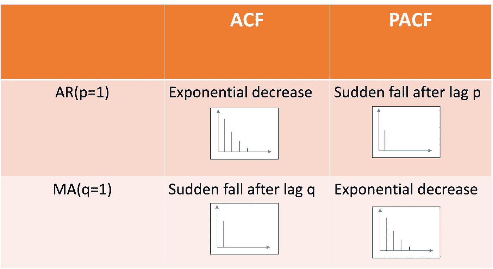
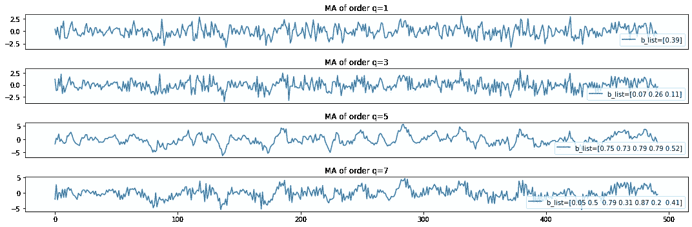
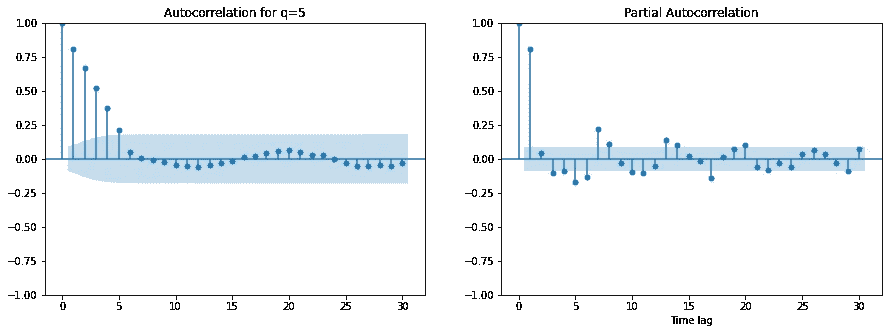
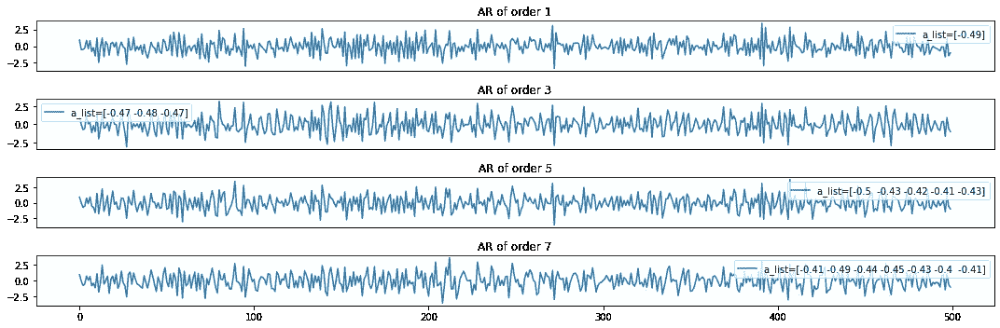
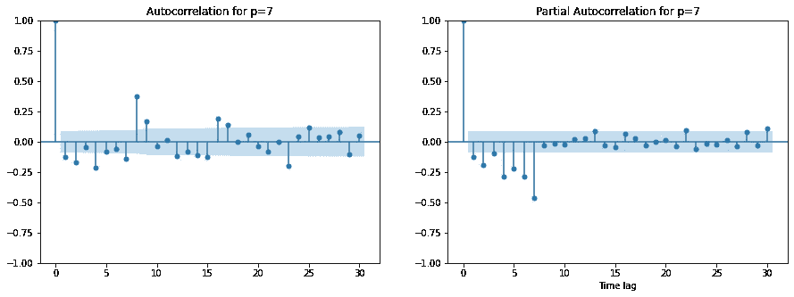

# 查找 ARIMA 模型的顺序

> 原文：<https://towardsdatascience.com/find-the-order-of-arima-models-b4d99d474e7a>

## 了解并找到时间序列基本建模的最佳参数


图片由 [@m_____me](https://unsplash.com/@m_____me)

ARIMA 是开始单变量时间序列实验的最佳模型之一。它提供了最先进的性能，特别是在小数据集的情况下，深度学习模型尚未处于最佳状态。

这是一个简单的，可解释的模型，但 ARIMA 是一个参数模型。这意味着在拟合模型之前需要设置特定的参数。事实上，模型的自回归、移动平均和平稳部分分别需要参数 **p、q 和 d**

在本文中，您将了解这些参数是什么，以及如何使用 **ACF** 、 **PACF 图**和 **BIC/AIC** 信息标准找到最佳参数

# **了解 ARIMA 车型**

首先，我们需要对这些模型有个基本的了解。

时间序列中“线性回归”或“经典模型”的等价物是 ar 和 MA。这些基本模型通常表现良好。它们是可解释的、轻量级的，是开始任何数据科学项目的良好基础。

ARMA 模型有一个严重的限制。它假设输入数据是稳定的(时间序列的均值和方差不依赖于时间序列被观察的时间)。如果您的数据是非平稳的，您可以使用 AR **I** MA 模型，其中 **I** 代表“集成的”。积分部分说明了“微分”，这是一种去除趋势并使时间序列平稳的方法。

# 1)自回归模型

订单 **p** 的 **AR** 是一个回归自身 **p 过去值**的模型。换句话说，系列 Vt 的当前值可以解释为 p 个过去值与随机误差的线性组合。我们假设下一个值与前 p 个值相关。用于预测下一个值的先前输入的数量被称为“顺序”。我们通常称之为“p”。这些用来计算下一个值的先验值被称为“滞后变量”。

作为滞后变量线性组合的 Vt 方程为:

AR(p):Vt = ao+a1V { t-1 }+…+apV { t-p }+Nt。

当我们拟合 AR 模型时，我们在[0，p]中估计 I 的{ai}。 *Nt* 是一个白噪声过程(我们称之为“白噪声过程”是一系列均值为 0、方差恒定且误差不相关的随机值)和 *ao* 均值。

比如，当 p=3 时，为了预测下一个时间戳(和时间序列均值 a0)，我们代入最后三个值，分别乘以系数 a1，a2，a3。

您可以看到如何使用下面的代码片段模拟订单 p 的 AR 模型:

该模型将以下内容作为输入:

*   随机变量的实现列表 V

```
rand_v_list = np.random.normal(size=N)
```

*   p 系数列表{ao，…，ap}。

模拟的 AR 模型是将 V 的 p 个连续值乘以其 p 个系数来创建一个时间序列。

我们的目标是:给定一个模拟的 AR 时间序列，如何找到 p，用来生成它的参数？

# 2)移动平均模型

**移动平均**模型利用观测值和应用于滞后观测值的移动平均的残差之间的相关性。换句话说，**马**将预测值建模为到 **q** 步的过去误差项的线性组合。误差或残差定义为 *res =预测值-真值。*

它利用回归方法中以前的预测误差来预测未来的观测值。在这种情况下，每个未来观测值都是以前预测误差的加权平均值。

MA(q):Et = B0+B1 * Et-1+…+BP * Et-q+Nt

我们估计{bi}在[0，q]中，Nt 是白噪声(均值为 0 且方差有限的不相关随机变量的集合)。

如果残差和预测值之间仍然存在相关性，这意味着我们仍然可以从误差中获得信息。实际上，我们可以认为误差是随机的。MA 过程只是来自白噪声过程的值 E 的加权组合。

您可以通过下面的代码片段看到该模型是如何工作的:

该模型采用与 ar 流程相似的输入。

# 3) ARMA

**自回归移动平均 ARMA** (p，q)结合了 **AR** (p)和 **MA** (q)过程，考虑了时间序列的滞后或过去值以及误差项。它是平稳时间序列最有效的线性模型[1]。

# 4) ARIMA

当输入数据不稳定时，用一个**自回归综合移动平均**代替 ARMA 模型。

在 ARIMA，积分部分将时间序列“固定化”[2]。当积分的阶数为 *d=0* 时，ARIMA 的行为类似于 ARMA 模型。当 *d=1* 时，模型将从 t 处观察到的值中减去 t-1 值。当数据中存在长期趋势时，您可以添加微分。术语综合指的是建模的时间序列必须不同多少次才能产生平稳性。

当你使用 ARIMA 模型时，不要手动进行微分，你可以直接在非平稳时间序列上拟合 ARIMA 模型。


图片由 [@tezos](https://unsplash.com/@tezos)

# 分析

现在我们了解了这些过程是如何工作的，以及它们的顺序意味着什么，让我们看看如何在实践中找到参数。为了分别找到模型的 AR、integrated 和 MA 部分的参数 p、d 和 q，我们可以使用:

*   **ACF** 和 **PACF** 剧情。
*   领域知识
*   各种适合的度量标准 **(BIC，AIC)**

我们提醒 p 是模型中滞后观测值的数量(也称为滞后阶数)，d 是原始观测值的差分次数，q 是移动平均窗口的大小。

我们将在下一节介绍如何使用 ACF、PACF 图、BIC 和 AIC 标准。

# 自相关函数

时间序列过程的一个重要方面是**自相关**。自相关是一种统计属性，当一个时间序列与其自身的先前版本或滞后版本线性相关时，就会出现自相关。它还用于检测时间序列中可能的季节性。

我们使用自相关函数来评估时间序列中的依赖程度，并选择适当的模型(MA、AR 或 ARIMA)。

**自相关函数(** ACF)和**偏自相关函数** (PACF)可以针对任何时间序列(不仅仅是平稳的)进行计算。

在实践中，我们使用这两个图的组合来确定 ARMA 过程的顺序。

## 我如何知道我的时间序列遵循哪个过程？

通用流程:

*   ARIMA(0，0，0)是一个白噪声模型。(Vt=Nt)
*   ARIMA(0，1，0)是随机游走(Vt-V{t-1}=c+Nt，c 是均值)
*   ARIMA(0，1，1)指数平滑法

但是除了常见的模式之外，我们使用 PACF 和 ACF 图来可视化要识别的模式:



过程识别表。作者图片

在下图中，我们展示了阶为 1 的 AR、MA 或 ARMA 过程中 ACF 和 PACF 的行为。如果你的时间序列是 AR 或 MA 或 ARMA，你可以很容易地使用这个表来识别任何订单。在 AR 或 MA 过程的情况下，您可以计算图表中突然下降的峰值数量。在 ACF 和 PACF 中，0 阶滞后总是等于 1(该值与其自身完全相关)，因此我们在第一个峰值后开始计数。

# 1) ACF

**我们使用自相关函数 ACF 来了解时间序列与其滞后值的相关程度。**

我们使用 **ACF** 来标识 ARMA 模型的 **MA(q)** 部分。

事实上，我们确定哪个滞后变量与产出有很强的相关性。这些滞后变量对时间序列的下一个值有很强的预测能力，应该用于预测。

在实践中，我们计算与输出值有显著自相关的滞后数，以找到 MA 模型的 q 值。

让我们针对 500 个模拟随机观察值，模拟顺序为 q=1、q=3、q=5 和 q=7 的四个 MA 过程。

绘制这四个不同的模拟数据:



顺序递增的不同 MA 过程。作者图片

现在，让我们用 ACF 和 PACF 图绘制 MA(q=5)模拟数据。

在右图中，我们可以看到 PACF 图上的阻尼下降(正的和负的)。即使在滞后 10 年之后，滞后仍然很明显。而在左侧的 ACF 图上，在 1+5 个显著滞后之后，所有随后的滞后都不显著。我们可以看到一个并购过程。

为了找到 q，我们可以计算 ACF 图上显著滞后的数量(蓝带之外)。除了第一个滞后对应于值与其自身的相关性之外，我们可以看到与序列的接下来 5 个滞后的相关性。



ACF 和 PACF 用于 MA(q=5)。我们可以在 ACF 中读取 5 个显著或“高”峰，左图。作者图片

# 2) PACF

## 直觉

**偏自相关函数(PACF)** 表示在我们考虑一些其他变量集合的值的假设下，两个变量之间的相关性。在回归中，这种部分相关性可以通过关联两个不同回归的残差来找到。

我们使用 PACF 来寻找残差与下一个滞后的相关性。如果我们发现残差和下一个滞后中隐藏的信息具有合理的相关性，我们将使用下一个滞后作为建模的特征。

换句话说，目标时间戳和先前时间戳之间的自相关值由两个值之间的直接相关性加上间接相关性组成。我们认为这些间接相关性是观察值相关性的线性函数。

我们可以使用 PACF 来计算 AR 流程中显著滞后的数量。

## 实验

首先让我们模拟 p=1，p=3，p=5，p=7 的移动平均 AR。



订单可变的不同 AR 流程。作者图片

我们可以在上面的图中看到，随着 p 的增加，我们也增加了时间序列的振荡性质。当时间序列增长过快时，自回归分量会产生一种自然趋势，使其回到平均值。现在它在平均值 0 附近振荡，但也可能是任何值。因为时间序列既取负值也取正值，所以 ACF 和 PACF 图也取正值和负值。

现在我们可以画出这些 AR 过程的 ACF 和 PACF 函数，并读出显著滞后的数目作为 p 的值



ACF 和 PACF 用于 AR(p=7)。我们可以在右边的 PACF 图上看到七个重要的峰值。图片由作者提供。

# 3) AIC/BIC 标准

绘制 ACF/PACF 对于识别 AR 和 MA 过程是有效的。但是对于 ARIMA 进程，更常见的是使用 *auto_arima* 函数。Auto arima 是一种强力方法，它尝试不同的 p 和 q 值，同时最小化两个标准:AIC 和 BIC。

评估正则化拟合优度的最常见度量是:

*   贝叶斯信息准则(BIC)
*   赤池信息标准(AIC)。

这些度量提供了考虑模型复杂性的模型性能的度量。AIC 和 BIC 将一个反映模型与数据拟合程度的术语与一个根据参数数量按比例惩罚模型的术语结合起来[3]。

作为一种正则化技术，我们希望根据模型中参数的数量进行惩罚。事实上，p 和 q 越大，你用来预测下一个值的延迟就越多，你就越有可能过度拟合你的数据。

> 自动 ARIMA 过程旨在确定一个`**ARIMA**`模型的最佳参数，确定一个单一的拟合 ARIMA 模型。[…]
> 
> 为了找到最佳模型，自动 ARIMA 为给定的`**information_criterion**`(分别为‘AIC’，‘aicc’，‘BIC’，‘hqic’，‘OOB’)(Akaike 信息标准、修正的 aka ike 信息标准、贝叶斯信息标准、Hannan-Quinn 信息标准或“出袋”–用于验证评分)之一进行优化，并返回使值最小化的 ARIMA。

在实践中，我们使用现成的工具 [auto_arima](https://www.google.com/search?q=auto_arima+pdarima&oq=auto_arima+pdarima&aqs=chrome..69i57j33i160l2.4073j0j1&sourceid=chrome&ie=UTF-8) 从包 *pmdarima 中自动找到时间序列的顺序。*

让我们尝试 auto_arima 来找出我们模拟的几个 ma 过程的顺序:

```
q=1
Performing stepwise search to minimize aic
 ARIMA(0,0,0)(0,0,0)[0] intercept   : AIC=1605.796, Time=0.01 sec
 ARIMA(1,0,0)(0,0,0)[0] intercept   : AIC=1493.552, Time=0.03 sec
 ARIMA(0,0,1)(0,0,0)[0] intercept   : AIC=1461.981, Time=0.03 sec
 ARIMA(0,0,0)(0,0,0)[0]             : AIC=1604.553, Time=0.01 sec
 ARIMA(1,0,1)(0,0,0)[0] intercept   : AIC=1463.723, Time=0.05 sec
 ARIMA(0,0,2)(0,0,0)[0] intercept   : AIC=1463.755, Time=0.05 sec
 ARIMA(1,0,2)(0,0,0)[0] intercept   : AIC=1465.600, Time=0.13 sec
 ARIMA(0,0,1)(0,0,0)[0]             : AIC=1460.398, Time=0.02 sec
 ARIMA(1,0,1)(0,0,0)[0]             : AIC=1462.121, Time=0.03 sec
 ARIMA(0,0,2)(0,0,0)[0]             : AIC=1462.155, Time=0.02 sec
 ARIMA(1,0,0)(0,0,0)[0]             : AIC=1491.861, Time=0.01 sec
 ARIMA(1,0,2)(0,0,0)[0]             : AIC=1463.988, Time=0.06 sec

Best model:  ARIMA(0,0,1)(0,0,0)[0]          
Total fit time: 0.468 seconds
Optimal order for is: (0, 0, 1) 

q=3
Performing stepwise search to minimize aic
 ARIMA(0,0,0)(0,0,0)[0] intercept   : AIC=1702.731, Time=0.01 sec
 ARIMA(1,0,0)(0,0,0)[0] intercept   : AIC=1570.816, Time=0.03 sec
 ARIMA(0,0,1)(0,0,0)[0] intercept   : AIC=1628.147, Time=0.04 sec
 ARIMA(0,0,0)(0,0,0)[0]             : AIC=1701.862, Time=0.01 sec
 ARIMA(2,0,0)(0,0,0)[0] intercept   : AIC=1528.848, Time=0.04 sec
 ARIMA(3,0,0)(0,0,0)[0] intercept   : AIC=1519.618, Time=0.06 sec
 ARIMA(4,0,0)(0,0,0)[0] intercept   : AIC=1485.096, Time=0.06 sec
 ARIMA(4,0,1)(0,0,0)[0] intercept   : AIC=1484.876, Time=0.11 sec
 ARIMA(3,0,1)(0,0,0)[0] intercept   : AIC=1509.277, Time=0.13 sec
 ARIMA(4,0,2)(0,0,0)[0] intercept   : AIC=1464.510, Time=0.17 sec
 ARIMA(3,0,2)(0,0,0)[0] intercept   : AIC=1465.074, Time=0.15 sec
 ARIMA(4,0,3)(0,0,0)[0] intercept   : AIC=1465.187, Time=0.28 sec
 ARIMA(3,0,3)(0,0,0)[0] intercept   : AIC=1464.135, Time=0.20 sec
 ARIMA(2,0,3)(0,0,0)[0] intercept   : AIC=1462.726, Time=0.23 sec
 ARIMA(1,0,3)(0,0,0)[0] intercept   : AIC=1462.045, Time=0.17 sec
 ARIMA(0,0,3)(0,0,0)[0] intercept   : AIC=1460.299, Time=0.09 sec
 ARIMA(0,0,2)(0,0,0)[0] intercept   : AIC=1507.915, Time=0.06 sec
 ARIMA(0,0,4)(0,0,0)[0] intercept   : AIC=1462.121, Time=0.09 sec
 ARIMA(1,0,2)(0,0,0)[0] intercept   : AIC=1467.963, Time=0.08 sec
 ARIMA(1,0,4)(0,0,0)[0] intercept   : AIC=1463.941, Time=0.23 sec
 ARIMA(0,0,3)(0,0,0)[0]             : AIC=1458.689, Time=0.12 sec
 ARIMA(0,0,2)(0,0,0)[0]             : AIC=1506.487, Time=0.03 sec
 ARIMA(1,0,3)(0,0,0)[0]             : AIC=1460.415, Time=0.11 sec
 ARIMA(0,0,4)(0,0,0)[0]             : AIC=1460.498, Time=0.04 sec
 ARIMA(1,0,2)(0,0,0)[0]             : AIC=1466.278, Time=0.07 sec
 ARIMA(1,0,4)(0,0,0)[0]             : AIC=1462.305, Time=0.11 sec

Best model:  ARIMA(0,0,3)(0,0,0)[0]          
Total fit time: 2.717 seconds
Optimal order for is: (0, 0, 3) 

q=5
Performing stepwise search to minimize aic
 ARIMA(0,0,0)(0,0,0)[0] intercept   : AIC=1659.497, Time=0.01 sec
 ARIMA(1,0,0)(0,0,0)[0] intercept   : AIC=1570.804, Time=0.03 sec
 ARIMA(0,0,1)(0,0,0)[0] intercept   : AIC=1613.884, Time=0.03 sec
 ARIMA(0,0,0)(0,0,0)[0]             : AIC=1658.949, Time=0.01 sec
 ARIMA(2,0,0)(0,0,0)[0] intercept   : AIC=1495.855, Time=0.04 sec
 ARIMA(3,0,0)(0,0,0)[0] intercept   : AIC=1482.804, Time=0.05 sec
 ARIMA(4,0,0)(0,0,0)[0] intercept   : AIC=1484.509, Time=0.07 sec
 ARIMA(3,0,1)(0,0,0)[0] intercept   : AIC=1484.564, Time=0.11 sec
 ARIMA(2,0,1)(0,0,0)[0] intercept   : AIC=1484.926, Time=0.07 sec
 ARIMA(4,0,1)(0,0,0)[0] intercept   : AIC=1486.509, Time=0.15 sec
 ARIMA(3,0,0)(0,0,0)[0]             : AIC=1481.204, Time=0.03 sec
 ARIMA(2,0,0)(0,0,0)[0]             : AIC=1494.160, Time=0.02 sec
 ARIMA(4,0,0)(0,0,0)[0]             : AIC=1482.892, Time=0.03 sec
 ARIMA(3,0,1)(0,0,0)[0]             : AIC=1482.953, Time=0.05 sec
 ARIMA(2,0,1)(0,0,0)[0]             : AIC=1483.270, Time=0.03 sec
 ARIMA(4,0,1)(0,0,0)[0]             : AIC=1484.892, Time=0.08 sec

Best model:  ARIMA(3,0,0)(0,0,0)[0]          
Total fit time: 0.824 seconds
Optimal order for is: (3, 0, 0) 

q=7
Performing stepwise search to minimize aic
 ARIMA(0,0,0)(0,0,0)[0] intercept   : AIC=2171.867, Time=0.01 sec
 ARIMA(1,0,0)(0,0,0)[0] intercept   : AIC=1789.289, Time=0.03 sec
 ARIMA(0,0,1)(0,0,0)[0] intercept   : AIC=1931.174, Time=0.04 sec
 ARIMA(0,0,0)(0,0,0)[0]             : AIC=2172.420, Time=0.01 sec
 ARIMA(2,0,0)(0,0,0)[0] intercept   : AIC=1788.083, Time=0.04 sec
 ARIMA(3,0,0)(0,0,0)[0] intercept   : AIC=1779.499, Time=0.07 sec
 ARIMA(4,0,0)(0,0,0)[0] intercept   : AIC=1778.438, Time=0.07 sec
 ARIMA(4,0,1)(0,0,0)[0] intercept   : AIC=1773.792, Time=0.26 sec
 ARIMA(3,0,1)(0,0,0)[0] intercept   : AIC=1780.497, Time=0.10 sec
 ARIMA(4,0,2)(0,0,0)[0] intercept   : AIC=1695.057, Time=0.32 sec
 ARIMA(3,0,2)(0,0,0)[0] intercept   : AIC=1738.073, Time=0.35 sec
 ARIMA(4,0,3)(0,0,0)[0] intercept   : AIC=1691.378, Time=0.51 sec
 ARIMA(3,0,3)(0,0,0)[0] intercept   : AIC=1711.992, Time=0.25 sec
 ARIMA(4,0,4)(0,0,0)[0] intercept   : AIC=1694.119, Time=0.72 sec
 ARIMA(3,0,4)(0,0,0)[0] intercept   : AIC=1701.593, Time=0.27 sec
 ARIMA(4,0,3)(0,0,0)[0]             : AIC=1689.749, Time=0.27 sec
 ARIMA(3,0,3)(0,0,0)[0]             : AIC=1710.347, Time=0.19 sec
 ARIMA(4,0,2)(0,0,0)[0]             : AIC=1693.396, Time=0.15 sec
 ARIMA(4,0,4)(0,0,0)[0]             : AIC=1692.698, Time=0.49 sec
 ARIMA(3,0,2)(0,0,0)[0]             : AIC=1736.557, Time=0.16 sec
 ARIMA(3,0,4)(0,0,0)[0]             : AIC=1699.989, Time=0.16 sec

Best model:  ARIMA(4,0,3)(0,0,0)[0]          
Total fit time: 4.481 seconds
Optimal order for is: (4, 0, 3)
```

我们对订单 1、3、5 和 7 的 ma 过程使用 auto arima。对于小订单 q=1 和 q=3，Auto_arima 准确地识别 ma 过程及其订单，但是对于订单 q=5 和 q=7，它混合了 AR 和 MA。

# 结论

当您开始时间序列分析时，从可能满足用例需求的简单模型开始是一个好的实践。ARIMA 模型简单而透明，你可以推导出严格的统计特性。它们在小数据集上表现良好，构建和重新训练都很便宜。

如果您需要使用它们，您需要了解它们是如何工作的，并明确地设置它们的参数。本文为您提供了充分自信地调整模型顺序的技术。

**本文笔记本可用** [**此处**](https://github.com/bledem/time_series_utils/tree/master/notebooks) **。**

# 参考资料:

[1]使用 Python 进行时间序列分析:从基础到前沿技术[https://www . Amazon . com/Hands-Time-Analysis-Python-Techniques/DP/1484259912](https://www.amazon.com/Hands-Time-Analysis-Python-Techniques/dp/1484259912)(非附属)

[2][https://people . cs . Pitt . edu/~ Milos/courses/cs 3750/lectures/class 16 . pdf](https://people.cs.pitt.edu/~milos/courses/cs3750/lectures/class16.pdf)

[3][https://www . science direct . com/topics/psychology/Bayesian-information-criterion #:~:text = The % 20 a kaike % 20 information % 20 criterion % 20(AIC，to % 20 its % 20 number % 20 of % 20 parameters。](https://www.sciencedirect.com/topics/psychology/bayesian-information-criterion#:~:text=The%20Akaike%20information%20criterion%20(AIC,to%20its%20number%20of%20parameters.)