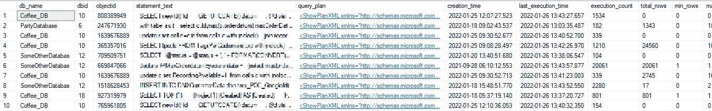
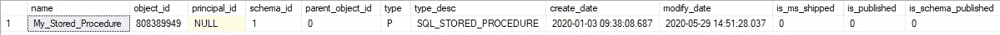

# 查找数据库中排名靠前且最慢的查询

> 原文：<https://towardsdatascience.com/find-the-top-n-most-expensive-queries-48e46d8e9752>

## 找到降低数据库处理速度的瓶颈查询


在这篇文章中，我们将寻找慢速查询(图片由 [Nicolai Dürbaum](https://unsplash.com/@nicoli) 在 [unsplash](https://unsplash.com/photos/PXGvsl0jQcE) 上提供)

当您的数据库增长时，很容易失去对它正在执行的所有进程的跟踪。跟踪阻碍操作的缓慢查询不是很好吗？

在本文中，我们将创建一个查询，为您提供**分析和优化数据库**所需的所有工具:它选择有问题的查询，提供这些查询的相关信息，并为您提供查找和改进它们的方法。阅读本文后，您将能够揭示前 n 个查询以及每个查询的信息:

*   在哪个数据库和对象中查找查询(例如在`Coffee`数据库中的`FreshPot`存储过程中)
*   实际的查询本身
*   查询计划
*   创建和最后执行的时间
*   执行次数
*   返回的行数的总数、最小值、最大值和平均值、运行时间和 CPU 时间

注意，本文分析了 SQL Server 数据库，但是类似的功能也存在于 Postgres 数据库中。查看本文中关于 Postgres 数据库中所有查询的统计数据。

# 搜寻慢速查询

我们将编写一个查询，提供哪些查询速度慢的信息，并为我们提供分析查询的工具。那我们可以

1.  **检测**:哪些查询有问题？
2.  **丰富**:增加更多信息，让我们了解缓慢的原因
3.  **分析**:在哪里可以找到查询，问题出在哪里？
4.  优化:我们如何进一步改进我们的查询和数据库？

完整查询可在本文底部[或**这里**](https://gist.github.com/mike-huls/546e9801a64ac1e004f2c83382131382) 。注意，我们将要使用的一些视图需要`VIEW DATABASE STATE`的许可。

## 1.查找有问题的查询

在第一部分中，我们使用 CTE 来选择我们感兴趣的查询。我们想从`sys.dm_exec_query_stats`获取一些数据；这将跟踪 SQL Server 中缓存查询计划的性能统计信息。

这里的目标是选择我们感兴趣的记录。在本例中，我们选择的记录是**新的**(自上次执行后不到 30 天)和频繁使用的**(在过去 30 天内超过 100 次)。我们不介意很少执行的慢速查询。接下来，我们按照平均 CPU 时间对查询进行排序，然后返回前 10 个最慢的查询。**

**当然，我们可以根据许多标准进行筛选:**

*   **执行时间变化很大的记录(例如，最小和最大 CPU 时间相差很大)**
*   **运行时间和 CPU 时间(CPU 实际执行的时间)相差很大的记录；可能查询浪费了很多等待的时间)**
*   **按返回的 avg_rows 或总 cpu 时间排序。**

****

**有些虫子伪装得很好(图片由 [id23](https://unsplash.com/@id23) 在 [Unsplash](https://unsplash.com/photos/7m3Gw8dgbjg) 上拍摄)**

## **2.提供有关查询的更多信息**

**在上一部分中，我们选择了频繁执行且执行时间很长的查询；这些是我们的问题查询。这一部分的目标是尽可能多地收集关于这些查询的相关信息。让我们看一下代码**

**上面的代码很长，但它只做了几件事:**

*   **使用第 34 行的视图`sys.dm_exec_sql_text`添加实际的 SQL 语句(并清除第 21 到 31 行的语句)**
*   **使用视图`sys.dm_exec_query_plan`添加查询计划(第 35 行)**
*   **使用视图`sys.dm_exec_plan_attributes`获取我们稍后需要的数据库 id 和对象 id。在第 37 到 41 行中，我们将 dbid 和 objectid 记录从行转换为列，这样我们可以更容易地在第 36 行交叉应用它们。**

**这是输出(带有匿名声明文本):**

****

**我们的数据库分析语句的输出(不是所有的列都适合，但最重要的列在这里，图片由作者提供)**

## **3.分析我们的问题查询**

**我们现在可以开始分析查询；以下是一些建议:**

1.  **检查 cpu 时间和运行时间之间的差异；可能查询等了很多？**
2.  **检查最小和最大 cpu 和执行时间之间的差异；也许将某些作业安排在晚上服务器有更多可用内存的时候？**
3.  **分析语句文本(格式化 vscode 中的 sql`cntrl` - `shift` - `p` → `format document with` → `sql`**
4.  **单击并签出 query_plan**

**一旦您发现了问题或改进查询的机会，我们需要找到查询的位置。我们已经有了数据库名称；让我们找到查询所在的对象的名称(例如，在存储过程中)。我们可以通过在下面的查询中插入`db_name`和`objectid` 来做到这一点:**

```
SELECT * FROM CoffeeDB.sys.objects WHERE object_id = 808389949
```

**这将告诉您我们正在寻找的对象的类型和名称。例如:**

****

**现在我们可以在 CoffeeDB 中搜索一个名为‘My _ Stored _ Procedure’的存储过程，并加快查询速度！**

## **4.进一步优化**

**查看一下 [**这些文章**](https://mikehuls.com/articles?tags=sql) 来改善你的查询，尤其是 [**这一条**](https://mikehuls.medium.com/sql-understand-how-indices-work-under-the-hood-to-speed-up-your-queries-a7f07eef4080) 。**

****

**随着所有拥塞的消失，我们的数据库进程再次自由流动(图片由 [Alexander Schimmeck](https://unsplash.com/@alschim) 在 [unsplash](https://unsplash.com/photos/W3MXYIfyxno) 上提供)**

# **结论**

**通过这篇文章，您将完全有能力优化您的数据库！我们已经了解了代码的工作原理以及如何使用它，现在是时候将它应用到您的情况中了。查看 [**完整查询此处**](https://gist.github.com/mike-huls/546e9801a64ac1e004f2c83382131382) 。**

**如果你有建议/澄清，请评论，以便我可以改进这篇文章。同时，看看我的其他关于各种编程相关主题的文章，比如:**

*   **[了解索引如何加快查询速度](https://mikehuls.medium.com/sql-understand-how-indices-work-under-the-hood-to-speed-up-your-queries-a7f07eef4080)**
*   **[跟踪 Postgres 中所有查询的统计数据以防止瓶颈](https://mikehuls.medium.com/how-to-track-statistics-on-all-queries-in-your-postgres-database-to-prevent-slow-queries-or-730d3f94076c)**
*   **[Docker 中的 Postgres 入门](https://mikehuls.medium.com/getting-started-with-postgres-in-docker-616127e2e46d)**
*   **[删除进入另一个表格](https://mikehuls.medium.com/sql-delete-into-another-table-b5b946a42299)**
*   **[更新到另一个标签页](https://mikehuls.medium.com/sql-update-into-another-table-bfc3dff79a66) le**
*   **[在一条语句中插入、删除和更新](https://mikehuls.medium.com/sql-insert-delete-and-update-in-one-statement-sync-your-tables-with-merge-14814215d32c)**
*   **[更新选择一批记录](https://mikehuls.medium.com/sql-update-select-in-one-query-b067a7e60136)**
*   **[插入唯一表格](https://mikehuls.medium.com/sql-inserting-only-unique-values-in-a-unique-table-af2eb3b9890a)**

**编码快乐！**

**—迈克**

**页（page 的缩写）学生:比如我正在做的事情？跟我来！**

**[](https://mikehuls.medium.com/membership) [## 通过我的推荐链接加入 Medium—Mike Huls

### 作为一个媒体会员，你的会员费的一部分会给你阅读的作家，你可以完全接触到每一个故事…

mikehuls.medium.com](https://mikehuls.medium.com/membership)**