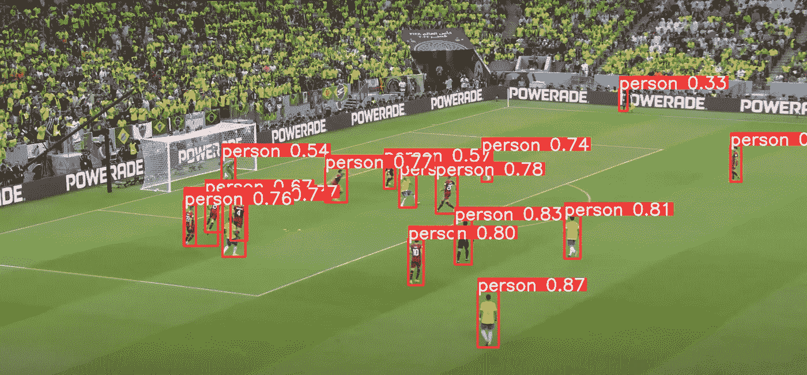
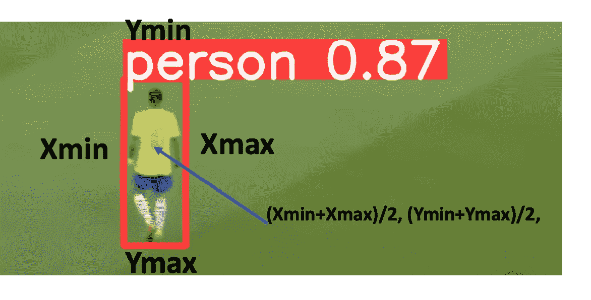
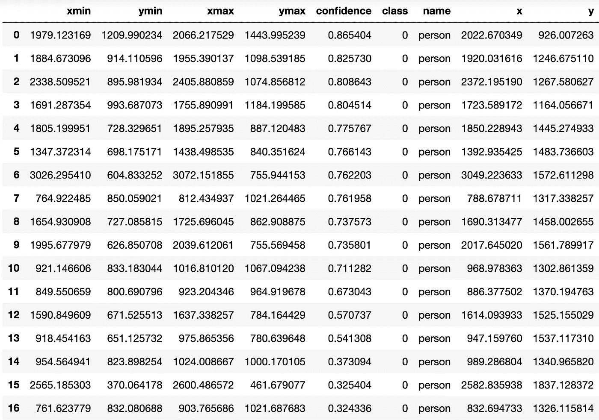
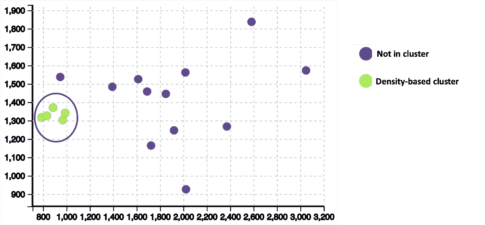
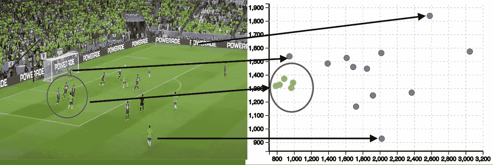

# 在图像中查找聚类

> 原文：<https://towardsdatascience.com/finding-clusters-in-an-image-96fe5eefc784>

## 不仅仅是在表格数据中查找聚类


Alex Shuper 在 [Unsplash](https://unsplash.com/s/photos/IMAGE?utm_source=unsplash&utm_medium=referral&utm_content=creditCopyText) 上拍摄的照片

我们也很容易在数据的行和列中找到聚类。但是如何在图像中找到集群呢？让我用最近在卡塔尔举办的 2022 年世界杯的一张图片来说明这个问题。

这里展示的是我在巴西对塞尔维亚的比赛中拍摄的照片。这张照片是在理查森的惊人进球之前拍摄的。


自己拍的 2022 世界杯足球赛巴西 vs 塞尔维亚的照片(图片由作者提供)

你能在照片中观察到任何集群吗？视觉上，您可以找到一群人，如下所示。


2022 年世界杯足球赛巴西对塞尔维亚的照片，显示了集群，由本人拍摄(图片由作者提供)

现在让我告诉你如何自动识别集群的技术步骤。

# 1.检测图像中的对象

第一步是检测图像中的所有对象。检测什么对象将基于聚类的目的。这里我们的目标是检测人群。检测照片中的人物可以在 YOLOv5 上完成。使用 YOLOv5 进行物体检测的结果如下所示。



用 YOLOv5 进行物体检测(图片由作者提供)

YOLOv5 还提供了额外的统计数据，如对象检测的数量。在这张照片中，有 17 个物体(人)。下面是一段代码

```
import yolov5
from sklearn.cluster import DBSCAN
from sklearn.preprocessing import StandardScaler
import numpy as np
import pandas as pd

# load pretrained model
model = yolov5.load('yolov5s.pt')

# set model parameters
model.conf = 0.25  # NMS confidence threshold
model.iou = 0.45  # NMS IoU threshold
model.agnostic = False  # NMS class-agnostic
model.multi_label = False  # NMS multiple labels per box
model.max_det = 1000  # maximum number of detections per image

# set image
img = 'brazil_vs_serbian.png'

# inference with test time augmentation
results = model(img, augment=True)

# parse results
predictions = results.pred[0]
boxes = predictions[:, :4] # x1, y1, x2, y2
scores = predictions[:, 4]
categories = predictions[:, 5]
```

# 2.识别物体的 X 和 Y 位置

下一步是识别物体的 X 和 Y 位置。YOLOv5 结果存储图像中每个对象的位置。位置存储为 xmin、ymin、xmax、ymax。我们可以取 xmin 和 xmax，以及 ymin 和 ymax 的平均值，求出物体的 x，y 位置。



对象的坐标(图片由作者提供)

可以将坐标转换为数据框。有一个调整很重要，它与反转 Y 位置有关。通常，图像以 Y 轴反转的方式存储。这意味着 Y=0 在图像的顶部。在计算过程中，我们可以通过减去图像的高度(这里是 2253)来还原位置。高度也可以自动确定，但是为了简化代码片段，我直接输入了高度。

```
df = results.pandas().xyxy[0]
df['x'] = (df['xmin'] + df['xmax'])/2.0 
df['y'] = (2253-(df['ymin'] + df['ymax'])/2.0) #2253 is image height
```

结果在这里显示为数据帧。



位置为 x，y 的数据框(图片由作者提供)

# 3.使用基于密度的聚类来查找聚类。

现在我们已经准备好寻找星团了。找到图像中的聚类意味着找到与图像的其他部分相比有更多对象的区域。本质上，这意味着根据图像中对象的密度来寻找聚类。一种有效的算法是基于密度的聚类(DBSCAN)。下面显示的是散点图中绘制的结果。



DSBSCAN 结果(图片由作者提供)

DBSCAN 算法将绿点识别为密集区域的一部分。下面是 DBSCAN 算法的代码片段。

```
#Density clustering
X = StandardScaler().fit_transform(df[['x','y']])
clustering = DBSCAN(eps=0.5, min_samples=5).fit(X)
df['c'] = clustering.labels_
```

# 4.分析结果

现在让我们对比照片分析散点图上的结果。



分析结果(图片由作者提供)

瞧啊。散点图看起来像是足球比赛的可视化数字表示！

# 结论

在图像中寻找聚类是一项有趣的技术，也有许多用例。在博客中，您看到了体育分析的一个用例。此外，还有各种其他用例，如识别公共空间中的过度拥挤或识别购物者在购物中心花费更多时间的区域。

希望你喜欢这个博客！

请**用我的推荐链接加入 Medium** 。

<https://pranay-dave9.medium.com/membership>  

请**订阅**每当我发布一个新的故事时，请及时通知我。

<https://pranay-dave9.medium.com/subscribe>  

# 额外资源

## 网站(全球资讯网的主机站)

你可以访问我的网站，这是一个学习数据科学的无代码平台。【https://experiencedatascience.com】T5[T6](https://experiencedatascience.com/)

## Youtube 频道

这是我的 YouTube 频道
[https://www.youtube.com/c/DataScienceDemonstrated](https://www.youtube.com/c/DataScienceDemonstrated)的链接