# 在 Python 中查找两个纬度和经度之间的距离

> 原文：<https://towardsdatascience.com/finding-distance-between-two-latitudes-and-longitudes-in-python-43e92d6829ff>

## 地理数据

# 在 Python 中查找两个纬度和经度之间的距离

## 地理坐标的特征工程距离

为模型准备数据时，有时查找两个位置之间的距离可能会很有用。这篇文章展示了如何在 Python 中从两个地点的纬度和经度找到两个地点之间的最短球面距离和旅行距离。


照片由 [Unsplash](https://unsplash.com?utm_source=medium&utm_medium=referral) 上的 [Dariusz Sankowski](https://unsplash.com/@dariuszsankowski?utm_source=medium&utm_medium=referral) 拍摄

# 🌐地理坐标

我们可以根据地理坐标定位地球上的任何地方。一个位置的地理坐标由它的纬度和经度位置组成。

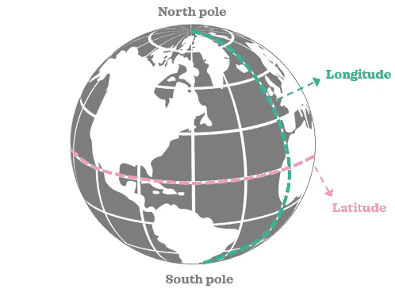

作者图片

## 📍纬度

纬度是北极和南极之间垂直位置的量度。假想的水平纬线称为*纬线*。[赤道](https://en.wikipedia.org/wiki/Equator)是一条特殊的纬线，位于 0°纬度，介于南北极之间。

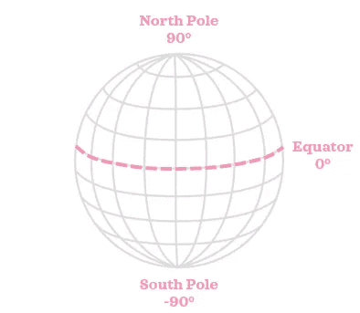

作者图片

## 📍经度

经度是水平位置的度量。假想的垂直经线称为*经线*。[本初子午线](https://en.wikipedia.org/wiki/Prime_meridian)是一条特殊的子午线，位于 0°经度。谈到时区，经度也很重要。

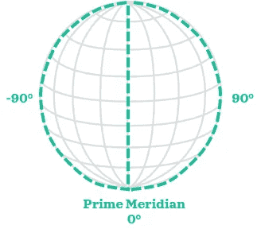

在本初子午线的对面，[反子午线](https://en.wikipedia.org/wiki/180th_meridian)位于经度 180 度。

纬线像一个环，而经线像半个环。

# 📦设置

我们将导入这些库，并在澳大利亚墨尔本设置两个示例位置坐标:

```
import numpy as np
import pandas as pd
from math import radians, cos, sin, asin, acos, sqrt, pifrom geopy import distance
from geopy.geocoders import Nominatim
import osmnx as ox
import networkx as nxlat1, lon1 = -37.82120, 144.96441 # location 1
lat2, lon2 = -37.88465,  145.08727 # location 2
```

[安装](https://osmnx.readthedocs.io/en/stable/#installation) `[osmnx](https://osmnx.readthedocs.io/en/stable/#installation)`可能比较繁琐。按照本教程设置环境的一个简单方法是使用 [Google 合作实验室](https://research.google.com › colaboratory):首先，创建一个新的笔记本；二、用`!pip install osmnx`安装库；第三，重启:从顶部菜单进入运行时>重启运行时>环境准备就绪！

# 🔵最短球面距离

地球的赤道半径是 6378 公里，极地半径是 6356 公里，所以地球不是一个完美的球体。然而，假设地球是球形的，使我们能够容易地找到近似的距离，这在某些应用中是令人满意的。在本节中，我们将使用*哈弗辛公式*从地理坐标中找出两个位置之间的[球面距离](https://en.wikipedia.org/wiki/Great-circle_distance)。让我们先熟悉一下*哈弗辛函数*。

哈弗辛函数如下:

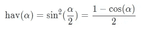

使用*哈弗辛公式*可以计算出[圆心角](https://en.wikipedia.org/wiki/Central_angle)的哈弗辛，等于球面距离除以球面半径:

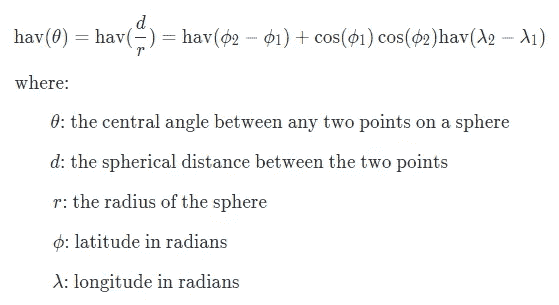

我们可以使用哈弗辛函数的第一个定义来转换这个公式，并重新排列它，使`d`在左边:

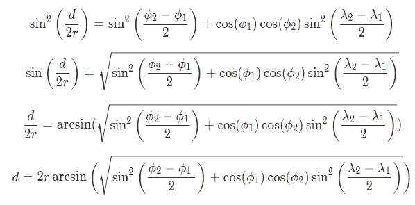

现在，是时候把这个翻译成 Python 代码了。有两点需要强调:首先，纬度和经度是以度为单位的，所以在我们将它们代入公式之前，我们必须将它们转换成弧度。其次，我们将使用[全球平均值 6371 公里](https://en.wikipedia.org/wiki/Earth_radius#Mean_radius)作为球形地球的半径。

```
def calculate_spherical_distance(lat1, lon1, lat2, lon2, r=6371):
    # Convert degrees to radians
    coordinates = lat1, lon1, lat2, lon2
    # radians(c) is same as c*pi/180
    phi1, lambda1, phi2, lambda2 = [
        radians(c) for c in coordinates
    ]  

    # Apply the haversine formula
    a = (np.square(sin((phi2-phi1)/2)) + cos(phi1) * cos(phi2) * 
         np.square(sin((lambda2-lambda1)/2)))
    d = 2*r*asin(np.sqrt(a))
    return dprint(f"{calculate_spherical_distance(lat1, lon1, lat2, lon2):.4f} km")
```

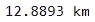

或者，我们可以使用带余弦的哈弗辛函数的第二个定义，并重新排列等式来表示`d`:

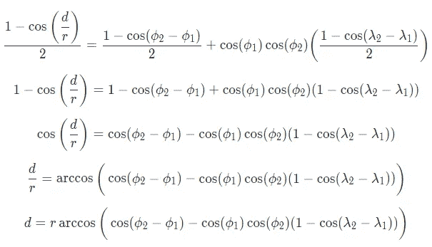

这可以用 Python 表达如下:

```
def calculate_spherical_distance(lat1, lon1, lat2, lon2, r=6371):
    # Convert degrees to radians
    coordinates = lat1, lon1, lat2, lon2
    phi1, lambda1, phi2, lambda2 = [
        radians(c) for c in coordinates
    ]

    # Apply the haversine formula
    d = r*acos(cos(phi2-phi1) - cos(phi1) * cos(phi2) *
              (1-cos(lambda2-lambda1)))
    return dprint(f"{calculate_spherical_distance(lat1, lon1, lat2, lon2):.4f} km")
```


更实际的是，我们可以使用`geopy`包在一行代码中获得球面距离:

```
print(f"{distance.great_circle((lat1, lon1), (lat2, lon2)).km:.4f} km")
```


另外，用`geopy`包很容易找到其他距离。例如，我们可以这样基于椭球地球假设得到距离:`distance.distance((lat1, lon1), (lat2, lon2)).km`。有不同的椭球模型可用，前面的函数使用了`WGS-84`模型，这里有一个替代语法:`distance.geodesic((lat1, lon1), (lat2, lon2), ellipsoid=’WGS-84').km`。如果你想了解更多关于这个图书馆的信息，请查看它在[计算距离](https://geopy.readthedocs.io/en/stable/#module-geopy.distance)上的资源。

# 🚗最短旅行距离

在这一节中，我们将看看如何使用 [OpenStreetMap](https://www.openstreetmap.org/#map=5/-28.153/133.275) 和`[OSMnx](https://github.com/gboeing/osmnx)`包找到最短的旅行距离。我们将从绘制城市网络图开始:

```
mel_graph = ox.graph_from_place(
    'Melbourne, Australia', network_type='drive', simplify=True
)
ox.plot_graph(mel_graph)
```

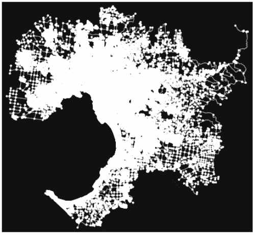

这段代码可能需要一段时间来运行。我们用`network_type='drive'`来获取行驶距离。其他网络类型也可用。例如，如果我们在步行距离之后，那么我们将代码调整为`network_type='walk'`。

现在，我们可以使用图表找到行驶距离:

```
orig_node = ox.distance.nearest_nodes(mel_graph, lon1, lat1)
target_node = ox.distance.nearest_nodes(mel_graph, lon2, lat2)
nx.shortest_path_length(G=mel_graph, source=orig_node, target=target_node, weight='length')
```

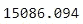

从位置 1 到位置 2 的最短行驶距离为 15，086.094 米。值得注意的是，从位置 2 到位置 1 的距离不一定与从位置 1 到位置 2 的距离相同。

我们可以创建一个计算距离的函数:

```
def calculate_driving_distance(lat1, lon1, lat2, lon2):
    # Get city and country name
    geolocator = Nominatim(user_agent="geoapiExercises")
    location = geolocator.reverse(f"{lat1}, {lon1}")
    address = location.raw['address']
    area = f"{address['city']}, {address['country']}" # Get graph for the city
    graph = ox.graph_from_place(area, network_type='drive', 
                                simplify=True) # Find shortest driving distance
    orig_node = ox.distance.nearest_nodes(graph, lon1, lat1)
    target_node = ox.distance.nearest_nodes(graph, lon2, lat2)
    length = nx.shortest_path_length(G=graph, source=orig_node, 
                                     target=target_node, weight='length')
    return length / 1000 # convert from m to kmsprint(f"{calculate_driving_distance(lat1, lon1, lat2, lon2):.2f} km")
```

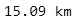

就是这样！如果你想了解更多关于这个库的信息，请查看 [OSMnx 用户参考](https://osmnx.readthedocs.io/en/stable/osmnx.html#)和 [OSMnx 示例](https://github.com/gboeing/osmnx-examples)。


照片由[粘土堤](https://unsplash.com/@claybanks?utm_source=medium&utm_medium=referral)在 [Unsplash](https://unsplash.com?utm_source=medium&utm_medium=referral) 上拍摄

*您想访问更多这样的内容吗？媒体会员可以无限制地访问媒体上的任何文章。如果您使用* [*我的推荐链接*](https://zluvsand.medium.com/membership)*成为会员，您的一部分会费将直接用于支持我。*

谢谢你看我的帖子。如果你感兴趣， 以下是我的一些帖子的链接:
◼️ [用这些技巧充实你的 Jupyter 笔记本](/enrich-your-jupyter-notebook-with-these-tips-55c8ead25255)
◼️ [用这些技巧整理你的 Jupyter 笔记本](/organise-your-jupyter-notebook-with-these-tips-d164d5dcd51f)
◼️ [有用的 IPython 魔法命令](/useful-ipython-magic-commands-245e6c024711)
◼️[Python 虚拟数据科学环境简介](/introduction-to-python-virtual-environment-for-data-science-3c216929f1a7)
◼️[git 数据科学简介](/introduction-to-git-for-data-science-ca5ffd1cebbe?source=your_stories_page-------------------------------------)
◼️ [你会发现有用的 python 中的简单数据可视化](/simple-data-visualisations-in-python-that-you-will-find-useful-5e42c92df51e)
seaborn(python)
◼️️[给熊猫用户的 5 个建议](/5-tips-for-pandas-users-e73681d16d17)
◼️️ [在熊猫中编写 5 个常见的 SQL 查询](/writing-5-common-sql-queries-in-pandas-90b52f17ad76)

再见🏃💨