# 使用无监督学习寻找平面布置图上的“m”细节

> 原文：<https://towardsdatascience.com/finding-m%C2%B2-details-on-a-floorplan-using-unsupervised-learning-f8f8891befa9>

## 使用 opencv、pytesseract、scikit-learn 和 pandas


斯文·米克在 [Unsplash](https://unsplash.com?utm_source=medium&utm_medium=referral) 上的照片

由于可以在搜索中应用个性化过滤器，在网上浏览一处房产会带来无数好处。然而，有一个非常重要的过滤器被遗漏了(至少对于像[ [1](https://www.rightmove.co.uk/) ，[ [2](https://www.zoopla.co.uk/) ]这样的英国房产搜索网站来说是这样的):房产的**平方英尺分割。**

有很多情况下，我会发现一个伟大的财产(大小，位置，价格等。)直到我看到它的平面图细节。如果我们可以根据房间的平方米来过滤属性结果，那将会节省我们很多时间。因此，我决定做一个实验，看看如何提取给定房地产广告平面图上的所有“m”细节。

## 介绍

在这篇文章中，我阅读了一个在线平面图图像并对其进行了处理，然后解释了为什么我使用无监督学习算法将相关的文本块分组在一起，演示了进一步的清理并测试了几个不同平面图图像的结果。 [**在结论部分**](#131c) ，我提到了我遇到的局限性和任何改进的空间(隐喻性的)。

## 步骤:

[**第一步:**读取并处理输入的平面图图像(opencv)](#da5b)
[**第二步:**检测字符及其位置(pytesserac)](#1048)
[**第三步:**聚类字符(scikit-learn)](#ed4c)
[**第四步:**处理聚类(熊猫)](#f803)
[**测试:**](#7551)

## 导入库

我们需要以下内容:

```
from matplotlib import pyplot as plt
import cv2
import numpy as npimport pandas as pd
pd.set_option('display.max_rows', 500)
pd.set_option('display.max_columns', 500)
pd.set_option('display.max_colwidth', 500)%matplotlib inline
plt.rcParams["figure.figsize"] = (40,20)import pytesseract
pytesseract.pytesseract.tesseract_cmd = r'/usr/local/bin/tesseract/'from sklearn.preprocessing import StandardScaler
from sklearn.cluster import DBSCAN
```

## 步骤 1:读取和处理输入图像

我们可以很容易地阅读如下平面图图像:

```
img = cv2.imread('Dummy Floorplanner Input Image.png')plt.imshow(img)
```


按作者输入图像

我们正在处理输入图像，这样，当输入到 pytesseract 时，它可以揭示更多关于文本块的信息。请阅读下文了解更多关于阈值的信息。

[](https://pyimagesearch.com/2021/04/28/opencv-thresholding-cv2-threshold/)  

经过处理后，我们的输入图像如下所示:

```
gray = cv2.cvtColor(img, cv2.COLOR_BGR2GRAY)
blur = cv2.GaussianBlur(gray, (3,3), 0)
thresh = cv2.threshold(blur, 0, 255, cv2.THRESH_BINARY_INV + cv2.THRESH_OTSU)[1]
plt.imshow(gray)
plt.imshow(blur)
plt.imshow(thresh)
```

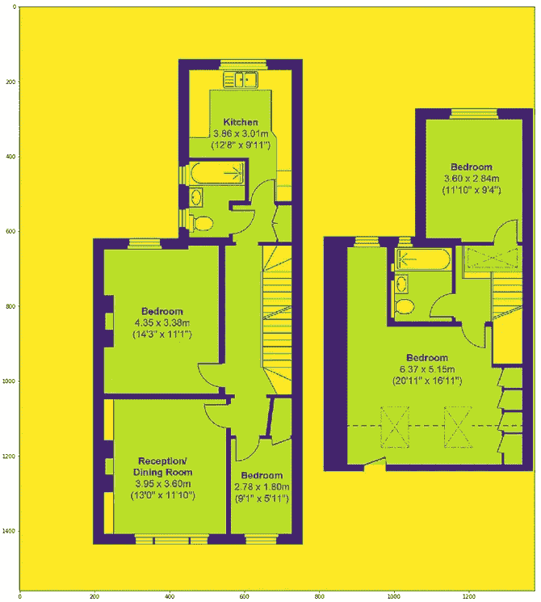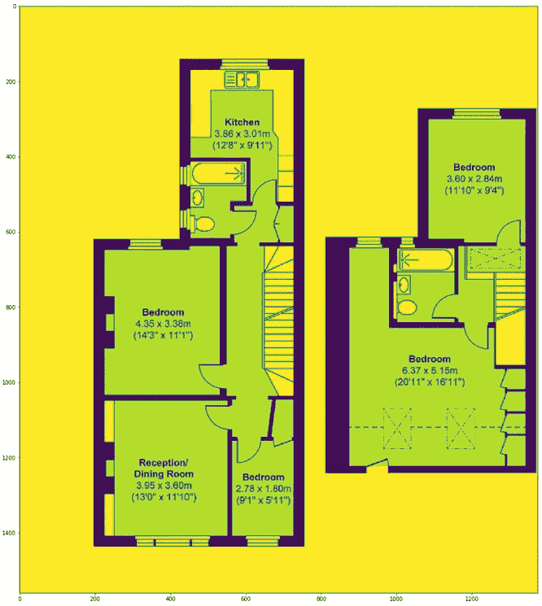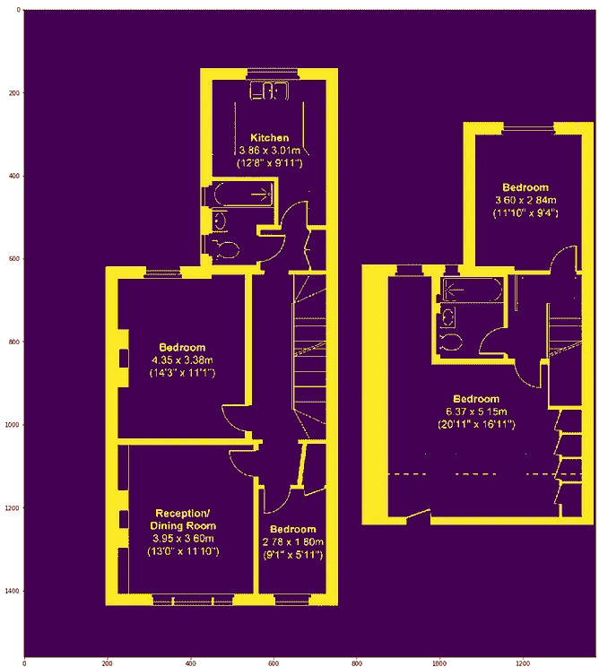

按作者分类的图像(灰色、模糊、阈值)

## **第二步:**检测字符及其位置

Pytesseract 从左上到右下开始读取图像像素(就像看书一样)。因此，如果一个房间的信息与另一个房间的信息在同一水平层上，那么两个房间的文本将被连接到一个房间，并且没有逻辑方法来正确解析完整的字符串，如下所示(餐厅和卧室的名称和尺寸被连接)。

```
print(pytesseract.image_to_string(thresh))
```

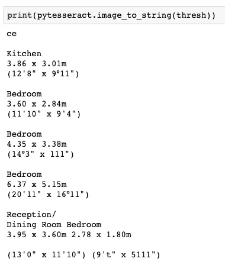

作者图片

幸运的是，还有另一个 pytesseract 函数(image_to_boxes)可以检测每个字符及其在图像上的位置。

```
df_img = pd.DataFrame([x.split(' ') for x in pytesseract.image_to_boxes(thresh).split('\n')],                     columns=['char', 'left', 'top', 'width',        'height', 'other'])df_img = df_img[ ~ df_img['left'].isnull()]# dropping whitespace characters like
# [',' '.' '/' '~' '"' "'" ':' '°' '-' '|' '=' '%' '”']df_img = df_img[ ~ df_img['char'].str.contains(r'[^\w\s]')].reset_index(drop=True)df_img[['left', 'top', 'width', 'height']] = df_img[['left', 'top', 'width', 'height']].astype(int)df_img.head(20)
```


作者图片

让我们根据这些字符的 x-y 坐标来绘制它们。

```
fig, ax = plt.subplots()ax.scatter(df_img['left'].tolist(), df_img['top'].tolist())for i, txt in enumerate(df_img['char'].tolist()):
    ax.annotate(txt, (df_img['left'].tolist()[i],
                      df_img['top'].tolist()[i]), 

                textcoords='data', 

                fontsize=28)
```

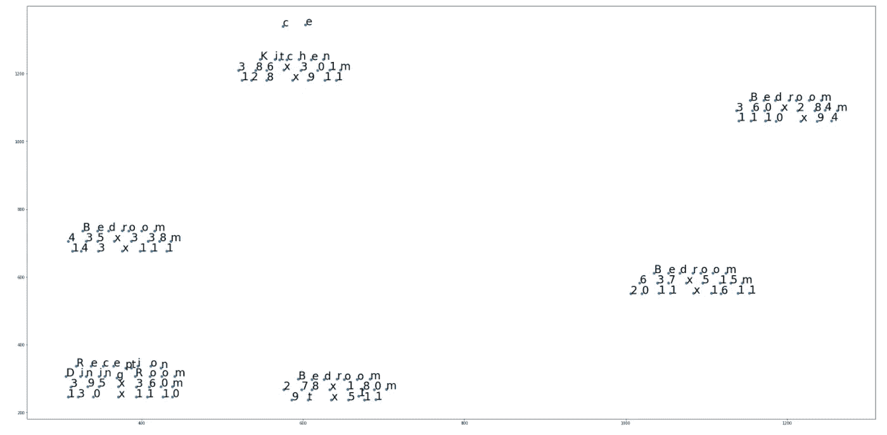

作者图片

基本上，我们需要对近距离内的数据点(字符)进行分组。

## **第三步:**聚类字符

如果需要，请阅读下面的帖子来了解 DBSCAN 是如何工作的。

[](/dbscan-clustering-explained-97556a2ad556)  

使用 DBSCAN，我们能够将相关的字符块组合在一起。当该聚类算法预测值为-1 时，该数据点被视为异常值。

```
X = StandardScaler().fit_transform(df_img[['left', 'top']].values)db = DBSCAN(eps=0.19, min_samples=10)db.fit(X)y_pred = db.fit_predict(X)
plt.figure(figsize=(10,6))
plt.scatter(X[:,0], X[:,1],c=y_pred, cmap='Paired')
plt.title("Clusters determined by DBSCAN")df_img['cluster'] = pd.Series(y_pred)
df_img.groupby(['cluster'])['char'].apply(lambda x: ' '.join(x)).reset_index()
```

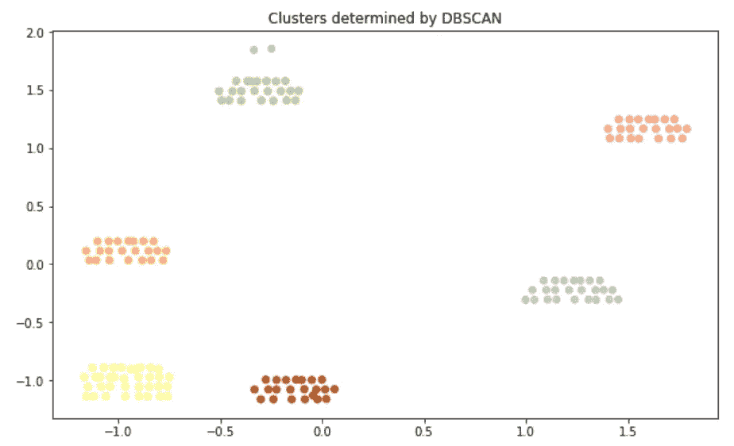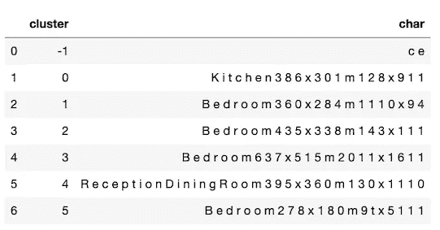

作者提供的图片

从上面的图像中我们可以看到，聚类算法在对平面图图像上的字符进行分组时工作得非常好。然而，它仍然需要一些进一步的清洁和处理。

## 步骤 4:处理集群

通常，在平面图上，我们有位置的类型(卧室、厨房、花园等。)，其尺寸以米为单位，最后以英尺为单位。有了这些信息，我们可以假设我们第一次看到一个聚类的数字是我们可以连接文本的最低水平。换句话说，在一个群中，如果在一个数字第一次出现的级别之下有一个数字，这可能是一个平方英尺信息。让我们从数据框中删除所有平方英尺(不是米)的行。

```
df_cc = df_img.copy().reset_index(drop=True)for cluster_no in df_cc['cluster'].unique():

    index_char_top_list = []

    # if the data point is not an outlier
    if cluster_no!=-1:

        index_char_top_list = [(index, char, top) for index, char, top in 

            zip(df_cc[(df_cc['cluster']==cluster_no)].index, 
                df_cc[(df_cc['cluster']==cluster_no)]['char'].values, 
                df_cc[(df_cc['cluster']==cluster_no)]['top'].values)ifchar.isdigit()] if index_char_top_list:

        df_cc = df_cc[~ ((df_cc['cluster']==cluster_no) & (df_cc['top'] <= ( index_char_top_list[0][2] - 5 ))) ]df_img.shape[0], df_cc.shape[0]
# (149 rows went down to 104 rows)
```

让我们创建一个函数，它可以将一串数字解析成宽度、长度维度。

```
def dimension_splitter(input_text):

    input_text_len = len(input_text) if input_text_len%2==0:
        split_text_by = int(input_text_len/2)
    else:
        split_text_by = int(input_text_len/2+0.5)

    dim1 = input_text[:split_text_by] dim2 = input_text[split_text_by:]

    dim1 = float('{}.{}'.format(dim1[:-2], dim1[-2:])) dim2 = float('{}.{}'.format(dim2[:-2], dim2[-2:])) return dim1, dim2
```

让我们对清理后的聚类数据框进行分组，并引入维度列。

```
df_cc_grouped = df_cc.groupby(['cluster'])['char'].apply(lambda x: ' '.join(x)).reset_index(name='text')df_cc_grouped['text_digits'] = df_cc_grouped.apply(lambda x: ''.join([y for y in x['text'] if y.isdigit()]), axis=1)df_cc_grouped['text_digits_len'] = df_cc_grouped.apply(lambda x: len([y for y in x['text'] if y.isdigit()]), axis=1)df_cc_grouped = df_cc_grouped[(df_cc_grouped['cluster']!=-1) & 
                              (df_cc_grouped['text_digits_len']>=5)].reset_index(drop=True)df_cc_grouped['room'] = df_cc_grouped.apply(

    lambda x: x['text'][:[x.isdigit() for x in x['text']].index(True)].strip()

                                                      , axis=1)df_cc_grouped['length'] = df_cc_grouped.apply(lambda x: dimension_splitter(x['text_digits'])[0]

                                                      , axis=1)df_cc_grouped['width'] = df_cc_grouped.apply(lambda x: dimension_splitter(x['text_digits'])[1]

                                                     , axis=1)df_cc_grouped['surface'] = np.round(df_cc_grouped['length'] * df_cc_grouped['width'], 2)df_cc_grouped
```

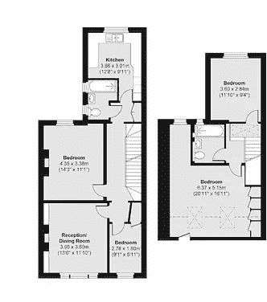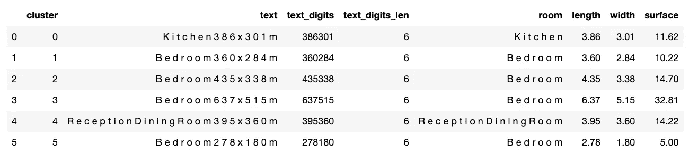

作者提供的图片

我们可以正确地提取所有的平方米信息。让我们看看我们的逻辑是否适用于其他图像。

## 试验

在第一项测试中，在检测步骤中，pytesseract 误读了“接待室”中的一些字母，并在检测到 Utility 之前多加了一个“a”。然而，在此之后，无监督学习如预期那样工作，并正确地揭示了所有信息。

```
img_test1 = cv2.imread('Dummy Floorplanner Test 1.png')plt.imshow(img_test1)df_cc_grouped_test1
```

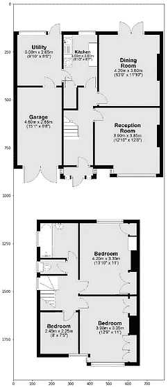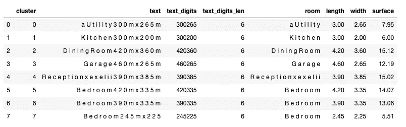

作者提供的图片

执行第 2 号测试时没有出现任何问题。

```
img_test2 = cv2.imread('Dummy Floorplanner Test 2.png')plt.imshow(img_test2)df_cc_grouped_test2
```

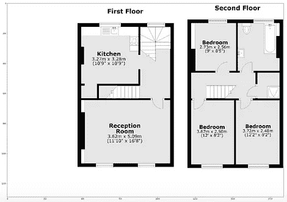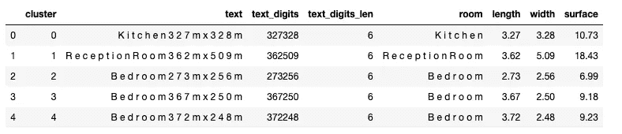

作者提供的图片

尽管平面布局不同(纵向或横向)，我们能够在大多数地方提取平方米信息。

**结论**

在这篇文章中，我演示了如何使用 OCR 库(pytesseract)来检测房地产平面图上的字母和数字，然后使用无监督学习算法(DBSCAN)来收集相关信息，以找到每个房间的平方米信息。

如果 pytesseract 可以正确地检测字符，我们可以毫无问题地找到房产的平方米分割。我们利用了这样一个事实，即英国的房产平面图具有几乎相同的结构:(1)房间的类型，下面的尺寸(2)米，下面的尺寸(3)英尺。但是，该脚本需要进一步开发，以处理具有不同结构的平面图图像，或者对缺失/未检测到的数据进行一些科学猜测。

感谢阅读！