# 用交互式混淆矩阵和折线图寻找不平衡分类的最佳分类阈值

> 原文：<https://towardsdatascience.com/finding-the-best-classification-threshold-for-imbalanced-classifications-with-interactive-plots-7d65828dda38>

## 使用 binclass-tools amazing Python 包将您对二进制分类问题的分析提升到一个新的水平

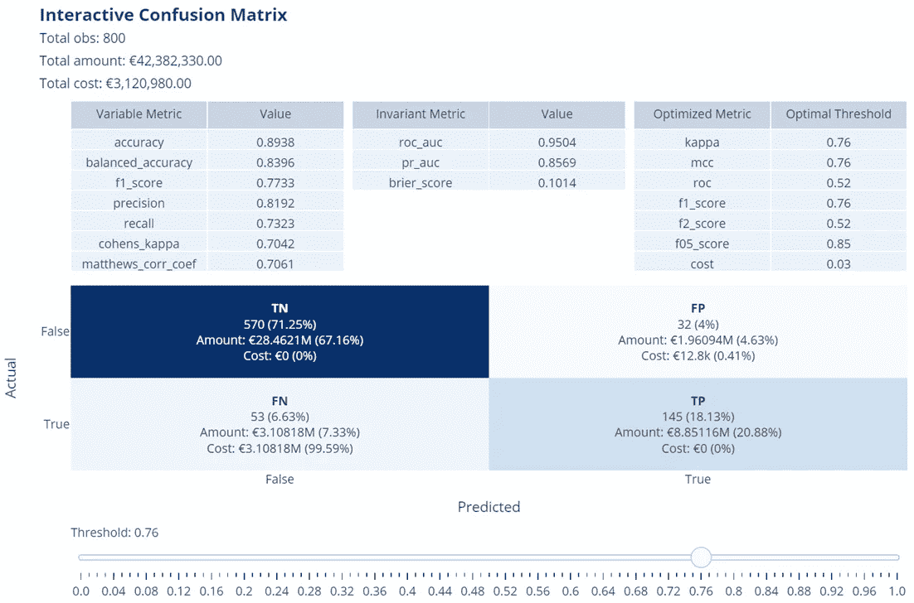

作者图片

即将训练分类模型的数据科学家经常发现自己在分析产生的*混淆矩阵*以查看模型的性能是否令人满意。让我们仔细看看这是怎么回事。

## 引入混淆矩阵

术语“混淆”是指一个观察值可能被模型正确或错误地预测，然后在分类中被混淆。如果我们考虑一个二元分类模型(其可能的结果只有两个，例如，*真*或*假*)，该模型的混淆矩阵是一个矩阵，该矩阵组织了为测试数据集的目标变量(作为模型的输入给出)获得的与该变量在数据集中呈现的真值相关的预测输出。通过这种方式，可以识别正确预测的数量和错误预测的数量(*假阳性*和*假阴性*)。将问题中感兴趣的类别定义为*正*(例如，交易是欺诈性的，因此*真*是正类别)，**假正**是那些预测为真(预测的正类别)，但实际上不是(假预测)的观察；**假阴性**则是那些观测值被预测为假(负类预测)，而实际上不是(假预测)。理解了这些定义，你就可以自己推导出*真阳性*和*真阴性*的含义。

模型结果的这种排列允许理解模型的性能是否如预期的那样。通常，二元模型的混淆矩阵如下所示:

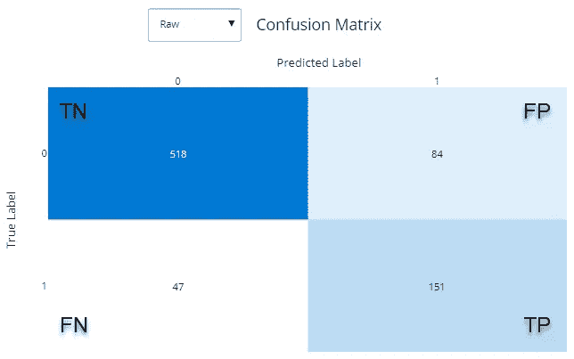

图 1-二元分类的混淆矩阵示例(作者图片)

一旦确定了混淆矩阵的 4 个象限的值，就有可能确定测量模型性能的定量和定性指标，如参考文献所示(见参考文献 1)。1).

乍看起来，混淆矩阵的四个象限的值对于被分析的模型是不变的。然而，在幕后，这些值是基于一个非常具体的假设计算出来的。

## 注意分类阈值

二元分类模型主要为目标变量中的每个类返回相似概率得分，该得分提供了一种度量方法，用于衡量针对该观察值获得的预测为正类的可能性。如果您使用 Python 来训练分类模型，我们讨论的分数通常是通过 Scikit-learn `predict_proba`函数获得的。该分数具有以下属性:

*   它是一个介于 0 和 1 之间的实数
*   将把一个观察关联到正面类的分值和把同一观察关联到负面类的分值相加，我们得到 1

任何学过一点数学的人都会认识到，这些属性与概率度量的定义是相同的。然而，我们的分数并不是一个真正的概率度量，即使通过应用一种称为 [*模型校准*](https://kiwidamien.github.io/are-you-sure-thats-a-probability.html) 的变换，有可能使我们的分数近似于一个概率度量。也就是说，我们之前讨论的关于混淆矩阵值的假设如下:

> 通常，考虑到如果得分大于或等于 0.5，则预测是正类，如果得分小于 0.5，则预测是负类，来计算与二元分类模型相关联的混淆矩阵所示的 TP、TN、FP、FN 的值

前一语句的 0.5 值被称为**分类阈值**，可以在 0 和 1 之间变化。为了理解阈值的用途，假设您已经训练了一个二进制分类模型来检测房屋火灾中的烟雾。您的模型将在安装于厨房的真实烟雾探测器中实现。现在假设测试产品的实验室将探测器安装在烤肉的炉子附近。如果传感器阈值设置得较低，在烤肉时，探测器很可能会报告火灾(*假阳性*)。为了使探测器更可靠，实验室技术人员应该在几次实验后将阈值增加到被认为适合识别真实火灾的值。

改变阈值，我们去修改预测的类。例如，使用阈值 0.5(得分 0.54 大于阈值 0.5，因此观察结果为真)分类为*真*的观察结果，如果阈值变为 0.6(得分 0.54 小于阈值 0.6，因此为假)，则变为*假*。因此，通过改变阈值，我们前面提到的所有定量和定性指标(例如，*精度*和*召回*)也会发生变化。所以，很明显:

> 分类器性能随着阈值的变化而变化

因此，您应该很好地理解，使用默认值为 0.5 的阈值的分类器可能会导致低质量的结果，尤其是在处理*不平衡数据集*时，因为不平衡数据的概率分布往往偏向多数类。

在这一点上，一旦模型已经被训练，问题是:“好的，现在我应该为我的模型使用什么阈值？”。通常适用于任何复杂决策情况的坏消息是:

> 不存在适用于所有情况的最佳阈值。这取决于要满足的业务需求。

在我们详细讨论阈值调整的不同情况之前，让我们快速提醒一下最常用于*不平衡分类*的指标，它们是更复杂的训练和测量模型。

# 不平衡分类的评价指标

让我们回想一下下面一些对初学者有用的基本概念，以便能够测量不平衡二进制分类的性能。当所分析的情况不同时，同样的概念将有助于解释最佳阈值。

## 精确度-召回率的权衡

假设您需要训练一个二进制分类模型来检测欺诈性信用卡交易。这是一个典型的*不平衡问题*，对于这个问题，感兴趣类别(欺诈交易=正类别)中的标签数量远远小于负类别中的标签数量。在这种情况下，为了评估分类器，经常考虑的度量是*精度*和*召回*(在平衡问题的情况下，经常考虑*灵敏度*和*特异性*)。

现在，需要提出的问题是:“将健康交易归类为欺诈更严重，还是将欺诈交易归类为健康更严重？”。如果对一个健康的事务强制进行检查，那么您的成本就是检查所需的时间。另一方面，如果欺诈性交易被错误分类为健康的，欺诈的成本显然高于前一种情况。

被错误分类为健康(负面类别)的欺诈交易(正面类别)属于*假阴性* (FN)集合。当 FNs 减少时，一个增加的指标(保持 TPs 数量不变)就是*回忆*。事实上，看看回忆的定义，我们有:

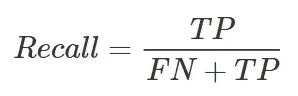

图 2 —回忆的定义(作者提供的图片)

从上面的公式可以明显看出，如果我们想通过使 fn 的数量趋向于 0 来最小化 fn 的数量，那么召回的值将趋向于 TP/TP = 1。

所以，首先要做的是将阈值移动到使回忆最大化的值 1。不幸的是，人们会发现，要使回忆趋于 1，必须将阈值移动到非常接近 0。但这将意味着把几乎所有的交易都归类为欺诈！实际上，召回公式中不存在的假阳性(FPs)的数量不成比例地增长，并且分类器在所有被预测为欺诈的观察结果中辨别实际上是欺诈的观察结果的能力被取消。换句话说，名为 Precision 的指标值急剧下降到零，这可以从下面定义它的公式中看出:

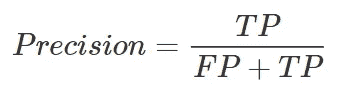

图 3——精度的定义(图片由作者提供)

从上式可以看出，如果 FPs 趋向于比 TP 大得多的数 N，精度就会趋向于 TP/N~0

你所了解的是著名的*精确-召回权衡*，它包括以下内容:

> 不可能同时拥有高精度和高召回率，除非你处理的是一个完美的模型(FP = FN = 0)。对于不太完美的模型，如果提高精度，就会降低召回率，反之亦然。

下面显示了一个示例模型的精度-召回曲线，展示了上述权衡:

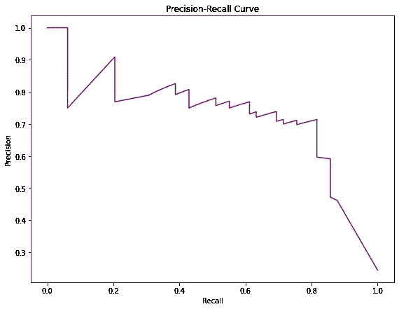

图 4——精确召回曲线(图片由作者提供)

为了兼顾精确度和召回率，我们可以考虑由两者的调和平均值给出的度量，也称为*F1-得分*:

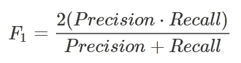

图 5—F1 的定义(图片由作者提供)

如果您希望对其中一个定义指标给予更多权重，您可以通过引入“不平衡”β系数来推广该公式:

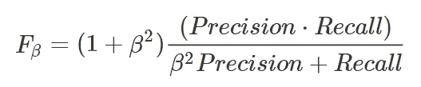

图 6-F-beta 的定义(作者提供的图片)

例如，如果您认为召回率是精确度的两倍，那么您可以将β设置为 2。反过来，如果你相信精度比召回率重要 2，那么β就会。

回到我们的欺诈交易问题，已经确定召回比精确度重要得多，您可以考虑β > 1 并优化阈值，以便 F 分数取最大值。

## 从精确度、召回率和 F 值到马修斯相关系数

有一个重要的事实需要考虑。精度和召回率(以及 F 值，F 值是两者的函数)将正面类视为感兴趣的类，回答以下问题:

> "在所有肯定预测的例子(FP + TP)中，有多少肯定检测(TP)是正确的？"(精度)
> 
> “在所有实际的正面例子(FN + TP)中，我们能够识别多少正面例子(TP)？”(回忆)

如果你仔细看上面的定义，**真否定** (TN)从来不会出现。如果感兴趣的类(较罕见的类)被标记为正的(大多数情况下都是这样)，这就不是问题。例如，在这种情况下，F1 分数仍然是不平衡分类的有效指标。事实上，如果模型没有正确地预测负类，则不正确的预测将馈入 FPs。因此，精度的值将减少，因为它被定义为 TP/(FP+TP)，因此 F1-score 的值也将减少。总之，在这种情况下，较少的负类正确预测了较低的 F1 分数。

有时可能发生的情况是，感兴趣的类没有被标记为正面的，而是被标记为负面的。在这种情况下，F1 值会误导对问题的正确分析。有关更多详细信息，请查看参考资料(参考。7).

因此，需要引入一种新的度量，该度量也将 TNs 考虑在内，并且不管正类分配如何都是稳定的。

那些研究过一些统计学的人肯定遇到过*克拉默相关系数* ( *克拉默相关系数 V* )，它测量两个分类变量之间的关联强度。1975 年，Brian W. Matthews 引入了一个相关系数，它是应用于 2x2 混淆矩阵的 cramér V 的一个特例。我们正在讨论的**马修斯相关系数** (MCC)定义如下:

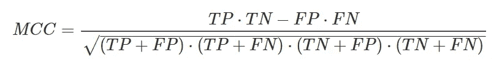

图 7 —马修斯相关系数的定义(图片由作者提供)

与通常的相关系数一样，MCC 也取[-1，1]范围内的值。在分类的情况下，值-1 表示模型预测正类和负类的方式与它们在目标变量中呈现的实际值完全相反。如果 MCC 取值为 0，则模型随机预测正类和负类。在值为 1 的情况下，模型是完美的。此外，如果正类被重命名为负类，MCC 是不变的，反之亦然。MCC 的主要特点如下:

> 只有当模型能够正确预测大多数正面观察值和大多数负面观察值时，MCC 才是唯一得分高的指标。

在快速回顾了不平衡分类问题(处理起来最复杂)中最常用的指标之后，我们可以回到文章的主题，即如何在这些情况下设置阈值。

# 为您的模型选择正确的阈值

确定阈值的“最佳值”意味着找到使特定目标函数最大化或最小化的值，该值衡量模型的良好性，并适合要解决的业务问题。归根结底，这是一个优化问题。

基本上，有两种优化阈值的方法:

*   基于特定*指标的优化*
*   基于*成本*的优化

在第一种情况下，选择感兴趣的**度量**(例如，F2 分数，或 MCC)并识别所选度量指示模型的最大性能的阈值(意味着必须根据其性质最大化或最小化度量)。

另一方面，在第二种情况下，使用所谓的**成本矩阵**，由此成本可以与混淆矩阵的每个类别相关联。这样，通过最小化与每个类别相关联的成本的总和来给出最佳阈值。

一旦确定了感兴趣的目标函数，不管它是度量还是成本，也不管它是需要最大化还是最小化，都有可能通过操作所谓的**阈值移动**来找到最佳阈值:

1.  将阈值从 0 变化到 1，步长例如为 0.01，记录每个阈值的目标函数值。
2.  选择使函数最大化(或最小化)的阈值。

然而，以这种方式识别的值将严格依赖于训练数据集，并且它可能不是阈值的最佳值的良好估计。

最近开发了一种通用方法，该方法总是基于从训练数据集获得的目标函数值，称为 **GHOST** ( **G** 一般化 T**H**resh**O**LD**S**HIF**T**ing 过程)。总之，它使用通过分层随机抽样提取的训练数据集的 N 个子集，以便它们保持类别分布。然后，对于每个子集，它应用由每个阈值给出的目标函数。这样，对于每个阈值，将有由 N 个子集给出的目标函数的 N 个值。此时，它会计算上述值的每个阈值的中值，因此您只能获得一个与阈值相关的“稳定”值。您可以在参考资料中找到更多详细信息(参考。8).

# 使用 binclass-tools Python 包控制一切

现在，深入分析的所有方面的总体情况都更清楚了，您很好地理解了主要困难之一是随着阈值的变化，要有手头上最重要的指标的视图。只有这样，您才能够根据所选择的业务标准，快速了解模型的性能何时接近期望的性能。

正是这种需求促使我开发了一个新的 Python 包，其中包含一些用于这种类型分析的有用工具。我们正在谈论令人惊奇的 **binclass-tools** 软件包:

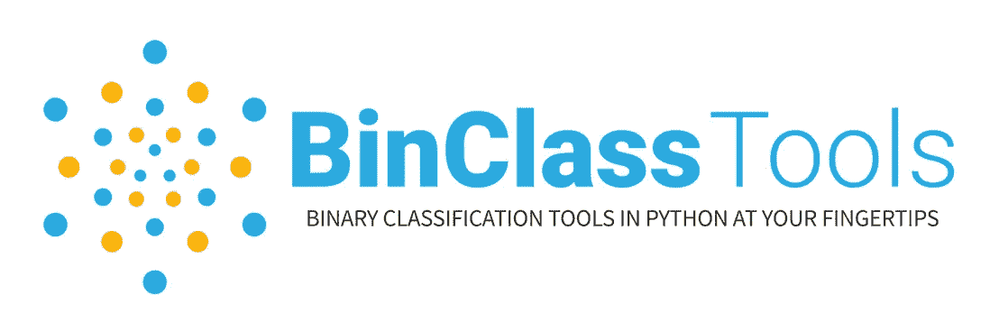

图 8—bin class-tools 包的徽标(图片由作者提供)

让我们看看这个包提供的一些最重要的工具。

## 交互混淆矩阵

软件包中最有趣的工具之一是**交互式混淆矩阵**，这是一个交互式图表，允许您查看二进制分类的最重要指标如何随着阈值的变化而变化，包括与矩阵中的类别相关联的任何金额和成本:

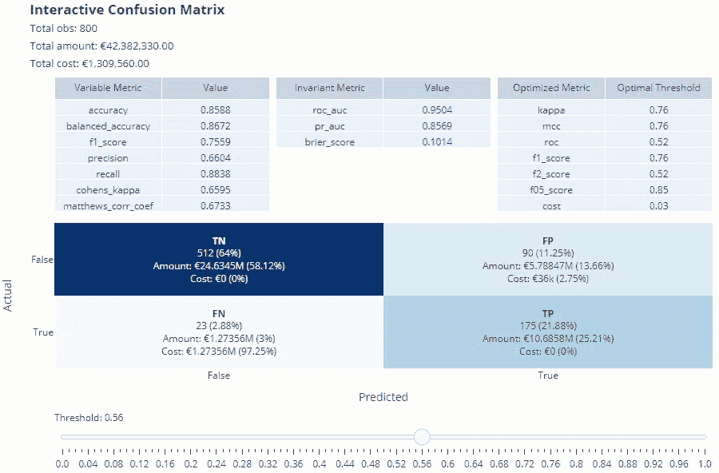

图 9 —交互式混淆矩阵的实例

从*图 9* 中可以看出，阈值与范围从 0 到 1 的滑块相关联，具有用户选择的步长(在本例中为 0.02)。随着滑块的移动，一些显示的测量和指标会相应地改变。

剧情分为两部分:

*   底部是**混淆矩阵**，它突出显示了属于 TP、TN、FP、FN 类别的观察数量以及与单个观察相关的数量或成本的可能度量。这是因为通过对从训练数据集的一列中获取的单个观察值进行求和来查看与每个类别相关联的总量如何变化可能会很有趣。类似地，通过对每个观察的平均成本或每个观察的成本列表中的值求和，来查看与每个类别相关联的总成本如何变化可能是有趣的。这些值显然会随着阈值的变化而变化，每个值旁边都显示了它在总数中所占的百分比值
*   最上面是三张桌子。左边的第一个包含所有依赖于阈值的度量，因此将随着载玻片的移动而变化(例如，准确度、F1 分数等。).另一方面，中间的表包含所有那些随着阈值变化而不变的指标(例如 ROC AUC 或 PR AUC)。只有在调用生成图的函数时指定了右边的第三个也是最后一个表，并且该表包含相对于左边的列中显示的指标而言最佳的所有阈值时，该表才会出现。目前可以优化的指标有 Cohen's kappa、Matthews 相关系数、ROC 曲线、F1-得分、F2-得分、f 0.5-得分和成本。在 1.1.0 版之前，最佳阈值的计算是通过 GHOST 完成的(如前一节所述)。从版本 1.1.0 开始，图中显示的最佳阈值只是与给定数据集的已实施指标的最佳值相关联的阈值(即:最大化 F 分数、MCC 和 Kappa 以及最小化成本的阈值)。实现 GHOST 方法的函数在包中仍然可用，并可用于获得通常优化给定指标的阈值(最佳实践:使用训练集进行优化，并对新数据使用这些阈值)。

使用交互混淆矩阵分析二元分类器的预测的便利性是毋庸置疑的。同样，显示阈值变化时金额或成本趋势的图表也是有用的。

## 交互式混乱折线图

从通过交互式混淆矩阵完成的分析中，分析师可能不仅对看到一个值感兴趣，而且对可视化与混淆矩阵的每个类别相关联的可能数量或成本的趋势感兴趣，因为阈值改变。这就是为什么 *binclass-tools* 包也允许你绘制**交互混淆线图**:

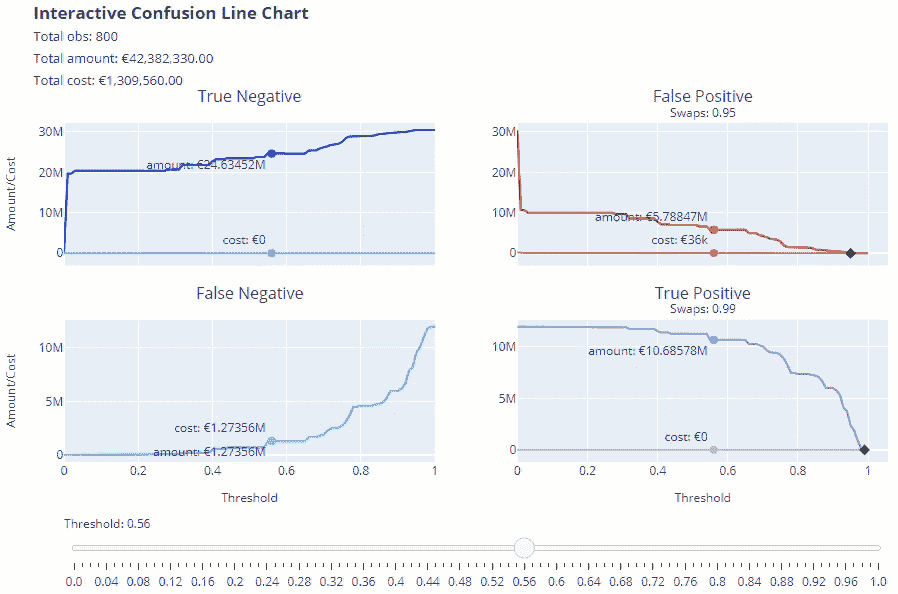

图 10 —交互式混淆折线图的实例

您可以从*图 10* 中观察到，除了代表所选阈值下的金额/成本的 4 个图中的每一个图都有一个点之外，还有黑色的“菱形”表示金额和成本曲线互换的第一个阈值。曲线交换点也可以多于一个。

如果分析师希望关注混淆矩阵中任何类别组合的总金额或成本值，还有另一个非常有用的图。

## 交互式金额-成本折线图

假设您想帮助一家公司的团队使用欺诈检测分类器分析可能的欺诈。假设分类器将欺诈类检测为阳性，分析师可能会提出以下观点:

*   如果模型检测到 TPs，则交易金额从可能的欺诈中“节省”出来，因此可以认为是公司的收益。
*   所有被分类为良好但实际上是欺诈的观察结果(因此 FNs)实际上都是与相关交易总额相等的损失。因此，它们是成本。
*   此外，团队必须对模型预测为欺诈但实际上不是欺诈的所有交易(FPs)进行检查，这也是成本，尽管在数量上小于与欺诈相关的成本。在这些情况下，通常考虑每次检查的固定成本。

如果现在分析师想要比较他认为的收益(TPs 数量)的表现和他认为的损失(FNs 数量+每 FP 的固定成本)的表现，他可以通过**交互式数量-成本折线图**来完成:

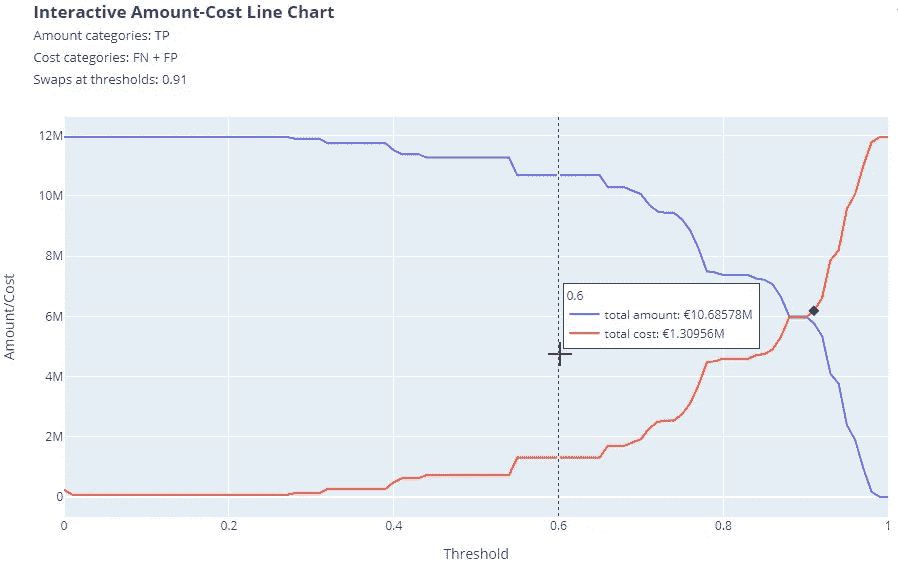

图 11 —交互式金额-成本折线图示例

同样在该图中，黑色“菱形”表示发生数量和成本曲线交换的第一个阈值。

在这一点上，基于分类器的损益分析的需求可以很容易地使用上述图来满足。

# 酷！但是我在哪里可以找到这个伟大的包呢？

一段时间以来，我一直在考虑将函数放在一个库中，以便对二进制分类器提供的结果进行交互式分析。由于我没有时间，Python(或 R)中的实现总是阻塞步骤。自从我得到一位同事的承诺，帮助我开发上述功能后，实现这个项目的可能性变得更加现实。这就是为什么所有这些想法的实现都要归功于 Greta Villa 的 Python 专业知识。

也就是说，我决定在 GitHub 上以**开源**的形式提供这个项目，原因有两个:

*   我想与整个数据科学家社区分享一个工具，它可以使二元分类器的分析更加容易。
*   我依靠社区可能的帮助来建议新的特性，改进现有的代码，或者帮助我们开发软件包的未来版本。

*binclass-tools* 包在 PyPI 上发布[，所以您只需要下面一行代码就可以将它安装到您的 Python 环境中:](https://pypi.org/project/binclass-tools/)

```
pip install binclass-tools
```

有关如何使用软件包中包含的功能的更多详细信息，请参考 GitHub 页面:

[](https://github.com/lucazav/binclass-tools)  

还添加了交互式 ROC 和精确回忆图，您可以在本文中读到:

[](/roc-and-pr-curves-probabilities-distribution-and-density-plots-now-in-binclass-tools-python-9351681a3803) [## 走向数据科学

### binclass-tools Python 包中的 ROC 和 PR 曲线、概率分布和密度图](/roc-and-pr-curves-probabilities-distribution-and-density-plots-now-in-binclass-tools-python-9351681a3803) 

我们还将添加包装器，以简化未来版本中校准模型的操作。

欢迎对该包的任何反馈！

# 参考

1.  [如何确定分类模型的质量和正确性？第 2 部分—定量质量指标](https://algolytics.com/how-to-determine-the-quality-and-correctness-of-classification-models-part-2-quantitative-quality-indicators/)
2.  [什么是平衡和不平衡数据集？](https://medium.com/analytics-vidhya/what-is-balance-and-imbalance-dataset-89e8d7f46bc5)
3.  [不平衡分类评价指标巡礼](https://machinelearningmastery.com/tour-of-evaluation-metrics-for-imbalanced-classification/)
4.  [真实世界用例中的精度-召回权衡](https://medium.com/analytics-vidhya/precision-recall-tradeoff-for-real-world-use-cases-c6de4fabbcd0)
5.  [马修斯相关系数(MCC)在二分类评估中相对于 F1 分数和准确度的优势](https://bmcgenomics.biomedcentral.com/articles/10.1186/s12864-019-6413-7)
6.  [在二进制分类评估中，马修斯相关系数(MCC)比科恩的 Kappa 和 Brier
    分数](https://ieeexplore.ieee.org/stamp/stamp.jsp?arnumber=9440903)更具信息量
7.  [马修斯相关系数:何时使用，何时避免](/matthews-correlation-coefficient-when-to-use-it-and-when-to-avoid-it-310b3c923f7e)
8.  [GHOST:调整决策阈值处理机器学习中的不平衡数据](https://pubs.acs.org/doi/10.1021/acs.jcim.1c00160)