# 用机器学习寻找最好的开瓶器

> 原文：<https://towardsdatascience.com/finding-the-best-wordle-opener-with-machine-learning-ce81331c5759>

## 我是如何几乎和 3blue1brown 一样得出相同的开头词的


芬恩·哈克肖在 [Unsplash](https://unsplash.com/s/photos/words?utm_source=unsplash&utm_medium=referral&utm_content=creditCopyText) 上拍摄的照片

如果你正在看这篇文章，那么你可能听说过流行的网络游戏“Wordle”。这是一个非常容易上瘾、分裂家庭的脑筋急转弯，最近被《T4 时报》收购。这个游戏的目的是以尽可能少的尝试来猜测每日单词，通常是 5 个字母的单词。当你尝试不同的单词时，游戏会提供反馈，表明猜测的质量；灰色方块表示字母不在单词中，黄色方块表示字母在单词中但位置错误，绿色方块表示字母在单词中且位置正确。

为了在这个游戏中获得持续的成功，**玩家必须进行初步猜测，以揭示仅与 5 个字母单词的一小部分相关的模式**。也就是说，每次猜测都需要排除尽可能多的潜在答案，只给玩家留下几个词来选择下一次猜测。因此，自然的问题是“最好的第一个猜测是什么”？

许多人试图用数学和计算机模拟来回答这个问题。在我看来，最佳答案是由 Grant Sanderson(又名 3blue1brown)在一个视频中发现的，他在视频中使用了来自[信息论](https://en.wikipedia.org/wiki/Information_theory)的概念来寻找平均来说揭示了关于目标词的最多信息的开头词。

在这篇文章中，我将采用不同的方法，利用无监督学习来寻找最佳的 Wordle 开启器。我将首先展示如何创建一个数据集，以数字形式表示 5 个字母单词的分布，然后我将展示一个机器学习模型如何帮助我们找到与所有可能的 Wordle 解决方案“最相似”的世界。这篇文章的所有代码可以在这里找到。尽情享受吧！

# 属国

对于这个项目，我们需要在 Python 中进行以下导入:

```
import numpy as np
import pandas as pd
import matplotlib.pyplot as plt
import seaborn as sns
import string
import re
from collections import Counter
from tqdm import tqdm
from pyod.models.copod import COPOD
```

# 数据

和任何机器学习问题一样，我们需要一些数据来学习。截至今天，Wordle 将接受 12，972 个单词作为猜测。然而，在这些被接受的猜测中，只有 2315 个是解字。为了一致，我将把 12，972 个被接受的猜测称为“被接受的单词”，把 2，315 个解称为“解单词”。

让我们从查看“接受的单词”的字母频率开始我们的分析。我们首先从文本文件中读入单词:

```
def read_word_list(file_name:str):
    result = []
    with open(file_name) as fp:
        result.extend([word.strip() for word in fp.readlines()])
    return result# Read in word lists
possible_words_list = read_word_list("possible_answers.txt")
accepted_words_list = read_word_list("accepted_words.txt")
```

以下是“已接受单词”的列表:

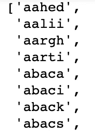

前 8 个“接受词”。图片作者。

以及“可能的单词”列表:

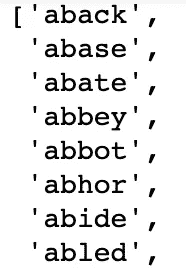

前 8 个“可能的单词”。图片作者。

然后，我们可以计算每个字母在所有“接受的单词”中的频率——这也可以理解为每个字母包含在单词中的比例。

```
# Create a letter occurrence dictionary 
words_string = ''.join(accepted_words_list)
letter_counts = dict(Counter(words_string))# Create letter frequency dictionary
letter_frequencies = {k:v/len(accepted_words_list) for k,v in letter_counts.items()}# Create letter frequency DataFrame
letter_frequencies = pd.DataFrame({'Letter':list(letter_frequencies.keys()),                      'Frequency':list(letter_frequencies.values())}).sort_values('Frequency',                                                                                  ascending=False)
```

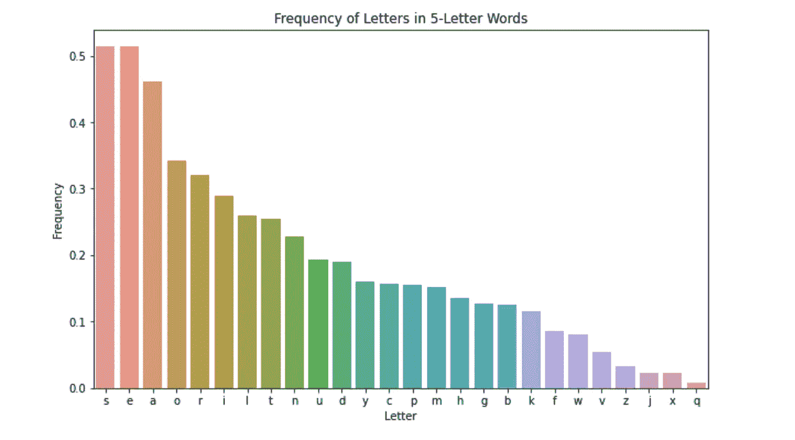

字母频率。图片作者。

这个柱状图让我们了解了“已接受单词”列表中每个字母的常见程度。例如，它告诉我们，字母“s”出现在超过 50%的“公认单词”中。

最初，人们可能会尝试使用原始频率作为一种好的初步猜测的方式。例如，我们最初的猜测可能是“soare ”,因为“soare”包含了最常出现的前 5 个字母。这样做的问题是，它没有考虑字母的相对顺序。以“soare”为例，一个单词包含一个“o”后跟一个“a”的情况非常罕见。事实上，这种情况只出现在 2315 个“可能单词”中的 23 个中:

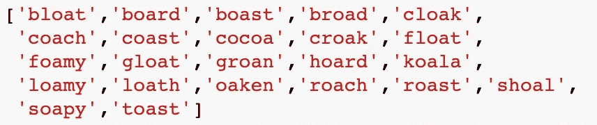

包含“oa”的 23 个“可能单词”。图片作者。

因此，使用“soare”作为第一个猜测最有可能得到一堆黄色方块。因此，我们需要创建一个数据集，它不仅要捕获字母的常见程度，还要捕获字母在单词中的排序方式。让我们先看看这个数据集是什么样子，以获得一些直觉，然后看看如何创建它。

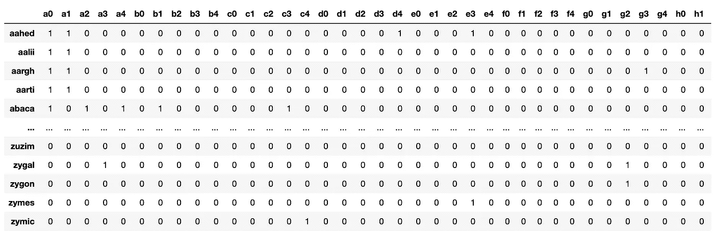

单词编码数据集。图片作者。

这个数据集中的每一行代表一个“接受的单词”，每一列告诉我们字母 *i* 是否在单词*中的位置 *j* 。*我们来看第一个词，“aahed”，作为例子。假设我们将每个单词看作一个包含 5 个元素的数组。那么我们将用下面的数组表示“aahed ”:

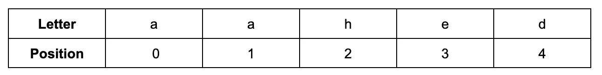

“aahed”数组表示。图片作者。

数据集中的每一行都代表这个数组编码:

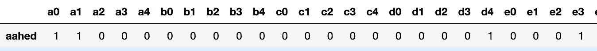

“aahed”的编码。图片作者。

列“a0”的值为 1，表示字母“a”位于单词的第 0 个位置(或第一个方块)。列“a1”的值为 1，表示字母“a”位于单词的第一个位置(或第二个方块)。列“d4”的值为 1，表示字母“d”位于单词的第四个位置(或第五个方块)。这个模式对单词中的每个字母都是如此。

因为字母表中有 26 个字母，而我们只考虑 5 个字母单词，所以数据集包含 26*5 = 130 列。每一列代表单词中的一个字母和一个位置，可以认为是一个 [**伯努利**](https://en.wikipedia.org/wiki/Bernoulli_distribution) 随机变量，因为它只能取{0，1}中的值。

我们可以用下面的代码创建这个数据集:

```
# Create letter/position occurrence matrix
letter_pos_freq = pd.DataFrame()# For each word in the list of accepted words
for word in tqdm(accepted_words_list):

    # Convert the word to it letter-position format
    word_and_pos = ''.join([f"{letter}{pos}" for pos, letter in enumerate(word)])

    # Create letter-position counter dictionary
    letter_pos_counter = {}
    for wp in letter_freq_cols:
        letter_pos_counter[wp] = len(re.findall(wp, word_and_pos)) tmp_pos_freq = pd.DataFrame(letter_pos_counter, index=[word])
    letter_pos_freq = pd.concat([letter_pos_freq, tmp_pos_freq]) 
```

这个数据集允许我们表示字母频率和字母排序。通过将我们的数据视为来自具有相依成分的多元伯努利分布，我们可以计算出我们想要的任何概率。例如，单词中第一个字母是“a”的概率由以下代码给出:

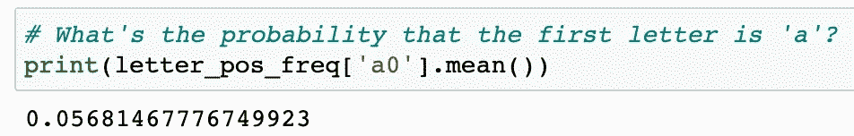

图片作者。

我们还可以看看更复杂的概率，比如假设前三个字母是“s”、“h”和“a”，那么第四个字母是“r”的概率:

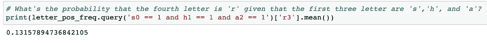

图片作者。

那么我们如何利用这个数据集找到最佳的开头词呢？继续读下去就知道了(悬念)。

# 基于 Copula 的孤立点检测模型

对于这个项目，我们将利用最常用于异常检测的最先进的无监督学习算法。如果你想知道算法背后的理论，请查阅[的论文](https://arxiv.org/abs/2009.09463)或者这篇[文章](/fast-accurate-anomaly-detection-based-on-copulas-copod-3133ce9041fa)。COPOD 算法的核心是试图通过逼近累积分布函数(CDF)来模拟数据集的潜在概率分布。然后，它可以使用近似的 CDF 为数据集中的每个观察值分配“异常值分数”,较高的分数表示该观察值位于分布的较低密度区域(更有可能是异常值)。

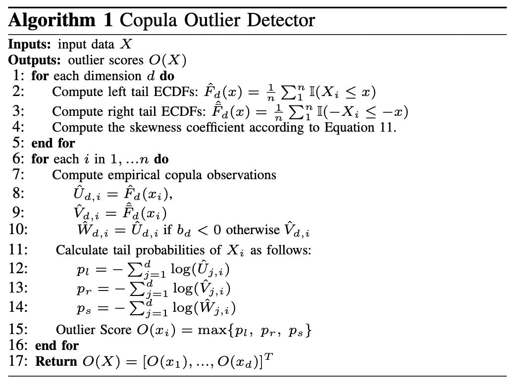

COPOD 算法。来源:[https://arxiv.org/pdf/2009.09463.pdf](https://arxiv.org/pdf/2009.09463.pdf)

我们不使用 COPOD 来查找离群值，而是使用它来查找内嵌值。也就是说，**我们要找到位于所有单词分布最可能位置的单词**。想象一下，我们可以以某种方式将每个单词表示为一个数字，这个数字编码了字母出现的频率以及它们通常是如何排序的。然后，假设这个分布是对称的，我们可能会选择最接近分布平均值的世界作为我们的初始猜测。

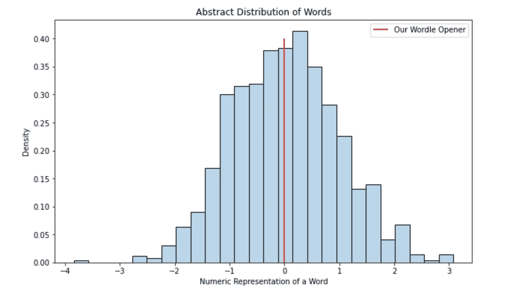

图片作者。

粗略地说，这就是我们试图通过将 COPOD 算法应用于我们的数据集来实现的。

# 模型——实施和结果

让我们将 COPOD 算法应用于我们的数据集，并查看它认为哪个单词具有与单词分布的“核心”最接近的结构。为简单起见，我们将只考虑“可能的单词”:

```
letter_pos_freq_possible = letter_pos_freq[letter_pos_freq.index.isin(possible_words_list)]# Drop columns with all zeros
for col in letter_pos_freq_possible.columns:

    if letter_pos_freq_possible[col].sum() == 0:
        letter_pos_freq_possible.drop(col, axis=1, inplace=True)
        letter_pos_freq.drop(col, axis=1, inplace=True)
```

现在，我们所要做的就是实例化并拟合 COPOD 模型，将其应用于我们的数据集，并按离群值对单词进行排序:

```
# Fit COPOD model
copod_model = COPOD(contamination=0.01)
copod_model.fit(letter_pos_freq_possible)# Add outlier scores to dataset and sort
letter_pos_freq_possible['score'] = copod_model.decision_scores_
letter_pos_freq_possible.sort_values('score',inplace=True)letter_pos_freq_possible['rank'] = range(1,len(letter_pos_freq_possible)+1)
```

以下是 COPOD 算法认为最接近单词分布“核心”的前 10 个单词:

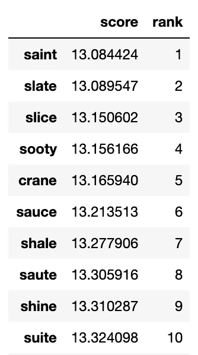

COPOD 十大开场白。图片作者。

你有它！根据问题被框定的方式，科波德认为‘圣人’是最好的开场。请注意，Grant Sanderson 推荐的开场词“crane”在 2315 个“可能单词”中排名第五。这可能表明 COPOD 算法已经完成了一些类似于在“3blue1brown”上进行的信息论模拟的事情。

# 最后的想法

在本文中，我们学习了如何创建一个数据集来充分表示 Wordle 中使用的 5 个字母单词的结构。然后，我们使用无监督学习算法来寻找与所有其他单词结构最相似的单词。请对本实验的思考过程提供反馈——我很想听到创建单词结构数据的更好方法或更好的算法的想法。感谢阅读！

*喜欢我的文章？给我买杯咖啡:*[*【https://www.buymeacoffee.com/HarrisonfhU】*](https://www.buymeacoffee.com/HarrisonfhU)