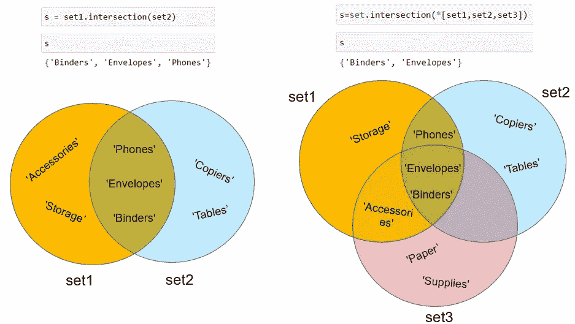
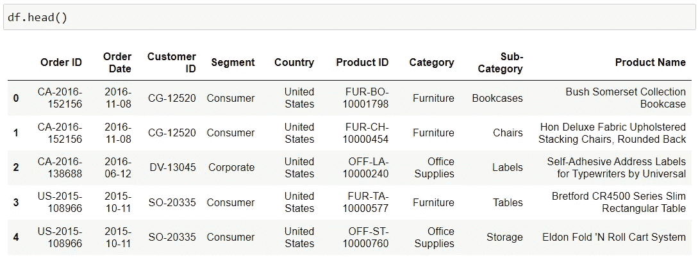
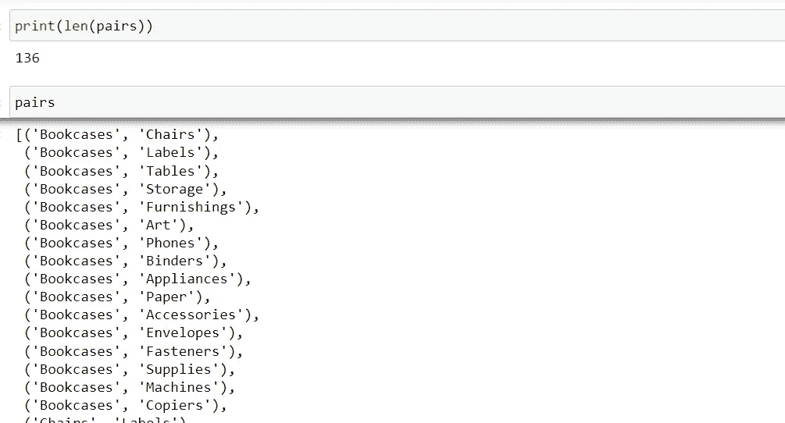
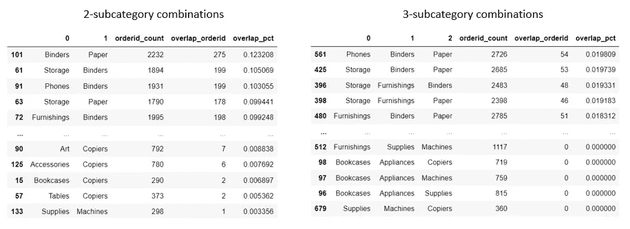

# 寻找 Python 集合的交集:一个实际用例

> 原文：<https://towardsdatascience.com/finding-the-intersection-of-python-sets-a-practical-use-case-f892fef5ff83>

## 如何使用 Python 的 Set？购物篮分析的交集()方法


图片由 [Pixabay](https://pixabay.com/photos/vegetables-basket-purchasing-market-2179845/) 提供

Python `set`是一个无序的、不可改变的*和唯一的元素列表，这些元素放在花括号内，用逗号分隔。注意，当我们说它是‘不可改变的’时，我们的意思是一旦一个`set`被创建，我们不能改变一个项目，但我们仍然可以删除项目或添加新项目。

python 最流行的`set`操作之一是寻找两个或更多集合的交集，使用 Python 的`set.intersection()`方法可以轻松完成。例如，假设您有三个集合，如下所示:

```
set1={'Storage','Phones','Binders','Accessories','Envelopes'}
set2={'Phones','Envelopes','Binders','Copiers','Tables'}
set3={'Paper','Supplies','Binders','Accessories','Envelopes'}
```

要找到集合 1 和集合 2 的交集，您可以:

```
s = set1.intersection(set2)
```

要找到这三个集合的交集，您可以执行以下任一操作(注意，在第二个代码片段中，我们通过用星号*操作符打开列表，将所有集合作为参数传递给`set.intersection()`):

```
s = set1.intersection(set2,set3)
or:
s = set.intersection(*[set1,set2,set3])
```



作者图片

够简单！现在让我们看看如何将`set`交集应用到一个实际用例中，在这个用例中，我们需要使用`set.intersection()`方法和 python `for`循环对一百多对集合进行交集运算。我们将使用流行的 [Tableau 样本超市数据集](https://public.tableau.com/en-us/s/resources?qt-overview_resources=1#qt-overview_resources)并运行一个简单的购物篮分析，使用`set.intersection()`方法找出哪些产品倾向于从超市一起购买！

# 一个实际的用例:购物篮分析

## 关于数据

你可以从[这里](https://public.tableau.com/en-us/s/resources?qt-overview_resources=1#qt-overview_resources)下载超市数据样本。这个免费的公共数据集包含超市的产品、销售、顾客购买历史等信息。从 2014 年到 2017 年。我们有兴趣了解哪些产品子类别可能会一起购买。让我们首先将数据导入熊猫数据框架。



作者图片

对于每个产品子类别(例如，书架)，我们可以通过为该子类别创建一个`set`来获得该产品子类别中所有唯一的订单 id。然后，对于任何一对产品子类别(例如，书架和椅子)，我们可以将这两个集合相交，并查看两个集合中存在多少个订单 id。这两个集合之间的重叠越多，就越能表明这两个产品子类别倾向于一起购买。

我们将对所有可能的产品子类别对进行`set`交集运算，并计算每对的重叠百分比。让我们看看它是如何工作的。

## 创建所有可能的产品子类别对

首先，让我们使用下面的代码创建一个所有可能的产品子类别对的列表。 `itertools.combinations(iterable,r)`方法允许我们创建任意数量的产品子类别的组合，由参数`r`指定。例如，如果您想要创建 3 个子类别的组合，您可以简单地将第 2 行中的`r`的值更改为 3。



作者图片

又快又简单！看起来我们总共有 136 个产品子类别对要分析。如果我们要查看 3 个子类别的组合，那么总共会有 680 种组合！

## 创建集合和集合交集

接下来，让我们使用 python `for`循环为每一对创建两个集合，并用`set.intersection()`方法使这两个集合相交，如下面的代码所示。注意，在第 6 行中，我们首先使用`set()`方法为每一对子类别创建了两个集合。然后，我们使用`set.intersection(*[set1,set2])`来相交这两个集合，就像我在这篇文章前面展示的那样。

对于`for`循环中的每次迭代，我们将我们的结果——每对中唯一订单 id 的数量、每对中重叠订单 id 的数量以及订单对名称添加到我们在第 1–3 行创建的三个列表中。

## 计算重叠百分比

最后，让我们把所有东西放在一起，计算每对订单 id 的重叠百分比，看看哪些产品子类别倾向于一起购买。



作者图片

这就对了。通过不到 20 行代码，我们能够完成各种产品组合的市场购物篮分析，并深入了解客户的购买模式和产品分组。您可以轻松地将这一概念和方法扩展到其他类似的用例:客户喜欢一起下载的应用程序、客户喜欢一起访问的网站、客户喜欢一起购买的书籍等。

感谢阅读。我希望你喜欢这篇文章，并且学到了一些关于 python 的新知识！

# 数据源:

本文中使用的数据集是一个免费的、公开的样本数据集，可以从 [Tableau 公共资源页面](https://public.tableau.com/en-us/s/resources?qt-overview_resources=1#qt-overview_resources)下载。该数据是由 [Tableau](https://www.tableau.com/about/blog/2019/2/public-data-sets-102221) 提供的样本数据集，可用于学习和教育目的。

你可以通过这个[推荐链接](https://medium.com/@insightsbees/membership)注册 Medium 会员(每月 5 美元)来获得我的作品和 Medium 的其他内容。通过这个链接注册，我将收到你的会员费的一部分，不需要你额外付费。谢谢大家！