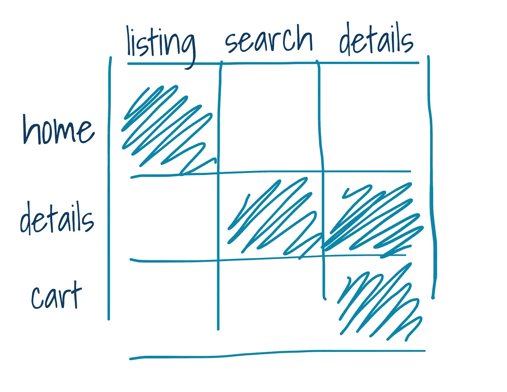
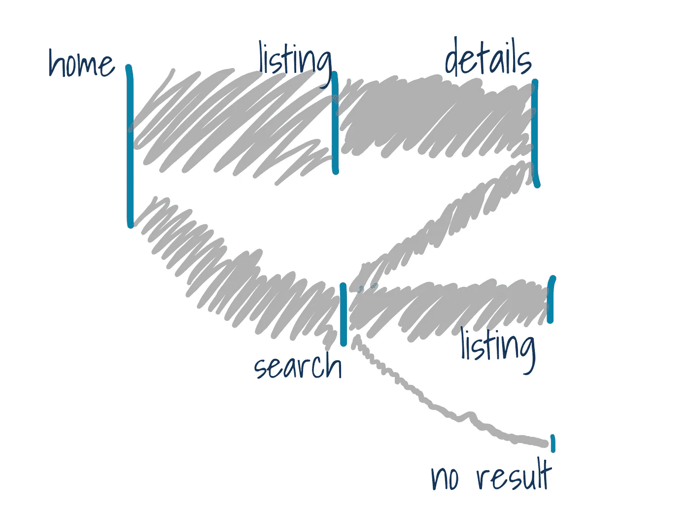

# 使用 BigQuery Firebase 数据查找高级用户

> 原文：<https://towardsdatascience.com/finding-your-power-users-using-bigquery-firebase-data-ad0e16e0ddea>

## 了解用户旅程，无需投资第三方工具

Solen Feyissa 在 [Unsplash](https://unsplash.com/s/photos/flow?utm_source=unsplash&utm_medium=referral&utm_content=creditCopyText) 上拍摄的照片

如果你使用 Firebase 和 BigQuery，你可以从 iOS 原生应用中挖掘点击流数据，并将其转化为关于用户旅程的可操作见解。你不需要任何第三方应用程序，你可以定制你的深度分析。

# 未开发的点击流数据金矿

如果你正在为一个原生的 iOS 应用程序使用 Firebase，那么每当用户登陆一个应用程序屏幕时就会触发一个事件。这个事件是 *screen_view，*并且你的屏幕被正确命名，你可以提取一个很好的屏幕名称序列，这将让你了解你的应用程序上的用户旅程。

> Google Analytics 跟踪屏幕转换，并将当前屏幕的信息附加到事件中，使您能够跟踪用户参与度或每个屏幕的用户行为等指标。大部分数据收集是自动进行的，但您也可以手动记录屏幕视图。

使用一些 SQL 操作和 BI 软件，您可以轻松了解:

*   最常访问和最少访问的屏幕；
*   从一个屏幕到另一个屏幕最频繁和最不频繁的转换:你可能会发现你的团队忘记存在的令人惊讶的转换；
*   退出屏幕:你可以了解大多数用户存在于 app 的什么地方，再加上过渡分析，你可以看到退出前发生了什么；
*   群体行为:一些用户会转变，一些不会——你将能够看到旅程中是否有任何差异，并围绕什么使你成为超级用户建立假设；
*   用户路径和用户达到应用旅程里程碑所需的时间:你的用户达到预期的转化事件需要多长时间？

虽然您肯定可以使用第三方工具跟踪用户的旅程，但访问原始数据也有好处——并不是所有的第三方工具都能够提供这一点。作为一个喜欢接触数据的人，当我看到我可以操作的数据时，我会很兴奋。

## 丰富您的应用旅程数据

如果您可以在同一个地方访问来自多个数据源的数据，那么您将拥有巨大的优势。丰富数据的 3 种主要方式:

*   使用您的客户数据:这将需要一个唯一的客户标识符，当用户浏览应用程序时，可以合法地收集该标识符(更多信息见下文)；
*   交易数据和反馈数据:交付一个产品需要多长时间，NPS 是什么，客户是否被保留，等等。；
*   从 Firebase 收集的其他事件:用户是 AB 测试的一部分吗，他们使用哪个应用程序版本，他们在哪个国家，等等。其他点击流事件，如产品视图、点击和其他互动、横幅互动等。，也可以用来丰富您的屏幕过渡数据。

最后，分析和可视化都在您的掌控之中。您想要会话级转换吗？给你。3 天归因？让它发生。想要排除 AB 测试中的用户吗？你能做到的。

## iOS15 和用户追踪的噩梦

值得注意的是，在苹果公司未经用户明确同意限制广告客户 id 收集后，对于 Firebase 数据来说，这意味着为否认跟踪的用户返回空的 IDFA 字符串。然而，在 Firebase 中，你仍然与`user_pseudo_id`保持一致。在某些情况下，它比 IDFA 更稳定，这是一个优势。

许多第三方工具从 IDFAs 转向使用概率模型来近似用户身份。这很讽刺，但确实有效。

# 分析数据

我将列出我最喜欢的三种挖掘这些数据的方法。

分析这些数据最简单的方法是建立一个**转移矩阵**，其中在行中有一个屏幕，在列中有一个屏幕——下一个屏幕或一个空屏幕以防退出。[非常类似于马尔可夫链中使用的一个概念](https://en.wikipedia.org/wiki/Markov_chain#Transitions),但是构造起来更加自由。这种情况下的值将是从一行中的屏幕移动到一列中的屏幕的用户的百分比，或者是每行总转换的百分比。它将突出显示用户进行的最常见的转换，以及最常见的屏幕退出——屏幕名称在一列中为空。使用`LEAD`和`LAG`窗口函数以及几乎任何可视化工具，这种分析都相当容易。

例如，在下面的快速模型中，蓝色单元格是主页、(产品)详细信息、购物车屏幕的前 3 个转换。用户最常跳转到产品列表，四处搜索。但是一旦用户进入详细信息页面，他们最有可能去搜索或另一个详细信息页面。为什么会这样？你能让 PDP 搜索对用户更方便吗？为什么用户会从主页跳过搜索？令人担忧的是，大多数用户从购物车转到产品详情页面，而不是结账，这甚至不在图片中。原因是什么？我们如何改善用户行为？

作者图片

这将是一个良好的开端，为了提高水平，您可以将用户在其会话或滚动窗口中查看的所有屏幕汇总起来，并比较有多少用户参与了您感兴趣的活动。如果是电商，往往是电商购买。你的假设可能听起来像这样“在会话期间查看评论屏幕的用户显示出更高的转化率”。在转换分析的基础上，这将给你建立用户行为假设的基础。

可视化用户旅程的最常见方式之一是使用流程图，它允许超越一个过渡的是 [**路径浏览器**](https://support.google.com/analytics/answer/9317498?hl=en) **，**也称为桑基图。Google 在 GA4 中引入了一个路径浏览器，看起来很有前途。您可以选择您想要考虑的事件以及屏幕名称。DIY 版本将需要一点 Python 技能(或任何其他语言)来绘制这样的图表，并考虑经常发生的重复屏幕转换。Plotly 是我最喜欢的可视化软件包之一，我认为它没有得到足够的信任，但它令人难以置信。

下面的模型路径显示了一个相当典型的电子商务流程，从首页到列表再到细节，然而，部分首页流量直接进入搜索。大多数搜索流量都指向产品列表页面，但其中很大一部分会将用户直接带到产品详情页面。

作者图片

陈楚翔写了一篇关于 [**超级用户曲线**](https://andrewchen.com/power-user-curve/) **，**的文章，如果你有兴趣，我强烈推荐。一旦你知道在哪里寻找转换信号，看看有多少用户在一个给定的时间段内做这个动作:一天，一个月，两个星期，等等。在最初的博客文章中，Andrew 建议将“一个月的总活跃天数”显示为 X 轴，并使用条形图显示相应桶中的用户百分比。它非常类似于一个直方图的概念，通过显示有多少用户使用你的功能特性，可以告诉你很多关于你的“用户质量”的信息。您可以围绕它跳舞，开发您自己的表示，例如“用户访问产品列表页面的次数”，等等。如果你能通过流量来源和媒介来监控用户构成的变化，那就更好了。

第三方工具经常使用**向日葵图**来可视化用户路径。它们玩起来很有趣，但当一些屏幕比其他屏幕被访问得更频繁时，或者当两个或更多屏幕之间频繁切换时，它会很快失控。例如，在一个电子商务应用程序中，您可以预期产品列表页面是最常访问的页面，并且会在产品列表页面和产品详细信息页面之间进行大量切换。这些数据并不总是受到重视，可能很难分析。

尽管如此，如果你的应用有任何显著的流量，点击流数据可能会变大，这可以通过聚合来解决。

# 它告诉你什么

总的来说，了解转换用户使用哪些功能将让您深入了解高级用户的行为。你可以开始构建你的假设，并在数据深度挖掘、用户访谈或实验中测试它们。

除此之外，这种方法将帮助你理解另一面——用户旅途中的干扰和退出点。

在此基础上，你可以开始开发用户质量框架——这对产品工作以及你的营销和 CRM 策略都有好处。

# 它没有什么

小心避免因果关系-相关性因果关系-相关性陷阱。相关性或关联并不意味着因果关系。换句话说，如果你发现你的超级用户——转化率最高的用户——比其他人更频繁地访问某个特定的屏幕，这并不意味着引导更多的用户访问这个屏幕就一定会带来更多的转化率。虽然这不是不可能的，但是您的高级用户可能会因为他们的内在动机而更倾向于使用某个特定的功能。因此，你需要实验，做用户研究和数据深度挖掘来理解行为。

# 资源

 [## 跟踪屏幕视图| Firebase 文档

### Google Analytics 跟踪屏幕切换，并将当前屏幕的信息附加到事件中，使您能够…

firebase.google.com](https://firebase.google.com/docs/analytics/screenviews)  [## 衡量电子商务|谷歌分析 4 属性|谷歌开发者

### 电子商务报告提供了对用户购物行为的洞察，使您能够量化您最…

developers.google.com](https://developers.google.com/analytics/devguides/collection/ga4/ecommerce?client_type=gtag#view_item_list)  [## 超级用户曲线:了解 andrewchen 最活跃用户的最佳方式

### 今天我们有一篇文章是关于我们用来分析安德森·霍洛维茨基金投资的一个常用框架:权力…

andrewchen.com](https://andrewchen.com/power-user-curve/)  [## 导航功能|大查询|谷歌云

### 无论您的企业正处于数字化转型的早期阶段，谷歌云都可以帮助您…

cloud.google.com](https://cloud.google.com/bigquery/docs/reference/standard-sql/navigation_functions)  [## 桑基

### 链接和节点有自己的 hovertemplate，其中可以显示特定于链接或节点的属性。要添加更多…

plotly.com](https://plotly.com/python/sankey-diagram/)