# 基准测试流失预测方法的发现

> 原文：<https://towardsdatascience.com/findings-from-benchmarking-churn-prediction-methods-95940683523d>

## 通过比较广泛使用的客户流失预测方法获得的见解

在 [Unsplash](https://unsplash.com/photos/Y20k53JEpUI) 上由 [Robert Bye](https://unsplash.com/@robertbye) 拍摄的照片。

T 他的文章展示了我上一篇(技术性更强)文章中的结果和发现，我在文章中解释了如何构建一个**通用管道来对流失预测方法进行基准测试。**这篇文章背后的动机是来自 [Geiler 等人(2022)](https://link.springer.com/article/10.1007/s41060-022-00312-5#citeas) 的一篇论文，该论文对不同的流失预测方法进行了基准测试。

# TL；博士；医生

*   根据我的[上一篇文章](/a-pipeline-for-benchmarking-churn-prediction-approaches-f5b533c53e30)，常见的客户流失方法在**五个免费可用的客户流失数据集**上进行了基准测试。
*   由于样本量小(只有五个数据集)，这些发现**可能不具有代表性**，但可以为您提供关于**在您的下一个流失预测项目中考虑**哪些方法的想法。
*   在处理**高等级不平衡**时，**采样方法并不总能提高你的模型性能**。
*   根据您偏好的误差度量，最佳方法是没有采样(PR AUC)的**软投票分类器模型**(逻辑回归+ XGB +随机森林)或具有**过采样** (SMOTE)和**随机过采样** (RND)方法(F2 得分)的**逻辑回归**。

# 回顾和方法

在讨论结果之前，我想给你一个快速回顾所使用的管道和方法。图 1 显示了所使用的基准测试管道的整体结构，从通过预清理步骤加载数据开始，到实际的基准测试和结果的最终可视化。

图一。基准测试流程概述(图片由作者提供)。

“动态部分”(绿色)表示不同的方法或机器学习模型和采样方法的组合，它们“动态地”附加到流水线的静态部分(估算器、缩放器和编码器)。

## 🛢数据集

对于这篇文章，我只使用了免费使用的客户流失数据集，并且有一个“真实的”流失率。我所理解的“现实流失率”是 20%或更少的高等级不平衡。如果你的数据有 40%的流失率，你应该考虑你是否真的想做流失率预测或更好地分析你的商业模式，因为几乎一半的客户正在离开。

下表 1 总结了所使用的数据集。

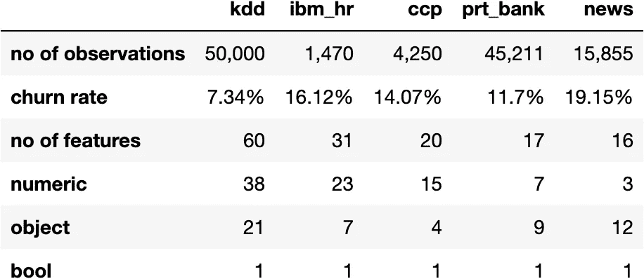

表 1。所用数据集的总结(图片由作者提供)。

前两行显示预清理步骤后每个数据集的行数或观察值，以及相关的流失率。以下各行显示了每个数据集的列数或特征数及其数据类型数。

所述的预清洁步骤**移除立柱** …

*   丢失超过 20%的值
*   仅常量值
*   像唯一标识符(例如，用户 id 或地址)

> 除了这些规则，我还删除了 KDD 数据集中包含 1000 多个不同类别值的列。否则，在应用一次热编码步骤时，我会遇到一个[维数灾难](https://en.wikipedia.org/wiki/Curse_of_dimensionality)问题。

本文使用的数据集如下:

*   **ACM KDD 杯— 2009 (** `kdd` **)** :来自法国电信公司 Orange 的营销数据库，用于预测客户更换提供商的倾向( [CC0:公共领域](https://www.openml.org/search?type=data&status=active&id=1112&sort=runs))。它是具有最多观察和特征的数据集。
*   **IBM HR Analytics 员工流失&绩效(** `ibm_hr` **)** :由 IBM 数据科学家创建的虚构数据集，其中包含导致员工流失的因素([数据库内容许可证(DbCL)](https://www.kaggle.com/datasets/pavansubhasht/ibm-hr-analytics-attrition-dataset) )。
*   **2020 年客户流失预测(** `ccp` **)** :流失数据(基于与真实世界相似的说法人工得出)。数据也是 [R 包](https://rdrr.io/cran/regclass/man/CHURN.html)([GPL(>= 2 license](https://rdrr.io/cran/regclass/))的一部分。
*   **葡萄牙银行营销数据集(** `prt_bank` **)** :一家葡萄牙银行的电话直销营销活动数据集( [CC BY 4.0](https://archive-beta.ics.uci.edu/ml/datasets/bank+marketing) )。
*   **报纸流失** **(** `news` **):** 关于报纸订阅用户的数据集( [CC0:公共域](https://www.kaggle.com/datasets/andieminogue/newspaper-churn))。

## ⚖️阶级不平衡

在现实生活中，处理接近 50%的类平衡是非常罕见的。特别是在客户流失预测领域，人们通常不得不处理高度不平衡的问题(流失者占少数)。imblearn 包提供了一系列不同的方法来处理这个问题。使用了以下几种(及其组合):

*   **不取样**(`no_sampling`)——我们不采用任何方法
*   <https://imbalanced-learn.org/stable/references/generated/imblearn.over_sampling.SMOTE.html>**(`o_SMOTE`)—过采样**
*   **<https://imbalanced-learn.org/stable/references/generated/imblearn.over_sampling.ADASYN.html>**(`o_ADASYN`)—过采样****
*   ****<https://imbalanced-learn.org/stable/references/generated/imblearn.under_sampling.TomekLinks.html>**(`u_TomekLinks`)—欠采样******
*   ******[**【NCR】**](https://imbalanced-learn.org/stable/references/generated/imblearn.under_sampling.NeighbourhoodCleaningRule.html)(`u_NCR`)—欠采样******
*   ******SMOTE 和**[**RND**](https://imbalanced-learn.org/stable/references/generated/imblearn.over_sampling.RandomOverSampler.html)(`h_SMOTE_RND`)—过采样和欠采样****
*   ******SMOTE 和 TomekLinks** ( `h_SMOTE_TomekLinks` ) —过采样和欠采样****
*   ******斯莫特和 NCR** ( `h_SMOTE_NCR` ) —过采样和欠采样****

## ****📦模型****

*   ****[**逻辑回归**](https://scikit-learn.org/stable/modules/generated/sklearn.linear_model.LogisticRegression.html) ( `lr`)****
*   ****<https://scikit-learn.org/stable/modules/generated/sklearn.ensemble.RandomForestClassifier.html>****(`rf`)********
*   ******[**XGB 量词**](https://xgboost.readthedocs.io/en/stable/python/python_api.html) ( `xgb`)******
*   ****[**SVC 分类器**](https://scikit-learn.org/stable/modules/generated/sklearn.svm.SVC.html) ( `svc`)****
*   ****[**高斯朴素贝叶斯**](https://scikit-learn.org/stable/modules/generated/sklearn.naive_bayes.GaussianNB.html) ( `gnb`)****
*   ****[**light GBM**](https://lightgbm.readthedocs.io/en/latest/pythonapi/lightgbm.LGBMClassifier.html)(`lgb`****
*   ****[**knighborsclassifier**](https://scikit-learn.org/stable/modules/generated/sklearn.neighbors.KNeighborsClassifier.html)**(`knn`)******
*   ******[**GEV-NN**](https://github.com/lhagiimn/GEV-NN-A-deep-neural-network-architecture-for-class-imbalance-problem-in-binary-classification)**(`gev_nn`)********
*   ******[**前馈神经网络**](https://github.com/naomifridman/Neural-Network-Churn-Prediction/blob/master/FFNN_churn_predict_0_12174.ipynb) ( `ffnn`)******
*   ****[**voting Classifier 1**](https://scikit-learn.org/stable/modules/generated/sklearn.ensemble.VotingClassifier.html):逻辑回归、XGB 分类器、随机森林(`lr_xgb_rf`)****
*   ****[**voting Classifier 2**](https://scikit-learn.org/stable/modules/generated/sklearn.ensemble.VotingClassifier.html):逻辑回归、XGB 分类器、随机森林、前馈神经网络(`lr_xgb_rf_ffnn`)****

> ****投票分类器使用[软投票](https://www.geeksforgeeks.org/ml-voting-classifier-using-sklearn/)，这意味着它们的结果是它们使用的模型预测的平均值。****

## ****⏱️误差度量****

****使用了以下误差指标:****

*   ****[**提升得分**](https://rasbt.github.io/mlxtend/user_guide/evaluate/lift_score/) (将模型预测与随机生成的预测进行比较)****
*   ****[**ROC AUC**](https://scikit-learn.org/stable/modules/generated/sklearn.metrics.roc_auc_score.html)****
*   ****[**F1 分数**](https://scikit-learn.org/stable/modules/generated/sklearn.metrics.f1_score.html) (用于真实类和宏)****
*   ****[**F2**得分](https://scikit-learn.org/stable/modules/generated/sklearn.metrics.fbeta_score.html)****
*   ****[**召回**](https://scikit-learn.org/stable/modules/generated/sklearn.metrics.recall_score.html) (在客户流失预测中，我们通常在漏报上有更高的成本)****
*   ****[**精度**](https://scikit-learn.org/stable/modules/generated/sklearn.metrics.precision_score.html)****
*   ****[**平均精度**](https://scikit-learn.org/stable/modules/generated/sklearn.metrics.average_precision_score.html) * (PR AUC)****

****有许多关于“正确”误差度量的讨论。首先，**没有银弹**。选择正确的错误度量标准不仅取决于您的**用例**或**优先级**(例如，您在假阴性或假阳性上的成本更高吗？)还取决于您的数据(例如，处理**强烈的类别不平衡**)以及您是否想要**预测类别**(与阈值相关)或**概率**(与阈值无关)。因此，更有意义的是**考虑几个指标**来更清楚地了解你的模型的性能。****

******F1 分数**同等对待精度和召回**。然而，在客户流失预测的情况下，我们通常会有**更高的假阴性成本**(获取客户的成本通常远高于留住客户的成本)。 **F2 分数**在召回上增加了**更高的权重，在等式的精度部分增加了更低的权重。********

****例如，如果我们将分类器的默认阈值(0.5)更改为 0.34，因为我们认为这是一个更好的阈值，我们的 **F2 分数**和**召回度量**将**更改它们的值**。阈值独立指标是 **ROC AUC** 和 **PR AUC** 。对于不平衡数据集，Saito 和 Rehmsmeier (2015)和 Czakon (2022)更喜欢 PR AUC 而不是 ROC AUC。****

> *****人们也可以**认为 PR AUC 是为每个回忆阈值**计算的精确度分数的平均值(Czakon，2022)。****

## ****🔬交叉验证****

****为了计算分数，我使用了[重复分层 k 倍交叉验证](https://scikit-learn.org/stable/modules/generated/sklearn.model_selection.RepeatedStratifiedKFold.html)，其中 n_repeats 和 n_splits = 5。这种方法通常在处理不平衡数据集时使用。在每个折叠中，每个目标类的样本百分比大致相同。****

# ****结果****

****结果可以通过使用像箱线图或可视化表格这样的图表来解释。我将在下面使用两者，从 F2 开始。下面的图 2 显示了通过对所有五个数据集使用不同的采样方法得到的每个模型的 F2 分数。平均值由绿色三角形标记表示。****

****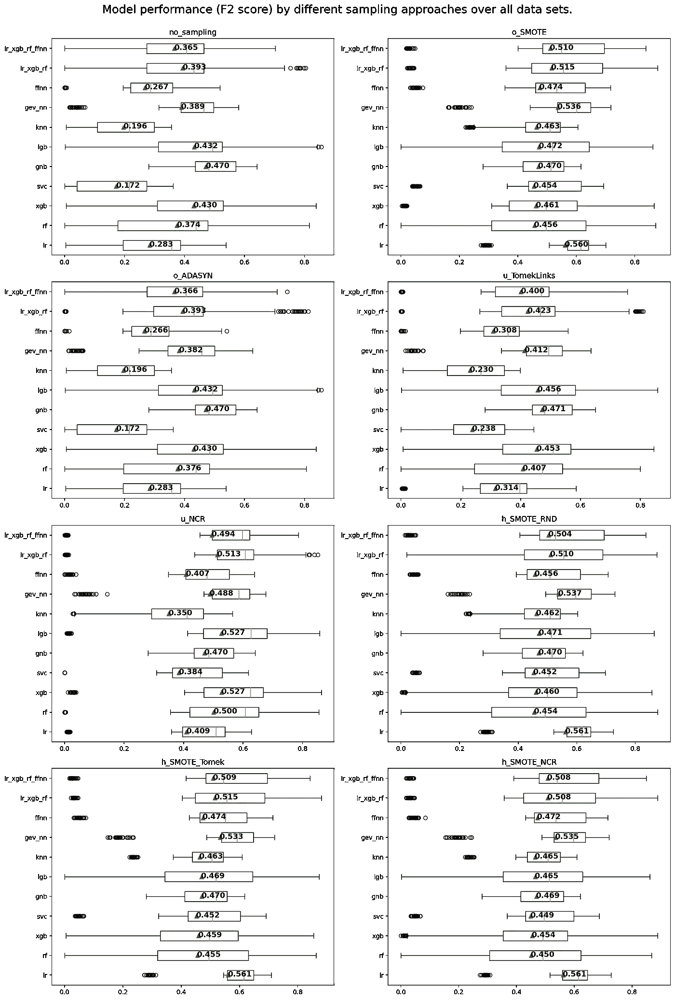****

****图二。对所有数据集使用不同采样方法的每个模型的 F2 分数的箱线图(图片由作者提供)。****

****我们可以从方框图中看到，与深度学习模型(`gev_nn`、`ffnn`)相比，基于树的模型(`rf`、`lgb`、`xgb`)总体上显示出更广泛的分布。我们还可以观察到，当使用混合采样方法(`h_SMOTE_RND`、`h_SMOTE_Tomek`、`h_SMOTE_NCR`)时，我们的线性模型(`lr`)的分布很小，与其他方法相比，其性能相当好。****

****下表(表 2)显示了每种方法的平均 F2 分数。****

****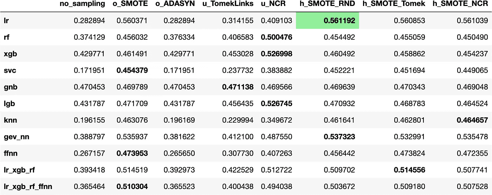****

****表二。对所有数据集使用不同采样方法的每个模型的平均 F2 值(图片由作者提供)。****

****该表可以按行读取。粗体显示的 F2 分数是相应模型采样方法的最高(最好)分数。**粗体和** **绿色高亮**的单元格是具有**最佳综合得分**的方法。当使用 **SMOTE+RND** 过采样方法时，逻辑回归(`lr`)模型得到了**总体最高的 F2 分数**。****

****如前所述，F2 分数取决于阈值。一个独立于阈值的指标是 PR AUC 指标，如下图所示(图 3)。****

****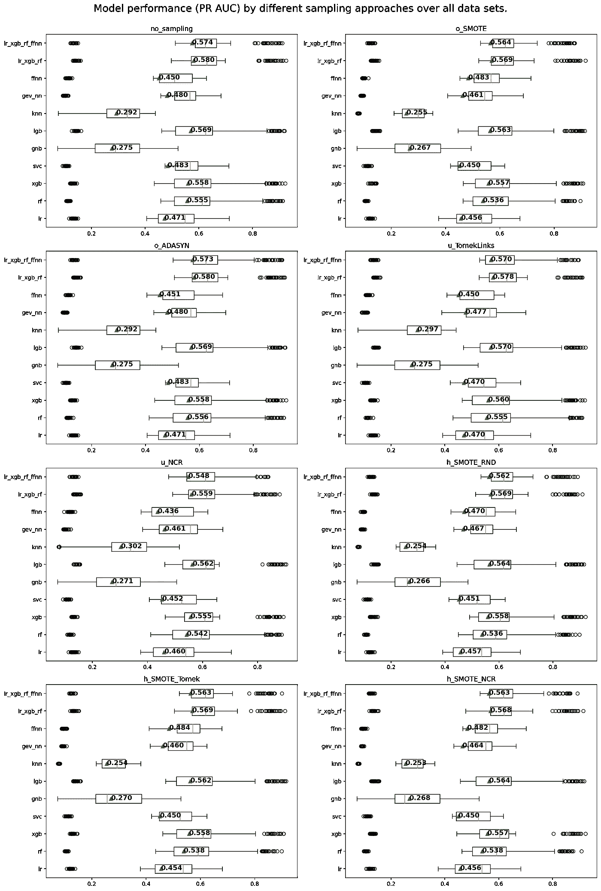****

****图 3。对所有数据集使用不同采样方法的每个模型的 PR AUC 分数的箱线图(图片由作者提供)。****

****我们可以看到，基本上高斯朴素贝叶斯(`gnb`)显示了最大的扩散，而投票分类器方法(`lr_xgb_rf`、`lr_xgb_rf_ffnn`)显示了最小的扩散。通过查看表格(表 3)，我们可以看到，最好的方法是没有抽样方法的投票分类器模型。****

****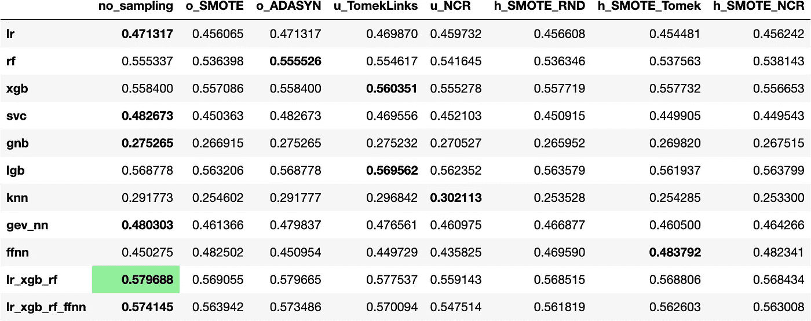****

****表 3。在所有数据集上使用不同取样方法的每个模型的平均 PR AUC 值(图片由作者提供)。****

****在我们的特定情况下，使用逻辑回归、XGB 分类器、随机森林(`lr_xgb_rf`)的软投票分类器比使用前馈神经网络(`lr_xgb_rf_ffnn`)的软投票分类器表现稍好。****

# ****结论****

****在这篇文章中，我们使用了五个免费的客户流失数据集对不同的方法进行了基准测试。需要指出的是，少量的数据集可能没有足够的代表性来得出可靠的结论。****

****然而，我希望这篇文章能让你知道在你的下一个客户流失预测项目中，你可以尝试哪些方法(例如，没有抽样方法的软分类器)。模型的代码和更详细的解释可以在我的[上一篇文章](/a-pipeline-for-benchmarking-churn-prediction-approaches-f5b533c53e30)中找到。****

****如果您对提到的其他指标的值感兴趣，请参见下面的附录。****

# ****来源****

****盖勒，l .，阿费尔特，s .，纳迪夫，m .，2022。*流失预测的机器学习方法综述*。Int J Data Sci Anal。[https://doi.org/10.1007/s41060-022-00312-5](https://doi.org/10.1007/s41060-022-00312-5)****

****蒙赫达莱，l，蒙赫达莱，t，刘，K.H，2020。 *GEV-NN:* *针对二元分类中类别不平衡问题的深度神经网络架构*。基于知识的系统。【https://doi.org/10.1016/j.knosys.2020.105534 ****

****j .布朗利(2020 年 2 月)。*机器学习 Fbeta-Measure 的温和介绍*。机器学习掌握。[https://machine learning mastery . com/fbeta-measure-for-machine-learning/](https://machinelearningmastery.com/fbeta-measure-for-machine-learning/)****

****Czakon，J. (2022 年 7 月 21 日)。 *F1 评分 vs ROC AUC vs 准确性 vs PR AUC:应该选择哪种评价指标？*Neptune . ai . 2022 年 9 月 18 日检索，来自[https://neptune.ai/blog/f1-score-accuracy-roc-auc-pr-auc](https://neptune.ai/blog/f1-score-accuracy-roc-auc-pr-auc)****

****Saito 和 m . rehms Meier(2015 年 3 月 4 日)。*在不平衡数据集上评估二元分类器时，精确召回图比 ROC 图提供的信息更多*。PLOS 一号，10(3)，e0118432。[https://doi.org/10.1371/journal.pone.0118432](https://doi.org/10.1371/journal.pone.0118432)****

# ****附录****

****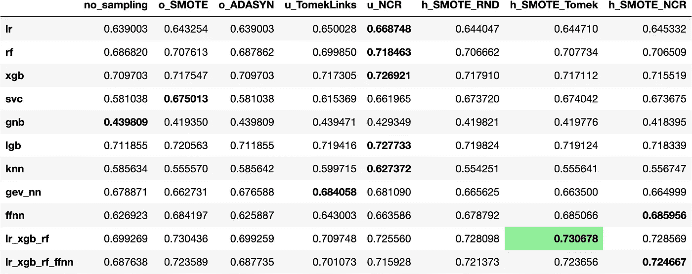****

****表 A1。F1 宏观评分(图片由作者提供)。****

****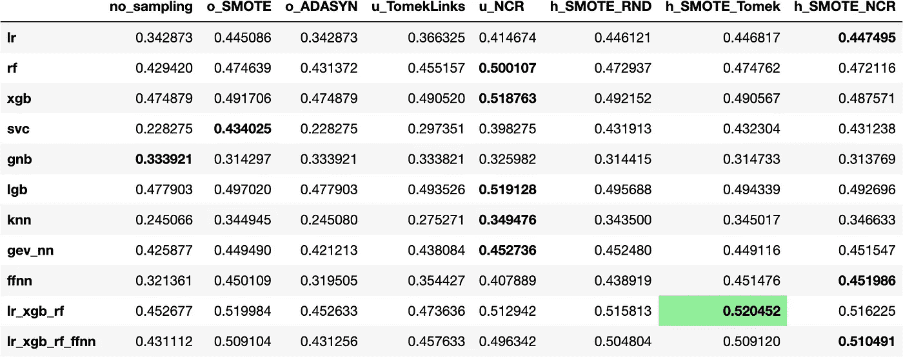****

****表 A2。F2 分数(图片由作者提供)。****

****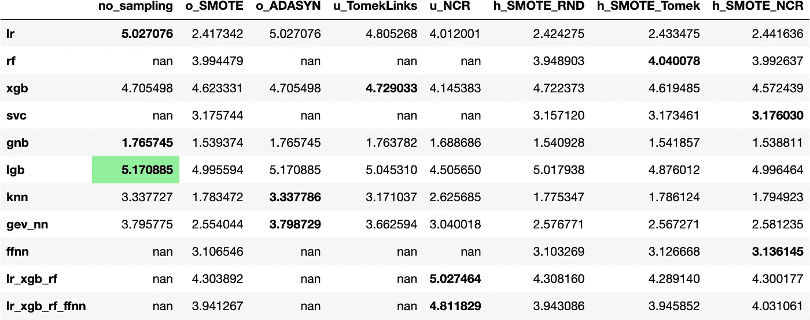****

****表 A3。Lift 评分(图片由作者提供)。****

****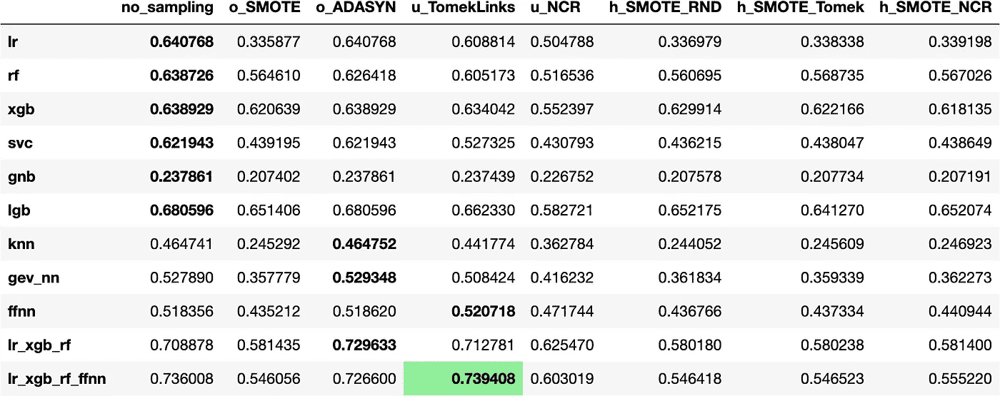****

****表 A4。精度(图片由作者提供)。****

****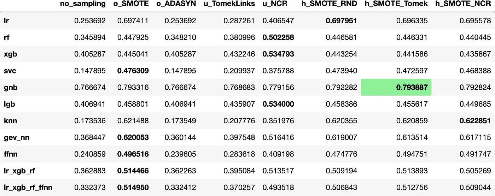****

****表 A5。回忆(图片由作者提供)。****

****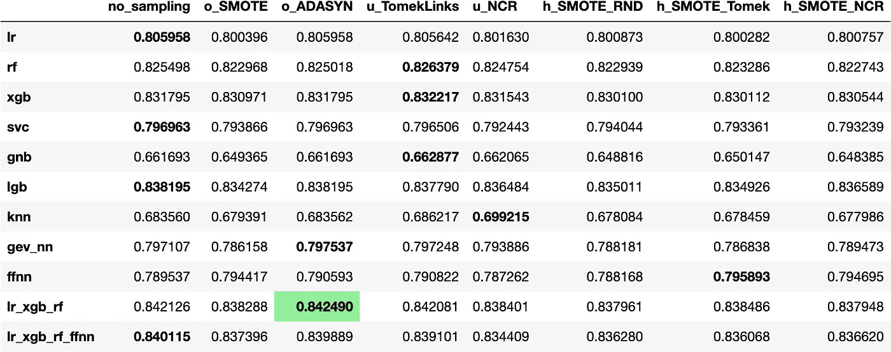****

****表 A6。ROC AUC(图片由作者提供)。****