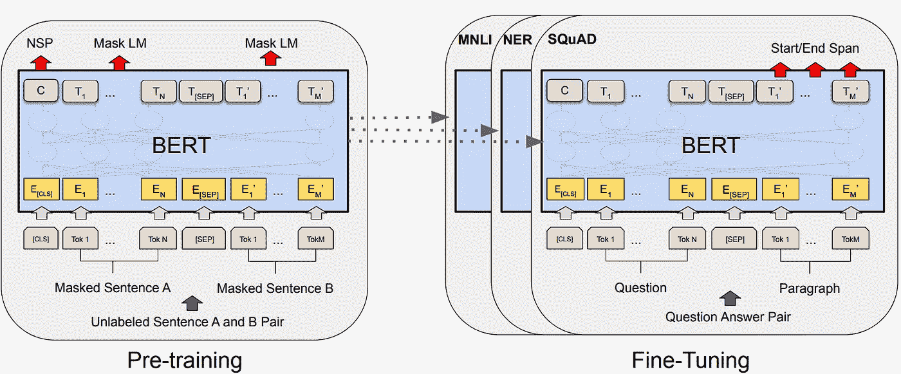
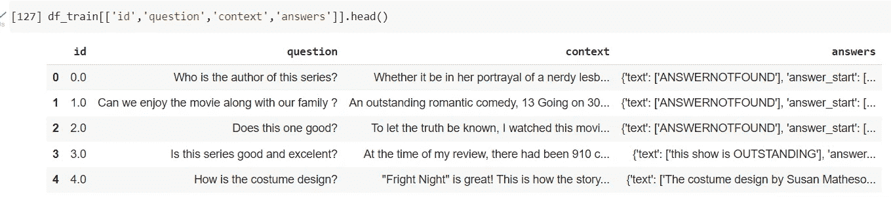
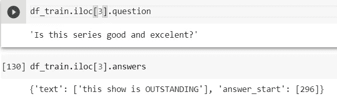
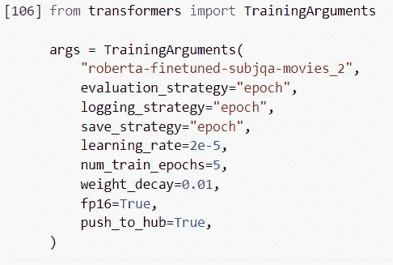
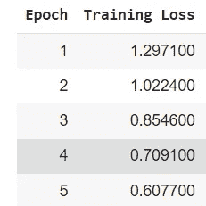
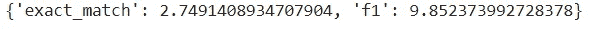
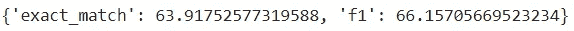
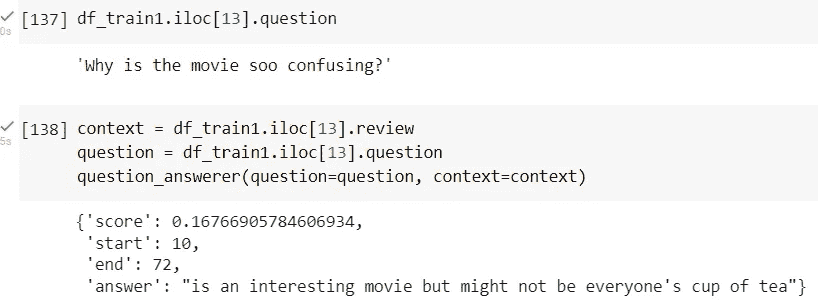
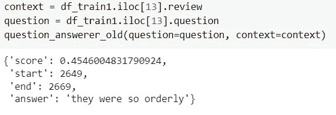

# 微调变压器模型，用于回答有关自定义数据的问题

> 原文：<https://towardsdatascience.com/fine-tune-transformer-models-for-question-answering-on-custom-data-513eaac37a80>

## 关于在自定义数据上微调拥抱脸 RoBERTa QA 模型并获得显著性能提升的教程


问答精选|塞犍陀·维维克

# 问答和变形金刚

伯特是 2019 年风靡全球的变形金刚模型。通过屏蔽单词并训练模型基于上下文预测这些屏蔽单词，在未标记的数据上训练 BERT。伯特后来在多项任务上进行微调，并在许多特定的语言任务上取得了艺术级的表现。特别是，BERT 对来自 SQUAD 数据集的 100k+问题答案对进行了微调，这些问题由维基百科文章中提出的问题组成，其中每个问题的答案都是相应段落中的一段文本，或 *span* 。



来自 https://arxiv.org/abs/1810.04805[的伯特变压器架构](https://arxiv.org/abs/1810.04805)

不久后发布的 RoBERTa 模型通过修改关键超参数和改进训练建立在 BERT 的基础上。我们感兴趣的模型是 deepset 发布的 huggingface 上的[微调过的 RoBERTA 模型，它在上个月被下载了 100 多万次。](https://huggingface.co/deepset/roberta-base-squad2)

例如，让我们使用 SubjQA 数据集的数据—包含来自 6 个不同领域的评论的 10，000 个问题:书籍、电影、杂货、电子产品、猫途鹰(即酒店)和餐馆。

[](https://github.com/megagonlabs/SubjQA) [## GitHub — megagonlabs/SubjQA:一个以主观信息为重点的问答数据集

### SubjQA 是一个问题回答数据集，侧重于主观(而不是事实)问题和答案。的…

github.com](https://github.com/megagonlabs/SubjQA) 

特别是因为我正在说明微调的力量，我将从电影评论中产生的问题和答案。这些可以方便地分为两个 csv 文件，分别用于培训(train.csv)和测试(test.csv)。

# 预处理数据

有 4 个主要列— id、问题、上下文和答案。



微调预处理后的 subjQA 数据集|塞犍陀·维韦克

在这种情况下，Id 可以是一个虚拟索引，上下文指的是要从中提取问题的文本块。我发现这里的答案不仅指答案，还需要包含起始字符索引。例如这里:



用于微调的典型问答格式|塞犍陀·维韦克

一旦你有了这种格式的熊猫数据框架，无论 QA 数据集是什么，其他步骤都是相同的——基本上是将数据预处理成 HuggingFace 模型训练器的格式。我将链接到下面脚本的笔记本。

# 模特培训

我唯一真正改变的是这里的纪元数量。微调模型需要几分钟时间。其他耗时的步骤包括加载模型和推送到 HuggingFace hub。



模型训练超参数|塞犍陀·维维克



时代的损失|塞犍陀·维维克

# 模型评估和部署

用于评估问答模型性能的最常见指标是 F1 分数。关于验证数据，旧模型



罗伯塔基于 SubjQA 数据集的模型指标|塞犍陀·维韦克



罗伯塔微调 SubjQA 数据集的模型指标|塞犍陀·维韦克

如您所见，微调**将性能提高了 50%以上**——这是一个巨大的性能提升！

要部署模型，您只需运行:

`trainer.push_to_hub(commit_message=”Training complete”)`

# 模型推理

现在是激动人心的部分——将模型部署到 huggingfacehub 后，您就可以从浏览器访问它了！

[](https://huggingface.co/skandavivek2/roberta-finetuned-subjqa-movies_2) [## skandavivek 2/Roberta-fine tuned-subj QA-movies _ 2 拥抱脸

### 编辑模型卡这个模型是在 None 数据集上的 deepset/roberta-base-squad2 的微调版本。更多信息…

huggingface.co](https://huggingface.co/skandavivek2/roberta-finetuned-subjqa-movies_2) 

也可以在笔记本中调用如下:

```
# Replace this with your own checkpoint 
model_checkpoint2 = “skandavivek2/roberta-finetuned-subjqa-movies_2”
question_answerer = pipeline(“question-answering”, model=model_checkpoint2)
```

作为健全性检查——您可以从训练数据集中的一个条目中查看微调后的转换器是否获得了正确的结果。



微调问答管道|塞犍陀·维维克



基地问答管道|塞犍陀·维维克

# 外卖食品

一般来说，NLP 和 AI 的世界在不断发展，似乎每个月都有新的突破。在过去的几周里，OpenAI 的 ChatGPT 风靡了全世界。然而，麦肯锡最近的一份报告显示，即使是基于人工智能的公司，也只有 11%在积极使用变压器。

虽然聊天功能和创造性的人工智能正在形成巨大的里程碑，但我相信，在信息提取和问题回答等任务中使用变形金刚，可以通过提供前所未有的快速准确的结果，为行业带来立竿见影的好处。

拥抱脸降低了进入门槛——现在不仅可以创建自己的微调变压器模型，而且它们使部署和可伸缩性更容易。

您可以在这个 GitHub repo 中找到代码:

[](https://github.com/skandavivek/transformerQA-finetuning) [## GitHub—skandavivek/Transformer QA-Fine tuning:微调 HuggingFace Transformer…

### 此时您不能执行该操作。您已使用另一个标签页或窗口登录。您已在另一个选项卡中注销，或者…

github.com](https://github.com/skandavivek/transformerQA-finetuning) 

***更新:***[***https://www.answerchatai.com/***](https://www.answerchatai.com/)***—我们使用生成式 AI 回答问题并从自定义文本中提取关键知识的 QA 引擎现已上线！回答特定领域的问题 3 个简单的步骤！***

1.  ***上传网址或粘贴文字，点击搜索按钮***
2.  ***针对上下文提出问题并点击查询***
3.  ***得到你的答案！***

***放心使用，在评论里告诉我你的反馈和任何建议！***

*参考文献:*

1.  [*https://hugging face . co/docs/transformers/tasks/问答*](https://huggingface.co/docs/transformers/tasks/question_answering)
2.  [*https://github.com/megagonlabs/SubjQA/tree/master/SubjQA*](https://github.com/megagonlabs/SubjQA/tree/master/SubjQA)

*如果你还不是中会员，想支持我这样的作家，可以通过我的推荐链接随意报名:*[*https://skanda-vivek.medium.com/membership*](https://skanda-vivek.medium.com/membership)

*获取每周数据透视* [*订阅此处*](https://skandavivek.substack.com/) *！*