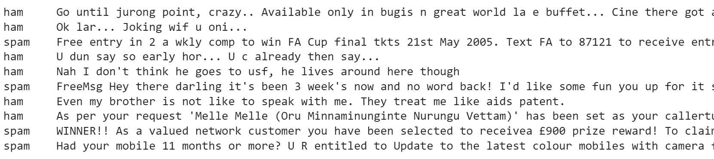
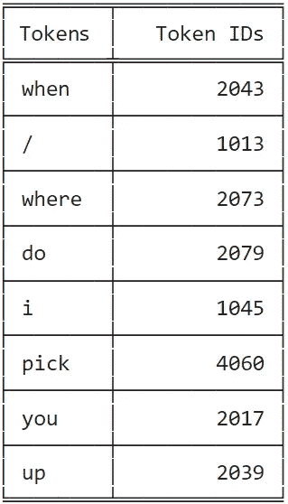
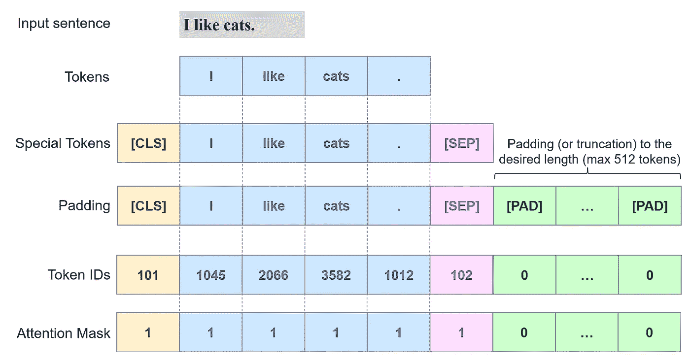
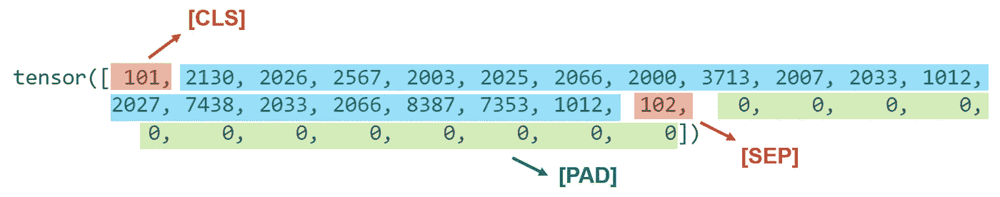
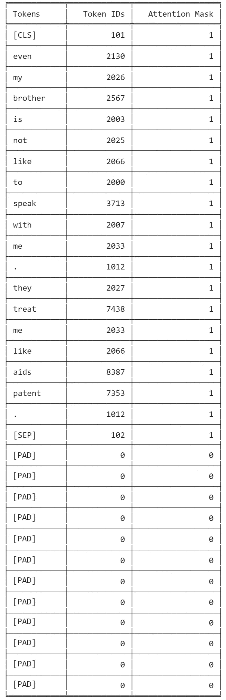
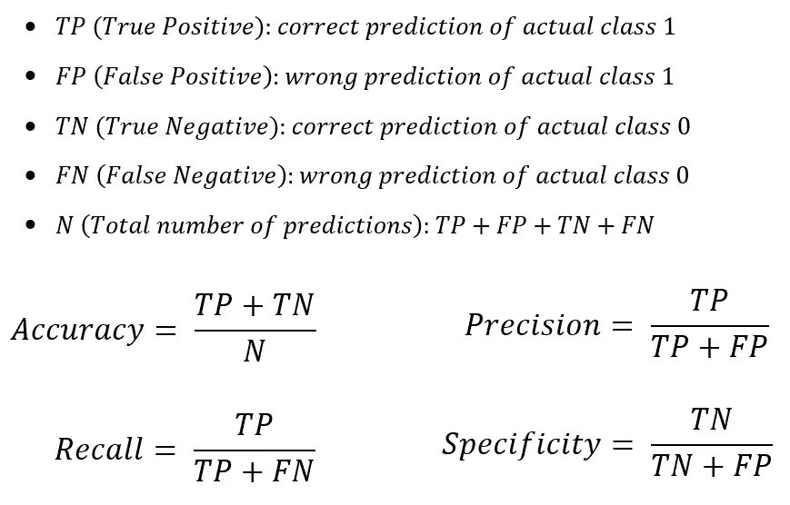
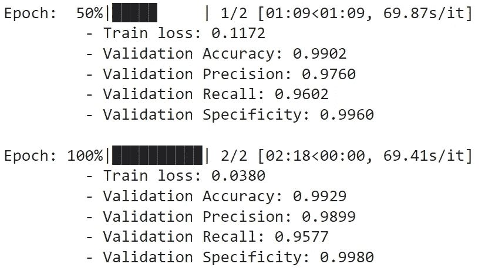
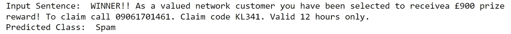

# 用于文本分类的微调 BERT

> 原文：<https://towardsdatascience.com/fine-tuning-bert-for-text-classification-54e7df642894>

## Python 的分步教程


意大利贝加莫皮佐科诺。图片作者。

# 目录

1.  [简介](#15b3)
2.  [环境设置](#e7cb)
3.  [数据集](#8f53)
4.  [预处理](#6ba6)
5.  [数据分割](#12df)
6.  [列车](#ec34)
7.  [预测](#5067)
8.  [结论](#f0e7)
9.  [参考文献](#96e0)

# 1.介绍

**BERT****(**B**I directional**E**n coder**R**presentations from**T**transformers)是一个基于 transformers 的机器学习模型，即能够学习单词之间上下文关系的注意力组件。**

**自然语言处理(NLP)社区可以(至少)以两种方式利用像 BERT 这样强大的工具:**

1.  ****基于特征的方法**
    1.1 下载预训练的 BERT 模型。
    1.2 用 BERT 把自然语言句子变成向量表示。
    1.3 将预先训练好的矢量表示输入到模型中，用于下游任务(如文本分类)。**
2.  ****执行微调** 2.1 下载一个预先训练好的 BERT 模型。
    2.2 更新下游任务的模型权重。**

**在本帖中，我们将遵循二进制文本分类示例的微调方法。我们将分享可以在**谷歌实验室**上轻松复制和执行的代码片段。**

# **2.环境设置**

**虽然这不是必要的，但训练过程将受益于 GPU 的可用性。在 Colab 中，我们可以通过选择`Runtime > Change runtime type`来**启用 GPU** 。**

**然后，我们安装拥抱 Face⁴ `transformers`库如下:**

```
!pip install transformers
```

**我们导入所需的依赖项:**

# **3.资料组**

**我们使用公共的**垃圾短信收集数据集**⁵**⁶.**UCI 机器学习库**中的**这些数据由一个文本文件组成，其中包含一组被标记为垃圾短信的文本文件。来自 Colab 笔记本:**

*   **将数据集下载为 zip 文件夹:**

```
!wget 'https://archive.ics.uci.edu/ml/machine-learning-databases/00228/smsspamcollection.zip'
```

*   **打开文件夹:**

```
!unzip -o smsspamcollection.zip
```

*   **检查数据文件的前几行:**

```
!head -10 SMSSpamCollection
```

****

**图片作者。**

*   **对于每一行，标签后跟一个制表符和原始文本消息。我们选择处理该文件以得到一个`pandas.DataFrame` 对象，因为这是数据科学实验中的一个常见起点:**

```
file_path = '/content/SMSSpamCollection'
df = pd.DataFrame({'label':int(), 'text':str()}, index = [])
with open(file_path) as f:
  for line in f.readlines():
    split = line.split('\t')
    df = df.append({'label': 1 if split[0] == 'spam' else 0,
                    'text': split[1]},
                    ignore_index = True)
df.head()
```

****

**图片作者。**

*   **我们提取文本和标签值:**

```
text = df.text.values
labels = df.label.values
```

# **4.预处理**

**我们需要在将文本源提供给 BERT 之前对其进行预处理。为此，我们下载了`BertTokenizer`:**

```
tokenizer = BertTokenizer.from_pretrained(
    'bert-base-uncased',
    do_lower_case = True
    )
```

**让我们观察一下记号赋予器如何将一个随机句子分割成单词级记号，并将它们映射到 BERT 词汇表中它们各自的 id:**

****

**图片作者。**

**BERT 需要以下预处理步骤:**

1.  **添加**特殊记号** :
    - `[CLS]`:每句话首(ID `101` )
    - `[SEP]`:每句话尾(ID `102`)**
2.  **使**的句子具有相同的长度**:
    ——这是通过*填充*来实现的，即向较短的序列添加方便的值，以匹配期望的长度。较长的序列被截断。
    -填充(`[PAD]`)令牌具有 ID `0`。
    -允许的最大序列长度为 512 个令牌。**
3.  **创建一个**注意力屏蔽**:
    -0/1 列表，指示模型在学习它们的上下文表示时是否应该考虑记号。我们期望`[PAD]`令牌具有值`0`。**

**该过程可以表示如下:**

****

**图片作者。**

**我们可以通过使用`tokenizer.encode_plus` ⁷方法来执行所有需要的步骤。当被调用时，它返回一个带有以下字段的`transformers.tokenization.tokenization-utils_base.BatchEncoding`对象:**

*   **`input_ids`:令牌 id 列表。**
*   **`token_type_ids`:令牌类型 id 列表。**
*   **`attention_mask`:0/1 列表，指示模型应该考虑哪些令牌(`return_attention_mask = True`)。**

**当我们选择`max_length = 32`时，较长的句子将被截断，而较短的句子将用`[PAD]`标记(id: `0`)填充，直到它们达到期望的长度。**

***注意*:使用`tokenizer.encode_plus`方法的想法(以及它的代码)是从这篇文章中借用的:*克里斯·麦考密克和尼克·瑞恩的《PyTorch⁸的伯特微调教程*。**

**我们可以观察文本样本的标记 id，并识别特殊标记`[CLS]`和`[SEP]`的存在，以及达到期望的`max_length`的填充`[PAD]`:**

```
token_id[6]
```

****

**图片作者。**

**我们还可以通过检查令牌、它们的 id 和随机文本样本的注意掩码来验证`tokenizer.encode_plus`的输出，如下所示:**

****

**图片作者。**

***注意* : BERT 是一种具有绝对位置嵌入的模型，因此通常建议将输入填充在右边(序列的结尾)而不是左边(序列的开头)。在我们的例子中，`tokenizer.encode_plus`负责所需的预处理。**

# **5.数据分割**

**我们将数据集分为训练集(80%)和验证集(20%)，并将它们包装在一个`torch.utils.data.DataLoader`对象周围。凭借其直观的语法，`DataLoader`在给定的数据集上提供了一个 iterable。**

**有关`DataLoader`的更多信息，请点击此处:**

*   ***数据集&数据加载器— Pytorch 教程* ⁹**
*   ***数据加载器文档* ⁰**

# **6.火车**

**现在是微调任务的时候了:**

*   **根据 BERT 论文中的建议选择超参数:**

> **最佳超参数值因任务而异，但我们发现以下可能值范围适用于所有任务:**
> 
> **-批量:16 个，32 个**
> 
> **-学习率(Adam): 5e-5，3e-5，2e-5**
> 
> **-历元数:2、3、4**

*   **定义一些函数来评估培训过程中的验证指标(准确度、精密度、召回率和特异性):**

****

**图片作者。**

*   **下载`transformers.BertForSequenceClassification`，这是一个 BERT 模型，在汇集的输出之上有一个用于句子分类(或回归)的线性层:**

***注意*:最好在有 GPU 的情况下运行本笔记本。为了在 CPU 上执行它，我们应该在上面的代码片段中注释`model.cuda()`以避免运行时错误。**

*   **执行培训程序:**

****

**训练日志。图片作者。**

# **7.预测**

**在训练过程之后，在测试集上评估模型的性能是一个很好的实践。出于这个例子的目的，我们简单地预测一个新文本样本的类别(*火腿*对*垃圾邮件*):**

****

# **8.结论**

**在本文中，我们对分类任务的 BERT 进行了微调。我们分享了可以在 **Google Colab** (或其他环境)上轻松复制和执行的代码片段。**

**深度学习框架已经配备了像 BERT 这样流行的 NLP 转换器的实现。 **TensorFlow** 和 **PyTorch** 提供了一组预先训练好的模型和直观的 API，以方便它们的采用和执行微调任务。此外，像**拥抱脸** ⁴这样的人工智能社区使得访问大型模型中枢和简单的界面成为可能。**

**最后，我们分享一些有用的资源，从中可以找到更多与该主题相关的示例和信息:**

*   ***TensorFlow 教程:微调 BERT 模型***
*   ***tensor flow Hub 上的 BERT 模型***
*   ***PyTorch 变形金刚⁴***
*   ***拥抱脸:变形金刚笔记本⁵***
*   ***拥抱脸:模特枢纽⁶***
*   ***伯特与 PyTorch⁸微调教程*:借用了本帖中`tokenizer.encode_plus`的用法。**
*   **第一次使用 BERT 的视觉指南，⁷，作者 Jay Alammar。**

**在之前的帖子⁸中，我们也在一个**多类**文本分类任务中使用了 BERT 和 **TensorFlow** 。**

# **9.参考**

**[1]德夫林，雅各布；张明伟；李，肯顿；图塔诺娃、克里斯蒂娜、*伯特:用于语言理解的深度双向变压器的预训练*，2018、[arXiv](https://en.wikipedia.org/wiki/ArXiv_%28identifier%29):[1810.04805 v2](https://arxiv.org/abs/1810.04805v2)**

**[2]阿希什·瓦斯瓦尼、诺姆·沙泽尔、尼基·帕尔马、雅各布·乌兹科雷特、利永·琼斯、艾丹·戈麦斯、卢卡兹·凯泽、伊利亚·波洛舒欣，“*关注是你所需要的全部*”，2017 年， [arXiv:1706.03762](https://arxiv.org/abs/1706.03762)**

**[https://colab.research.google.com/](https://colab.research.google.com/)**

**[https://huggingface.co/](https://huggingface.co/)**

**[https://archive.ics.uci.edu/ml/datasets/sms+spam+collection](https://archive.ics.uci.edu/ml/datasets/sms+spam+collection)**

**[6][https://archive.ics.uci.edu/ml/index.php](https://archive.ics.uci.edu/ml/index.php)**

**[7][https://hugging face . co/docs/transformers/v 4 . 18 . 0/en/internal/token ization _ utils # transformers。pretrainedtokenizerbase . encode _ plus](https://huggingface.co/docs/transformers/v4.18.0/en/internal/tokenization_utils#transformers.PreTrainedTokenizerBase.encode_plus)**

**[8]克里斯·麦考密克和尼克·瑞安。(2019 年 7 月 22 日)。*使用 PyTorch 的 BERT 微调教程*。从 http://www.mccormickml.com[取回](http://www.mccormickml.com/)。**

**[9][https://py torch . org/tutorials/beginner/basics/data _ tutorial . html #使用数据加载器准备培训数据](https://pytorch.org/tutorials/beginner/basics/data_tutorial.html#preparing-your-data-for-training-with-dataloaders)**

**[10][https://py torch . org/docs/stable/data . html # torch . utils . data . data loader](https://pytorch.org/docs/stable/data.html#torch.utils.data.DataLoader)**

**[11][https://hugging face . co/transformers/v 3 . 0 . 2/model _ doc/Bert . html # bertforsequenceclassification](https://huggingface.co/transformers/v3.0.2/model_doc/bert.html#bertforsequenceclassification)**

**[12][https://www . tensor flow . org/text/tutorials/classify _ text _ with _ Bert](https://www.tensorflow.org/text/tutorials/fine_tune_bert)**

**[https://tfhub.dev/s?q=bert](https://tfhub.dev/s?q=bert)**

**[https://pytorch.org/hub/huggingface_pytorch-transformers/](https://pytorch.org/hub/huggingface_pytorch-transformers/)**

**[https://huggingface.co/docs/transformers/notebooks](https://huggingface.co/docs/transformers/notebooks)**

**[https://huggingface.co/models](https://huggingface.co/models)**

**[17][https://jalammar . github . io/a-visual-guide-to-use-Bert-for-first-time/](https://jalammar.github.io/a-visual-guide-to-using-bert-for-the-first-time/)**

**[18][https://towards data science . com/multi-label-text-class ification-using-Bert-and-tensor flow-D2 e88d 8 f 488d](/multi-label-text-classification-using-bert-and-tensorflow-d2e88d8f488d)**