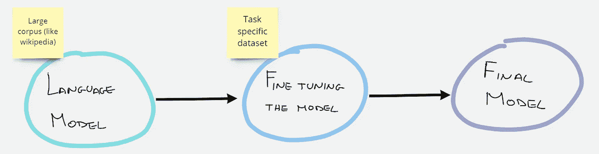

# 自然语言处理中领域适应的微调

> 原文：<https://towardsdatascience.com/fine-tuning-for-domain-adaptation-in-nlp-c47def356fd6>

卢卡·布拉沃在 [Unsplash](https://unsplash.com?utm_source=medium&utm_medium=referral) 上的照片

## 创建您的自定义模型并上传到拥抱脸

## **简介**

通常，当我们想要解决一个 NLP 问题时，我们会使用预先训练好的语言模型，显然会小心地选择最合适的模型，这些模型已经针对我们感兴趣的语言进行了微调。
例如，如果我正在进行一个基于意大利语的项目，我将使用诸如[*dbmdz/Bert-base-Italian-xxl-cased*](https://huggingface.co/dbmdz/bert-base-italian-xxl-cased)或[*dbmdz/Bert-base-Italian-xxl-uncased*](https://huggingface.co/dbmdz/bert-base-italian-xxl-uncased)这样的模型。
**这些语言模型通常在通用文本上工作得很好，但当我们在特定领域使用它们时**却常常不太合适，例如，如果我们在有其**特殊语言**的医学或科学领域使用它们。
为此，我们需要应用**域适配**！
领域适应，是指我们对新数据集上的预训练模型进行微调，它会给出更适合该数据集的预测。

## 微调是什么意思？

> NLP 中的微调指的是**使用您自己的自定义数据**重新训练预训练语言模型的过程。作为微调过程的结果，原始模型的权重被更新，以考虑领域数据和您感兴趣的任务的特征。

作者图片

在我们的例子中，我们将使用**屏蔽语言模型任务(MLM)** 进行微调。换句话说，我们的数据集将不具有前缀标签，但是对于每个句子**，一些单词将被隐藏**(被屏蔽)，并且**模型将不得不猜测**哪些是隐藏的单词。

## 资料组

我们将用于此目的的**数据是公开的，可以在 kaggle 的[链接](https://www.kaggle.com/datasets/mrisdal/fake-news)中找到。这个**数据集包含大约 13k 条新闻**。我们只对评论的内容感兴趣，所以你只需要使用*文本*列。在本文中，我不会描述从 kaggle 下载数据集并提取 csv 文件的过程，如果您有问题，可以阅读我在 TDS 上发布的其他文章。**

## 亲自动手

让我们先导入我们需要的所有库。

进口

让我们定义模型训练所需的超参数。(如果你有足够的计算能力，可以随便玩！)

超参数

先说资料准备。加载您的 csv 文件，分割它并将其转换为数据集对象。

数据准备

现在你必须选择你的分层模型和标记器。我喜欢用 distilbert，因为它更轻，训练更快。

开始模型和标记器

为了给模型提供信息，我们需要对数据集进行标记。

现在我们可以训练我们的模型了。*DataCollatorForLanguageModeling*是一个允许我们非常容易地在掩蔽语言任务上训练模型的函数。

训练并保存您的自定义模型

## 困惑评估

你创建的定制模型真的比源模型好吗？要了解是否有改进，我们可以计算模型的困惑度！如果你对这个指标感兴趣，请阅读这篇[文章](/perplexity-in-language-models-87a196019a94)。

原始模型困惑

定制模型困惑

希望你注意到了模型困惑的改善！

## 在拥抱脸上发布您的自定义模型！

如果您在个人数据集或您自己创建的特定数据集上训练您的模型，您的模型可能对其他人有用。只需几行代码就可以上传到你的拥抱脸账户！

首先创建一个拥抱脸的个人帐户，然后运行以下命令。

上传你的模型到拥抱脸

搞定了。现在你的模型在拥抱脸，任何人都可以下载和使用它！感谢大家的贡献！

## 结论

如果你也喜欢创建你自己的自定义语言模型并把它发布在 Hugging Face 上，请继续创建新的模型并让社区可以使用它们。
如果你想看看我在太空物品(遥感器、卫星……)方面训练过的模型，这就是:

<https://huggingface.co/Chramer/remote-sensing-distilbert-cased>  

## 结束了

作者:*马赛洛·波利蒂*

[Linkedin](https://www.linkedin.com/in/marcello-politi/) ， [Twitter](https://twitter.com/_March08_)