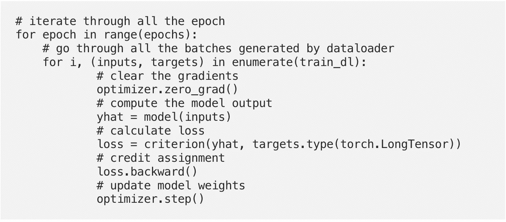
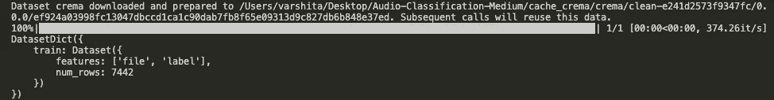
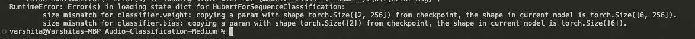
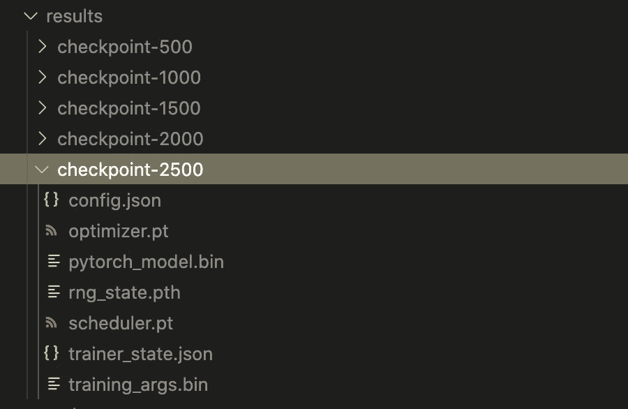
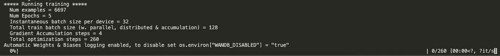
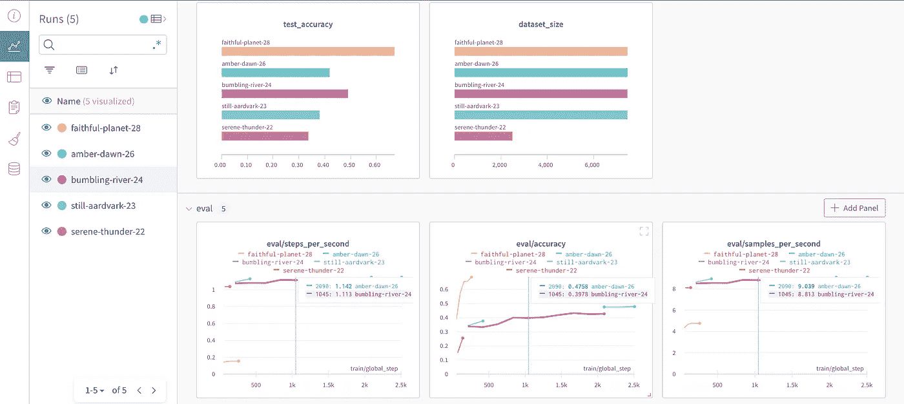
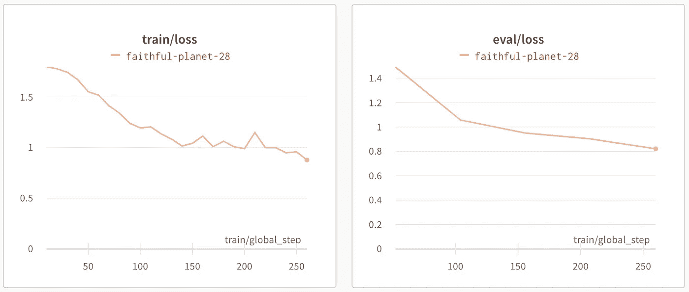

# 检测语音数据中的情感:使用 Huggingface 微调 HuBERT

> 原文：<https://towardsdatascience.com/fine-tuning-hubert-for-emotion-recognition-in-custom-audio-data-using-huggingface-c2d516b41cd8>

## 深度学习—音频的自然语言处理

## 构建定制的数据加载器、实验日志、改进指标的技巧以及 GitHub repo，如果您愿意的话

# 为什么是音频数据？

与文本和计算机视觉任务的 NLP 相比，音频数据的 NLP 没有得到足够的重视。是时候改变了！

# 工作

情绪识别——识别语音是否表现出*愤怒*、*快乐*、*悲伤*、*厌恶*、*惊讶*或*中性*情绪。

*注意:一旦我们完成教程，你应该能够重用任何音频分类任务的代码。*

# 资料组

对于本教程，我们将使用 Kaggle 上公开可用的 [Crema-D](https://www.kaggle.com/datasets/ejlok1/cremad) 数据集。(非常感谢[大卫·库珀·切尼](https://github.com/CheyneyComputerScience/CREMA-D)收集了这个令人敬畏的数据集)。所以请点击[链接](https://www.kaggle.com/datasets/ejlok1/cremad?resource=download)上的*下载*按钮。您应该看到包含 Crema-D 音频文件的 *archive.zip* 开始下载。它包含 7k+音频文件，格式为`.wav`。

*注意:请随意使用您收集的任何音频数据，而不是 CremaD 数据集。*

如果你想跟随这个教程，这里有 GitHub repo。

<https://github.com/V-Sher/Audio-Classification-HF/tree/main/src>  

# 拥抱脸库和教练 API

正如标题中提到的，我们将使用拥抱人脸库来训练模型。特别是，我们将使用它的[训练器](https://huggingface.co/docs/transformers/main_classes/trainer)类 API。

*为什么是培训师？为什么不用 PyTorch 写一个标准的训练循环呢？*

下面是标准样板代码在 **Pytorch** 中的样子:



摘自我给 PyTorch 的[入门教程](/recreating-keras-code-in-pytorch-an-introductory-tutorial-8db11084c60c)

相比之下，**训练器**大大简化了编写训练循环的复杂性，使得训练可以在一行中完成:

```
trainer.train()
```

除了支持基本的训练循环，它还允许在多个 GPU/TPU 上进行分布式训练、回调(例如提前停止)、评估测试集的结果等。所有这些都可以通过在初始化培训师课程时简单地设置几个参数来实现。

如果不是因为任何事情，我觉得用 Trainer 代替香草 PyTorch 肯定会导致一个更有组织，看起来更干净的代码库。

# 让我们开始吧…

## 装置

虽然是可选的，但我强烈建议通过创建和激活一个新的虚拟环境来开始本教程，在这个环境中我们可以完成所有的`pip install ...`。

```
python -m venv audio_env
source activate audio_env/bin/activate
```

## 正在加载数据集

与任何数据建模任务一样，我们首先需要使用[数据集](https://huggingface.co/docs/datasets/tutorial)库加载数据集(我们将把它传递给培训师类)。

```
pip install datasets
```

鉴于我们正在使用自定义数据集(与该库附带的预安装数据集相反)，我们需要首先编写一个**加载脚本**(让我们称之为`crema.py`)，以教练可接受的格式加载数据集。

在之前的一篇[文章](/how-to-turn-your-local-zip-data-into-a-huggingface-dataset-43f754c68f82)中，我已经讲述了如何创建这个脚本(非常详细)。(我强烈建议通过它来了解`config`、`cache_dir`、`data_dir`等的用法。在下面的代码片段中)。数据集中的每个示例都有两个特征:`file`和`label`。

```
dataset_config = {
  "LOADING_SCRIPT_FILES": os.path.join(PROJECT_ROOT, "**crema.py**"),
  "CONFIG_NAME": "clean",
  "DATA_DIR": os.path.join(PROJECT_ROOT, "data/archive.zip"),
  "CACHE_DIR": os.path.join(PROJECT_ROOT, "cache_crema"),
}ds = load_dataset(
  dataset_config["LOADING_SCRIPT_FILES"],
  dataset_config["CONFIG_NAME"],
  *data_dir*=dataset_config["DATA_DIR"],
  *cache_dir*=dataset_config["CACHE_DIR"]
)print(ds)********* OUTPUT ********DatasetDict({
    train: Dataset({
        features: ['**file**', '**label**'],
        num_rows: 7442
    })
})
```



*P.S:虽然我们为 CremaD 数据集创建了一个* `*datasets.Dataset*` *对象(传递给 Trainer 类)，但它不一定必须是这样。我们也可以定义并使用* `*torch.utils.data.Dataset*` *(类似于我们在* [*本*](/recreating-keras-code-in-pytorch-an-introductory-tutorial-8db11084c60c) *教程中创建的 CSVDataset)。*

# 编写模型培训脚本

[Github repo](https://github.com/V-Sher/Audio-Classification-HF) 中的目录结构:

```
Audio-Classification-Medium  
│
└───src
│   │
│   └───data
│       │   crema.py
│   
└───data
|   │   archive.zip 
|
└───scripts
    │   audio_train.py
```

让我们开始写我们的`audio_train.py`剧本吧。

## 装置

## 实验跟踪(可选)

我们使用[权重&偏差](https://wandb.ai/site)进行实验跟踪，因此请确保您已经创建了一个帐户，然后根据您的详细信息更新`USER`和`WANDB_PROJECT`。

## 加载特征提取器

> 问题:从广义上讲，什么是特征提取器？
> 答:[特征提取器](https://huggingface.co/docs/transformers/main_classes/feature_extractor#feature-extractor)是一个负责为模型准备输入特征的类。例如，在**图像**的情况下，这可以包括裁剪图像、填充，或者在**音频**的情况下，这可以包括将原始音频转换成频谱特征、应用归一化、填充等。
> 
> 图像数据的特征提取器示例:
> > > >从变形金刚导入 ViTFeatureExtractor
> >>>vit _ extractor = ViTFeatureExtractor()
> >>>print(vit _ extractor)
> 
> ViTFeatureExtractor {
> " do _ normalize ":true，
> "do_resize": true，
> " feature _ extractor _ type ":" ViTFeatureExtractor "，
> "image_mean": [0.5，0.5，0.5]，
> "image_std": [0.5，0.5，0.5]，
> "resample": 2，
> "size": 224
> }

更具体地说，我们将使用`[Wav2Vec2FeatureExtractor](https://huggingface.co/docs/transformers/model_doc/wav2vec2#transformers.Wav2Vec2FeatureExtractor)`。这是从[sequence feature extractor](https://huggingface.co/docs/transformers/v4.21.2/en/main_classes/feature_extractor#transformers.SequenceFeatureExtractor)派生的一个类，它是一个通用的语音识别特征提取类，由 Huggingface 提供。

使用[wav2 vec 2 feature extractor](https://huggingface.co/docs/transformers/model_doc/wav2vec2#transformers.Wav2Vec2FeatureExtractor)有三种方法:

*   选项 1 —使用默认值。

```
from transformers import Wav2Vec2FeatureExtractorfeature_extractor = Wav2Vec2FeatureExtractor()
print(feature_extractor)**** OUTPUT ****
Wav2Vec2FeatureExtractor {
   "do_normalize": true,
   "feature_extractor_type": "Wav2Vec2FeatureExtractor",
   "feature_size": 1,
   "padding_side": "right",
   "padding_value": 0.0,
   "return_attention_mask": false,
   "sampling_rate": 16000 
}
```

*   选项 2-修改任何`Wav2Vec2FeatureExtractor` [参数](https://huggingface.co/docs/transformers/model_doc/wav2vec2#transformers.Wav2Vec2FeatureExtractor)来创建您的自定义特征提取器。

```
from transformers import Wav2Vec2FeatureExtractorfeature_extractor = Wav2Vec2FeatureExtractor(
          ***sampling_rate*=24000,
          *truncation*=True**
)
print(feature_extractor)**** OUTPUT ****
Wav2Vec2FeatureExtractor {
   "do_normalize": true,
   "feature_extractor_type": "Wav2Vec2FeatureExtractor",
   "feature_size": 1,
   "padding_side": "right",
   "padding_value": 0.0,
   "return_attention_mask": false,
 **"sampling_rate": 24000,
   "truncation": true**
}
```

选项 3:因为我们不寻求任何定制，我们可以使用`from_pretrained()`方法来加载预训练模型的默认特征提取器参数(通常存储在名为`preprocessor_config.json`的文件中)。由于我们将使用`facebook/hubert-base-ls960`作为我们的基础模型，我们可以获得它的特征提取器参数(可用于视觉检查[这里](https://huggingface.co/facebook/wav2vec2-base-960h/tree/main)下`preprocessor_config.json`)。

```
from transformers import Wav2Vec2FeatureExtractor**model = "facebook/hubert-base-ls960"**
feature_extractor = Wav2Vec2FeatureExtractor**.from_pretrained(model)**print(feature_extractor)*** OUTPUT ***Wav2Vec2FeatureExtractor {
   "do_normalize": true,
   "feature_extractor_type": "Wav2Vec2FeatureExtractor",
   "feature_size": 1,
   "padding_side": "right",
   "padding_value": 0,
   "return_attention_mask": false,
   "sampling_rate": 16000
 }
```

为了查看特征提取器的运行情况，让我们将一个虚拟音频文件作为`raw_speech`输入到 Wav2Vec2FeatureExtractor:

```
model_id = "facebook/hubert-base-ls960"
feature_extractor = Wav2Vec2FeatureExtractor.from_pretrained(model_id)audio_file = "dummy1.wav"
audio_array = librosa.load(audio_file, *sr*=16000, *mono*=False)[0]input = *feature_extractor*(
       **raw_speech=audio_array**,
       *sampling_rate*=16000,
       *padding*=True,
      *return_tensors*="pt"
)print(input)
print(input.shape)
print(audio_array.shape)***** OUTPUT ******
{'input_values': tensor([[-0.0003, -0.0003, -0.0003,  ...,  0.0006, -0.0003, -0.0003]])}torch.Size([1, 36409])(36409,)
```

需要注意的几件事:

*   特征提取器的输出是一个包含`input_values`的字典。它的值只是应用于`audio_array`的[标准化](https://github.com/huggingface/transformers/blob/v4.21.2/src/transformers/models/wav2vec2/feature_extraction_wav2vec2.py#L224)，即来自`librosa`库的输出。事实上，`input.input_values`和`audio_array`的形状是一样的。
*   当调用特征提取器时，确保您使用的`sampling_rate`与基础模型用于其训练数据集的`sampling_rate`相同。我们使用[这个](https://huggingface.co/facebook/hubert-base-ls960) facebook 模型进行训练，它的模型卡明确声明以 16Khz 采样语音输入。
*   `return_tensors`可以分别为 PyTorch 张量、TensorFlow 对象和 NumPy 数组取值“pt”、“tf”和“np”。
*   `padding`在单个音频文件的情况下没有太大意义，但当我们进行批处理时，它有意义，因为它填充较短的音频(带有额外的 0 或-1)以具有与最长音频相同的长度。以下是用不同长度填充音频文件的示例:

```
audio_file_1 = "dummy1.wav"
audio_file_2 = "dummy2.wav"audio_array_1 = librosa.load(audio_file_1, *sr*=16000, *mono*=False)[0]
audio_array_2 = librosa.load(audio_file_2, *sr*=16000, *mono*=False)[0]input_with_one_audio = *feature_extractor*(
       **audio_array_1**,
       *sampling_rate*=16000,
       *padding*=True,
      *return_tensors*="pt"
)input_with_two_audio = *feature_extractor*(
       **[audio_array_1, audio_array_2]**,
       *sampling_rate*=16000,
       *padding*=True,
      *return_tensors*="pt"
)print(input_with_one_audio.input_values.shape)
print(input_with_two_audios.input_values.shape)***** OUTPUT ****
torch.Size([1, 36409])
torch.Size([2, 37371])
```

既然我们知道特征提取器模型的输出可以根据输入音频的不同而改变形状，那么在将一批输入推送到模型进行训练之前，填充为什么重要就变得很清楚了。当处理批次时，我们可以(a)将所有音频填充到训练集中最长音频的长度，或者(b)将所有音频截断到最大长度。(a)的问题是，我们不必要地增加了存储这些额外填充值的内存开销。(b)的问题是，由于截断，可能会丢失一些信息。

有一个更好的选择——使用[数据整理器](https://huggingface.co/docs/transformers/main_classes/data_collator)在模型训练期间应用动态填充。我们将很快看到他们的行动！

> 在构建批次(用于训练)时，**数据整理器**可以只对特定批次的输入进行预处理(比如填充)。

## 分类的加载基础模型

如前所述，我们将使用脸书的休伯特模型来分类音频。如果你对休伯特的内部工作方式感兴趣，可以看看这篇由乔纳森·Bgn 撰写的关于休伯特的很棒的[入门教程。](https://jonathanbgn.com/2021/10/30/hubert-visually-explained.html)

裸露的 [HubertModel](https://huggingface.co/docs/transformers/model_doc/hubert#transformers.HubertModel) 是 24 个 transformer 编码器层的堆栈，并为这 24 层中的每一层输出原始隐藏状态(顶部没有任何特定的头用于分类)。

```
bare_model = HubertModel.from_pretrained("facebook/hubert-large-ls960-ft")last_hidden_state = bare_model(input.input_values).last_hidden_state
print(last_hidden_state.shape)*** OUTPUT ***torch.Size([1, 113, 1024]) *# the hidden size i.e. 113 can vary depending on audio*
```

我们需要在这个裸模型之上的某种分类头，它可以将最后一个隐藏层的输出馈送到一个线性层，最终输出 6 个值(6 个情感类别中的每一个)。这正是[Hubert for sequence classification](https://huggingface.co/docs/transformers/model_doc/hubert#transformers.HubertForSequenceClassification)所做的事情。它的顶部有一个分类头，用于音频分类等任务。

然而，与上面解释的特征提取器配置类似，如果您从预训练模型中获得 HubertForSequenceClassification 的默认配置，您会注意到，由于其默认配置的定义方式，它仅适用于二进制分类任务。

```
model_path = ""facebook/hubert-large-ls960-ft""hubert_model = HubertForSequenceClassification.from_pretrained(model_path)hubert_model_config = hubert_model.configprint("Num of labels:", hubert_model_config.num_labels)**** OUTPUT ******Num of labels: 2**
```

对于我们的 6 类分类，我们需要使用 [PretrainedConfig](https://huggingface.co/docs/transformers/v4.21.2/en/main_classes/configuration#transformers.PretrainedConfig) 更新要传递给 Hubert 模型的配置(查看部分— [参数进行微调](https://huggingface.co/docs/transformers/v4.21.2/en/main_classes/configuration#transformers.PretrainedConfig.architectures))。

需要注意的几件事:

*   在第 5 行，`from_pretrained()`从`facebook/hubert-base-ls960`加载模型架构**和**模型权重(即所有 24 个变压器层+线性分类器的权重)。
    *注意:如果你简单地做了* `*hubert_model = HubertForSequenceClassification()*` *，变换编码器和分类器权重被随机初始化*。
*   将`ignore_mismatched_sizes`参数设置为`True`很重要，因为如果没有它，你会因为尺寸不匹配而得到一个错误(见下图)——作为`facebook/hubert-base-ls960`一部分的分类器权重具有形状`(2, classifier_proj_size)`，而根据我们新定义的配置，我们的权重应该具有形状`(6, classifier_proj_size)`。鉴于我们无论如何都要从头重新训练线性分类器层，我们可以选择忽略不匹配的大小。



分类器大小不匹配导致的错误

## 冻结图层进行微调

> 根据一般经验，如果训练预训练模型的基础数据集与您正在使用的数据集有显著不同，最好取消冻结并重新训练顶层的几个层。

首先，我们解冻顶部两个编码器层(最接近分类头)的权重，同时保持所有其他层的权重冻结。为了冻结/解冻权重，我们将`param.require_grad`设置为假/真，其中`param`指的是模型参数。

> 在模型训练期间解冻权重意味着这些权重将照常更新，以便它们可以达到手头任务的最佳值。

*注意:虽然在训练过程的最开始解冻许多层看起来很直观，但这不是我推荐的。我实际上是通过冻结所有层并只训练分类器头来开始我的实验的。因为结果很差(这点不奇怪)，我解冻两层恢复训练。*

## 正在加载数据集

使用我们的定制加载脚本`crema.py`，我们现在可以使用`load_dataset()`方法从[数据集](https://huggingface.co/docs/datasets/v2.4.0/en/index)库中加载我们的数据集。

接下来，我们使用`map()`将数据集中的所有原始音频(以`.wav`格式)转换成数组。

> 一般来说，`map`对数据集中的所有行/样本重复应用一个函数。

这里，函数(定义为一个 [lambda 函数](https://www.w3schools.com/python/python_lambda.asp))接受一个参数`x`(对应于数据集中的一行)，并使用`librosa.load()`将该行中的音频文件转换为一个数组。如上所述，确保采样率(`sr`)合适。

*注意:如果你在这个阶段做* `*print(ds)*` *，你会注意到数据集中的三个特征:*

```
*print(ds)******* OUTPUT *******DatasetDict({
    train: Dataset({
        features: ['file', 'label', 'array'],
        num_rows: 7442
    })
})*
```

一旦我们生成了数组，我们将再次使用`map`——这一次使用辅助函数`prepare_dataset()`来准备输入。

`prepare_dataset`是一个助手函数，它将处理函数应用于数据集中的每个示例(或者一组示例，也就是`batch`)。更具体地说，该函数做两件事— (1)读取出现在`batch["array"]`的音频数组，并使用上面讨论的`feature_extractor`从中提取特征，并将其存储为名为`input_values`的新特征—(除了`file`、`labels`和`array`)以及(2)创建名为`labels`的新特征，其值与`batch["label"]`相同。

*问题:你可能想知道对于每个例子都有* `*label*` *和* `*labels*` *有什么意义，尤其是当它们有相同的值时。*
*原因:训练器 API 会寻找* `*labels*` *的列名，默认情况下，所以我们只是乐于助人。如果你愿意，你甚至可以在这一步删除*<https://huggingface.co/docs/datasets/process#remove>**和其他* `*label*` *列，或者更好，在创建加载脚本时将特征命名为“标签”。**

*如果你仔细观察，就会发现不像前面的`map`用例，lambda 函数只需要*一个*输入参数，`prepare_dataset()`需要*两个*参数。*

> *记住:每当我们需要向`map`内部的函数传递多个参数时，我们必须将`fn_kwargs`参数传递给`map`。这个参数是一个字典，包含所有要传递给函数的参数。*

*基于其函数定义，我们需要两个参数用于`prepare_dataset()` — (a)数据集中的行和(b)特征提取器——因此我们必须如下使用`fn_kwargs`:*

*接下来，我们将使用`class_encode_column()`将所有字符串标签转换成 ids，1，2，3，4，5，6)。*

*最后，我们通过使用`train_test_split()`引入训练-测试-验证分割。我们需要以这种方式分割两次，以获得三个不重叠的数据集，所有这些数据集在下面的步骤 8 中合并成一个单独的`DatasetDict`。*

# *让训练开始吧…*

*所有的细节都准备好了，我们现在准备开始使用训练者职业进行训练。*

*首先，我们需要指定训练参数——这包括时期的数量、批量大小、存储训练模型的目录、实验记录等。*

*需要考虑的事情很少:*

*   *[梯度累积步骤](https://huggingface.co/docs/transformers/perf_train_gpu_one#gradient-accumulation)在你想在训练期间推动更大批量但你的记忆有限的情况下非常有用。设置`gradient_accumulation_steps=4`允许我们在每 4 步后更新权重—在每一步中，`batch_size=32`个样本被处理，它们的梯度被累加。只有在 4 个步骤之后，当积累了足够的梯度时，权重才会得到更新。*

*其次，除了指定训练和评估数据集之外，我们用这些训练参数实例化训练器类。*

*需要考虑的事情很少:*

*   *在第 5 行，我们使用了一个`data_collator`。我们在本教程开始时简要讨论了这种动态填充输入音频数组的方法。数据排序器初始化如下:*

```
*# DEFINE DATA COLLATOR - TO PAD TRAINING BATCHES DYNAMICALLYdata_collator = DataCollatorCTCWithPadding(
            processor=feature_extractor,
            padding=True
)*
```

*`DataCollatorCTCWithPadding`是改编自本[教程](https://huggingface.co/blog/fine-tune-wav2vec2-english)的 dataclass。我强烈推荐快速阅读教程中的[设置教练部分](https://huggingface.co/blog/fine-tune-wav2vec2-english#set-up-trainer),以了解这个课程发生了什么。*

*不涉及太多细节，这个类中的`__call__`方法负责准备接收到的输入。它从数据集中获取一批示例(记住每个示例有 4 个特征— `file`、`labels`、`label`、`array`、`input_values`)，并返回同一批示例，但使用`processor.pad`将填充应用到`input_values`。还有，批量中的`labels`都转换成 Pytorch 张量。*

*   *在第 8 行，我们定义了`compute_metrics()`，这是一种告诉培训师在评估期间必须计算哪些指标(准确度、精确度、f1、召回率等)的方式。它将评估预测(`eval_pred`)作为输入，并使用`metric.compute(predictions=.., references=...)`比较实际标签和预测标签。同样，`compute_metrics()`的样板代码是从[改编而来的。](https://huggingface.co/course/chapter3/3?fw=pt)*

**注:如果您想发挥创意并显示自定义指标(例如，绝对差异 btw 实际值和预测值的日志)，您可以修改* `*compute_metrics()*` *。在这样做之前你只需要知道* `*eval_pred*` *返回的是什么。这可以通过在实际训练模型之前在您的评估/测试数据集上运行* `*trainer.predict*` *来提前发现。在我们的例子中，它返回实际的标签和预测(即 logits 在其上应用* `[*argmax*](https://en.wikipedia.org/wiki/Arg_max)` *函数以获得预测的类):**

```
*trainer = Trainer(model=..., args=...,...)
output = trainer.predict(ds["test"])print(output)**** OUTPUT *****
PredictionOutput(
predictions=array([
       [ 0.0331, -0.0193, -0.98767, 0.0229, 0.01693, -0.0745],
       [-0.0445,  0.0020, 0.13196, 0.2219, 0.94693, -0.0614],
        .
        .
        .
], dtype=float32),
label_ids=array([0, 5, ......]),
metrics={'test_loss': 1.780486822128296, 'test_accuracy': 0.0, 'test_runtime': 1.6074, 'test_samples_per_second': 1.244, 'test_steps_per_second': 0.622}
)*
```

## *现在实际的训练只有一行代码*

*快速迂回:第 4 行包含从一个检查点继续训练的命令。但是首先，什么是检查点？*

*在训练过程中，教练将创建模型重量的快照，并将它们存储在`TrainingArguments(output_dir="results")`中定义的`output_dir`中。这些文件夹通常被命名为`checkpoint-XXXX`，包含模型权重、训练参数等。*

**

*检查站*

*您可以分别使用`[save_strategy](https://huggingface.co/docs/transformers/main_classes/trainer#transformers.TrainingArguments.save_strategy)`和`[save_steps](https://huggingface.co/docs/transformers/main_classes/trainer#transformers.TrainingArguments.save_steps)`指定**何时**和**多久**创建这些检查点。默认情况下，每 500 步后会保存检查点(`save_steps=500`)。我提到这一点的原因是因为我不知道这些默认值，并且在一次培训会议(运行了 7 个小时)中，我看到在输出目录中没有创建任何检查点。这是我正在使用的配置:*

*   *训练样本:6697*
*   *次数= 5*
*   *批量= 32*
*   *梯度累积步长= 4*

*经过一小时又一小时的调试，我发现在我的例子中总共只有 260 步，而默认的保存只发生在第 500 步之后。🤦作为`TrainingArguments()`的一部分，‍♀设置`save_steps = 100`为我解决了这个问题。*

**

*在底部，您可以找到优化步骤的总数*

**注意:如果您想知道如何计算总步数(即本例中的 260 步):**

****总训练批量*** *=批量*梯度累积步长= 32*4 = 128* ***总优化步长*** *=(训练样本/总训练批量)*历数=(6697/128)*5 ≈ 260。**

## *对测试集进行预测并记录结果*

*需要考虑的事情很少:*

*   *要记录权重和偏差的任何额外指标/变量，我们可以使用`wandb.log()`。例如，在第 4 行，我们记录了测试集的准确性。*
*   *默认情况下，`wandb`不记录训练过的模型，所以它只在训练完成后在本地机器上可用。为了显式地存储模型工件，我们需要使用带有`policy="end"`的`wandb.save()`，这意味着只有当运行结束时才同步文件。*

# *结果和反思*

*使用不同超参数组合的所有不同模型运行的结果都记录在我的重量和偏差仪表板上[这里](https://wandb.ai/vsher/audio-classifier)。*

**

*WandB 仪表板*

*查看学习曲线，看起来我们最近的运行( **faithful-planet-28** 测试精度= 68%——考虑到只花了 4 个小时的训练，还不算太坏)可能会受益于额外的时期，因为 train 和 eval 损失仍在减少，尚未稳定下来(或者更糟，开始发散)。根据这是否可行，可能需要解冻更多的编码器层。*

**

*学习曲线*

*一些反思和学习:*

*   *如果我们正在增加纪元，可能值得考虑提前通过回调停止训练。详见[本](https://stackoverflow.com/questions/69087044/early-stopping-in-bert-trainer-instances)栈溢出讨论。*

```
*# TO IMPLEMENT EARLY STOPPINGtrainer = Trainer(
  callbacks=[EarlyStoppingCallback(early_stopping_patience = 10)]
)*
```

*   *除了 Cuda 之外，Trainer 最近还增加了对新 Mac M1 GPU 的支持(只需设置`args = TrainingArguments(use_mps_device=True)`)。如果您正在与他们一起工作，请注意，有些人报告了指标的下降(这是一个已知的错误—参见[这个问题](https://github.com/huggingface/transformers/issues/17971))。*

# *结论*

*希望你现在对使用变形金刚库微调深度学习模型更有信心了。如果你真的推进这个项目，请与我和更广泛的社区分享你的结果(和提高准确性的步骤)。*

*与任何 ML 项目一样，关注负责任的 AI 开发对于评估未来工作的影响至关重要。考虑到最近的工作表明情绪检测方法可能有内在的性别/种族偏见，并可能造成现实世界的伤害，这变得更加重要。此外，如果您正在处理敏感的音频数据(比如包含信用卡详细信息的客户支持电话)，请应用脱敏技术来保护个人身份信息、敏感的个人数据或业务数据。*

*一如既往，如果有更简单的方法来做/解释本文中提到的一些事情，一定要让我知道。一般来说，避免不请自来的破坏性/垃圾/敌意评论！*

*直到下一次✨*

*我喜欢写循序渐进的初学者指南、操作指南、ML/AI 中使用的解码术语等。如果你想完全访问我的所有文章(以及其他媒体上的文章)，那么你可以使用 [***我的链接***](https://varshitasher.medium.com/membership)**这里* ***注册。*****

**</step-by-step-guide-to-explaining-your-ml-project-during-a-data-science-interview-81dfaaa408bf>  </time-series-modeling-using-scikit-pandas-and-numpy-682e3b8db8d1>  </hands-on-introduction-to-github-actions-for-data-scientists-f422631c9ea7>  </deploying-an-end-to-end-deep-learning-project-with-few-clicks-part-2-89009cff6f16> **