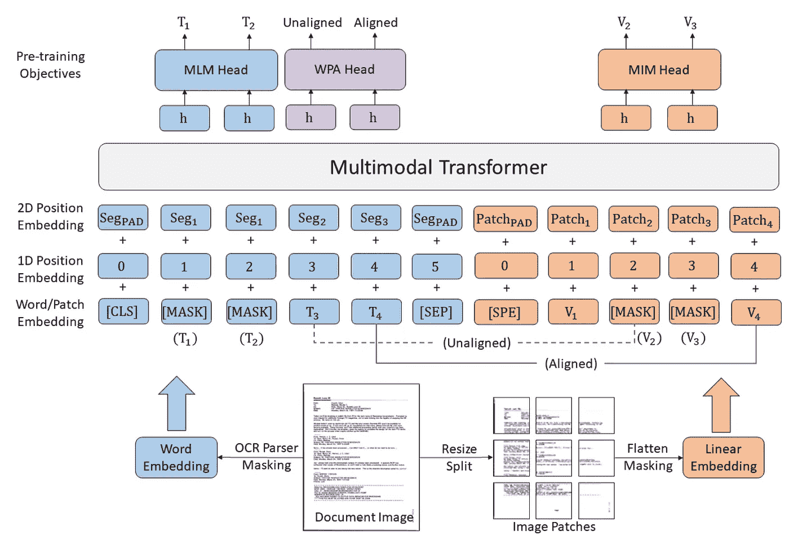
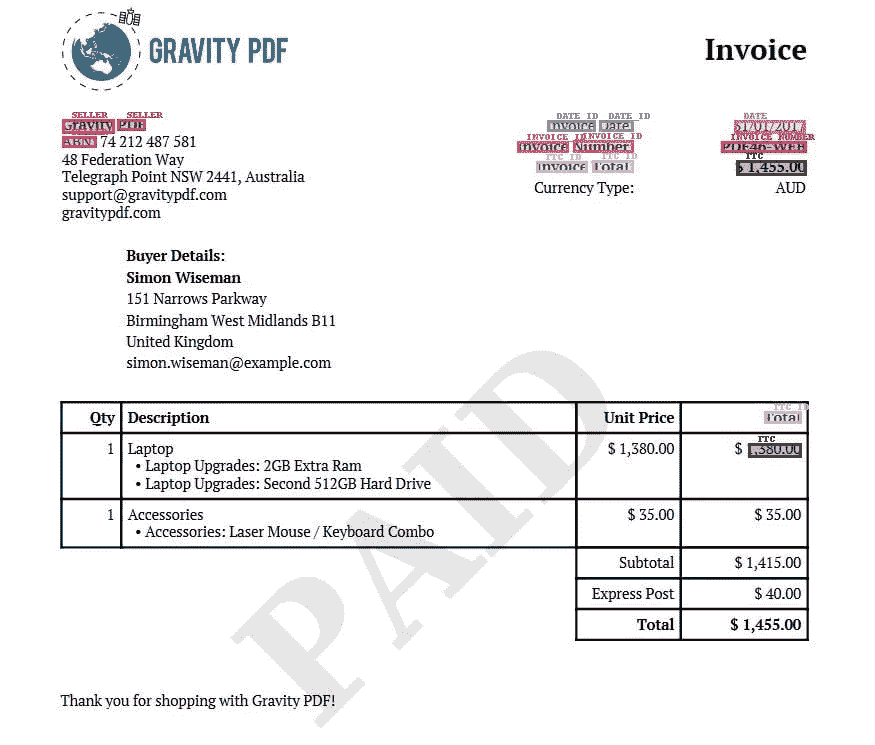
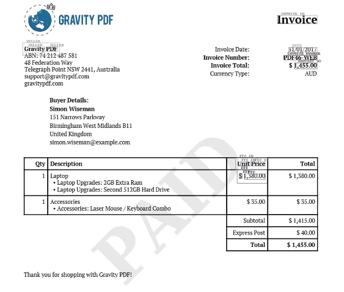

# 微调用于发票处理的 LayoutLM v3

> 原文：<https://towardsdatascience.com/fine-tuning-layoutlm-v3-for-invoice-processing-e64f8d2c87cf>

## 并将其性能与 LayoutLMv2 进行比较


来自 [Pixabay](https://pixabay.com/?utm_source=link-attribution&utm_medium=referral&utm_campaign=image&utm_content=1274307) 的图片由 [Sabine van Erp](https://pixabay.com/users/sabinevanerp-2145163/?utm_source=link-attribution&utm_medium=referral&utm_campaign=image&utm_content=1274307)

文档理解是文档处理和抽取的第一步，也是最重要的一步。它是从非结构化或半结构化文档中提取信息并将其转换为结构化形式的过程。然后，这种结构化表示可用于支持各种下游任务，如信息检索、摘要、分类等。理解文档有许多不同的方法，但它们都有一个共同的目标:创建文档内容的结构化表示，以便用于进一步处理。

对于发票、收据或合同等半结构化文档，随着 LayoutLM v1 和 v2 的开发，微软的 layoutLM 模型显示出了巨大的前景。如需深入教程，请参考我之前的两篇文章“[微调变压器模型用于发票识别](/fine-tuning-transformer-model-for-invoice-recognition-1e55869336d4)”和“[微调 LayoutLM v2 用于发票识别](/fine-tuning-layoutlm-v2-for-invoice-recognition-91bf2546b19e)”。

在本教程中，我们将微调微软最新的 LayoutLM v3，类似于我以前的教程，我们将比较其性能与 layoutLM v2 模型。

# LayoutLM v3

LayoutLM v3 相对于其前身的主要优势是多模态转换器架构，它以统一的方式结合了文本和图像嵌入。不是依赖 CNN 来进行图像嵌入，文档图像被表示为图像块的线性投影，然后图像块被线性嵌入并与文本标记对齐，如下所示。这种方法的主要优点是所需参数的减少和总体计算量的降低。



布局 LM v3 架构。[来源](https://github.com/microsoft/unilm/tree/master/layoutlmv3)

> 作者表明，“LayoutLMv3 不仅在以文本为中心的任务(包括表单理解、收据理解和文档视觉问答)中，而且在以图像为中心的任务(如文档图像分类和文档布局分析)中，都实现了一流的性能”。

# 微调 LayoutLM v3

与我的上一篇文章类似，我们将使用 220 个带注释的发票的相同数据集来微调 layoutLM v3 模型。为了执行注释，我们使用了 [UBIAI 文本注释工具](https://ubiai.tools)，因为它支持 OCR 解析、原生 PDF/图像注释以及以与 LayoutLM 模型兼容的正确格式导出，而无需任何后期处理。此外，[可以在 UBIAI 平台中对 layouLM 模型](https://ubiai.tools/Docs#modelcreation)进行微调，并使用它自动标记您的数据，这可以节省大量手动注释时间。

以下是关于如何使用该工具注释 pdf 和图像的精彩概述:

由 [Karndeep Singh](https://www.youtube.com/@karndeepsingh) 提供的 UBIAI 教程

从 [UBIAI](https://ubiai.tools/) 导出注释文件后，我们将它上传到 google drive 文件夹。我们将使用 google colab 进行模型训练和推理。

可以在下面的 google colab 中访问训练和推理脚本:

**训练:**

[](https://colab.research.google.com/drive/1TuPQ1HdhMYjfQI9VRV3FMk7bpPYD4g6w?usp=sharing) [## 谷歌联合实验室

### 编辑描述

colab.research.google.com](https://colab.research.google.com/drive/1TuPQ1HdhMYjfQI9VRV3FMk7bpPYD4g6w?usp=sharing) 

**推论:**

[](https://colab.research.google.com/drive/1YDTKuIg4mkrCBz1bzqabL27_UzF2Z82F?usp=sharing) [## 谷歌联合实验室

### 编辑描述

colab.research.google.com](https://colab.research.google.com/drive/1YDTKuIg4mkrCBz1bzqabL27_UzF2Z82F?usp=sharing) 

*   第一步是打开一个 google colab，连接你的 google drive，从 huggingface 安装变形金刚包。请注意，与 layoutLMv2 不同，我们没有使用 detectron 2 包来微调实体提取模型。但是，对于布局检测(超出了本文的范围)，需要 detectorn 2 包:

```
from google.colab import drivedrive.mount('/content/drive')!pip install -q git+https://github.com/huggingface/transformers.git! pip install -q git+https://github.com/huggingface/datasets.git "dill<0.3.5" seqeval
```

*   接下来，提取 preprocess.py 脚本来处理从 UBIAI 导出的 ZIP 文件:

```
! rm -r layoutlmv3FineTuning! git clone -b main [https://github.com/UBIAI/layoutlmv3FineTuning.git](https://github.com/UBIAI/layoutlmv3FineTuning.git)#!/bin/bashIOB_DATA_PATH = "/content/drive/MyDrive/LayoutLM_data/Invoice_Project_mkWSi4Z.zip"! cd /content/! rm -r data! mkdir data! cp "$IOB_DATA_PATH" data/dataset.zip! cd data && unzip -q dataset && rm dataset.zip! cd ..
```

*   运行预处理脚本:

```
#!/bin/bash#preprocessing argsTEST_SIZE = 0.33DATA_OUTPUT_PATH = "/content/"! python3 layoutlmv3FineTuning/preprocess.py --valid_size $TEST_SIZE --output_path $DATA_OUTPUT_PATH
```

*   加载数据集后处理:

```
from datasets import load_metricfrom transformers import TrainingArguments, Trainerfrom transformers import LayoutLMv3ForTokenClassification,AutoProcessorfrom transformers.data.data_collator import default_data_collatorimport torch# load datasetsfrom datasets import load_from_disktrain_dataset = load_from_disk(f'/content/train_split')eval_dataset = load_from_disk(f'/content/eval_split')label_list = train_dataset.features["labels"].feature.names
num_labels = len(label_list)
label2id, id2label = dict(), dict()
for i, label in enumerate(label_list):
    label2id[label] = i
    id2label[i] = label
```

*   定义一些评估指标:

```
metric = load_metric("seqeval")
import numpy as npreturn_entity_level_metrics = Falsedef compute_metrics(p):
    predictions, labels = p
    predictions = np.argmax(predictions, axis=2)# Remove ignored index (special tokens)
    true_predictions = [
        [label_list[p] for (p, l) in zip(prediction, label) if l != -100]
        for prediction, label in zip(predictions, labels)
    ]
    true_labels = [
        [label_list[l] for (p, l) in zip(prediction, label) if l != -100]
        for prediction, label in zip(predictions, labels)
    ]results = metric.compute(predictions=true_predictions, references=true_labels,zero_division='0')
    if return_entity_level_metrics:
        # Unpack nested dictionaries
        final_results = {}
        for key, value in results.items():
            if isinstance(value, dict):
                for n, v in value.items():
                    final_results[f"{key}_{n}"] = v
            else:
                final_results[key] = value
        return final_results
    else:
        return {
            "precision": results["overall_precision"],
            "recall": results["overall_recall"],
            "f1": results["overall_f1"],
            "accuracy": results["overall_accuracy"],
        }
```

*   加载、训练和评估模型:

```
model = LayoutLMv3ForTokenClassification.from_pretrained("microsoft/layoutlmv3-base",
                                                         id2label=id2label,
                                                         label2id=label2id)processor = AutoProcessor.from_pretrained("microsoft/layoutlmv3-base", apply_ocr=False)NUM_TRAIN_EPOCHS = 50PER_DEVICE_TRAIN_BATCH_SIZE = 1PER_DEVICE_EVAL_BATCH_SIZE = 1LEARNING_RATE = 4e-5training_args = TrainingArguments(output_dir="test",
                                  # max_steps=1500,
                                  num_train_epochs=NUM_TRAIN_EPOCHS,
                                  logging_strategy="epoch",
                                  save_total_limit=1,
                                  per_device_train_batch_size=PER_DEVICE_TRAIN_BATCH_SIZE,
                                  per_device_eval_batch_size=PER_DEVICE_EVAL_BATCH_SIZE,
                                  learning_rate=LEARNING_RATE,
                                  evaluation_strategy="epoch",
                                  save_strategy="epoch",
                                  # eval_steps=100,
                                  load_best_model_at_end=True,
                                  metric_for_best_model="f1")# Initialize our Trainer
trainer = Trainer(
    model=model,
    args=training_args,
    train_dataset=train_dataset,
    eval_dataset=eval_dataset,
    tokenizer=processor,
    data_collator=default_data_collator,
    compute_metrics=compute_metrics,
)trainer.train()
trainer.evaluate()
```

训练完成后，对测试数据集进行评估。下面是评测后的模型评分:

```
{'epoch': 50.0,
 'eval_accuracy': 0.9521988527724665,
 'eval_f1': 0.6913439635535308,
 'eval_loss': 0.41490793228149414,
 'eval_precision': 0.6362683438155137,
 'eval_recall': 0.756857855361596,
 'eval_runtime': 9.7501,
 'eval_samples_per_second': 9.846,
 'eval_steps_per_second': 9.846}
```

该模型能够实现 0.69 的 F1 分数、0.75 的召回率和 0.63 的精确度。

让我们对不属于训练数据集的新发票运行模型。

# 使用 LayoutLM v3 进行推理

为了运行推理，我们将使用 Tesseract 对发票进行 OCR，并将信息提供给我们训练好的模型来运行预测。为了简化这个过程，我们创建了一个定制的脚本，只有几行代码，让您可以接收 OCR 输出并使用模型运行预测。

*   第一步，让我们导入一些重要的库并加载模型:

```
#drive mountfrom google.colab import drivedrive.mount('/content/drive')## install Hugging face Transformers library to load Layoutlmv3 Preprocessor!pip install -q git+https://github.com/huggingface/transformers.git## install tesseract OCR Engine! sudo apt install tesseract-ocr! sudo apt install libtesseract-dev## install pytesseract , please click restart runtime button in the cell output and move forward in the notebook! pip install pytesseract# ! rm -r layoutlmv3FineTuning! git clone https://github.com/salmenhsairi/layoutlmv3FineTuning.gitimport osimport torchimport warningsfrom PIL import Imagewarnings.filterwarnings('ignore')# move all inference images from /content to 'images' folder
os.makedirs('/content/images',exist_ok=True)
for image in os.listdir():
  try:
    img = Image.open(f'{os.curdir}/{image}')
    os.system(f'mv "{image}" "images/{image}"')
  except:
    pass# defining inference parametersmodel_path = "/content/drive/MyDrive/LayoutLM_data/layoutlmv3.pth" # path to Layoutlmv3 modelimag_path = "/content/images" # images folder
# if inference model is pth then convert it to pre-trained format
if model_path.endswith('.pth'):
  layoutlmv3_model = torch.load(model_path)
  model_path = '/content/pre_trained_layoutlmv3'
  layoutlmv3_model.save_pretrained(model_path)
```

*   我们现在准备使用模型运行预测

```
# Call inference module! python3 /content/layoutlmv3FineTuning/run_inference.py --model_path "$model_path" --images_path $imag_path
```



作者图片:输出 LayoutLM v3

有了 220 张带注释的发票，该模型能够正确预测卖家姓名、日期、发票号码和总价(TTC)！

如果我们仔细观察，我们会发现它犯了一个错误，将笔记本电脑的总价作为发票总价。鉴于模型的得分，这并不奇怪，并暗示需要更多的训练数据。

# LayoutLM v2 与 LayoutLM v3 的比较

除了计算量较小之外，layoutLM V3 与 v2 相比是否提供了性能提升？为了回答这个问题，我们比较了同一张发票的两种模型输出。下面是我上一篇文章中显示的 layoutLM v2 输出:



作者图片:输出 LayoutLM v2

我们观察到几个区别:

*   v3 模型能够正确地检测大多数密钥，而 v2 无法预测 invoice_ID、Invoice number_ID 和 Total_ID
*   v2 模型错误地将总价$1，445.00 标记为 MONTANT_HT(在法语中表示税前总价)，而 v3 模型正确地预测了总价。
*   这两种型号都犯了一个错误，将笔记本电脑的价格标为总价。

基于这个例子，layoutLM V3 总体上表现出了更好的性能，但是我们需要在更大的数据集上进行测试来证实这一观察结果。

# 结论

通过开源 layoutLM 模型，微软正在引领供应链、医疗保健、金融、银行等许多行业的数字化转型。

在这个循序渐进的教程中，我们展示了如何在一个特定的用例(发票数据提取)上微调 layoutLM V3。然后，我们将其性能与 layoutLM V2 进行了比较，发现性能略有提升，但仍需在更大的数据集上进行验证。

基于性能和计算增益，我强烈推荐利用新的 layoutLM v3。

如果您有兴趣以最高效和最简化的方式创建自己的训练数据集，请不要犹豫，免费尝试 UBIAI OCR 注释功能[此处](https://ubiai.tools/Signup)。

在推特上关注我们 [@UBIAI5](https://twitter.com/UBIAI5) 或[订阅这里](https://walidamamou.medium.com/subscribe)！