# Osma 咖啡机中的粉末迁移

> 原文：<https://towardsdatascience.com/fines-migration-in-the-osma-coffee-machine-148530bd0657>

## 咖啡数据科学

## 对我来说是 Osma 数据的开始

我在 [Chromatic](http://chromaticcoffee.com/) 和 Hiver 一起品尝一些咖啡，我要求收集一些数据。我想检查一下 [Osma](https://drinkosma.com/) 是否与[微粒迁移](https://youtu.be/6kmdriFIZjA)有任何问题，所以我们拿了一些巴西咖啡，我们拉了两个镜头。通过检查颗粒分布，我没有发现 Osma 中微粒迁移的证据。

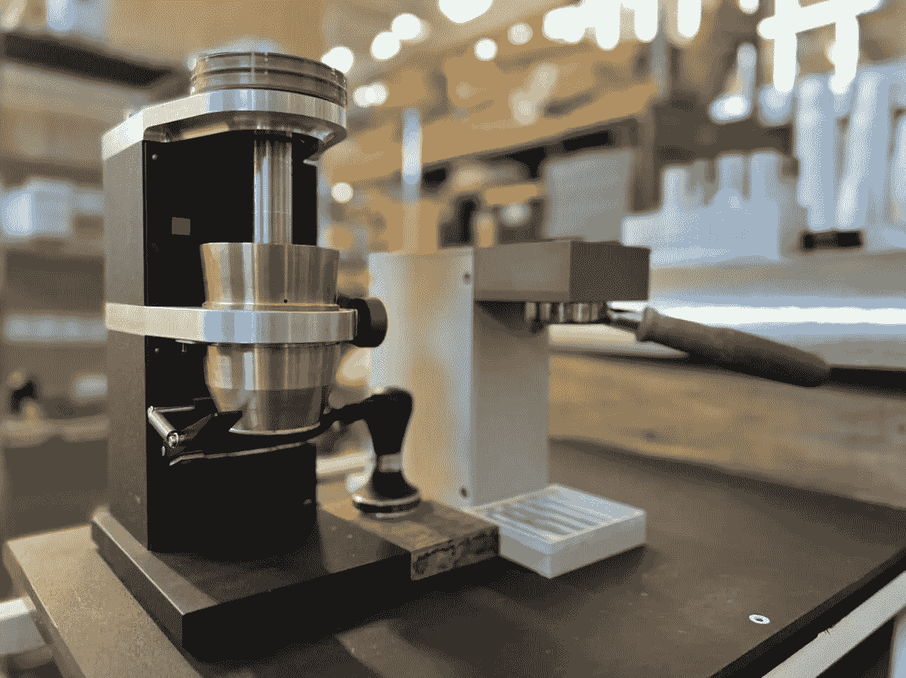

所有图片由作者提供

我看了一杯奥斯马咖啡和一杯像样的浓缩咖啡。我把视频并排放在一起。两者都有一定的不连续性，但是如果微粒迁移，这仍然会产生横向切割。

Osma 是一款冷(或热)浓缩咖啡酿造器，它使用谐波来摇动咖啡，并提取真正的冷酿造浓缩咖啡。意式浓缩咖啡的效果不同，我怀疑一些可溶物的提取速度与热意式浓缩咖啡不同。我一直有兴趣通过收集一些数据来研究这台机器。

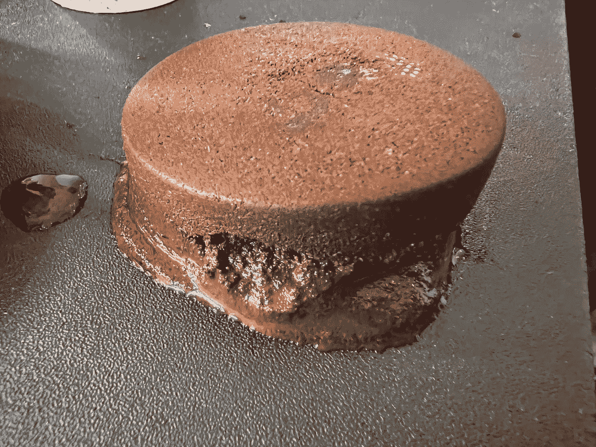

我对其他一些实验，特别是[强制微粒迁移](https://youtu.be/67FnyGrlP2c)的担心是，Osma 的行为可能类似于强制微粒迁移。我拿了一个用过的冰球，把它切成了三块。

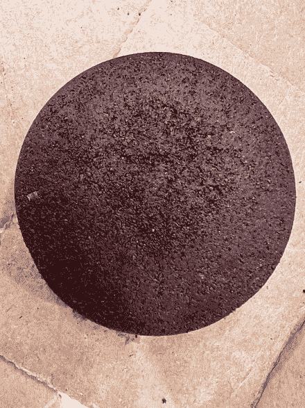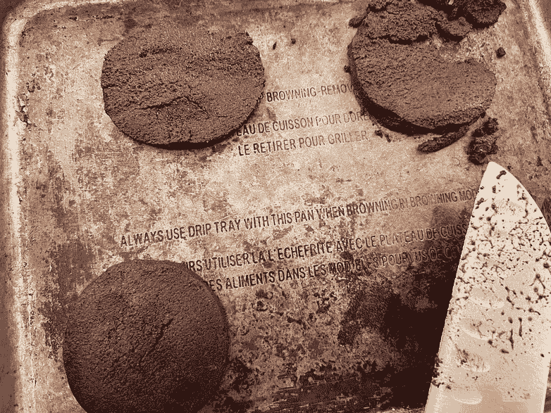

然后我用[成像和计算机视觉来计数颗粒](https://medium.com/nerd-for-tech/measuring-coffee-grind-distribution-d37a39ffc215)。我用同样的咖啡，同样的研磨(Versalab 研磨机)在像样的浓缩咖啡机上做了一杯普通的浓缩咖啡。我最初的测量没有显示出差异，我不确定样品是否足够干燥，所以我多干燥了一天。

没有太多的变化，我预计底层的微粒数量会稍微多一些，但事实并非如此。

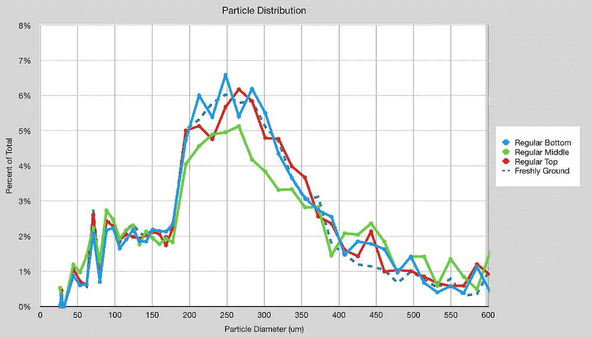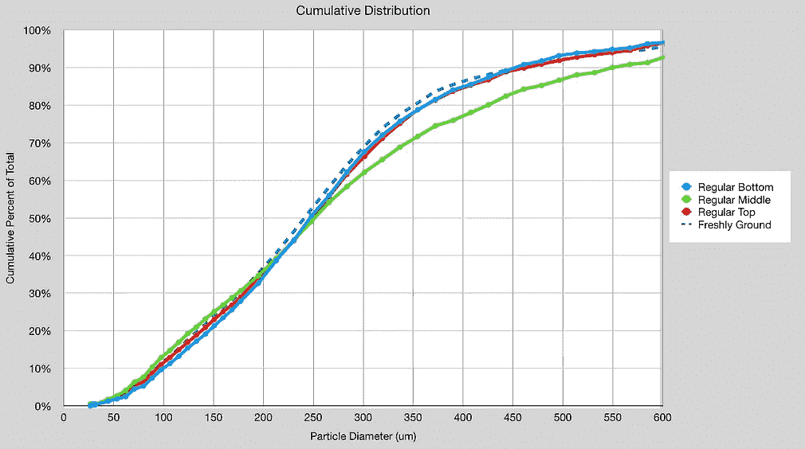

然后对比奥斯马，我发现了一个相似的模式。

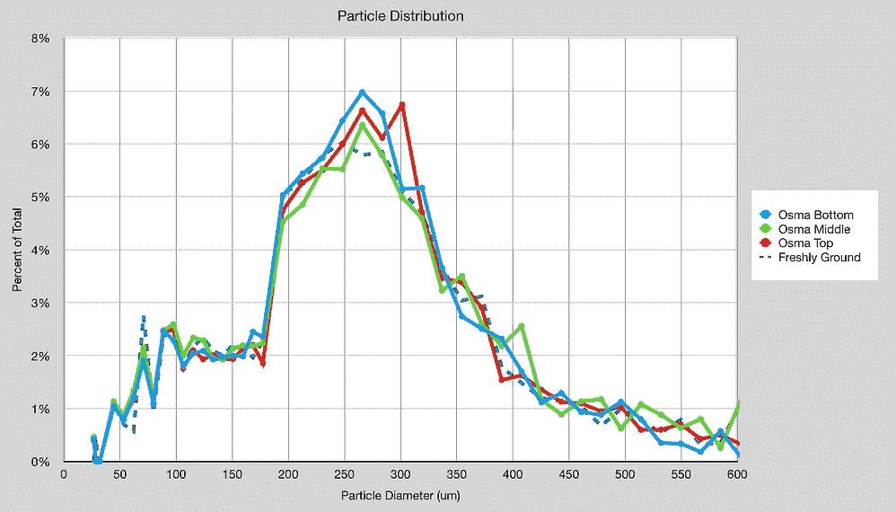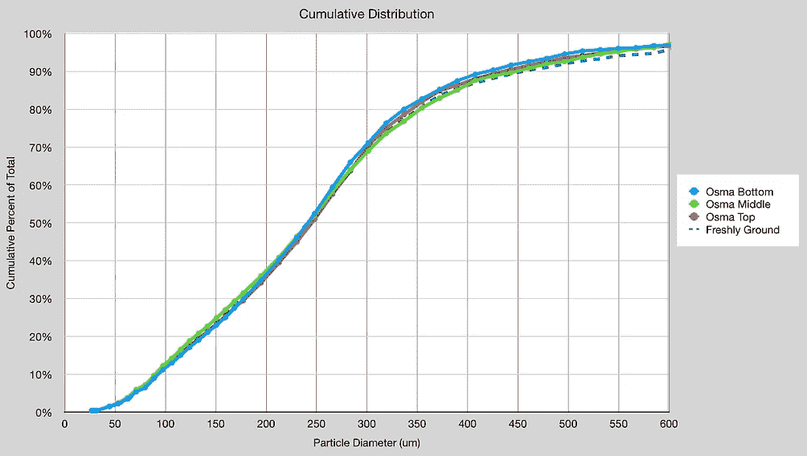

所以为了比较所有的分布，我做了一些测量来观察累积效应。同样，常规或奥斯马注射也没有效果。

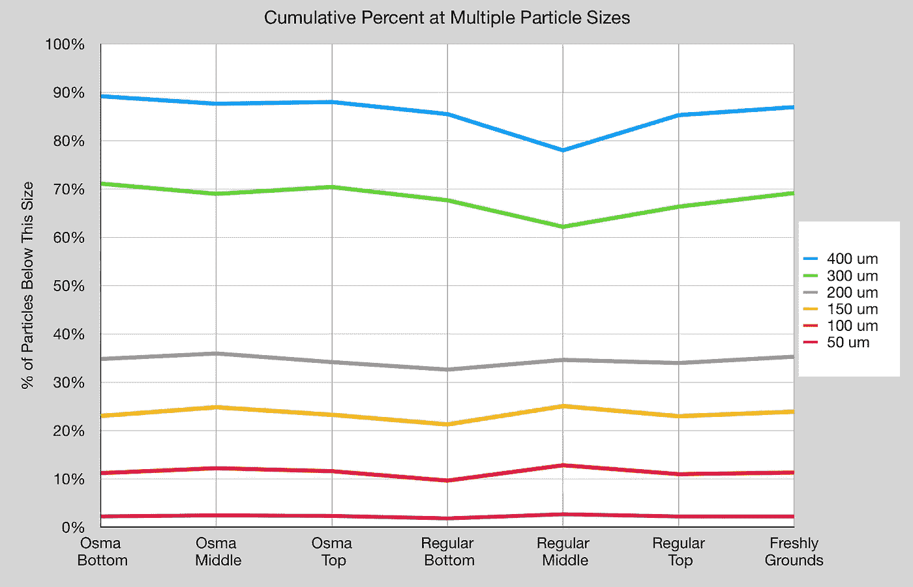

我放大到 150 微米以下的颗粒直径，底层和顶层的 Osma 颗粒数量相同。中间层似乎稍微多一点，所以可能有一些从顶部到中间的迁移，但很难确定。

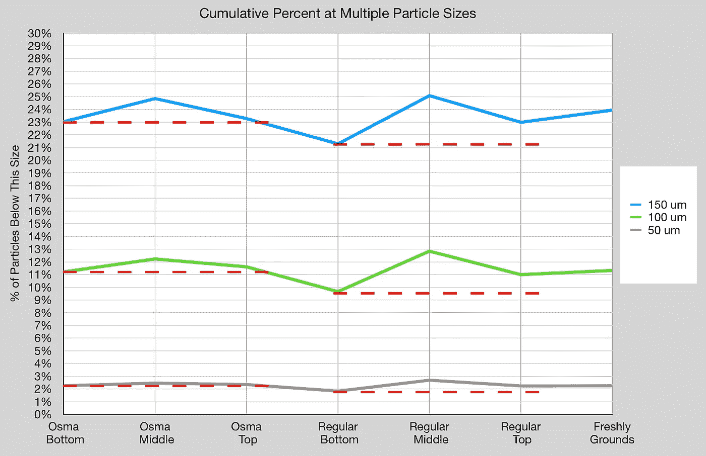

# 附加测量

在再次干燥之前，我的第一个样品没有显示出差异，对于第一个样品，我\取了额外的样品来验证测量过程。对于每一个，我取了三个样本，大多数情况下，方差并不大。

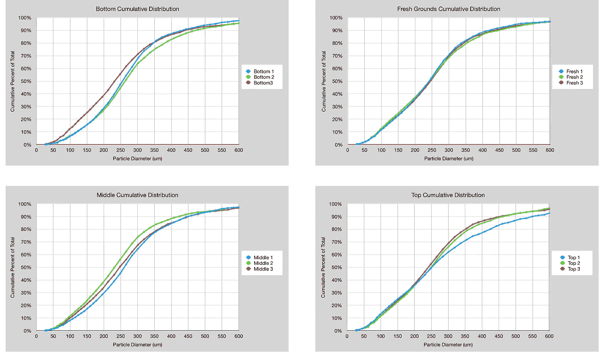

我检查了 Osma 用过的咖啡球，发现在颗粒迁移中没有观察到大量的微粒迁移。这可以进行更多的研究，以更好地理解 Osma 的功能。

如果你愿意，可以在推特、 [YouTube](https://m.youtube.com/channel/UClgcmAtBMTmVVGANjtntXTw?source=post_page---------------------------) 和 [Instagram](https://www.instagram.com/espressofun/) 上关注我，我会在那里发布不同机器上的浓缩咖啡照片和浓缩咖啡相关的视频。你也可以在 [LinkedIn](https://www.linkedin.com/in/dr-robert-mckeon-aloe-01581595) 上找到我。也可以关注我在[中](https://towardsdatascience.com/@rmckeon/follow)和[订阅](https://rmckeon.medium.com/subscribe)。

# [我的进一步阅读](https://rmckeon.medium.com/story-collection-splash-page-e15025710347):

[我未来的书](https://www.kickstarter.com/projects/espressofun/engineering-better-espresso-data-driven-coffee)

[我的链接](https://rmckeon.medium.com/my-links-5de9eb69c26b?source=your_stories_page----------------------------------------)

[浓缩咖啡系列文章](https://rmckeon.medium.com/a-collection-of-espresso-articles-de8a3abf9917?postPublishedType=repub)

工作和学校故事集