# 完全掌握费希尔的 A/B 检验的精确检验

> 原文：<https://towardsdatascience.com/fishers-exact-fb49432e55b5>

## 虽然费希尔精确测试是 A/B 测试的一个方便工具，但测试的思想和结果往往难以理解和解释。不管是纠结于超几何分布还是优势比，本指南为你提供了理解和应用费雪精确检验所需的所有背景知识。

我经常在网上寻找 A/B 测试的好资源。虽然对连续数据的解释很多，但我不认为对离散数据是这样——Fisher 的精确检验就是其中一个例子，我很少能找到对单尾假设检验的好的证明。为了填补这一空白，我将为费希尔的精确测试提供一个可理解和充分的指导，并进行一个**左**和**右尾**测试，以及一个**双边测试。**

让我大胆地说，这是费希尔精确测试所需的唯一指南。

## 结构

1.  [基线(对比)模型](#da06)
2.  [费希尔精确分布和超几何分布简介](#9a77)
3.  [手动计算费希尔 P 值](#e1b3)
4.  [假设](#4923)
5.  [进行测试(代码示例)](#241d)
6.  [了解优势比](#8b1d)
7.  [重述](#926e)

## 基线(比较)模型

首先，我们假设在以下结构中收集了捕获大西洋和印度洋中鲨鱼和鲸鱼出现的数据(原始示例来自 [Scipy](https://docs.scipy.org/doc/scipy/reference/generated/scipy.stats.fisher_exact.html) ):

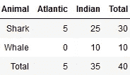

大西洋和印度洋中鲨鱼和鲸鱼出现的 2x2 矩阵

为了获得数据的第一印象，并有一个**“基线参考”**我将对独立性进行卡方检验。我总是这样做，看看是否已经有强烈的迹象表明这两个变量是(不)独立的。

```
h0: Independence of the variables (animals and ocean)
hA: Variables are not independent (i.e. there is a "pattern")
```

如图所示，p 值 0.41 太大，无法拒绝零假设，留给我们的假设是**变量是独立的**——如零假设下所述。

为了说明卡方检验有意义的原因:如果我们谈论的不是海里的鱼，而是网页上的点击量，我们可以说，两个网页的效率是一样的，因为没有迹象表明一个页面比另一个页面的点击量多/少。独立性实际上可以与没有网页比另一个更好的想法联系在一起——因此你最近的 A/B 测试变化并没有带来用户点击行为的显著变化。

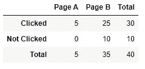

相同的列联表，相同的测试，不同的上下文

## 费雪精确分布和超几何分布简介

现在让我们来看看为什么我们都在这里，**费雪的精确测试。** Fisher 的精确检验假设输入表来自具有参数 *a，b，c* 和 *d* (每个像元值)的超几何分布。


与罗纳德·艾尔默·费希尔毫无相似之处——韦小宝拍摄的照片

如果超几何分布现在还没有引起注意，让我来给你举个例子:

抽屉里有 20 只黑袜子，10 只红袜子。你随机挑 8 只袜子，挑 6 只黑袜子和 2 只红袜子的概率是多少？像这样的问题是典型的超几何问题:

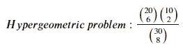

超几何分布下的概率

超几何分布下计算概率的公式可以用不同的方式来表达:

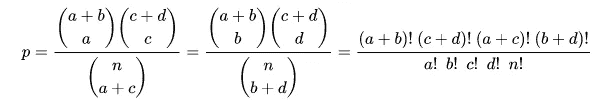

超几何分布下的概率

让我们将超几何分布与我们感兴趣的测试联系起来。Fisher 精确测试的核心思想是，我们使用我们的输入表并计算与问题“*相关的概率，我们看到随机抽取的表的概率小于或等于我们的输入表的概率(在超几何分布的假设下)*的可能性有多大。为了引用我们的数据表，我们使用以下列值:

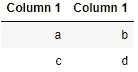

p 的超几何方程中填充的表的结构

> 双侧 p 值是在零假设下，随机表的概率等于或小于输入表的概率的概率([链接](https://docs.scipy.org/doc/scipy/reference/generated/scipy.stats.fisher_exact.html))。

## “手动”计算费雪的 P 值

虽然，**你可能对 Fisher 的精确测试更感兴趣，因为编码相关的任务**，我将快速详细说明测试的一般工作方式——相信我，它对理解测试结果有很大帮助。

正如我在开始时所说的，文献和例子主要集中在双边场景，因为它更常见(在实践中，你通常需要一个好的理由来进行单边测试)，也因为它似乎更容易理解。我将解决所有三种情况，单尾(左和右)和双尾。

基本上，Fisher 的精确测试是通过从左到右或从右到左(1)移动值来尝试数据单元格的不同配置— **注意，当第一行向右移动时，底部一行向左移动，因此边际分布保持不变**(理解这一点非常重要)。

对于每一种配置，我们可以计算看到那个表的概率。对于我们的初始表，变化如下所示:

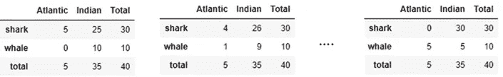

移位—所有可能的表格组合

可以重复上述步骤，直到我们在 Atlantic/shark 单元格中看到 0 值，因为我们不能减少超过该点—您不能观察到负数。如上所述，有 5 个可能的移位，因此对于这个例子有 6 个结果。使用 X(从 Python 索引的角度来看，单元格[1，1]或单元格[0，0])范围从 0 到 5 的那些表给出以下概率质量函数:

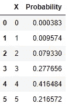

PMF 为 1.0(计算 **p** 的代码如下)

在超几何分布下计算和聚集这些表中的概率允许我们计算 p 值，用于确定是拒绝还是保留零假设。

> 为了使这一点更加具体，在我们的例子中，我们对 P(X=5)感兴趣。在费希尔的精确检验下，这被翻译为:“对所有 P(X=x)求和，其中 P(X=x) ≤ P(X=5) = 0.2166。

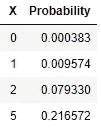

P(X) ≤ 0.217 的 X

“解码”这个:对于 P(X=5 ),我们看到概率约为 0.2166，因此表中低于该值的所有概率都是我们感兴趣的。很明显，对于[0，1，2]中的 X 值，情况就是这样，因此我们将[0，1，2]和[5]的所有概率相加，结果得到 **0.30586，这是我们在双边情况下的 p 值。**也可以将分数计算为 1-sum(0.277，0.42)对应 X={3，4}(取整值)。

**单尾测试**将参考假设 X 是<或>而不是值“a”(在我们的例子中，a = 5)。

如果我们选择选项“更大”(右尾)，则概率计算为所有 P(X=x)的总和，其中 x>5，而对于“更小”选项，我们则相反(x<5)。

> 请记住这个值，我们希望在稍后的费希尔精确测试中也能得到这个结果。

要计算上述概率，您可以使用以下代码片段:

如果你觉得很难理解移动 X 值(单元格[1，1])的想法，我可以推荐下面的视频，它从一个更直观的角度解释了移动 X 值的想法**以及与**超几何分布**的联系 **:****

超几何分布下的概率

## 假设

由于我们已经在 p 值的计算中达到顶峰，让我们**后退一步，想想潜在的假设。**

该测试基于直接计算获得输入表显示的结果的概率，给出零假设。回想一下，我们可以将独立性解释为:变量之间没有关联(动物对海洋)，这在零假设下是正确的(类似于独立性的卡方检验)。

在你通读假设之前，有一点需要注意:“比例”指的是优势比，我将在后面描述。我觉得在这里引入比值比会使事情变得不必要的混乱，所以我们现在跳过它，用更简单的 X (shark)的“比例”来代替:

```
**Two-sided:**
h0: Sharks are equally likely in both oceans (independence)
OR: There is no difference in the proportion of sharks in both oceans
*****OR: *A random table would have the probability of equal or less than the input table (look below for a detailed explanation of this)*hA: The variables are not independent (one proportion is different to the other)
OR:
The the proportions of sharks are not equivalent in both oceans.**Left sided (less):** h0: The proportion of sharks in the Atlantic is **greater or equal** to the Indian Ocean
hA: The proportion of sharks in the Atlantic is **less** than in the Indian Ocean **Right sided (greater):** h0: The proportion of sharks in the Atlantic is **less or equal** to the Indian Ocean
hA: The proportion of sharks in the Atlantic is **greater** than in the Indian Ocean
```

***** 零假设的另一种表述特别有趣，因为它**确切地指的是前面提到的潜在超几何分布**。考虑表格单元格[1，1]，随机表格等于或小于我们用作假设检验输入的表格的概率是多少—在我们的示例中 x = 5(大西洋中的鲨鱼)？

在零假设下，对于 x=5 的情况，我们期望概率为 0.22。我们现在只查看小于或等于 P(X=5)的概率，这是 X = {0，1，2，5}导致 P 值为 **0.30586** (所有符合条件的概率之和)的情况。

## 进行测试

让我们从与代码更相关的角度来看这个测试——我使用了 Scipy 的 *fisher_exact* 测试的实现:

```
from scipy.stats import fisher_exact as f
```

让我们从“更容易”的双面案例开始。如前面“手动”所示，测试的 p 值约为 0.31。鉴于这个相对较高的值，我们不能拒绝零假设，因此假设:

*   独立性**或**
*   动物与海洋的比例没有差别**或**
*   观察到概率等于或小于观察到的 X=5 的随机表的概率约为 31%。

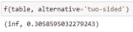

让我们继续选择“更大”，分布的右尾。最初，我们假设大西洋和印度洋的鲨鱼比例相等(或更少)。如果我们即将拒绝 h0，我们将假定 X 的值> 5 或在大西洋中更大的一个比率。

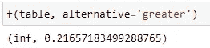

p 值为 0.2166

根据 p 值，我们不能拒绝零假设。我们假设 X ≤ 5。回想一下，在 Python 中计算索引时，我们从输入表的单元格[1，1]或单元格[0，0]中获得 5。

另一个“较少”意味着大西洋中鲨鱼的比例比在印度洋中观察到的要少。即使不进行测试，简单地观察表格也表明这似乎不太可能。因此毫不奇怪，我们**不会拒绝零假设**(替代方案似乎是错误的)。

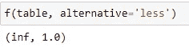

p 值为 1.0

我们最初的假设不能被拒绝，大西洋中鲨鱼的比例大于或等于印度洋。

当进行这样的测试时，产生一个参考例子总是一个好主意，这个例子看起来如此极端，以至于你会期望测试的结果相对清晰。

考虑以下高度不平衡的表:

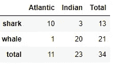

显然，大西洋中鲨鱼的比例似乎要高得多，而鲸鱼的比例则低得多

*   鉴于这种高度不平衡的比例，我会假设双边测试非常重要，因为我构建了一个表，让大西洋中有更多的鲨鱼，印度洋中有更多的鲸鱼。
*   至于“更大”的选择，我假设我们再次看到了一个重要的结果，因为大西洋中鲨鱼的数量不是少于或等于(h0)，而是多得多——再次，是故意的！
*   至于“更少”的选择，我预计值(接近)1.0，因为我们已经知道鲨鱼在大西洋更频繁。在这种情况下，我们非常自信地坚持 h0，这意味着鲨鱼的数量大于或等于在印度洋观察到的数量。


所有三个不同尾部的测试

## 了解优势比

细心的读者可能已经意识到，在第一个示例中，p 值输出之前总是有一个值 inf，在后一个示例中是 66.667。

比值比直接从下表中计算得出:

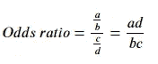

记住观察表，我们计算两个大洋中鲨鱼与鲸鱼的比例。这就缩小了我们之前分析的假设的差距，我有时会使用“**比例**”。奇数比，简单地比较了我们已经用于原始假设的两个比例。但是，如何解释这些比率呢？

如果奇数比是 1，我们会看到两个海洋中鲨鱼的比例是相同的。给定这个等式，我们也可以解释为什么在某些情况下(第一个例子)，当其中一个字母为 0 时，我们会看到 **inf** ！

至于第二个例子，我们看到一个 66.67 的高比值比，这意味着这两个比值是非常不平衡的——这是我们通过设计从表格中预期的！

我们现在可以推导出关于比值比的附加/相关假设:

```
Two-sided Fisher’s Exact Test:
ho: The odds ratio is equal to 1
ha: The odds ratio is not equal to 1“Less” Fisher’s Exact Test:
ho: The odds ratio ≥ 1
ha: The odds ratio is <1“Greater” Fisher’s Exact Test:
ho: The odds ratio is ≤1
ha: The odds ratio is > 1
```

## 概述

当涉及列联表上的假设检验时，Fisher 精确检验是最受欢迎的选择之一，这是一个典型的 A/B 检验场景。要完全理解这个测试，基本的超几何分布，比例或优势比的概念是必不可少的。

虽然 Fisher 精确检验的应用很简单，但是通过对各个超几何概率的结果求和，也很容易获得精确的结果。如果比值比感觉很难解释(特别是当在假设中直接考虑它们时)，简单比例的想法使比较列联表中的事件变得更实际。

如果你觉得这篇文章有帮助，我会很感激“关注”🫀，直到那时:

{照顾好自己，如果可以的话，也照顾好别人}

*—借自史蒂芬·都伯纳*