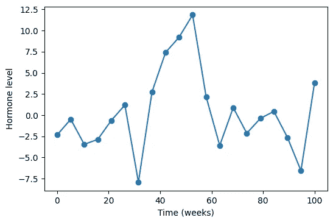
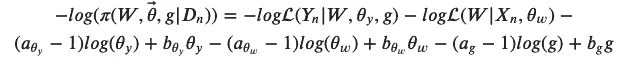
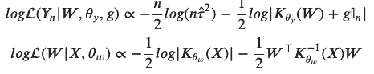
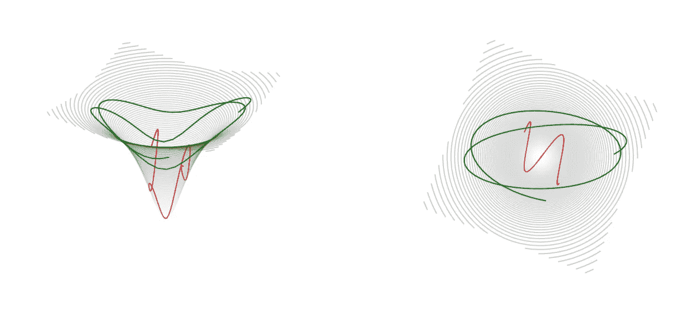
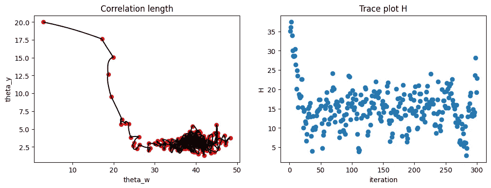
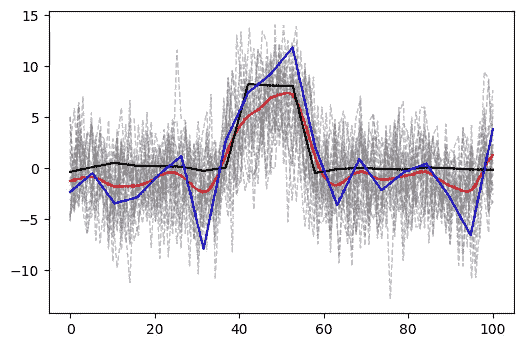
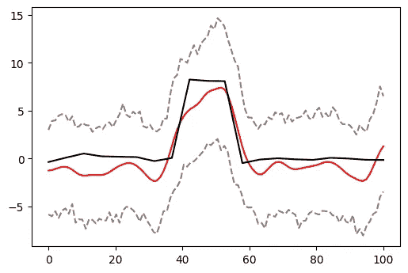

# 用哈密顿蒙特卡罗方法拟合深度高斯过程

> 原文：<https://towardsdatascience.com/fitting-deep-gaussian-process-via-hamiltonian-monte-carlo-641725b70514>

## 深度高斯过程建模在多大程度上量化了信号中的不确定性

作者图片

如今，先进的机器学习(ML)技术可以回答从你的数据中得出的非常复杂的问题。不幸的是，由于它们的“黑箱”性质，很难评估这些答案有多正确。如果你想在你的家庭相册中找到猫的照片，这可能没问题。但是在我的工作中，处理医疗数据，这是不可接受的，因此经常阻止 ML 模型在实际临床应用中的实际使用。在这篇文章中，我将概述一种结合了现代 ML 的复杂性和经典统计方法的合理置信度评估的生物数据分析方法。

## 我们在这里谈论什么？

我的目标是提供

*   对生物数据使用高斯过程建模的理由，特别是深度高斯过程(DGP ),而不是普通的、稳定的过程
*   汉密尔顿蒙特卡罗(HMC)方法概述及其如何帮助 DGP 建模
*   一个模拟数据的例子说明了这种方法的应用

## 分析医疗数据的挑战

想象一下，我们是一群医生，我们正在监测一个已经接受治疗的病人。假设治疗应该影响某种激素的水平。我们正在记录一段时间的测试结果，并逐渐得到这样的图片。

假设的临床数据。这些数据不是真实的，而是作者为了说明而模拟的。图片由作者提供。

这显然是一个非常嘈杂的数据。我们不能马上知道发生了什么，但我们真的想知道激素水平是否在变化。通常，人们做的第一件事，看看是否有任何影响，是好的旧线性回归，将所有噪声聚集成随机正态。在大多数真实世界的临床数据中，这给出的很少。因此，第二个最好的办法是将其建模为高斯过程(GP)。为什么有意义？那么，首先，让我们回顾一下什么是全科医生。

## 将临床信号视为平稳高斯过程

当执行 GP 建模时，所有数据点都被认为是从多元高斯分布中提取的，如下所示

需要注意两点。1) *K(X)* 这里是一个你的数据大小的方阵，一般情况下，有非零非对角元素；这与将你的数据视为独立随机抽取的 *n* 不同。2)数据点由 *X* 索引，就像我们的例子中的时间，定义了顺序——也就是过程。对于这篇文章来说，这就是我们需要了解的关于 GPs 的全部内容。然而，这个主题已经得到了很好的研究，好奇的读者可以在经典参考文献[1]中找到扩展他们知识的极好来源。

当我们谈论拟合 GP 时，我们指的是找到矩阵 *K(X)的参数。*为了使其更加明确，让我们将 GP 模型重写为

现在我们有三个参数，我想提出一个论点，它们可以被解释为捕捉我们在这里试图建模的过程的不同方面。论点如下。

当分析时变医学信号时，我们试图通过医学测试来评估某些生物过程的演变。进化是在大量噪音的背景下发生的。仔细想想，我们可以将噪声源大致分为两类。一个是测量噪声，随着现代医学中的测试变得相当复杂，这个元件可能具有相当复杂的结构。另一个来源是生物过程引起的变异，这种变异与我们感兴趣的过程无关。这一部分甚至更复杂，研究也少得多。那么，代表我们试图检测的过程的实际信号可能是高度非线性的。所有这些造成了一大堆数据，我们没有机会精确建模，至少在可预见的未来没有。

但是我们可以尝试在 GP 的框架中半独立地对这三个组件建模。最有可能的是，这两个噪声源具有不同的频率和振幅。首先， *g* 参数是线性回归分析中随机噪声的后代。从技术上来说，应该是 *τ g，*但这就是“半分离”的由来，也很容易解释。将该参数与测量噪声联系起来是最自然的。只要我们谈论的是同一类型的测量，这种类型的噪声就不会因患者而异。它甚至可以通过反复测试来训练并保持固定。我们指定由 *τ表示的生物噪声。*原因是该参数决定了变化的幅度。这很可能取决于患者，但在同一患者的监测期间或多或少保持不变。然后，剩下 *θ* 负责描述数据点之间的相关程度。如果我们正在观察一个正在接受治疗的病人，并且治疗确实产生了效果，那么它将在连续的测量中反映出来，并且是强相关的。因此， *θ* 参数是为我们试图检测的信号保留的。

正如我们所看到的，GP 模型可以很好地满足我们将一些数学知识放在医学数据后面的需求。这是线性回归的一个很好的进步。但是有一个问题。模型的所有参数都假定保持不变。对于 *g* 和 *τ* 参数来说，这可能是好的，因为正如我们上面所讨论的，它们归因于测量噪声和身体中不受治疗影响的生物变化。但是我们不能指望 *θ* 也是如此。治疗可以停止，或者改变，或者它可以自行停止工作。这会影响信号的相关性，我们想知道这一点。因此，我们必须考虑到 *θ* 的变化。

该解决方案带有深度高斯过程模型。就像深度神经网络一样，这意味着增加更多的层。

## 双层 GP 作为更合适的替代方案

有许多方法可以将层添加到 GP。出于我们的目的，我们简单地在时间索引和测量信号之间插入另一个 GP，如下所示

遵循参考文献[2]的方法。为什么这就够了？如上所述，我们只需要适应变化的 *θ* 。通过为时间变量引入一个额外的 GP，我们以一种灵活的方式“扭曲”了测量时间点之间的间隔，并产生了预期的效果。

但这也让试衣变得复杂了！不管怎样，我们必须从这个后验分布中为我们的数据找到参数的最优值

这两种可能性定义为

该表达式的推导见参考文献[2]。既然我们已经写出了这个庞然大物，我们需要思考如何把它变成有用的东西。从分析的角度来看，这里做不了什么。最直接的方法是对这个分布进行数字采样。数字采样的最佳方式是哈密顿蒙特卡罗！

## 哈密顿蒙特卡罗方法的一点体会

出于两个原因，我们需要一个聪明的方法来对我们的分布进行采样，这实际上是同一事物的两种观点。事实是，我们在多维空间中定义了概率分布。空间很大，但概率必须有限。这意味着非零概率区域将被限制在空间的小体积内。但这是我们希望达到的目标。因此，我们不能盲目投掷飞镖的两个原因是:1)浪费时间——我们将在零概率区域花费大量时间，这将是无用的；2)不准确的估计—在某些时候，我们将不得不停止采样，并且我们有可能会错过非零区域。

解决方案来自于类比物理学中一个众所周知的机制所描述的粒子运动。想象一个带电粒子在相反电荷附近的空间中飞行，或者一个实际的物理硬锥体颠倒过来，而你正沿着侧面滑动一个球。在所有这些情况下，运动的物体被吸引并向圆锥体的底部或带相反电荷的粒子所在的地方运动。但是如果它一开始就有足够的速度，如果你把球足够用力地推向一边，它会围绕这个吸引中心反弹。这个图正好显示了——两个可能的轨迹，有不同的初速度，或者动量，我们在物理学中是这么说的。绿色的动量比红色的大，所以它在远离中心的地方花的时间多一点。但是他们两个都在朝这个方向努力。

势场中粒子运动的示意图(侧视图和俯视图)。两个可能的轨迹被吸引到势能的最小值。绿色的动量比红色高，在极小值周围覆盖了更多的空间。图片由作者提供。

这种情况在理论力学中用哈密顿方程来描述

在哪里

是动能和势能的总和。作为一名物理学家，我无法停止欣赏这些方程的简单和美丽。

## 让 HMC 为我们工作

我们现在要做的就是说，我们的概率分布是 *U* ，势能。为了把它颠倒过来，我们在它前面放一个负号，因为它已经写在我们的方程中了，并开始用不同的动量值求解哈密顿方程，以探索最大值周围的区域。HMC 的很多细节可以在参考文献[3]中找到。下面是我编写的一个示例代码，用来生成这样的轨迹。

正如我们可能注意到的，有一个小问题——我们需要提供概率函数`grad_U`的导数。

不可能得出对数似然性相对于任何参数的导数的解析表达式。当然，我们可以尝试估计梯度的数值方法，但我决定测试 tensorflow 库，我想它最终仍然是数值的，但更优雅一些。下面是我使用 tensorflow 函数实现对数似然的代码片段(整个代码太大太无聊了)。对于导数，它使用`GradientTape`。它实际上创造了奇迹！

## 它是如何工作的？

我不得不承认，在我的帖子开始的病人数据的假设情节完全是假的。它是这样模拟的。

也就是说，它是从维数为 20 的多变量高斯中提取的，除了中间三个位置的均值为 4 之外，它在任何地方都是零，并且具有第一非对角元素的协方差矩阵都是 0.1。我把整件事乘以 2 只是为了好玩。我生成了 60 个样本。我挑选了一个，并添加了随机正常噪音，方差为 1。如下图所示——蓝线是我选取的样本，蓝点是添加了噪声的样本，灰色虚线是从同一分布中抽取的剩余样本，黑线是它们的平均值。

本文中用于概念验证的模拟数据中的所有样本。蓝点是用于拟合的数据，灰色虚线是相同分布的相似样本，实心黑线是代表信号的那些样本的平均值。图片由作者提供。

背景中的灰线是为了给我们直观地估计来自这种分布的数据的不确定性。它有用的原因是，作为我们方法的一个额外的好处，我们将尝试基于给定的一个样本来估计不确定性。当然，主要目标是估计黑线——信号。

我把一个有噪声的样本，上图中的蓝点，放到我用 HMC 实现的两层 GP 中。这是结果。首先，我们来看转换。我们这里有 24 个参数( *τ，g，θ_y，θ_y* ，20 个 *W* s)，所以不可能显示全部空间。下图只显示了其中的两个参数，左边的两个 *θ* 。我故意从远离正确值的地方开始，但是请注意轨迹多快地向一个静止点移动，大概是概率的最大值，并开始在它周围盘旋。右边的图显示了总能量与迭代次数的关系。再次，快速移动到，希望，最低和良好的混合围绕它。

收敛诊断的轨迹图。图片由作者提供。

这是推断出的信号。我使用参数的采样后验值推断了 200 个样本，适当地丢弃了初始老化样本。结果如下图所示，其中蓝线和黑线分别代表原始样本和真实数据的平均值。红线是推断样本的平均值。灰色虚线是所有要与上图模拟数据进行比较的单个推断样本。

灰色线，红色是它们的平均值，代表拟合的数据。为了便于比较，拟合的输入用蓝线表示，真实信号用黑线表示。图片由作者提供。

最后，这就是我们的最终结果。黑色是我们试图恢复的信号，红色是我们的最佳猜测，灰色虚线是我们猜测的 95%置信区间。

双层 GP 通过 HMC 估计真实信号(黑色)的结果(红色),估计值周围有 95%的置信区间(灰色虚线)。图片由作者提供。

是的，这些置信区间可能比真实的东西宽一点，但我们会明确检测到中间信号的变化，我们不会被边上的波动所迷惑。考虑到我们得到的是如此之少(一个样本有不同的变异来源，没有重复)，这是一个非常强大的结果，你不觉得吗？

## 参考

[1] C. E. Rasmussen 和 C. K. I. Williams，[机器学习的高斯过程](http://gaussianprocess.org/gpml/chapters/RW.pdf)，(2006)，麻省理工学院出版社 ISBN 0–262–18253-x。

[2] A. Sauer，R. B. Gramacy，D. Higdon，(2021) [深度高斯过程代理的主动学习](https://arxiv.org/abs/2012.08015)，arXiv:2012.08015v2

[3] M .贝当古，[哈密顿蒙特卡罗概念介绍](https://arxiv.org/abs/1701.02434)，(2018)，arXiv:1701.02434

感谢您的阅读。我很乐意回答任何问题，并听取任何意见。我特别感谢 Robert Gramacy 和 Annie Sauer 激发讨论，并感谢《走向数据科学》的评论者。