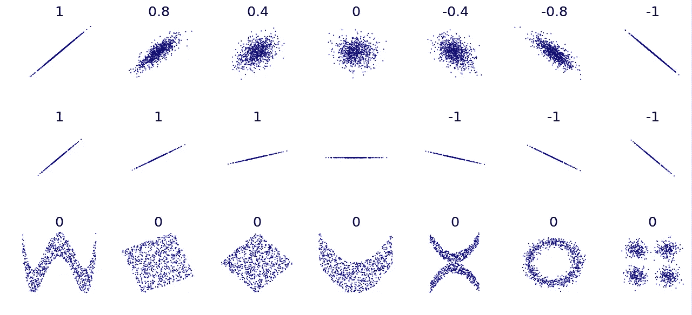
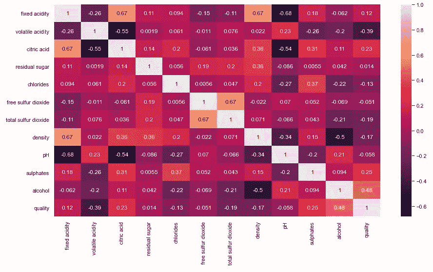
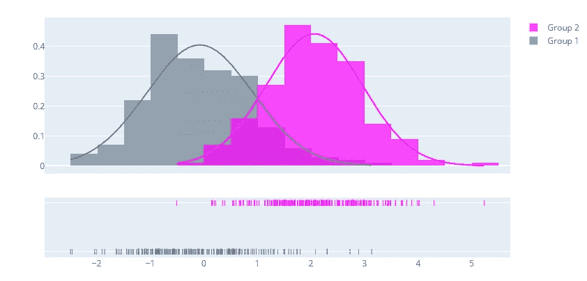
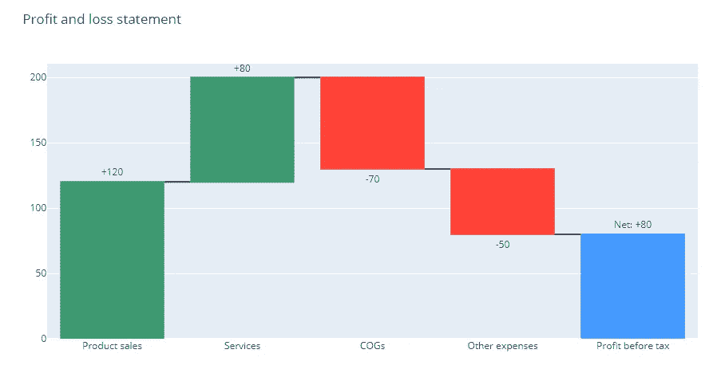
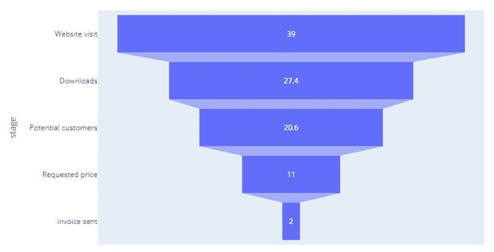

# 所有数据科学家都应该知道的五种高级数据可视化

> 原文：<https://towardsdatascience.com/five-advanced-data-visualizations-all-data-scientists-should-know-e042d5e1f532>

## 使用这些可视化工具扩展您的数据技能和工具库

由故事集创建的控制面板矢量—[www.freepik.com](http://www.freepik.com)

虽然每个人都赞美机器学习模型和复杂的神经网络，但许多人忘记了构建强大的数据可视化可以获得的巨大价值。我说的不是像折线图和条形图这样的基本可视化。

在本文中，我将与您分享五个强大的数据可视化工具，您应该知道如何构建它们，因为它们非常强大，深受高管们的欢迎。说了这么多，让我们开始吧！

> ***务必*** [***订阅此处***](https://terenceshin.medium.com/membership) ***千万不要错过另一篇关于数据科学的指南、诀窍和技巧、生活经验等文章！***

# 1.群组图表

## 什么是队列图表？

群组图是一种工具，可以让您衡量不同用户群在一段时间内的表现。我将特别提到基于时间的群组图表，它根据时间框架对用户进行分组。下面是一个群组图表示例:

作者创建的图像

如何阅读队列图表很简单:

1.  **每行代表一个组群**。在这种情况下，用户群组基于用户的注册月份。例如，第一行表示 2009 年 12 月注册的用户，第二行表示 2010 年 1 月注册的用户。
2.  **每一列代表一个时期。**在这种情况下，每个周期代表一个月的数字。例如，第一列表示每个群组的第一个月(第 0 个月)，第二列表示每个群组的第二个月(第 1 个月)。
3.  **每个单元格代表感兴趣的值**。在这个特别的群组图表中，我们比较了每个群组第 0 个月的收入在每个期间的百分比。例如，第一组第二个月的收入是第一个月的 58%，第一组第三个月的收入是第一个月的 44%。

## **为什么群组图表如此有用**

**群组图表在评估需要时间才能成熟的指标时非常有用**。例如，如果你想看看 2021 年与 2022 年相比用户流失的百分比，这不是一个公平的比较，因为 2021 年的用户比 2022 年的用户有更多的时间流失。但是，通过使用群组图表，您可以比较不同群组的同一时期。

作者创建的图像

回到我的例子，如果我们比较第一组(2009 年至 2012 年)和倒数第二组(2010 年至 2011 年)，我们可以看到收入百分比从第 0 期到第 1 期显著下降。第一组的百分比是 58%，但在第二组，百分比下降到 8%。这告诉我们，新客户在购买一个月之后，花费会少很多。出现这种情况的可能原因是因为新的群体中的回头客较少，或者产品的质量随着时间的推移有所下降。

群组图表如此强大的另一个原因是它们本质上是整体的。从横向来看，你可以理解用户的整个生命周期，以及在生命周期中用户行为发生剧烈变化的地方。纵向上，您可以比较和评估新用户群与旧用户群的性能。

## 队列图表的应用

群组图表最常见的应用是:

1.  评估随时间推移跨群组的流失。
2.  跨群组评估收入或盈利能力。
3.  评估跨队列的漏斗转换。

## 如何构建群组图表

要用 SQL 构建群组图，请查看我下面的教程:

</a-complete-guide-to-revenue-cohort-analysis-in-sql-and-python-9eeecd4c731a>  

要用 Python 制作群组图表，请查看[埃里克·林森](https://medium.com/u/44bc27317e6b?source=post_page-----e042d5e1f532--------------------------------)的精彩教程:

</a-step-by-step-introduction-to-cohort-analysis-in-python-a2cbbd8460ea>  

> ***请务必*** [***订阅此处***](https://terenceshin.medium.com/membership) ***千万不要错过另一篇关于数据科学指南、诀窍和技巧、生活经验等的文章！***

# 2.相关矩阵

## 但是首先，什么是相关性？

相关性是从-1 到 1 的统计度量，它告诉我们两个变量之间的线性关系有多强。

如果相关性是-1，那么在两个变量之间有一个**完美的负相关性**，意味着一个变量的**增加**可靠地预测另一个变量的**减少**。

如果相关性是 1，那么在两个变量之间有一个完美的正相关性，这意味着一个变量的增加可靠地预测了另一个变量的增加。

如果相关性为 0，则两个变量之间没有相关性。以下是不同类型的关联模式的一些示例:

图片来自维基媒体(免费提供)

## 什么是相关矩阵

相关矩阵是一个 n 乘 n 的表格，显示每个行变量和列变量之间的相关系数。

以下面的图表为例，我们可以看到，如果我们观察第一行(固定酸度)和第二列(挥发性酸度)，相关系数为-0.26。

作者创建的图像

## 相关矩阵什么时候有用？

当您想要快速了解所有变量之间的线性关系时，相关矩阵非常有用。这在以下几种情况下构建模型时特别有用:

*   建立回归模型时，可以使用相关矩阵来确定变量之间的共线性。
*   在构建机器学习模型时，可以使用相关矩阵来识别可用于模型的潜在强特征。
*   进行特征重要性评估时，可以使用相关矩阵来移除相关变量。

## 如何建立相关矩阵

查看下面的链接，构建一个简单的相关性矩阵:

<https://datatofish.com/correlation-matrix-pandas/>  

# 3.距离图

## 什么是 distplot，为什么它们有用？

作者创建的图像

distplot 是 distribution plot 的缩写，是数字数据的多种统计表示的组合，用于描述数据分布的变化。distplot 可以是几个图的组合，如直方图、核密度估计(kde)和 rug 图。

distplot 的主要目的是了解和比较数据的分布，以便更好地了解集中趋势、数据的偏斜度和数据的分布。

## 如何构建 distplot

查看以下链接，了解如何使用 Plotly 构建 distplot:

<https://plotly.com/python/distplot/>  

> ***务必*** [***订阅此处***](https://terenceshin.medium.com/membership) ***千万不要错过另一篇关于数据科学指南、诀窍和技巧、生活经验等的文章！***

# 4.瀑布图

## 什么是瀑布图，为什么它们有用？

瀑布图是一种独特的条形图，它通过一系列正值和负值显示值的净变化。与仅显示指标的起始值和结束值不同，瀑布图显示了*指标如何从起始值变为结束值。*

瀑布图的主要目的是讲述一个特定指标如何通过一系列子组件增长或下降的故事。

它在分解盈利能力指标时特别有用，例如，您可以查看某个特定公司的所有收入来源，分解所有成本，并以该公司的利润结束(通常称为 P&L 报表)。下面是一个简化的瀑布图示例:

作者创建的图像

## 如何构建瀑布图

查看下面的链接，了解如何使用 Plotly 构建瀑布图:

<https://plotly.com/python/waterfall-charts/>  

# 5.漏斗图

## 什么是漏斗图，为什么有用？

漏斗图是一种可视化形式，用于显示流程中各个阶段的值。例如，您可以使用如下图所示的漏斗图来显示从访问网站到收到发票的每个阶段有多少客户。

作者创建的图像

漏斗图有助于理解高效单位如何从一个阶段流向另一个阶段。我们的目标是让尽可能多的单位从开始到结束，了解哪里有明显的下降非常重要，这样您就可以确定漏斗中需要改进的地方。

在上面的例子中，只有一半的潜在客户询问价格。理解了这一点，你就可以研究为什么下降是不好的。是因为不清楚向哪里要价吗？是因为这些潜在客户仍然缺乏信息，并希望在请求价格之前与某人交谈吗？这是一些如何在商业环境中使用漏斗图的例子。

## 如何构建漏斗图

查看以下链接，了解如何使用 Plotly 构建漏斗图:

<https://plotly.com/python/funnel-charts/>  

# 感谢阅读！

> ***务必*** [***订阅此处***](https://terenceshin.medium.com/membership) ***千万不要错过另一篇关于数据科学指南、诀窍和技巧、生活经验等的文章！***

不确定接下来要读什么？我为你挑选了另一篇文章:

</the-10-best-data-visualizations-of-2021-fec4c5cf6cdb>  

**还有一个:**

</all-machine-learning-models-explained-in-6-minutes-9fe30ff6776a>  

# 特伦斯·申

*   ***如果您喜欢这个，*** [***订阅我的媒介***](https://terenceshin.medium.com/membership) ***获取独家内容！***
*   ***同样，你也可以*** [***关注我上媒***](https://medium.com/@terenceshin)
*   ***跟我上***[***LinkedIn***](https://www.linkedin.com/in/terenceshin/)***其他内容***