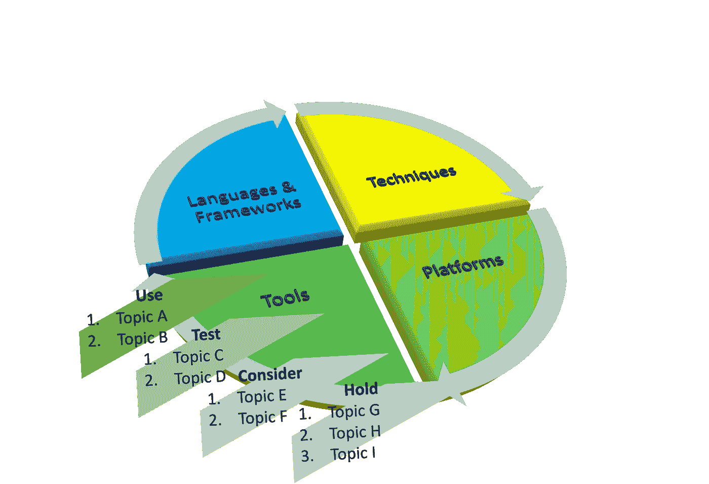

# 机器学习部门的五项关键技术

> 原文：<https://towardsdatascience.com/five-key-techniques-for-machine-learning-department-df95bba5cc95>

# 机器学习部门的五项关键技术

## 2022 年，可能会对机器学习部门的工作方式产生重大影响的技术

瑞典基律纳的 EISCAT 雷达天线。它是[斯堪的纳维亚](https://en.wikipedia.org/wiki/Scandinavia)的三个[雷达](https://en.wikipedia.org/wiki/Radar)系统之一，用于[太空垃圾](https://en.wikipedia.org/wiki/Space_debris) [追踪](https://en.wikipedia.org/wiki/Space_surveillance)以及其他用途。在交付机器学习应用的技术和技术的看似无限的空间中，Tech radar 对于机器学习部门来说扮演着同样重要的角色。图片由 [Tpheiska](https://www.wikidata.org/wiki/Special:CentralAuth?target=Tpheiska) 在[维基共享](https://commons.wikimedia.org/wiki/File:EISCAT_dish_Kiruna.JPG)中提供。

交付机器学习(ML)应用程序的组织的技术雷达是一组主题，每个主题都是一种技术或工艺，在组织中的团队的应用程序开发中起着重要的作用。tech radar 的使用并不新鲜，已经被世界各地从事 IT 和软件开发的组织所采用。

像任何技术组织一样，技术雷达是 ML 组织的一个非常重要的工具。对于组织中的 ML 团队来说，这是一个标准化技术栈和愿景的很好的练习。它增加了组织内的透明度，因此，是增加团队间协作的有利因素。如果面向公众发布，它可以成为招聘和公共关系的一个有影响力的沟通工具。

让我们首先了解一下技术雷达框架的概况。

# 技术雷达框架

由四个类别和四个采用阶段组成的技术雷达框架。每个类别在采用的每个阶段都有零个或多个主题。这种框架允许个人、团队或组织确定一个感兴趣的主题，以及在相关的技术类别中该做些什么。图片由作者提供。

部分题目的框架和灵感来自于 Thoughtworks 倡导的 [Tech Radar。它的知名度相当高，已经被许多知名机构采用，如](https://www.thoughtworks.com/content/dam/thoughtworks/documents/radar/2021/04/tr_technology_radar_vol_24_en.pdf) [Zalando](https://opensource.zalando.com/tech-radar/) 或 [Backstage](https://backstage.io/blog/2020/05/14/tech-radar-plugin) 等平台。该框架由 IT 行业公认的委员会管理。它被很好地记录和展示，并带有一个易于采用的开源库[。](https://github.com/thoughtworks/build-your-own-radar)

由四个类别和四个采用阶段组成的技术雷达框架。类别定义如下。

*   **技术**:影响团队工作方式或结构的方法
*   **平台**:团队成员进行技术或团队活动的软件平台
*   **工具**:允许团队成员或系统执行技术或团队活动的单一实用软件
*   **语言&框架**:团队进行软件开发所使用的编程语言及其包

采用阶段定义如下。

*   **使用**:建议在生产使用中尽快采用该主题，因为它解决了一个主要问题，已被广泛采用并在操作使用中表现良好
*   **测试**:建议最好进行试验，目的是发现其在生产使用中的适用性，因为它解决了一个主要问题，已被适度采用，但在操作使用中表现良好
*   **考虑**:建议开发概念验证，目的是了解更多关于其适用性的信息，因为它解决了一个主要问题，要么以有限的方式采用，要么直接使用在运营中表现良好，要么基于核心技术或广受机构群体欢迎的技术
*   **保持**:建议谨慎使用，最好停止使用，因为它会导致不合标准的体验或性能

# 管理技术雷达

管理技术雷达有三个方面。首先，技术雷达是一个活的工具，这意味着它应该定期更新。其次，技术雷达是一个组织级的工具，这意味着它应该由一个委员会以包容的方式开发，该委员会涵盖广泛的角色，并且有能力和时间进行彻底的研究。第三，技术雷达是一种被广泛使用的手段，即使在组织之外，它也应该以一种易于使用的格式和平台来访问，并且对于定期更新仍然是友好的。

对于第一种情况，一个 ML 组织应该至少每年更新雷达两次。对于第二种情况，管理技术雷达的委员会应该包括高级工程、数据科学、分析师、产品经理和工程师、数据科学、分析师领导。为了保持委员会的灵活性，人数不应太多。但是，组织成员应该从他们的同事和团队成员那里收集反馈，以确保广泛的覆盖面。最后，技术雷达的平台应该是某种仪表板或 web UI 平台，以便于浏览、搜索和可视化信息。我个人会推荐使用 [Thoughtworks 开源库](https://github.com/thoughtworks/build-your-own-radar)开发平台。为了管理信息，我会推荐一个类似于 Thoughtworks 推荐的的 CSV 文件格式。对于部署，我会使用具有易于记忆的 URL 的服务器。此外，我建议以这样一种方式构建平台，即可以在平台中开发多种技术雷达。例如，维护一个技术雷达供内部使用，另一个供外部使用，或者保留所有技术雷达版本。

重要的是，一旦开发出来，就要定期广泛地交流和使用科技雷达，以确保保持更新的动力。

# ML 组织的五个关键技术

## **MLOps**

采用阶段:使用

MLOps 包含了与 DevOps 共享血统的元素，但是应用于开发/部署 ML 模型。像 DevOps 一样，它涵盖了系统、实践和人员。在系统方面，它包括持续集成和部署(CI/CD)解决方案，不仅针对代码，还针对 ML 模型。在实践方面，它包括旨在提高生产中模型的自动化和可靠性的过程和工作方式。在人员方面，它包括 ML 团队中的数据科学家和不同的工程师，他们使用那些系统应用那些实践。如果你的组织真的想使用 ML，它应该采用这个咒语。许多组织仍然在做特定的数据科学，并回避使用 ML 增加/创造商业价值的问题。在赶时髦之前，组织应该做认真的尽职调查，以确定这是否是正确的选择。一旦确定了这一点，组织等待采用的时间越长，组织获得价值的代价就越大。

## **ML 平台产品团队**

采用阶段:使用

[ML 平台产品](/platform-products-for-machine-learning-3d3749443d2)和交付这些产品的团队是组织中生产就绪型 ML 应用的重要推动者。在这里，我从[团队拓扑](https://www.youtube.com/watch?v=haejb5rzKsM)中获得了灵感，但是着眼于 ML 应用的上下文而不是典型的 IT 系统。ML 平台产品团队可以被视为仅关注内部平台客户的另一个产品团队，例如组织中的 ML 和分析团队。对于每一个这样的团队来说，拥有一个薄而高效的产品和稳定的赞赏客户流是至关重要的。仅仅因为这些团队只与内部客户合作，it 仍然不应该像任何关注外部的产品团队一样跳过工程规程和工作流程的方式。当一个组织遇到三个或更多的流对齐的 ML 团队时，它应该开始考虑如何孵化一个支持这些团队的平台团队。如果这个数字翻倍，仍然没有平台团队，组织应该确保现实尽快改变。

## **团队规模的软件**

采用阶段:使用

康威定律(Conway's law)指出，一个组织将按照其沟通结构产生一个系统设计。这对于 ML 组织来说没有什么不同。正如在[团队拓扑](https://www.youtube.com/watch?v=haejb5rzKsM)中所提倡的，它颠倒了 IT 团队快速流动的法则，最好保持软件系统的焦点基于团队的认知负荷能力。在这一点上，我建议保持每个 ML 团队是一个[双层披萨](https://docs.aws.amazon.com/whitepapers/latest/introduction-devops-aws/two-pizza-teams.html)团队，同时保持 ML 应用程序及其交互的范围在团队中的大小。

## 远程 Mob 编程

采用阶段:测试

在 COVID 时代，远程结对编程非常盛行。在此之前，除了结对编程， [Mob 编程](https://www.youtube.com/watch?v=28S4CVkYhWA)成为软件产品团队快速流程的推荐方法。这项技术已经变得更加重要，因为它允许团队“移动”一个问题或解决方案，而没有任何物理空间/存在的限制。现代视频会议工具、在线编码平台和数字白板使得“聚众”远程团队比以往任何时候都更容易。由于团队中的各种角色，数据科学家、数据分析师、机器学习工程师、数据工程师、软件工程师等，ML 团队通常在竖井中工作。然而，我建议严肃的 ML 团队从成功的跨职能软件团队中吸取教训，打破活动的隔间，并经常使用诸如 mob 编程的方法作为一个整体走到一起，但在“完全”远程设置中。我之所以推荐尝试这种方法，是因为这是一种新的实践，而且事实上，一种接近健康的平台来执行远程 mob 编程的东西还没有出现。

## 开发/测试环境中的真实数据

采纳阶段:搁置

ML 团队倾向于在开发/测试环境中使用真实产品的样本，主要是因为它的[庞大](https://en.wikipedia.org/wiki/Big_data#Characteristics)。现代软件团队正试图摆脱这种做法，因为它是一种主要的反模式。在冷酷的人看来，这种做法会导致以下问题，这些问题同样适用于 ML 应用程序。

*   开发/测试成本增加，这是整个团队基础架构成本中的一个重要因素。
*   对软件行为的理解减少
*   由于使用大量数据，反馈回路较慢
*   由于开发/测试环境中的低安全性设置，增加了安全风险

[用于测试 ML 管道的合成数据](/testing-machine-learning-pipelines-22e59d7b5b56)是一个新领域，一个严肃的、经过实战检验的框架尚未出现。此外，可能存在需要测试中的真实数据的情况，例如，再现源自数据的错误。由于这些原因，我在 ML 团队的练习中非常谨慎。然而，我相信关于合成数据生成的[框架](https://sdv.dev/)和[库](https://faker.readthedocs.io/en/master/)将会成熟，特别是由于基于 ML 的信息增强技术的出现，例如[生成对抗网络](https://en.wikipedia.org/wiki/Generative_adversarial_network)及其在该领域的[应用](https://arxiv.org/pdf/1907.00503.pdf)。

# 评论

[Thoughtworks 列出了与技术世界相关的 17 种技术](https://www.thoughtworks.com/radar/techniques)，其中一些在主题层面上与候选名单相匹配。然而，由于上下文有些特殊，所以细节有些微妙。除了我在这里列出的，你觉得前五名还应该包括别的吗？请评论分享你的选择。你觉得你能为这些细节做出贡献，并愿意把你的精力放在这些话题上吗？也许我们可以合作。请伸出手。