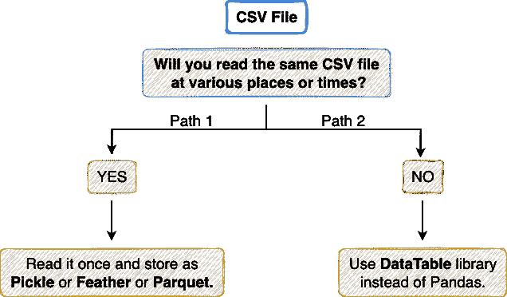
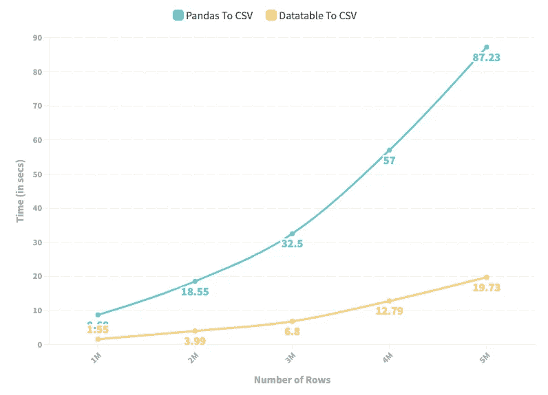
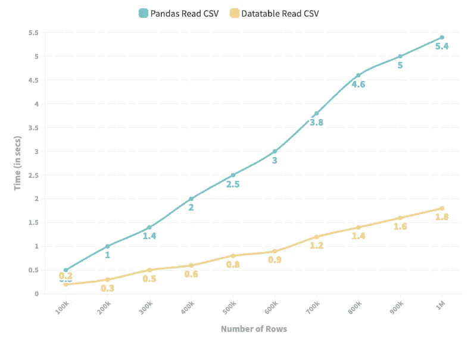
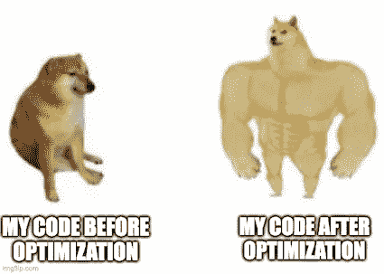

# 每个熊猫用户应该知道的五个黑仔优化技术

> 原文：<https://towardsdatascience.com/five-killer-optimization-techniques-every-pandas-user-should-know-266662bd1163>

## 数据分析运行时优化的一步

照片由[布拉德在](https://unsplash.com/@bradneathery?utm_source=medium&utm_medium=referral) [Unsplash](https://unsplash.com?utm_source=medium&utm_medium=referral) 上整理

设计和构建现实世界适用的机器学习模型的动机一直吸引着数据科学家大规模利用优化、高效和准确的方法。优化在可持续交付真实世界和面向用户的软件解决方案中扮演着基础性角色。

虽然我知道不是每个人都在大规模构建解决方案，但是了解各种优化和省时技术仍然是有帮助的，并且高度适用于甚至一般的数据科学/机器学习用例。

因此，在本文中，我将向您介绍一些令人难以置信的技术，来减少使用 Pandas 进行常规表格数据分析、管理和处理任务的运行时间。为了得到一个简要的概述，我将在这篇文章中讨论以下主题:

[**# 1 CSV 输入/输出**](#14b5)[**# 2 基于分类数据的过滤**](#469f)[**# 3 合并数据帧**](#7c21)[**# 4 Value _ counts()vs group by()**](#c4a5)[**】**](#327d)

此外，你可以在这里获得这篇文章[的笔记本。](https://deepnote.com/workspace/avi-chawla-695b-aee6f4ef-2d50-4fb6-9ef2-20ee1022995a/project/Pandas-Optimization-Techniques-aae1af3a-70dd-467b-ae4e-57d5b4e23169/%2Fnotebook.ipynb)

我们开始吧🚀！

# CSV 上的#1 输入/输出

CSV 文件是目前最流行的读取和存储数据帧的来源，不是吗？这是因为 CSV 在使用`pd.read_csv()`和`df.to_csv()`方法的输入和输出操作环境中提供了极大的灵活性，例如:

1.  CSV 可以在 Excel 中打开，并以 Excel 允许的任何方式进行操作。
2.  通过将列指定为列表并将其作为`pd.read_csv()`方法的`usecols`参数传递，CSV 使您能够在需要时只读取列的子集。
3.  如果需要的话，可以使用`pd.read_csv()`方法的`nrows`参数来只读前`n`行，等等。

虽然我承认使用 CSV 文件有许多优点，但同时，如果您正在寻找运行时优化，它们远不是首选方法。让我解释一下。

Pandas 对 CSV 文件的输入输出操作是序列化的，这不可避免地使它们非常低效和耗时。虽然有足够的并行化空间，但不幸的是，Pandas 还没有这种功能。

在此之前，如果您无法阅读 CSV 文件，有两种非常快速的方法可供选择，我在下面的流程图中描述了这两种方法:

确定读取 CSV 的替代方法的流程图(图片由作者提供)。

## 路径 1

如果您的 CSV 文件是静态的，并且您认为您会多次读取它，可能是在同一个管道中或在重新加载内核之后，请立即将其保存为一个**泡菜**或**羽毛**或**拼花**文件。但是为什么呢？这一点我已经在下面的帖子中讨论过了:

 [## 为什么我停止向 CSV 转储数据帧，为什么您也应该这样做

### 是时候告别 pd.to_csv()和 pd.read_csv()了

towardsdatascience.com](/why-i-stopped-dumping-dataframes-to-a-csv-and-why-you-should-too-c0954c410f8f) 

下面的代码块演示了从 CSV 格式到所需格式的转换:

现在，当您想要读回数据帧时，不要从 CSV 文件中读取它，而是使用您创建的新文件读取它。Pandas 中重新加载数据集的相应方法如下所示:

此外，这些单独的文件中的每一个都将把记录解释为熊猫数据帧。这可以使用 Python 中的`type()`方法进行验证，如下所示:

下面的条形图描述了所有四种文件格式在运行时的预期速度提升:

以各自的格式加载和保存数据帧所花费的时间。(图片由作者提供)

为了获得这四种格式的运行时间，我用 Python 生成了一个包含一百万行三十列的随机数据集——包括字符串、浮点和整数数据类型。我测量了负载和保存运行时间十次，以减少随机性，并从观察结果中得出公正的结论。以上结果显示了十次实验的平均值。

## 路径 2

如果您的 CSV 文件不是静态的，或者您只打算使用一次 CSV 文件，那么转换为新的格式是没有意义的。取而代之的是路径 2，即使用[数据表](https://datatable.readthedocs.io/en/latest/)库进行输入和输出操作。您可以在 Jupyter 笔记本中使用以下命令安装 DataTable:

当使用数据表时，CSV 文件将被解释为数据表数据帧，**而不是**熊猫数据帧。因此，在加载 CSV 文件后，您需要将其转换为 Pandas DataFrame。我在下面实现了这一点:

类似地，如果您想将 Pandas 数据帧存储到 CSV 中，最好选择 DataTable 路线，而不是 Pandas。这里，要使用 datatable 生成 CSV 文件，首先需要将 Pandas 数据帧转换为 DataTable 数据帧，然后将其存储在 CSV 文件中。这在下面实现:

**左图**:描绘使用 Pandas 和 DataTable 将数据帧存储到 CSV 所需时间的折线图。**右侧**:描绘使用 Pandas 和 DataTable 从 CSV 读取数据帧所用时间的折线图。(图片由作者提供)

如上面的折线图所示，DataTable 通过 Pandas 为 CSV 文件提供高速输入和输出操作。

## 关键要点/最终想法

1.  如果由于某些限制，您必须使用 CSV 文件，千万不要使用 Pandas `read_csv()`和`to_csv()`方法。相反，更喜欢 datatable 的输入输出方法，如上所示。
2.  如果您将重复读取同一个 CSV 文件，请将其转换为 Pickle、Feather 和 Parquet 之一，然后使用新文件进行输入操作。

# #2 基于分类数据的过滤

数据过滤是熊猫中另一种常见且广泛使用的操作。核心思想是选择符合特定条件的数据帧片段。

为了演示，考虑一个我自己创建的超过 400 万条记录的虚拟数据框架。下图显示了前五行:

虚拟数据集的前五行(作者图片)

下面的代码块演示了我的实现:

假设您想要过滤所有属于“Amazon”的记录。这可以通过以下方式完成:

进行相同过滤的另一种方法是使用`[groupby()](https://pandas.pydata.org/docs/reference/api/pandas.DataFrame.groupby.html)`并使用如下所示的`[get_group()](https://pandas.pydata.org/docs/reference/api/pandas.core.groupby.GroupBy.get_group.html#pandas.core.groupby.GroupBy.get_group)`方法获得单个组:

与通常的过滤方法相比，后一种方法提供了高达 **14 倍**的加速，这在运行时间上是一个巨大的改进。

此外，`get_group()`方法将单个组作为熊猫数据帧返回。因此，您可以继续进行通常的分析。我们可以通过检查方法 1 和方法 2 中获得的数据帧类型来验证这一点，如下所示:

## 关键要点/最终想法

1.  如果您要对分类数据执行数据框架的重复过滤，最好首先使用`groupby()`方法对数据进行分组。之后，使用`get_group()`方法获取所需的组。
2.  警告:这种方法仅适用于基于分类数据的过滤。

# #3 合并数据帧

Pandas 中的合并是指根据一个连接条件合并两个数据帧。这类似于结构化查询语言(SQL)中的连接。您可以在 Pandas 中使用`[pd.merge()](https://pandas.pydata.org/docs/reference/api/pandas.DataFrame.merge.html#pandas.DataFrame.merge)`方法执行合并，如下所示:

虽然上述链接数据帧的方法没有任何问题，但是有一个更快的方法可以使用`[join()](https://pandas.pydata.org/docs/reference/api/pandas.DataFrame.join.html)`方法来连接两个数据帧。

在下面的代码块中，我使用`merge()`方法和`join()`方法实现了合并操作。这里，我们使用两种方法来测量合并操作所花费的时间。

使用`join()`方法，我们注意到相对于熊猫的标准`merge()`方法，改进超过 **4 倍**。

这里，`join()`方法首先希望您更改索引列，并将其设置为您希望在其上执行表间连接的特定列。这是在熊猫身上用`set_index()`方法完成的，如上图所示。

如果您想在多个列上执行一个连接条件，您也可以使用`join()`方法来完成。首先，将希望执行连接条件的列作为列表传递给`set_index()`方法。然后，像以前一样调用`join()`方法。下面演示了这一点:

## 关键要点/最终想法

1.  在执行连接时，始终更改两个数据帧的索引，并将其设置为要对其执行连接条件的列。

# #4 Value_counts()与 GroupBy()

我们在 Pandas 中使用`value_counts()`来查找一个序列中各个元素的频率。例如，考虑我们在第 2 节中使用的虚拟雇员数据框架。

虚拟数据集的前五行(作者图片)

我们可以使用`value_counts()`方法找到该数据集中属于每个公司的员工人数，如下所示:

使用`groupby()`也可以进行类似的频率计算。下面的代码演示了:

`value_counts()`的输出按频率降序排列。另一方面，`groupby()`上`size()`的输出在索引列上排序，在本例中是`Company Name`。

假设我们不关心输出如何排列或排序，我们可以测量两种方法的运行时间差异，以获得所需的频率，如下所示:

尽管这两种方法本质上做的是相同的事情(如果我们忽略一次输出的顺序)，但两者之间有一个显著的运行时间差异— `groupby()`比`value_counts()`慢 **1.5 倍**。

当您想要获得归一化频率时，事情会变得更糟，归一化频率表示序列中各个元素的百分比/分数。在这种情况下，运行时间比较如下:

同样，尽管这两种方法做的是同样的事情，但两者之间有一个显著的运行时间差异——与`value_counts()`相比，`groupby()`要慢**2**倍。

## 关键要点/最终想法

1.  对于基于频率的测量，最好使用`value_counts()`而不是`groupby()`。
2.  `value_counts()`可一次用于多列。因此，如果您想要计算来自多个列的值的组合的频率，请使用`value_counts()`而不是`groupby()`来完成。

# #5 迭代数据帧

循环或迭代数据帧是单独访问每一行并对记录执行一些预定义操作的过程。虽然在这种情况下，最好的办法是首先避免循环，而选择向量化的方法，但是在某些情况下，循环是必要的。

Pandas 中有三种方法可以实现迭代。下面，我们将讨论它们，并比较它们在下面几节中使用的雇员虚拟数据集上的运行时间。要重新查看，下图显示了数据框的前五行。

虚拟数据集的前五行(作者图片)

循环遍历数据帧的三种方法是:

1.  使用`range(len(df))`进行迭代。
2.  使用`[iterrows()](https://pandas.pydata.org/docs/reference/api/pandas.DataFrame.iterrows.html)`进行迭代。
3.  使用`[itertuples()](https://pandas.pydata.org/docs/reference/api/pandas.DataFrame.itertuples.html)`进行迭代。

我在下面的代码块中实现了三个利用这三种方法的函数。该函数的目标是计算数据框架中所有雇员的平均工资。我们还在下面的同一个数据框架中找到了这些方法的运行时间。

## 方法 1:使用`range(len(df))`迭代

迭代超过 400 万条记录的平均运行时间是`46.1 ms`。

## 方法 2:使用 iterrows()迭代

`iterrows()`方法在迭代过程中提供了实质性的改进，将运行时间从`46.1 ms`减少到`18.2 ms`的 2.5 倍**。**

## 方法 3:使用 itertuples()进行迭代

结果证明`itertuples()`方法甚至比`iterrows()`更好，从`18.2 ms`到`773 µs`进一步减少运行时间超过 **23 倍**。

## 关键要点/最终想法

1.  首先，您应该避免在代码中引入 for 循环来迭代数据帧。如果可能的话，考虑一个矢量化的解决方案。
2.  如果矢量化是不可能的，那么利用 Pandas 中预先实现的方法进行迭代，比如`itertuples()`和`iterrows()`。

# 结论

在这篇文章中，我讨论了 Pandas 中五个令人难以置信的优化技术，你可以在你的下一个数据科学项目中直接利用它们。在我看来，我在这篇文章中讨论的领域是改善运行时间的微妙方法，在寻求优化时经常被忽略。尽管如此，我希望这篇文章能让你深刻理解这些熊猫的日常功能。

如果你喜欢读这篇文章，我希望你也会喜欢下面的文章:

 [## 每个数据科学家都应该知道的强大的一句话

### 使用熊猫可以在一行中完成的事情

towardsdatascience.com](/powerful-one-liners-in-pandas-every-data-scientist-should-know-737e721b81b6)  [## 数据科学家 80%的时间使用熊猫 20%的功能

### 将帕累托法则运用于熊猫图书馆

towardsdatascience.com](/20-of-pandas-functions-that-data-scientists-use-80-of-the-time-a4ff1b694707) 

感谢阅读。

作者在[imgflip.com](https://imgflip.com/)创造的 Doge meme。