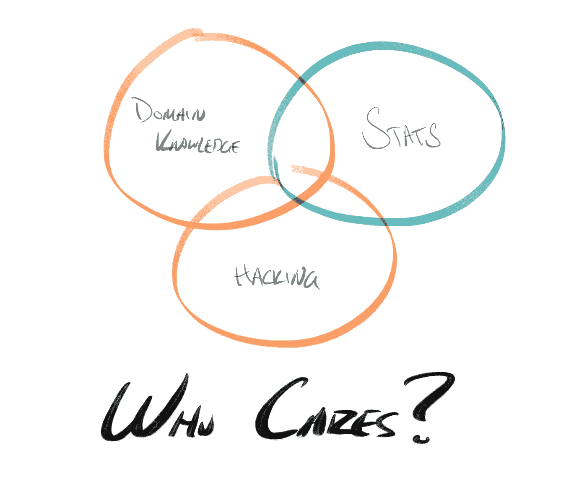
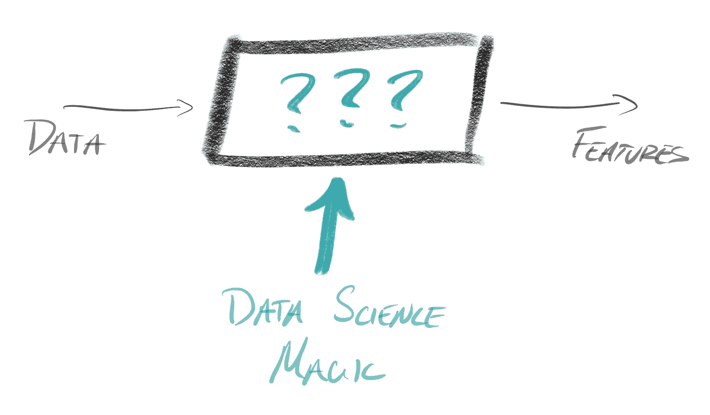

# 功能工程是最大化数据科学影响的关键的五个原因

> 原文：<https://towardsdatascience.com/five-reasons-feature-engineering-is-key-to-maximizing-data-science-impact-97f1d88f951>

## 评估数据产品和建立高影响力团队的框架

光子由[斯蒂芬·道森](https://unsplash.com/@dawson2406)送上[的 Unsplash](https://unsplash.com/)

所有组织都有数据，需要将这些数据整理成可操作的*功能*。在本文中，我们将回顾特性的含义，以及为什么它们是好的业务和有效的数据产品不可或缺的一部分。然后，我们将讨论为什么数据科学家最适合开发这些功能，功能工程的镜头如何量化您的数据科学项目的价值，以及如何使用这些知识来建立高影响力的数据科学团队。

所有组织都需要特性工程。

从数据管理和 EDA 到模型测试,“数据科学”这个术语的含义太多了。问题困扰着处于不同分析成熟度水平的组织。*我的组织需要在哪里利用数据科学？数据科学家比分析师/预测师/数据工程师更适合在哪里工作？我如何量化数据科学项目的影响？*

(图片由作者提供)

*数据科学家是特性工程师。*

有时数据科学家确实会对数据进行预处理，以剔除垃圾和边缘案例。在绘制问题空间时，他们可能会参与探索性数据分析。他们可以部署统计或机器学习技术来预测趋势和未来结果。有时他们会进行实验来寻找因果影响。他们甚至可能进入操作化的杂草中，部署管道和“生产”代码来服务于他们的劳动成果(但希望不会，稍后会有更多的介绍……)。但最终，这一切都是为了一个核心目标:以特征的形式为他们的客户提供可操作的、精选的数据。

**特性是所有数据产品的基础。**

我在这里将一个特性定义为简单的数据转换。这是一个黑匣子:数据进入，特征出现。介于两者之间的魔法是数据科学领域——管理数据并将其转化为可操作的信号，这些信号可以为业务决策提供信息、实现流程自动化、提供客户洞察并推动整个数据产品世界的发展。

(图片由作者提供)

根据这个定义，几乎所有的预处理，人口统计，人工智能/ML 和数据操作都是特征工程。因此，我们希望选择对给定用例影响最大的最直接的策略。

**特征是粒状的**

特性是基于数据的决策的基本组成部分。组装成一个更大的叙述的数据可以有更重要的影响(以后会有更多的讨论)，用特性的语言来组织工作产品迫使可解释性成为一个小块，容易被技术领域的涉众消化。随着特性变得更加细致入微、更具预测性和规范性，分析的成熟度也在不断提高。

数据科学家最适合功能开发。

将数据转化为可操作的特性需要产品意识和技术知识的巧妙结合。有影响力的数据科学团队通过深入的领域知识、了解组织的数据资产(包括边缘案例和警告)以及掌握统计和 ML/AI 技术来实现这一点。

他们最好把时间花在测试假设和改进数据产品上。拥有自助服务平台的团队可以最大限度地减少花在流程编排和扩展上的时间，从而有更多时间改进产品。他们还通过拥有数据科学家的作品来提升他们的地位。用 Jeff Magnuson1 的话说，“工程师不应该写 ETL。”

**你可以绑定特性的值。**

在使用特性语言设计产品问题时，我们可以通过直接询问利益相关者、客户或潜在用户来预测项目的价值——*了解这些信息的价值是什么？*通过考虑信息如何影响收入、留存、终身价值或服务客户的成本，数据科学家可以帮助利益相关者用美元来表达该价值。

例如，考虑一个假设的场景，其中一个企业想要运行一个赢回计划，当客户做出积极反应时，该计划获得净回报，但当客户做出消极反应时，该计划没有额外收入(实际上执行该计划需要成本)。在某些情况下，如果期望值为负，企业可能不会选择联系任何流失的客户，这取决于成功率。然而，如果他们能够在选择有资格的客户之前预测哪些客户会积极响应，投资回报是有保证的！在这种情况下，客户做出积极响应的可能性的值将是没有该信息的策略(根本不部署该程序，或零)与他们拥有完美信息(仅将该信息部署给做出积极响应的客户)之间的差异。

这就是所谓的千里眼 (VOC)的*值。它是一个有价值的工具，用于在规划甚至构思阶段阐明和界定数据产品的影响，而无需运行一个单独的实验。虽然您可能不总是能够以完美的准确度或精确度交付这些信息，但是估计 VOC 意味着团队可以计算描述性特征的值，或者概率特征的期望值(EV)(例如，流失的可能性)。*

**结论**

功能是分析团队的支柱——所有组织都使用精选数据来推动业务决策或交付用户价值。从功能的角度思考数据科学和数据产品开发可以帮助您:

*   根据功能描述数据产品的影响。这个框架可以:
    ——通过离散的特征描述增加数据产品的可解释性和可解释性。
    –利用洞察力的价值来量化项目的影响。
*   为数据科学家提供他们开发的功能的端到端所有权。拥有深厚领域知识的数据科学家可以拥有其数据产品的最终影响，并负责通过持续改进(例如，通过实验)来维护性能。
*   通过水平平台支持端到端的功能所有权，使数据科学家能够专注于功能工程科学。

我发现这个框架有助于建立有影响力的数据科学团队和规划新的数据产品，我希望你也一样。

[1] J .马格努松，工程师不该写 ETL (2016)，[https://threaded . stitchfix . com/blog/2016/03/16/Engineers-should nt-Write-ETL/](https://multithreaded.stitchfix.com/blog/2016/03/16/engineers-shouldnt-write-etl/)