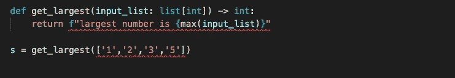

# 提升 Python 代码可读性的五个技巧

> 原文：<https://towardsdatascience.com/five-tips-to-elevate-the-readability-of-your-python-code-7b049bbf72e6>

## 现在就将这些应用到您的 Python 代码中，以提高可读性——您的同事和未来的自己都会感谢您的！


图片:[不飞溅](https://unsplash.com/photos/82TpEld0_e4)

> **TL；博士**
> 
> 1.使用自动格式化程序，如`black`和`isort`
> 
> 2.使用代码检查器，如`flake8`和`pylint`
> 
> 3.添加类型提示以消除函数参数中的模糊性
> 
> 4.用`pre-commit`自动化代码质量检查
> 
> 5.使用 Python 文档字符串编写好的文档

我以前从不太担心代码的可读性。

很明显，我在乎我能在开发过程中阅读它。但是我从来没有过多考虑过 6 个月后我是否还能读它。

> “当然，我知道那个变量包含什么类型的数据，以及那个函数负责什么——这是显而易见的，对吧！?"

**给过去的自己的提示:你会忘记🤦‍♂️.**

与软件工程师不同，作为数据科学家，我们倾向于独立地编写代码。

是的，我们在团队中工作，但是你和其他人在同一个代码文件中工作是不寻常的。通常情况下，您将对项目的特定部分(例如，您的个人笔记本)承担个人责任和所有权，而不是由多个团队成员共同承担责任。

这往往会导致项目代码库的代码格式不一致，其他人不太关注可读性和可维护性。

自职业生涯开始以来，我主要是在“绿地”项目中担任咨询角色。这些项目通常包括编写只有我负责的新代码。仅仅过了几年，我才着手我的第一个项目，这个项目涉及到继承的遗留代码库。

这时，我终于意识到编写可读代码的重要性。不仅仅是为了你自己，也是为了将来加入这个项目的开发人员。这也让我反思我自己在以前的项目中糟糕的编码习惯，以及我希望以前的开发人员在他们的代码中添加了什么，以节省我几个小时的时间。

**幸运的是，在 Python 中，你可以应用一些简单的修饰性的改变，使你的代码变得更加可读和易于管理**。

在这篇文章中，我给出了五个可行的技巧，你可以在编码时应用它们来提高你的 Python 代码的可读性，而不需要重构。

让我们开始吧！

# 1.使用自动格式化程序来标准化代码🧹

提高代码可读性最简单的方法是使用自动代码格式化工具来标准化你的代码。

Python 中有很多工具可以帮助你格式化代码。一些最受欢迎的包括:[黑色](https://github.com/psf/black)、[伊索特](https://github.com/PyCQA/isort)、[自动驾驶 8](https://github.com/hhatto/autopep8) 和 [YAPF](https://github.com/google/yapf) 。

我个人使用`black`进行代码格式化，使用`isort`对我的库导入语句进行排序。

在整个项目中定义并坚持一致的编码风格/格式会大大增加你的代码对其他开发人员的可读性。

阅读格式不好的代码就像阅读一篇语法不好的文章。你仍然可以理解这篇文章，但意思可能是模糊的或令人困惑的。

**遵循 PEP8 标准的一致格式有助于开发人员在阅读代码时确定方向**。他们知道从代码布局中可以期待什么，并且可以专注于重要的部分——理解代码逻辑。

标准化和自动化的代码格式也有助于版本控制。

想象一下您创建一个不遵循 PEP8 约定的新文件的场景。然后，您的同事在版本控制上签出该文件，并对*的一行代码*进行更改。在保存文件时，他们的 IDE 会自动格式化原始文件以符合 PEP8(例如，最大行长度 79 个字符，删除函数之间不必要的空白行，函数参数之间无关的空白等)。然后，他们将文件签回到存储库中。现在有一个问题。旧代码和更新后的代码之间会有很大的差异(“diff”)，即使对底层代码逻辑只做了很小的更改。

标准化、自动化的代码格式化降低了版本控制中与被更改代码的功能无关的较大差异的风险。

## 如何使用代码格式化程序

您可以从命令行对您的代码运行自动代码格式化程序。或者，大多数 ide(比如 VSCode)都有设置和插件，可以在保存代码时自动格式化代码。

例如，在命令行上，您可以将[黑色](https://github.com/psf/black)代码样式应用到您的代码中，并使用[或](https://github.com/PyCQA/isort)组织您的导入，如下所示:

```
*# install the black and isort libraries*
pip  install black isort*# use black command line tool to format code*
black SOURCE_FILE_OR_DIRECTORY*# organise import statements with isort*
isort SOURCE_FILE_OR_DIRECTORY
```

下面是我的 VSCode `settings.json`文件的摘录，它在 VSCode 中保存文件时自动将`black`格式应用于我的 Python 文件。它还按照字母顺序组织我的导入(类似于 [isort](https://github.com/PyCQA/isort) 的功能)，当有许多导入的库或函数时，使导入语句更易读。

```
# vscode settings.json
{
    **"editor.formatOnSaveMode"**:"file",
    **"editor.formatOnSave"**:**true**,
    **"python.formatting.provider"**: "black",
    **"editor.codeActionsOnSave"**: { **"source.organizeImports"**: **true**},
}
```

> ***注***
> 
> *虽然建议遵循*[*pep 8*](https://www.python.org/dev/peps/pep-0008/)*编码约定，但是并没有普遍接受的 Python 代码样式规则。您会注意到不同项目之间的差异，这是开发团队自身偏好的结果。*
> 
> 参与项目的所有团队成员都遵守相同的代码样式规则是至关重要的。因此，最好明确你所遵循的风格指南。
> 
> *您可以在* `*README.md*` *中描述您的项目使用的编码风格，但是更好的是，您可以使用您的项目目录中的* [*配置文件*](https://pycqa.github.io/isort/docs/configuration/config_files.html) *来显式定义该风格。上面提到的每个工具都可以自动读取配置文件，以确保项目中的所有开发人员都遵循相同的规则。*

# 2.使用代码检查工具(linters)来捕捉错误并遵循最佳实践🔎

代码检查工具，通常被称为 [linters](https://code.visualstudio.com/docs/python/linting) ，有助于突出 Python 代码的语法和风格问题。

Linters 帮助您保持代码 PEP8 的兼容性，在运行代码之前捕捉一些错误，并警告不良行为。例如:

*   发现未使用的变量或赋值前使用的变量
*   识别未使用的导入库
*   确保所有函数/类都有文档字符串
*   警告不要使用[裸异常](https://www.flake8rules.com/rules/E722.html)

在某些情况下，linter 突出显示的错误并不是真正的问题。例如，`pylint`建议每个 Python 模块应该有一个 docstring 来描述它的用途。对于您的项目，您可能认为这是不必要的。您可以使用[配置文件或行内注释](https://pylint.pycqa.org/en/latest/)来控制 linters 的行为，它们可以被设置为忽略某些错误。

同样，Python 有许多林挺工具。最常见的两种是: [flake8](https://github.com/PyCQA/flake8) 和 [pylint](https://pylint.pycqa.org/en/latest/) 。

我倾向于使用`flake8`作为我的预提交钩子(见下面的提示)。我还在开发过程中使用 Pylint 来帮助捕捉问题并确定可能的改进，然而，与`flake8`相比，它对看似良性的问题要严格得多，这使得它无法用作向您的 repo 提交新代码的看门人。

Pylint 还给你的代码打了 10 分，这很酷。尽管当你的完整工作代码最初被评为满分 10 分中的 3 分时，这会伤害你的自尊😞。

## 如何使用 linters 检查你的代码

如上所述，linters 可以从命令行运行，也可以内置到您的 IDE 中。

```
*# install flake8*
pip install flake8*# run flake8 checks*
flake8 SOURCE_FILE_OR_DIRECTORY
```

您可以使用`settings.json`文件在 VSCode 中启用林挺。例如，使用 pylint:

```
# vscode settings.json
{
    **"python.linting.pylintEnabled"**:**true**,
    **"python.linting.enabled"**: **true**,
}
```

> ***顶端提示💡***
> 
> ***使用***[***nbQA***](https://github.com/nbQA-dev/nbQA)***库将代码检查工具扩展到您的 Jupyter 笔记本上。***
> 
> 如果你使用 Jupyter 笔记本，使用代码检查工具变得比简单的 `*.py*` *文件更重要。*
> 
> 本质上，在 Jupyter 笔记本上的工作是实验性的，当你测试或调试代码时，可能涉及到以不同的顺序运行单元格。因此，很容易意外地留下未赋值的变量，或者在变量被定义之前就使用它们。在将笔记本提交到 git repo 之前，也很难手动捕捉这些错误。
> 
> *nbQA 针对您的笔记本运行 Python 林挺工具，以帮助防止损坏的笔记本提交到您的存储库中。*

# 3.静态类型提示💡

在我的代码中使用类型提示对我来说是一个游戏改变者。

当你开始使用[类型提示](https://realpython.com/lessons/type-hinting/)时，你的代码的可读性提高了多少，我怎么强调都不为过。如果你从这篇文章中学到了什么，那就是开始使用类型提示。

## 什么是类型提示？

Python 是一种[动态类型语言](https://realpython.com/lessons/dynamic-vs-static/)。这意味着您不需要在代码中显式声明变量数据类型。运行代码时，数据类型会根据传递给变量的特定数据结构自动分配给变量。

动态类型语言较低的语法开销对初学者来说可能更宽容和更有吸引力，但是，它可能会导致坏习惯和可读性较差的代码，尤其是在较大的项目中。

Python(3.6 以上版本)中的类型提示是可选的注释，它向代码的读者表明特定变量或函数所期望的数据结构/类型。例如`str`、`list`、`dict`、`int`等。

Python 解释器忽略类型提示。如果没有类型提示，或者即使错误地指定了类型提示，您的代码仍然会运行。**类型提示的目的纯粹是为了开发者的利益**

**示例**

以下面的函数为例，类型提示可以用来改善开发人员的体验。

```
**def** get_largest(items):
    **return** max(items)
```

上面的函数旨在返回数字列表中的最大值。简单吧？

现在，假设您是该项目的新开发人员，看到了这段代码。你应该如何使用这个功能？

当最初编写这个函数时，我确信作者确切地知道这个函数做什么以及它应该用于什么——它是非常简单的 Python 代码。然而，作为一个新的开发人员，这可能会导致不正确地使用函数或得到意想不到的结果。

这个例子中最大的问题是:我应该把什么数据结构传入名为`items`的函数参数中？

Python 关键字可以处理许多不同的数据结构，包括:字典、列表、字符串、字符串列表、集合、元组。如果将这些数据结构传递给上面的函数，它不会抛出错误。然而，只有整数列表(或者可能是浮点数)才能给出最初开发者想要的结果。

类型提示(和改进的变量命名)可以极大地提高可读性，并减少以后出错的机会:

```
*# improved with type hints (python 3.9+ syntax)*
**def** get_largest(input_list: list[int]) -> int:
    """Return largest number in a list"""
    **return** max(input_list)
```

上面的代码片段使用了`:`语法来指定函数所期望的数据结构是一个整数列表，而`->`语法表示函数将返回一个整数。

> *你可以在* [*文档*](https://docs.python.org/3/library/typing.html) 中阅读更多关于 Python 类型提示语法的内容

虽然仍然没有什么可以防止未来的开发人员意外地将一个字符串或字符串列表传递给这个函数，但是类型提示极大地帮助了开发人员，并指明了该函数的预期用途。

## 类型提示工具

您可以使用类似于 [mypy](https://github.com/python/mypy) 和 [pylance](https://marketplace.visualstudio.com/items?itemName=ms-python.vscode-pylance) (在 VSCode 中)的工具来检查可疑的键入错误。

如果指定了类型提示，这些工具将检查代码中该变量/函数的实例，并确保使用了正确的数据结构。

例如，在下面的 VSCode 编辑器中，我已经指定了函数需要一个整数列表并返回一个整数。VSCode 发现了两个问题。首先，我从函数中返回一个字符串，而不是一个整数。其次，当我试图在其他地方使用这个函数时，我得到一条红线警告我，我正在向这个函数传递一个字符串列表，而不是一个整数列表。



作者图片

这些警告在开发过程中非常有用，有助于快速捕获潜在的 bug。

我的 vscode `settings.json`文件中的相关设置是:

```
{
    **"python.linting.pylintEnabled"**:**true**,
    **"python.linting.enabled"**: **true**,
    **"python.analysis.typeCheckingMode"**: "strict",
}
```

或者，您可以使用`mypy`作为命令行工具，对您的代码运行静态类型分析:

```
*#install mypy*
pip install mypy*# run mypy*
mypy SOURCE_FILE_OR_DIRECTORY
```

# 4.用预提交钩子自动处理一切🪝

作为程序员，我们喜欢自动化。代码格式化和检查也不例外。

您可以使用[预提交](https://pre-commit.com/)钩子来自动化代码样式和检查。`pre-commit`框架允许您在提交对 git 库的更改之前，指定要对代码运行哪些检查。这些检查在提交代码时自动运行。如果任何检查失败，代码将被拒绝，直到它们被修复。

这有助于防止不良代码被添加到您的项目历史中，并确保 repo 中的所有代码都符合您的代码样式指南。

## 预提交挂钩入门

1.  安装预提交

```
pip install pre-commit
```

2.将`.pre-commit-config.yaml`配置文件添加到您的项目目录中

```
*# .pre-commit-config.yaml*
**repos**:
-   **repo**: https://github.com/pre-commit/pre-commit-hooks
    **rev**: v2.3.0
    **hooks**:
    -   **id**: trailing-whitespace
-   **repo**: https://github.com/psf/black
    **rev**: 19.3b0
    **hooks**:
    -   **id**: black
```

3.安装 git 挂钩

```
pre-commit install
```

遵循这些指令后，下一次您尝试向 repo 提交文件时，预提交钩子将运行，并确保您的代码与`black`格式化程序兼容。在上面的例子中，预提交还将检查并删除文件中的任何尾随空格

查看我的[关于预提交钩子](https://engineeringfordatascience.com/posts/pre_commit_yaml/)的文章，获得更详细的教程和我用于数据科学项目的完整模板`.pre-commit-config.yaml`文件。

# 5.写有用的文档✍️

我们都希望我们的代码能够超越我们对项目的投入而继续存在。但是不管你的软件有多好，如果文档不好，人们就不会使用它。

在开发过程中很容易跳过文档，这通常是在项目结束时最后引起我们注意的事情。

虽然为仍在开发中的功能编写详细的文档是没有意义的——糟糕的或不正确的文档比没有文档更糟糕——但是有一些简单的策略可以帮助您在没有太多开销的情况下掌握全局。**有了更好的文档，你就增加了其他人使用你的代码的机会，也将使你未来的生活更加轻松。**

在 Python 中，文档通常有三种形式:行内注释、文档字符串和外部文档(例如 README.md)。

## 内嵌注释

一般来说，你应该试着遵循 [PEP8](https://www.python.org/dev/peps/pep-0008/#comments) 设定的行内评论准则。

在代码中编写内联注释是一个令人惊讶的有争议的话题。但是我喜欢采纳马丁·福勒在他的书《重构》中的建议:

> *“注释应该解释‘为什么’代码在做某事，而不是‘它在做什么’——****马丁福勒*** *，* [*重构*](https://engineeringfordatascience.com/book-notes/refactoring/)

代码正在做什么应该是不言自明的。然而，*为什么*开发者选择在代码中使用那个‘神奇’的数字、不寻常的方法或变通方法可能并不明显。这就是行内注释很有意义的地方。

我喜欢在代码意图不明显的地方添加行内注释。一个很好的例子就是当你使用[十六进制代码](https://en.wikipedia.org/wiki/Web_colors)来表示颜色时——你永远不会仅仅通过看十六进制代码来记住颜色。

下面是我在[上发表的可视化资产价格相关性](https://engineeringfordatascience.com/posts/visualising_asset_price_correlations/)的文章的一个片段，我为此使用了行内评论。

```
**def** assign_colour(correlation: float) -> str:
    """Assign hex code colour string based on correlation value"""
    **if** correlation <= 0.0:
        **return** "#ffa09b"  *# red*
    **else**:
        **return** "#9eccb7"  *# green*
```

## 文档字符串

文档字符串用于描述函数或类的操作。它们是使用函数声明下面的三个引号语法`"""`定义的。

```
**def** add(a,b):
    """Add two numbers together"""
    **return** a + b
```

将简单的单行文档字符串添加到代码函数中，即使您认为函数很简单，也会对提高可读性和减少未来开发人员的歧义有很大帮助。

需要注意的是**文档字符串和行内/块注释是不可互换的**。

与行内/块注释不同，文档字符串可以在代码运行时使用`__doc__` dunder 属性或内置的`help()`函数来访问。这意味着文档字符串可以被 ide 解释，并在输入新代码时显示为提示。

我注意到来自其他语言的程序员没有正确使用 Python 的文档字符串特性。例如，使用 Python 函数上面的块注释*而不是使用 doc 字符串语法:*

```
*# function to add two numbers together*
**def** add(a,b):
    **return** a + b
```

这不仅不是“Pythonic 化的”(参见技巧 1 —代码格式化)，而且通过编写这样的注释，您在运行时放弃了对文档字符串的访问。因此，在 IDE 中编写时，您将无法查看函数描述，也无法使用自动文档工具，如 [sphinx](https://www.sphinx-doc.org/en/master/) (见下文)。

根据函数的复杂程度，一个简单的单行文档字符串可能是合适的。如果函数名和参数本身提供了足够的描述性细节，就不要添加不必要的细节。

> ***顶端提示*** *💡*
> 
> *您可以使用 VSCode 中的* [*Python 文档字符串生成器*](https://marketplace.visualstudio.com/items?itemName=njpwerner.autodocstring) *等工具自动生成文档字符串模板*

## 外部文件

最详细的文档应该留给项目`README.md`。

自述文件应该向项目的维护者和用户提供关于如何设置环境、项目的目的、项目目录结构等的一般信息。

你可以利用 [GitHub](https://github.com/othneildrew/Best-README-Template) 上的[自述文件模板](https://www.makeareadme.com/)。

此外，如果您已经用文档字符串记录了您的代码，那么您可以使用像 [Sphinx](https://www.sphinx-doc.org/en/master/) 这样的工具在一个漂亮的用户界面中自动生成文档。

# 额外收获:阅读他人的代码👨‍🎓

所以这条建议与改进你自己的 Python 代码没有直接关系。然而，学习如何编写可读和可维护的代码的最好方法之一是阅读其他人的代码。

你可以通过查看 GitHub 上流行的开源库来获得其他人的代码，或者如果你在一个团队中工作，通过审查其他人的代码。

**通过阅读他人的代码，你将能够发现在试图理解他们的代码库时让你感到沮丧的事情**。这可能是命名不当的变量、函数所需的数据结构不清楚、文档不充分(例如，没有函数的文档字符串、自述文件)、不一致或不符合 PEP8 的代码使其难以阅读。

从外部的角度来看别人的代码，你可以从另一个程序员的角度将这些知识应用到你自己的代码中，而这个程序员以前并不了解代码库。

例如，只有当我参与一个继承了遗留代码库的项目时，我才意识到类型提示对于帮助其他开发人员(以及您自己)是多么有用！)来理解在代码中传递的数据结构。

# 结论

您可以显著提高项目的可读性和可维护性，而无需重构任何代码逻辑，只需利用 Python 开源社区开发的工具。

根据我的经验，你应该假设你会在未来的某个时刻忘记每个函数或变量的用途。因此，在第一次编写代码时，最好尽可能地明确(例如，编写描述性的文档字符串，添加明确的类型提示等)。).将这些策略应用到您自己的 Python 项目中，将会极大地改善合作者的开发体验，如果不能，它至少会让您未来的生活更加轻松。

我在这篇文章中提到的五大技巧包括:

*   使用自动格式化程序，如`black`和`isort`
*   使用代码检查器，如`flake8`和`pylint`
*   使用类型提示来消除函数参数中的歧义
*   使用`pre-commit`自动检查
*   使用 Python 文档字符串编写好的文档

将这些原则应用到您的开发中，将极大地提高代码的可维护性，并使您的未来生活变得更加轻松！

# 资源

*   [我的模板。我用 pre-commit-config.yaml 文件作为大多数项目的基础](https://gist.github.com/julian-west/e50b25a9aa10551e3452f5a6cfaa6aa3)
*   [RealPython —类型提示教程](https://realpython.com/lessons/type-hinting/)
*   [Arjan Codes YouTube Channel —软件设计思路和干净代码](https://www.youtube.com/c/ArjanCodes/videos)
*   [写好 Python 文档](https://docs.python-guide.org/writing/documentation/)

> 本文最初发表在我的博客上，[engineeringfordatascience.com](https://engineeringfordatascience.com)