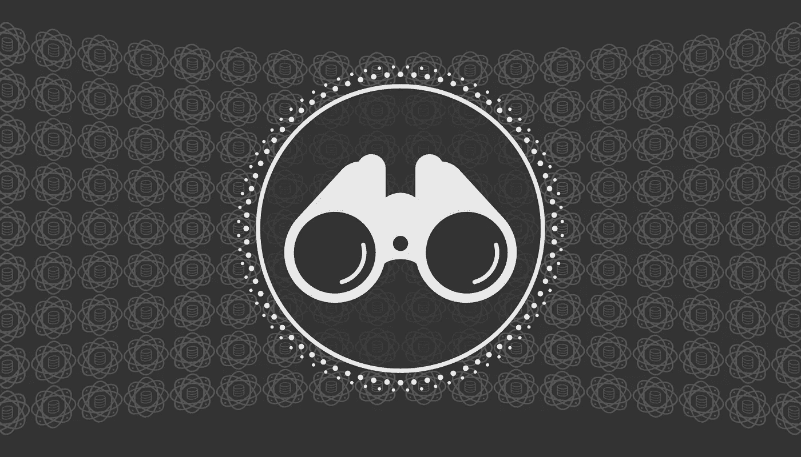

# 数据科学行业值得关注的五大趋势

> 原文：<https://towardsdatascience.com/five-trends-to-watch-for-in-the-data-science-industry-97bf1589f9ca>

## 意见

## 分析行业的发展方向，以及你应该如何准备

作者创作的图形

有一句著名曲棍球运动员经常引用的话，“我滑向冰球要去的地方，而不是它已经去过的地方。”这句话几乎适用于所有行业，数据科学也不例外。尽管概念数据科学并不是一门新的学科，但应用数据科学相对来说仍处于起步阶段。也许只是在过去的 7 年左右，我们才看到数据科学在主流公司中获得了牵引力，因此它仍然非常适合持续发展。

自然，任何人都应该为未来做好准备。我已经在这个领域从业多年，因为我看到我自己的职业生涯在这里继续发展，我想确保我现在做的事情是正确的，为未来做准备。当然，我没有水晶球，所以我不能肯定地说，我下面分享的趋势肯定会发生。

但是根据过去推断未来是我们的工作！我们使用数据科学来寻找数据的趋势，因此同样，我正在使用我自己在多个渠道的专业经验来对行业可能的发展方向做出有根据的猜测。具体来说，我是一名《财富》50 强公司的机器学习工程师，经常发表和阅读关于数据科学的文章。我指导各种各样的学生、实习生和寻求职业转型的人，我定期梳理 LinkedIn 和 Reddit 等网站，看看数据科学领域的“热门话题”是什么。当然，肯定有比我更了解数据科学的人，但我想我已经掌握了这个令人惊叹的行业的发展方向。

下面的列表按重要性从低到高的降序排列。同样，这只是我对数据科学发展方向的个人看法，我完全承认我可能是错的。我希望你能看透这些趋势，并了解如果这些趋势成为现实，你该如何调整自己的技能，做好最好的准备。

事不宜迟，让我们跳进名单吧！

# 5.更多地方的更多人工智能

正如我上面提到的，概念数据科学并不新鲜；只是在过去几年里，由于通用硬件设备计算能力的提高，它变得更加流行。如果考虑企业级软件，计算能力方面的许多“重担”都来自于一般用户无法访问的一些数据中心的大型服务器。随着硬件继续发展，以更小的尺寸提供更快的计算速度，我想我们也会看到越来越多的设备使用人工智能。

仅在过去的五年里，我们就已经看到我们称之为“物联网”(IoT)市场的设备数量有了相当大的增长。迄今为止，这些物联网设备的功能相对简单，从打开灯泡到打开车库门。我个人还没有见过很多物联网设备在数据科学方面做如此复杂的事情，这可能是因为大多数物联网设备仍然没有达到能够以毫秒级延迟处理深度神经网络等事情的程度。在小型硬件环境中实现这些复杂的人工智能技术仍然是一个挑战，但如果技术继续保持过去几十年的趋势，这将很快成为物联网设备的一个问题。一旦我们达到这一点，我打赌我们会看到应用人工智能在各种用例中的增长。

# 4.各种渠道的欺诈数量不断增加

我不知道你怎么想，但我个人的手机号码和 WhatsApp 账户上的垃圾短信数量明显增加。好消息是，大多数人能够相当容易地检测出什么是欺诈，什么是真实的，但挑战在于，不幸的是，检测出什么是真实的可能会越来越难。以“深度假货”为例。到目前为止，我们真的没有看到一个像“深度伪造”视频这样的东西真正引起麻烦的重大事件。这在很大程度上是因为人们相对善于检测视频何时是“深度伪造”的视频。(例如，不自然的动作、声音和嘴部动作之间的不匹配等。)但和任何技术一样，随着时间的推移，情况会变得更好。我收到的那些假短信会变得越来越真实，我敢打赌“深度假”视频最终会变得与真实内容难以区分。

有许多方法可以抵消欺诈活动，当然，我希望人工智能/机器学习是我们能够用来更好地检测这种欺诈的工具之一。我甚至可以看到某种网络安全/数据科学组合角色在未来成为主流角色，利用数据科学实践与网络安全实践来打击所有这些不同类型的欺诈。如果你是这两个领域的从业者，在相反的领域提高技能会让你受益匪浅，这样你就能很好地为这些潜在的新工作角色定位。

# 3.伦理人工智能

在过去的五年中，我们已经开始看到这种对消费者数据的负责任使用的巨大推动。例如，我们仅在 2018 年就看到了主要的立法:加利福尼亚州的[加州消费者隐私法(CCPA)](https://oag.ca.gov/privacy/ccpa) 和欧盟的[一般数据保护条例(GDPR)](https://www.privacyshield.gov/article?id=European-Union-Data-Privatization-and-Protection#:~:text=The%20EU%20General%20Data%20Protection,to%20companies%20of%20all%20sizes.) 。这是两项开创性的立法，我个人认为这是朝着正确方向迈出的步伐。通过数据滥用消费者隐私太容易了，所以我非常期待这种趋势在人工智能和机器学习等数据科学领域继续下去。

好消息是，你可以——我认为应该——在你今天的工作中减少不道德的人工智能实践。虽然常识会让你在制定道德的人工智能实践方面走很长的路，但有很多很好的资源可以帮助你更好地理解那些更多的“灰色区域”在美国，你可以查看像[美国平等就业机会委员会(EEOC)](https://www.eeoc.gov/employers/small-business/3-who-protected-employment-discrimination) 这样的政府网站，以获得关于“受保护阶层”等问题的明确答案，你可以合理地假设你在创建自己的预测模型时应该尊重这些问题。许多组织(尤其是大型组织)也有自己的法律团队和外部验证团队，他们通常精通道德最佳实践。当有疑问时，不要害怕向这些团体中的任何一个咨询。他们应该能够给你明确的建议来解决这些“灰色区域”,这样你就可以创建一个有效和道德的人工智能模型。

# 2.MLOps

因为应用数据科学仍处于起步阶段，我们还没有太多关于模型退化的担忧。新训练的预测模型通常在几个月或几年内保持良好的性能，因为对于许多用例来说，正在推断的基础数据不会发生很大变化。但这并不意味着数据永远不会改变，在行业部署这些模型大约七年后，我不得不相信，它们中的许多不再像最初接受培训时那样高性能。

这正成为许多公司的一个巨大问题，尤其是那些维护数百或数千个模型的公司。鉴于以下因素，重新培训和重新部署模型的能力是一个巨大的挑战…

*   员工离开公司，因此关于一个模型是如何被训练的知识也消失了
*   用于最初训练模型的原始数据和/或代码已经丢失
*   没有足够的人既服务现有的模型又创造新的模型。

MLOps 试图通过创建这个无缝的流程来回答这些问题，该流程训练、部署并定期验证模型在生产中保持高性能。如果模型经历衰退或漂移，那么 MLOps 管道应该能够自动地重新训练/重新部署模型。显然，这对于这些拥有许多模型的公司来说是一个巨大的福音，因此尽管感觉 MLOps 已经成为当今的一个大话题，但我真诚地相信，我们才刚刚开始在企业级水平上真正成熟这些实践。实现 MLOps 的最大挑战是它很大程度上需要一套工程技术，这就引出了我们的最终趋势…

# 1.对全栈数据科学家的需求日益增长

我在介绍中提到，我经常指导各种希望进入数据科学领域的人，这也包括定期查看招聘信息，了解对员工的期望。毫无疑问，对于这些数据科学角色的需求，传统高等教育和专业公司之间存在巨大的脱节。具体来说，数据科学课程似乎没有教授如何部署预测模型。我指导过许多你能想到的最知名大学的学生，每个学生都告诉我同样的事情:他们专注于如何建立模型或创建算法，但几乎没有时间致力于如何在现实世界中实际实现它们。从每一个和我交谈过的新朋友那里一遍又一遍地听到同样的情绪，真是令人兴奋不已！

一些公司试图通过雇佣软件工程师来代表数据科学家执行这一实现来回答这个问题，但不幸的现实是，为了胜任地部署预测性人工智能模型(特别是使用 MLOps 原则)，软件工程师真的需要理解数据科学家会理解的原则。没有这种背景的软件工程师最多能做好工作，但我个人从未见过任何软件工程师成功部署完全启用的 MLOps 管道。需要说明的是，这并不是对普通软件工程师的打击。只是这实际上是一个双重技能集，所以要求一个数据科学家也拥有足够强大的软件工程技能集来部署他们自己的模型是很难的。

尽管这是一个很高的要求，但我已经在今天的招聘启事中看到了。此外，如果我们真的像许多人预测的那样即将进入衰退，许多公司的自然倾向是“少花钱多办事”，这意味着要求他们的数据科学家保持“全套”技能，以便他们也可以部署自己的预测模型。是的，对一个人来说，这绝对是一个具有挑战性的要求，但我可以看到这种要求变得越来越普遍。

这篇文章到此结束！你同意这个列表吗，或者这是你可能添加的另一个趋势？在评论中分享你的想法吧！我很想听听你的想法。感谢您的阅读，我们将在下一篇文章中再见。