# 使用线性规划的车队和劳动力计划

> 原文：<https://towardsdatascience.com/fleet-and-workforce-planning-with-linear-programming-16db08c7f91d>

## 线性编程解决一些商业问题的能力预览


[Pop &斑马](https://unsplash.com/@popnzebra?utm_source=unsplash&utm_medium=referral&utm_content=creditCopyText)在 [Unsplash](https://unsplash.com/s/photos/workers?utm_source=unsplash&utm_medium=referral&utm_content=creditCopyText) 上拍照

B 企业(应该)花费大量的时间和精力来预测他们的产品/服务的需求，或者完成不同任务所需的精力/资源，以使他们的回报最大化，同时避免两种不希望的结果:

*   缺乏资源或工人来应对需求，这可能导致流程失败或销售和客户损失；
*   有太多未使用的资源(库存过多)或失业工人，这意味着储存货物的额外成本和员工的机会成本(也许他们可以被分配到其他任务)。

假设一家公司已经成功开发了产品/服务需求的准确预测模型，那么下一步可能是组织产品补给背后的物流，并根据未来需求分配任务。例如，这可能意味着找到以下问题的答案:

**i.** 从哪个仓库向我的每个商店发送预计在下周/下个月内售出的产品“P”件比较便宜？

**二。考虑到每个仓库的可用单位数量，我如何才能做到这一点？**

**三。**可利用的交通资源如何？我如何利用现有的货车/卡车将库存箱子从仓库运到商店？考虑到每辆货车运输的箱子数量有限，哪种选择成本更低？

**四。**考虑到我的一些员工在上周的国际象棋锦标赛中打架，如果他们被分配到同一辆车上，可能会再次打架，我如何将可用劳动力分配到每辆货车？

接下来的问题是，如何回答这些看起来非常具体且性质不同的问题？嗯，我们需要一个框架，允许我们从头开始构建一个完全可定制的解决方案，在这个框架中，我们可以指定我们的目标和现实世界的约束，这些约束定义了这个目标的可行结果。把现实生活中的问题写成方程组怎么样？

在本文中，我们将模拟这些场景，并使用一种称为线性规划的数学建模方法，对提出的 4 个问题给出一个简单的解决方案。虽然不在数据科学的聚光灯下，但这是一种著名的优化技术/框架，用于求解线性方程组，该方程组由一个目标函数(我们希望最大化/最小化什么，例如最大化利润同时最小化成本)和一组线性约束组成，这些约束指定了我们需要满足的不同条件，以便获得可行的解决方案。

基本上，我们用线性术语写下我们想要解决的问题，指定目标和约束，然后使用优化算法(求解器)以智能和有效的方式浏览数千或数百万个可行和不可行的结果，使我们至少接近最优解。但是，我们所说的最优是什么意思呢？在这个框架中，最优意味着构成最终解决方案的参数的最佳可行配置。请注意，由于这个原因，“最佳”可能指的是完全不同的东西，这取决于企业的偏好/规则。例如，对一个公司来说，满足客户的需求可能比节省运输成本更重要，而对其他公司来说可能不是这样。最后，这一切都归结于业务目标及其约束的正确规范。

# 一个问题，一个框架，一个解决方案

为了回答前面的问题，我们先介绍一个虚构的场景。上下文将保持简单，因为本文的主要目的只是介绍框架以及我们如何使用它通过开发定制解决方案来解决现实生活中的问题。在开始之前，我想澄清一下，从这里开始出现的图像/等式/代码块都是来自我个人的阐述。好了，我们直奔主题吧。

## 1.上下文和示例结果

假设你拥有一家公司，拥有一个目录，其中有 **5** 种产品( *P=5* )、 **3** 个仓库( *W=3* )、3 个商店( *S=3* )、4 辆货车( *V=4* )用于运输产品，以及 **8** 名员工( *E=8* )，这些员工可以被分配到每辆货车上(成对)正如开始提到的，你已经对预期需求有了一个估计。此外，我们将假设由于你已经估计了需求，你也储存了足够的库存来满足它，因此知道你在每个仓库有多少库存。

为了简化问题，我们不考虑产品的单位，而是讨论产品的箱数，即产品的需求和库存是以产品的箱数来衡量的(在现实生活中，在预测以箱/包形式交付的产品需求后，我们需要将原始数字转换为所需的箱数或分组单位数，因为这是运输它们的方式)。

接下来，我们假设您也知道使用任何货车将每种产品的一箱从您的任何仓库运送到您的任何商店的成本。除了可变成本之外，每辆车的使用成本也是固定的(你可以把它看作折旧/维护成本)。

此外，我们假设每辆货车可以行驶的次数是有限的。在这种情况下，限制是 5 次旅行。此外，每辆货车都有一个默认的箱子数量。最重要的是，每辆车(如果使用的话)都需要两人一组(一名司机和一名助手)来操作。此外，我们只能给每个员工分配一辆货车，如果我们这样做，他将获得 1500 美元的固定工资。

最后，在上周举行的国际象棋锦标赛期间，一些员工发生了争吵，因此希望避免将两个有冲突的工人分配到同一辆货车上；事实上，我们有 23 对相互冲突的员工( *J=23* )。如果我们最终把他们分配到同一辆货车上，我们将不得不处理后果，即罚款 500 美元。

总之，我们的上下文变量如下:

*   “P”产品= 5
*   “W”仓库= 3
*   “S”商店= 3
*   “V”型货车= 4 辆
*   “E”员工= 8 人
*   “J”对相互冲突的雇员= 23

这些假设是:

*   我们知道每个商店对每种产品的需求；
*   我们知道每个仓库里有多少箱我们的产品；
*   所有的盒子都有相同的大小(为了简化问题)；
*   我们知道每辆车能装多少箱子；
*   根据产品-仓库-商店-货车的组合，发送一个箱子的成本不同；
*   每辆货车的使用都有固定成本；
*   没有运输至少 1 个箱子，货车不能从仓库到商店；
*   货车最多只能行驶 5 次。我们可以假设它们都发生在同一天；
*   每辆货车能运送多少箱子是有限制的；
*   没有一辆货车可以重复同样的行程；
*   我们需要为每辆货车分配 2 名员工，以便能够成行；
*   如果我们指派一名员工，我们必须支付他这项任务🙂；
*   每个员工只能被分配到一辆货车上；
*   希望避免将冲突的员工分配到同一辆车上。

然后，我们要解决的问题是找到最优(成本更低)的方式将产品从仓库运输到商店，使用不同的货车和工人，同时满足需求、库存、货车和工人分配的约束。

结果看起来像这样:


此表说明了在某些参数(冲突罚金、货车固定成本和员工人数)存在部分差异的不同情况下获得的结果(最终成本)。注意，试验不同参数的可能性是这个框架的主要优点之一。当然，如果我们同时尝试几项改变，比如允许货车进行更多的旅行，同时减少处罚成本和增加冲突数量，分析会更丰富。事实上，我鼓励你以后尝试这些改变。

好的，从现在开始，事情会变得更技术性一些…

## 2.变量、目标和约束

我们需要建立的第一件事是，我们将在定义问题的方程组中使用的变量。以下是它们的列表，以及它们的描述和值的范围:

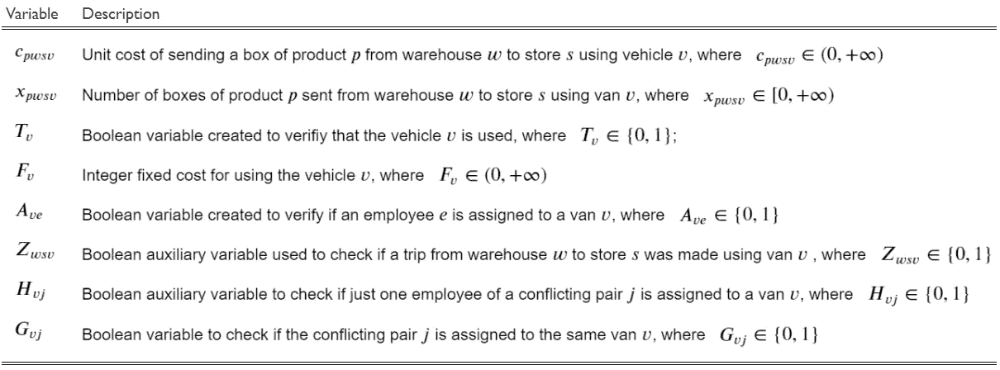

既然我们已经指定了变量，我们就来写问题。用数学术语来说，要解决的问题如下:

***i)* 客观**

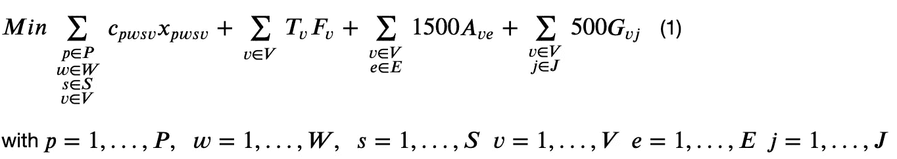

(1)这是用四项之和表示的目标函数: *a)* 单位成本之和乘以从仓库***【w】***发送到仓库***【s】***使用货车***v***；*b)****F***所用面包车的固定费用总和； *c)* 员工工资之和 ***e*** 分配到面包车***v***； *d)* 不遵守不将冲突的一对雇员 ***j*** 分配到同一辆货车 ***v*** 的可选约束的惩罚成本。

***ii)* 约束**

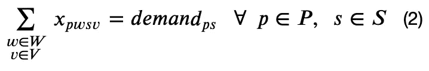

(2)第一个限制规定必须满足每个商店*的每个产品 ***p*** 的需求，即使用任何车辆***v【从每个仓库 ***w*** 发送到每个商店 ***s*** 的所有产品箱组合的总和****

*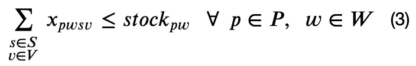*

*(3)规定不能寄没有的箱子。换句话说，从仓库发出的产品箱数总和必须低于或等于其可用箱数；*

*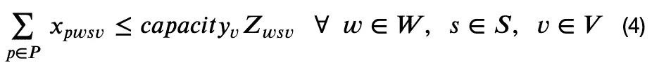*

*(4)规定我们不能超过货车所能容纳的箱数限制，因此每辆车运输的箱数总和必须低于或等于货车每次行程的容量(***【capacity _ v】***)。有了这个约束，我们用辅助变量 **Z_wsv** 来计算货车的行程数，因为 ***capacity_v*** 是车辆 ***v*** 在每次行程中可以运输的最大箱子数，我们可以将几个产品的运输算作一次行程。此外，该约束隐含地阻止了重复相同行程的可能性；*

*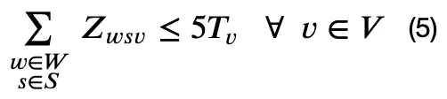*

*作者图片*

*(5)发出信号，表明没有一辆货车可以行驶超过 5 次，同时检查每辆货车是否被使用过。请注意，这个约束与前一个约束是链接在一起的。怎么会？好吧，一旦我们通过使用约束(4)知道是否进行了一次旅行，我们简单地将 ***Z_wsv*** 的数目相加，并要求总数小于或等于 5(旅行限制)。这里，由于等式的规定，除非货车闲置，否则 **T_v** 将等于 1；*

*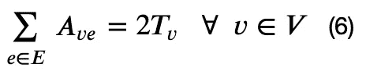*

*作者图片*

*(6)指定每辆货车将被分配 2 个或零个雇员；*

*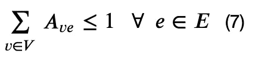*

*作者图片*

*(7)要求每个员工只能分配到一辆货车上；*

*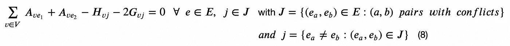*

*(8)该约束说明了对冲突雇员对的期望约束 ***j*** 是可选的。当一对相互冲突的员工***j =***(***E1***， ***e2*** )被分配到同一辆面包车(***A _ ve1***+***A _ ve2***= 2)时，惩罚被激活( ***G_vj*** =1)如果只有一个成员被分配到货车，那么 ***H_vj*** =1。如果对 ***j*** 的冲突雇员中没有一个被分配到货车 ***v*** 中，则所有元素都为零。*

*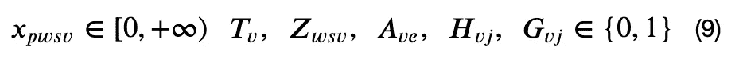*

*(9)最终约束规定了每个变量的上限和下限。这里我们声明哪些变量是二进制的，哪些是整数。*

*完整的问题被表达为:*

*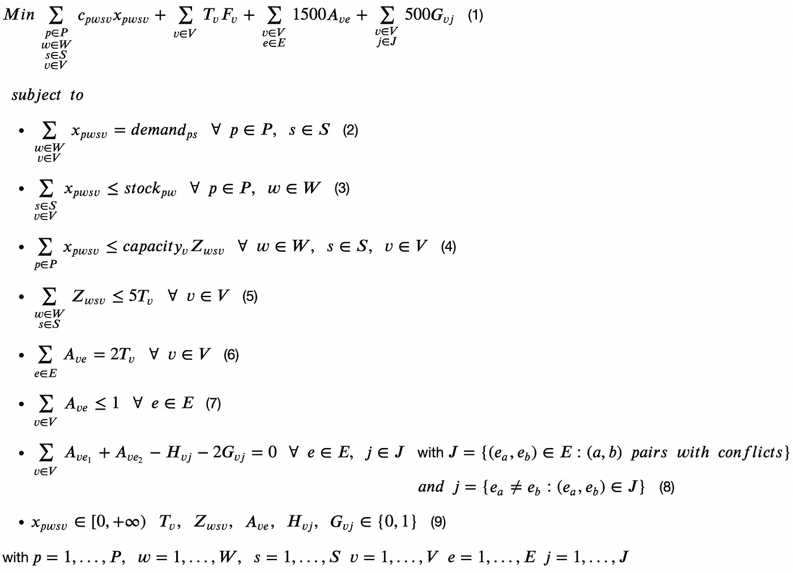*

*既然我们已经设法写出了问题，我们可以继续使用谷歌的 [**或 Python 的**工具的](https://developers.google.com/optimization)来编码这些例子的解决方案。但是，在继续之前，重要的是要强调花时间完成前面的步骤是非常重要的，因为这将使您更好地掌握手头的问题，同时潜在地避免代码中的一些未来错误，并帮助您向数据科学的同事解释您的推理。*

## *3.解决办法*

*你可以在这个[笔记本](https://github.com/eortizrecalde/linear_programming/blob/beb8662089f38b29fd22f993fce4ab4bcadaee88/planning_lp.ipynb)里查看整个解决方案。*

*首先，我们导入将在本例中使用的包。*

```
*import numpy as np
import pandas as pd
from ortools.linear_solver import pywraplp*
```

*该解决方案由以下步骤组成:*

1.  *设置一个能够复制模拟的种子；*
2.  *申报仓库、产品、商店、货车、员工和行程限制的数量；*
3.  *为模拟数据设置一些阈值，并为固定工资和将一对有冲突的雇员分配到同一辆货车的处罚设置值；*
4.  *生成成本矩阵(每种产品 1 个)、库存向量(每种产品 1 个，显示每个仓库的可用库存)、需求向量(每种产品 1 个，显示每个商店的需求)、每辆货车的容量列表(每辆货车每次行程可以运输多少箱子)以及最终的冲突雇员对列表；*
5.  *调用一个求解器的实例，可以用来寻找手头问题类型的解(整数规划或混合整数规划)；*
6.  *创建变量；*
7.  *定义约束条件；*
8.  *定义目标函数和问题(最大化/最小化)；*
9.  *求解并验证结果是否符合约束。*

*我们从步骤 1-4 开始。当我们模拟这个问题时，成本和数量是用一个随机变量创建的，但是在实际场景中，我们需要使用企业提供的输入。该过程如下所示:*

*现在，要完成第 5 步，我们需要实例化一个求解器。本例中，我们使用的是来自 [**Google 的**](https://developers.google.com/optimization) **[*pywraplp*](https://developers.google.com/optimization/reference/python/linear_solver/pywraplp) 或者-Tools** 。注意在 *pywraplp* 中有几个可用的解算器，比如 *GLOP* 、 *SCIP* 、 *GUROBI* 和 *IBM CPLEX* 。由于 *GUROBI* 和 *CPLEX* 需要许可证，而 *GLOP* 是为简单线性编程设计的，但是我们手头的问题需要求解器来处理整数或混合整数线性问题，我们将使用[***SCIP***](https://www.scipopt.org/)(可以处理整数和混合整数线性问题的最快的非商业求解器之一)。*

```
*solver = pywraplp.Solver.CreateSolver('SCIP')*
```

*之后，我们继续第 6 步，即定义构成线性方程组的变量。*

*首先，对于产品、仓库、商店和货车的每个组合，我们需要创建一个索引为 ***x*** 的变量 ***p*** (产品) ***w*** (仓库) ***s*** (商店) ***v*** (货车)，它告诉我们产品 ***p 的整数箱数这些整数变量(求解器。IntVar)被限制为正数(*下限* = 0 和*上限*=*solver . infinity()*)。此外，为了跟踪每个特定的变量和未来的约束，我们仔细地给它们命名。其中一个变量的例子是 ***x_1_1_1_1*** 。****

```
*x = {}
for p in range(P_products):
  for w in range(W_warehouses):
    for s in range(S_stores):
      for v in range(V_vans):
        x[p,w,s,v] = solver.IntVar(lb=0,
                                  ub=solver.infinity(),
                                  name=f"x_{p+1}_{w+1}_{s+1}_{v+1}")*
```

*其次，我们生成布尔变量(*解算器。BoolVar*)***T _ v***它告诉我们是否使用了 van ***v*** 它需要能够为其使用分配成本。*

```
*T = {}
for v in range(V_vans):
  T[v] = solver.BoolVar(name=f"T_{v+1}")*
```

*第三，我们创建变量 ***A_ve*** ，如果 employee ***e*** 被赋值给 van ***v*** ，则发出信号。我们需要这样做，以便能够考虑员工工作的成本。*

```
*A = {}
for v in range(V_vans):
  for e in range(E_employees):
    A[v,e] = solver.BoolVar(name=f”A_{v+1}_{e+1}”)*
```

*第四，我们生成变量 **Z_wsv** ，这是一个辅助布尔变量，用于计算货车的行程次数。他们每个人都会告诉我们从仓库 ***w*** 到商店 ***s*** 的行程是否被分配给货车*

```
**Z = {}
for v in range(V_vans):
  for w in range(W_warehouses):
    for s in range(S_stores):
      Z[w,s,v] = solver.BoolVar(name=f”Z_{w+1}_{s+1}_{v+1}”)**
```

**最后，我们生成变量 ***H_vj*** 和 ***G_vj*** 。 ***H_vj*** 表示冲突对 ***j*** 中只有一个冲突员工被分配到 van ***v*** 。变量 ***G_vj*** 表示一对冲突雇员 ***j*** 中的两个成员都被分配到 van ***v*** 中。**

```
**H = {}
G = {}
for v in range(V_vans):
  for j in range(len(J_employees_conflicts)):
    H[v,j] = solver.BoolVar(name=f"H_{v+1}_{j+1}")
    G[v,j] = solver.BoolVar(name=f"G_{v+1}_{j+1}")**
```

**创建变量后，我们继续生成线性约束(我们使用*解算器方法。添加*来完成此操作)。关于需求约束，我们声明 sum ( *求解器。每个仓库发出的库存总和必须等于商店的需求。在库存约束的情况下，我们指定发送到每个商店的库存总和必须低于或等于每个仓库的可用库存。在这两种情况下，我们都使用来自库 [**itertools**](https://docs.python.org/3/library/itertools.html) 的函数 *product* 来获得可能组合(仓库、货车)和(商店、货车)的笛卡尔乘积。***

```
***# Demand constraint** for p in range(P_products):
  for s in range(S_stores):
    solver.Add(
    solver.Sum(
    [x[p, j[0], s, j[1]] for j in itertools.product(
                                  range(W_warehouses),
                                  range(V_vans))]) == demands[p][s],
                                  name='(2) Demand')**# Stock constraint** for p in range(P_products):
  for w in range(W_warehouses):
    solver.Add(
    solver.Sum(
    [x[p, w, j[0],j[1]] for j in itertools.product(
                                   range(S_stores),
                                   range(V_vans))]) <= stocks[p][w],
                                   name='(3) Stock')*
```

*注意，我们使用参数“name”为每个限制添加了一个名称。这将允许我们使用函数*解算器在标准问题表示(LP 格式)中识别它们。ExportModelAsLpFormat* ，我强烈建议你用的 *:**

```
*print(solver.ExportModelAsLpFormat(obfuscated=False))*
```

*下面是约束条件的快照:*

*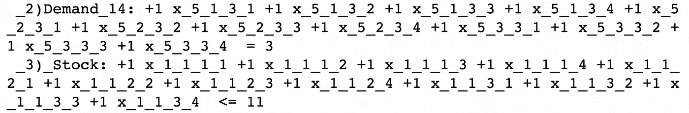*

*这是需求和库存约束的一个例子(记住 ***x*** 采用的形式是 ***x_pwsv*** )。第一个，按照要求，显示了使用任何货车从任何仓库 ***w*** 发送到商店***s = 3***v 的产品的箱数 ***p=5*** 必须等于商店3 **，**的 ***需求=3* 库存约束表明，从仓库 ***w=1*** 发送到任何商店*、使用任何货车*的产品 ***的箱数 p = 1***p = 1*w = 1*******必须低于或等于*库存=11* 仓库 1 随机生成的产品 1 的库存。这些特定约束的其余部分遵循相同的逻辑。***

**接下来，我们添加行程和货车的使用约束。对于第一个问题，我们要求每辆运货车每次运输的箱子不能超过其容量，同时还要检查从仓库***【w】***到仓库***【s】***的行程是否分配给了运货车*。第二个约束帮助我们验证是否使用了 van ***v*** 。***

```
****# Trip verification constraint**
for v in range(V_vans):
  for s in range(S_stores):
    for w in range(W_warehouses):
      solver.Add(
      solver.Sum(
      [x[p, w, s, v] for p in range(P_products)])
      <= capacities[v]*Z[w, s, v],
      name='4) TripVerification')**# Van use and trip limit constraint** for v in range(V_vans):
  solver.Add(
  solver.Sum(
  [Z[j[0], j[1],v] for j in itertools.product(
                            range(W_warehouses),
                            range(S_stores))]) <= trip_limit*T[v],
                            name='5) TripLimit')**
```

**让我们来看看这些约束的示例:**

**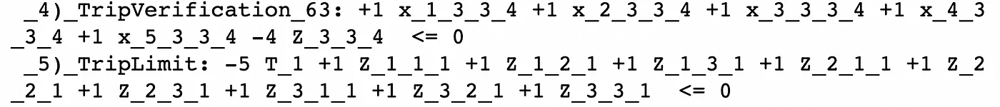**

**一方面，约束 *TripVerification_63* 检查 van ***v=4*** 是否被分配从仓库 ***w=3*** 到商店 ***s=3*** 。注意，术语 ***Z_wsv*** 乘以 4，就是面包车 ***v*** 的容量。这意味着，为了符合约束条件，运输数量的最高总和不能大于 4。同样，在任何情况下，对于所有大于 0 的量， ***Z_wsv*** 必须等于 1。这就是我们如何核实一次旅行是否被分配完成。**

**另一方面，*三极限*约束的例子意味着货车 **v=1** 的所有可能行程路径的总和( ***w_s*** )必须低于或等于 5(我们在开始时设置的行程极限)，因为我们有术语 ***-5T_1*** 。请注意，这最后一项也将告诉我们是否会使用 van **v=1** 。相同的逻辑适用于该类剩余约束中的其余货车。**

**在这之后，我们跟进最终的约束:*(6)**employee requirement*， *(7)* *JobLimit* 和*(8)conflict verification*。关于*员工要求*我们要求使用货车时，必须指派两名员工。接下来， *JobLimit* 意味着我们不能将一名员工分配到一辆以上的货车上。最后，构建 *ConflictVerification* 来验证每对 ***J*** 员工冲突是否被分配到同一辆货车。**

```
****# Number of employees per van**
for v in range(V_vans):
  solver.Add(
  solver.Sum(
  [A[v,e] for e in range(E_employees)]) == 2*T[v],
  name='6) EmployeeRequirement')**# Number of vans an employee can be assigned to** for e in range(E_employees):
  solver.Add(
  solver.Sum([A[v,e] for v in range(V_vans)]) <=1,
  name='7) JobLimit')**# Verification of the constraint compliance** for v in range(V_vans):
  for idx,j in enumerate(J_employees_conflicts):
    solver.Add(
    solver.Sum([A[v,j[0]-1]])==-A[v,j[1]-1]+H[v,idx]+2*G[v,idx],
    name='8) ConflictVerification')**
```

**前两者的一个例子是:**

**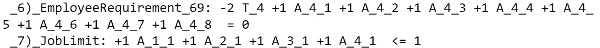**

**这两个约束都很简单。 *EmployeeRequirement_69* 告诉我们，要使用货车 **v=4** ，我们至少需要为其分配 2 名员工。 *JobLimit* 指定雇员 ***e=1*** 只能被分配到一辆货车。**

**关于最后一个约束，可能是最难理解的一个，我们有两个例子:**

**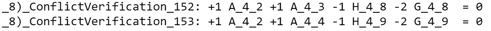**

***conflict verification _ 152*检查如果冲突的一对员工 ***j=8*** ，由员工 ***e=2*** 和 ***e=3*** 组成的 v=4 。如果这些雇员中只有 1 个被分配给它，那么 ***H_4_8*** 必须等于 1，等式才能等于 0。如果两个雇员都被分配到这辆货车，那么 ***G_4_8*** 必须等于 1，等式才能等于 0。请注意，只有第二种情况会对总成本产生影响，因为 500 美元的罚金将被激活。在 ConflictVerification_152 的情况下，我们可以直接看到，它检查的是完全相同的东西，但对于由雇员 ***e=2*** 和 ***e=4*** 组成的冲突对 ***j=9*** 。**

**既然我们已经写完了一系列约束条件，我们准备继续第 8 步，即目标函数的定义和问题的类型(最大化/最小化)。为此，我们首先创建一个列表来保存前面描述的每一项，因为目标函数就是所有项的总和。然后，在添加了所有的项之后，我们指定我们想要解决一个最小化问题( *solver)。最小化*。**

```
****# Objective Function** objective_function = []**# First term -> Transportation variable costs** for p in range(P_products):
  for w in range(W_warehouses):
    for s in range(S_stores):
      for v in range(V_vans):
        objective_function.append(costs[p][w][s][v] * x[p, w, s, v])**# Second term -> Transportation fixed costs** for v in range(V_vans):
  objective_function.append(costs_v[v]*T[v])**# Third term -> Salary payments** for v in range(V_vans):
  for e in range(E_employees):
    objective_function.append(fixed_salary*A[v,e])**# Fourth term -> Penalties for not avoiding conflicts** for v in range(V_vans):
  for j in range(len(J_employees_conflicts)):
    objective_function.append(conflict_penalty*G[v,j])**# Type of problem** solver.Minimize(solver.Sum(objective_function))**
```

**这是整个目标函数，其中所有变量都是二进制的，除了 ***x*** ，这是一个整数:**

**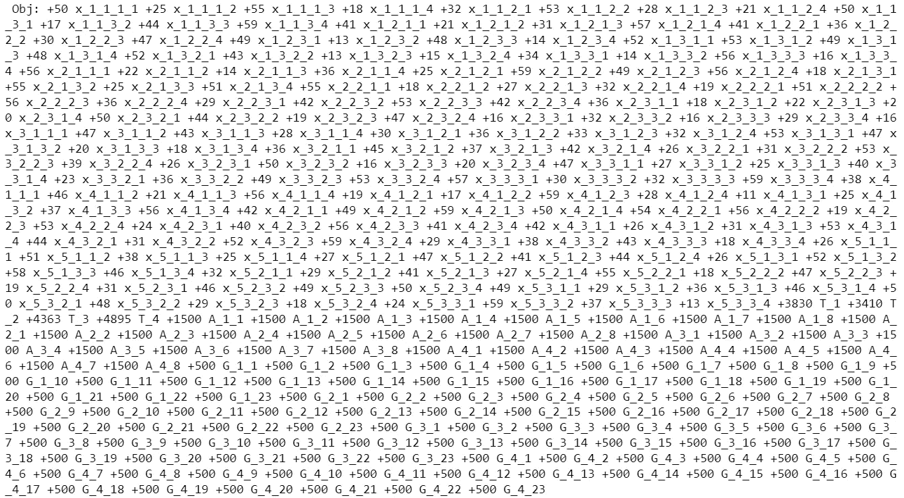**

**最后，我们使用 Solve 方法运行优化算法。**

```
**# Call the solver method to find the optimal solution
status = solver.Solve()**
```

**剩下的就是检查解决方案了。为了做到这一点，我们称之为解决方案状态，如果它是最优的( *pywraplp)。我们打印目标函数的值，如果不是这样，我们应该检查我们以前的工作，寻找问题定义中的不一致。***

```
**if status == pywraplp.Solver.OPTIMAL:
  print(
   f'\n Solution: \n Total cost = ${solver.Objective().Value()}'
   )
else:
    print(
    'A solution could not be found, check the problem specification'
    )**
```

**对于此模拟，解决方案是:**

**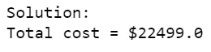**

**这意味着使用货车将产品从仓库运送到商店的最佳运输成本最终为 22，499 美元。现在我们必须决定这是否足够好。如果我们认为可以通过修改问题的定义找到更好的解决方案，我们应该考虑如何添加/删除或修改一些约束，或者如果可能的话，如何改变上下文变量。如果我们认为这是可以的，那么下一个自然的步骤将是检查模型变量的最优值，因为从计划的角度来看，能够辨别哪些是将要使用的货车，哪些是将要在这些任务中工作的雇员是非常相关的；他们中的哪些人被分配到哪辆货车；哪些是需要计划的行程以及在每个行程中运输的产品的数量和类型。**

**为了完成这篇文章，我们假设没有什么可做的了，这样我们就可以通过提取解决方案的细节来检查相关变量的最优值。**

## **4.车队和劳动力计划详细信息**

**为了开始提取有用的细节，我们遵循一个简单的程序:I)提取每个变量的最佳值；ii)预处理并将数据重新排列到表格中；iii)使用不同的过滤器查询表格。这里是我)和 ii):**

```
**result_list = []**# Extract the solution details and save them in a list of tables** for var in [x,Z,T,A,H,G]:
  variable_optimal = []
    for i in var.values():
      variable_optimal.append(i.solution_value())

      var_result=list(zip(var.values(),variable_optimal))

      df=pd.DataFrame(var_result,columns=['Name','Value'])

      result_list.append(df)**# Concatenate the tables and extract the variable names** results=pd.concat(result_list)
results['Name']=results['Name'].astype(str)
results.reset_index(drop=True,inplace=True)
results['Variable']=results['Name'].str.extract("(^(.)\d?)")[0]
results['Variable']=results['Variable'].str.upper()
results['Value']=results['Value'].map(int)**# Create a mapping of variables and indices to simplify the analysis** variable_indices={'X':'X_product_warehouse_store_van',
                  'A':'A_van_employee',
                  'T':'T_van',
                  'H':'H_van_pair',
                  'G':'G_van_pair',
                  'Z':'Z_warehouse_store_van'}results['Indices']=results['Variable'].map(variable_indices)**# Order the columns** results=results[['Variable','Indices','Name','Value']].copy()**
```

**这是主表的一个示例:**

**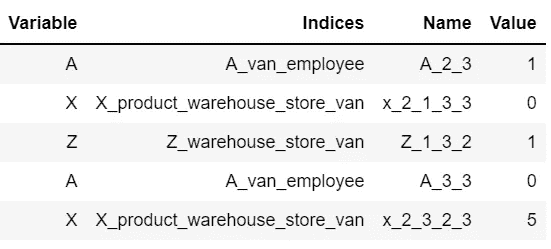**

**接下来，在创建我们的主数据框架之后，我们通过用“T”过滤列*变量*(表示车辆使用情况的二进制变量)和用 1 过滤列*值*(这意味着最优解意味着我们需要使用这些货车)来寻找我们要使用的货车:**

```
**list(results[(results[‘Variable’]==’T’)&(results[‘Value’]==0)].Name)**
```

**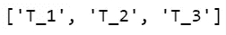**

**结果显示将使用 vans 1、2 和 3。**

**对于下一部分，我们将只搜索与 van 1 相关的变量，从回答使用该车辆进行哪些旅行开始。这里重要的是要记住，van **v=1** 对应于索引 **v=0** :**

```
**trips_van_1=[]
for w in range(W_warehouses):
  for s in range(S_stores):
    for v in range(V_vans):
      if v==0:
        trips_van_1.append(str(Z[w,s,v]))trips_df=results[(results['Variable']=='Z')&(results['Value']>0)]display(trips_df[trips_df['Name'].isin(trips_van_1)])**
```

**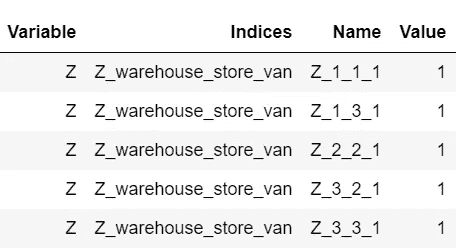**

**我们可以看到，货车 1 被分配了以下 5 次行程:**

*   **仓库 1 存放 1 和 3；**
*   **仓库 2 到商店 2；**
*   **仓库 3 存放 2 和 3；**

**接下来，我们需要找到将负责货车 1 的交付操作的员工:**

```
**employees_van_1=[]
for v in range(V_vans):
  for e in range(E_employees):
    if v==0:
     employees_van_1.append(str(A[v,e]))

employees_df=results[(results['Variable']=='A')&(results['Value']>0)]display(employees_df[employees_df['Name'].isin(employees_van_1)])**
```

**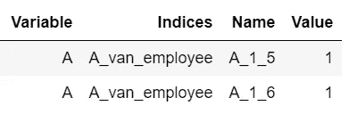**

**该表告诉我们，雇员 5 和 6 被分配到货车。现在，关于货车 1 的最后一个问题是，在每次行程中，它必须运输多少箱子和哪些产品。让我们在从仓库 2 到商店 2 的行程中这样做:**

```
**transport_df = results[(results['Variable']=='X')&(results['Value']>0)]transport_trip_2_2 = []for p in range(P_products):
  for w in range(W_warehouses):
    for s in range(S_stores):
      for v in range(V_vans):
        if w==1 and s==1 and v==0:
          transport_trip_2_2.append(str(x[p,w,s,v]))display(transport_df[transport_df['Name'].isin(transport_trip_2_2)])**
```

**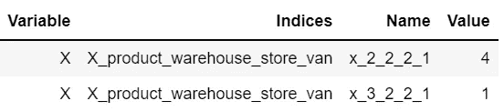**

**因此，在从仓库 2 到商店 2 的行程中，货车 1 将运输 5 个箱子(其最大容量)，4 个产品 2 和 1 个产品 3。请注意，在这些示例中，我们验证了模型的预期效果，即考虑了约束条件以获得最佳解决方案。最后，我们只需要检查冲突的两个雇员的约束条件发生了什么:**

```
**results[(results['Variable']=='G')&(results['Value']!=0)]**
```

**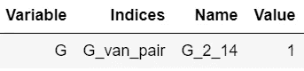**

**嗯，看起来这一对相互冲突的雇员 ***j=14*** (雇员 3 和 4)被分配到最优解中的货车 2。如果是这样，那么 A_2_3 和 A_2_4 应该等于 1，我们来查一下:**

```
**results[(results['Variable']=='A')&(results['Value']!=0)]**
```

**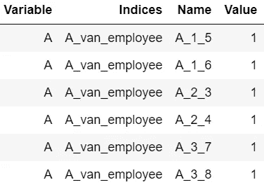**

**就这样，我们终于完成了例子。**

## **结束语**

**总而言之，我们已经看到，将现实生活中的问题写成线性方程组确实是可能的。更重要的是，我们也能够解决它们。当然，找到一个最佳解决方案严格地依赖于环境变量、目标和约束集。然而，真正复杂的设置可能会使找到最佳解决方案变得更加困难，因为需要分析更多的参数组合，这反过来需要更多的计算能力。**

**最后，尽管本文中提供的示例与车队和劳动力规划问题有关，但该框架的应用范围要广得多。严格地说，我已经用这种方法解决了与*物流*、*供应链管理*和*定价和收入管理*相关的问题，但是可能的应用更进一步，因为它也经常用于解决与*医疗保健优化*、*城市设计*、*管理科学*和*体育分析*相关的问题。**

**对于那些到达这一步的人，我希望你能够获得一些见解来构建你自己的解决方案。别担心，尽管可以说最难的部分是定义问题，但是一旦你做了，接下来的步骤就很简单了。感谢阅读！**

**别忘了喜欢和订阅更多与解决真实商业问题相关的内容🙂。**

# **参考**

**[1]线性规划:[基础与扩展(运筹学国际丛书&管理科学第 285 册)](https://www.goodreads.com/book/show/56568451-linear-programming)**