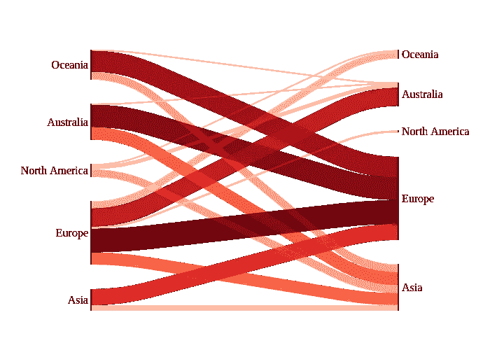
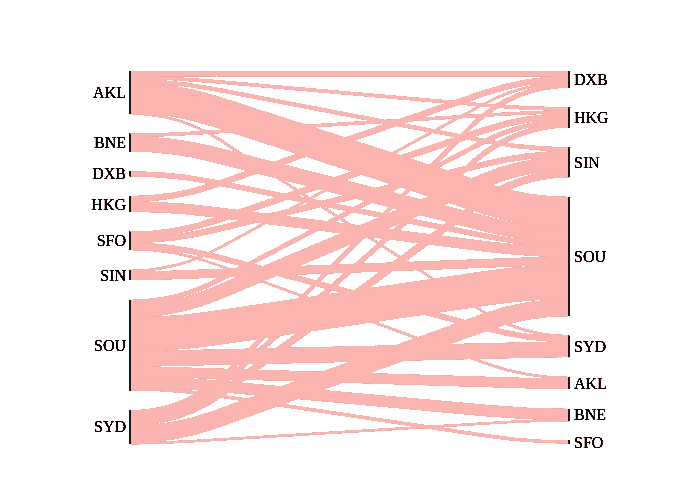
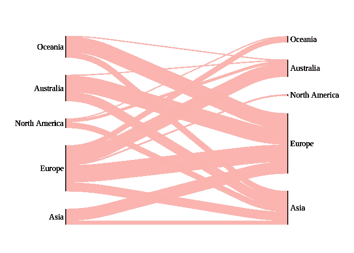
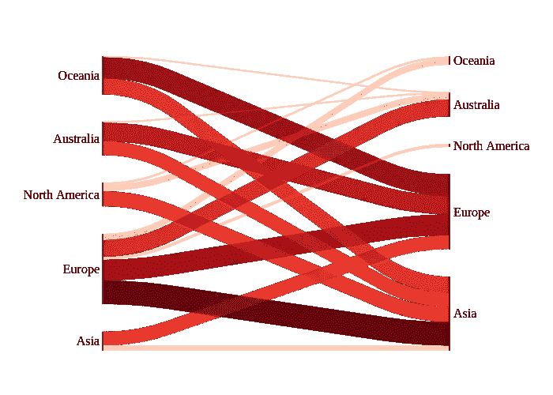
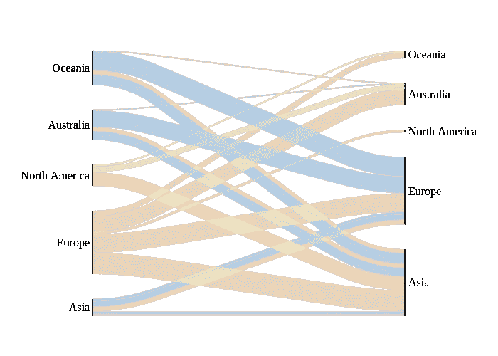
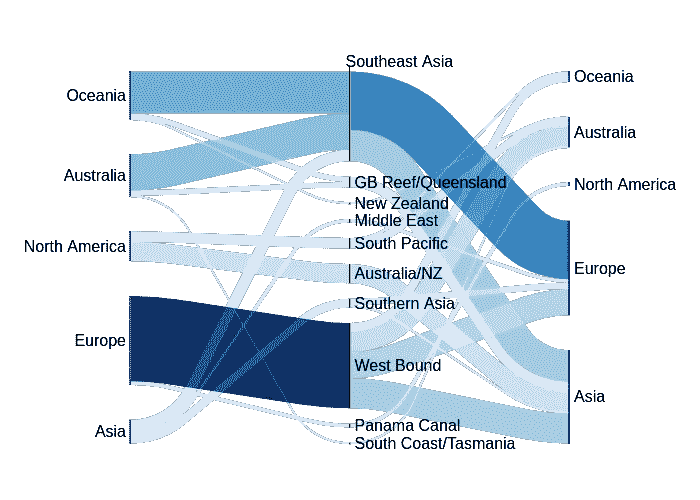

# floWeaver 将流数据转换成 Python 中的 Sankey 图

> 原文：<https://towardsdatascience.com/floweaver-turn-flow-data-into-a-sankey-diagram-in-python-d166e87dbba>

## [实践教程](https://towardsdatascience.com/tagged/hands-on-tutorials)

# floWeaver 将流数据转换成 Python 中的 Sankey 图

## 用几行代码创建和定制一个 Sankey 图

# 动机

假设您想要显示两个域(例如，公司和工作)之间的映射，或者从一个位置到另一个位置的路径。

如果可以用图表把这种关系可视化不是很好吗？



作者图片

这时桑基图就派上用场了。桑基图是描述流量的图表，其中线条的宽度与流量成比例。

流程可以是:

*   从一个地区到另一个地区的运动
*   能量从源头到目的地的运动
*   政党之间选民的流动

还有更多。

在本文中，我们将学习如何使用 floWeaver 在 Python 中创建一个 Sankey 图。

# floWeaver 是什么？

[floWeaver](https://github.com/ricklupton/floweaver) 是一个 Python 库，允许您轻松创建和定制 Sankey 图。

要安装 floWeaver，请键入:

```
pip install floweaver
```

要在你的 Jupyter 笔记本上显示桑基图，安装 [ipysankeywidget](https://github.com/ricklupton/ipysankeywidget) 。

```
pip install ipysankeywidget
jupyter nbextension enable --py --sys-prefix ipysankeywidget
```

确保 ipywidgets 已启用:

```
jupyter nbextension enable --py --sys-prefix widgetsnbextension
```

酷！现在我们已经准备好试用 floWeaver 了。

# 准备数据

让我们从从 Kaggle 加载 [Cruise_Travels](https://www.kaggle.com/ivanpv/cruise-travels) 数据集开始。

接下来，按照`EMBARK_PORT`、`DISEMBARK_PORT`、`CRUISE_REGION`对数据帧进行分组。

floWeaver 根据它们的名称将不同的列用于不同的目的。具体来说，

*   `source`指定流程开始的位置
*   `target`指定流程结束的位置
*   `type`指定流的类型
*   `value`指定流量

因此，我们将重命名一些列，以便它们符合 floWeaver 的格式。我们将使用:

*   `EMBARK_PORT`作`source`
*   `DISEMBARK_PORT`为`target`
*   `CRUISE_REGION`为`type`
*   `PRICE_PAID`为`value`

# 创建桑基图

## 开始

首先创建两个组:`embark_port`和`disembark_port`。

接下来，指定图表中每个组的顺序。列表中的第一组将放在最左侧。列表中的最后一组将放在最右侧。

为了指定哪些连接应该出现在图中，我们将使用`Bundle`:

将所有内容放在一起，创建一个桑基图:


作者图片

这看起来不是很有用，因为所有端口都被归入各自的类别。让我们使用`Partition`来分隔这些端口:



作者图片

不错！这样更好看！在上图中:

*   左边的节点代表不同的上船港口。
*   右边的节点代表不同的卸载端口。
*   这条线显示了从一个港口到另一个港口的航行路线。
*   线越粗，旅行就越贵。

## 组合不同的类别

上面的图表看起来有点乱。我们还可以将不同的类别组合成一组，使图形看起来更清晰。让我们试着根据港口所属的大洲对不同的港口进行分类。



作者图片

不错！图表现在看起来更清晰了。

## 彩色亮度

除了线条的粗细，我们还可以用颜色强度来表示一个流的值有多大。



作者图片

我们也可以使用`palette`属性来改变调色板。让我们用`Blues_9`调色板来表现海洋的颜色。


作者图片

找到所有调色板的列表[这里](https://jiffyclub.github.io/palettable/colorbrewer/sequential/)。

现在更容易看出哪些旅行最贵。似乎最昂贵的旅行是:

*   从大洋洲到欧洲
*   从澳大利亚到欧洲
*   从欧洲到欧洲
*   从欧洲到亚洲

## 区分不同的流动类型

列`type`代表巡航区域。为了根据线的类型给线着色，我们将使用`SankeyDefinition`中的`flow_partition`属性。



作者图片

## 对相同类型的线进行分组

为了对相同类型的线进行分组，我们将在图的中间添加节点。这些节点被称为路点。



作者图片

有意思！从图中可以看出，大多数穿越西部和东南亚的旅行似乎比穿越其他地区的旅行更贵。

# 结论

恭喜你！您刚刚学习了如何使用 Python 从流数据集创建桑基图。我希望这篇文章能给你提供使用 Sankey 图分析你自己的流量数据所需的知识。

随意发挥，并在这里叉这篇文章的源代码:

[](https://github.com/khuyentran1401/Data-science/blob/master/visualization/floweaver_example/travel.ipynb)  

我喜欢写一些基本的数据科学概念，并尝试不同的数据科学工具。你可以在 LinkedIn 和 T2 Twitter 上与我联系。

星[这个回购](https://github.com/khuyentran1401/Data-science)如果你想检查我写的所有文章的代码。在 Medium 上关注我，了解我的最新数据科学文章，例如:

[](/pyvis-visualize-interactive-network-graphs-in-python-77e059791f01)  [](/introduction-to-yellowbrick-a-python-library-to-explain-the-prediction-of-your-machine-learning-d63ecee10ecc)  [](/observe-the-friend-paradox-in-facebook-data-using-python-314c23fd49e4)  [](https://python.plainenglish.io/find-the-top-bootcamps-for-data-professionals-from-over-5k-profiles-92c38b10ddb4)  

# 参考

[伊万·佩雷斯](https://www.kaggle.com/ivanpv)。2020–02–16.游轮旅行。
CC0:公共领域。从[https://www.kaggle.com/ivanpv/cruise-travel](https://www.kaggle.com/ivanpv/cruise-travels/metadata)s 取回 2021–01–12