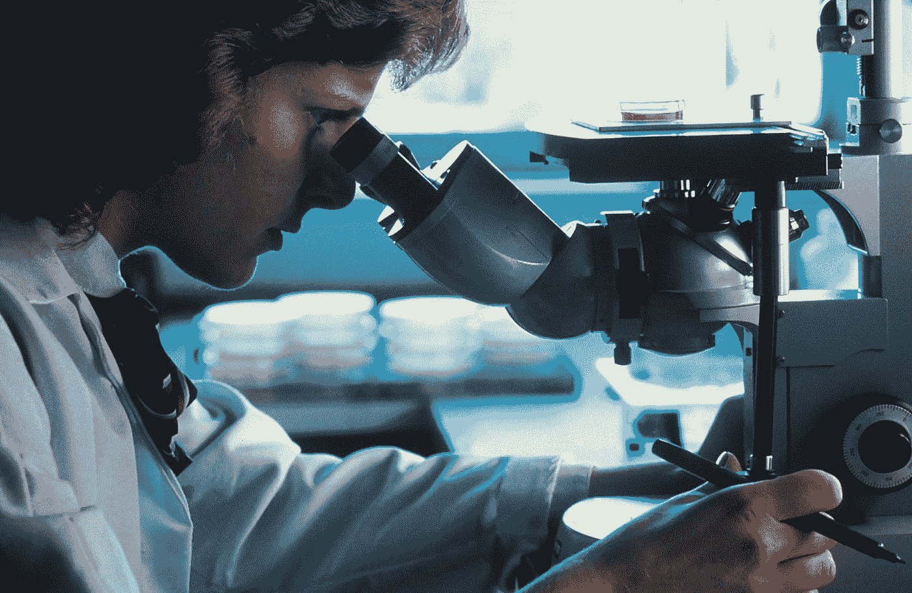
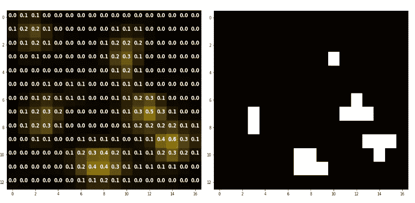

# 荧光神经元细胞数据集—第一部分

> 原文：<https://towardsdatascience.com/fluorescent-neuronal-cells-dataset-part-i-ac123196b963>

## 一种新的目标分割、检测和计数基准

[国家癌症研究所](https://unsplash.com/@nci?utm_source=medium&utm_medium=referral)在 [Unsplash](https://unsplash.com?utm_source=medium&utm_medium=referral) 上拍摄的照片

在过去十年中，计算机视觉成功的关键因素之一是大量标记数据的可用性。

事实上，收集智能手机、网络摄像头和其他现代设备图像的可能性产生了前所未有的大量数据，描述了广泛的日常生活环境。随着可用性的提高，对所描绘场景的熟悉程度使得求助于未经培训的操作员来注释图像成为可能，因此需要相对较低的成本。反过来，这允许研究人员和从业人员通过利用*监督学习*技术来解决几个学习任务，如*人脸识别*、*关键点检测*、*自动驾驶*等。

不幸的是，这并不适用于更多的利基应用，在这些应用中，数据更少，标记需要一些专业知识。例如，考虑像生物学或生命科学这样的领域，由于缺乏适当规模的精选数据，这些领域的技术水平仍然落后于更主流的应用。

在本系列的第一篇文章中，我们将呈现 [**荧光神经元细胞数据集**](http://amsacta.unibo.it/6706/) :收集了小鼠脑切片**的 **283 张高分辨率图片** (1600x1200 像素)和相应的地面真相蒙版**。

**图一。**数据集-图片由作者提供

# 数据

荧光神经元细胞数据集([莫雷利等人，2021)](https://www.nature.com/articles/s41598-021-01929-5) 是 283 张高分辨率(1600x1200 像素)小鼠脑切片图片的集合，可在此免费下载[。](http://amsacta.unibo.it/6706/)

这些图像是通过成像技术*荧光显微镜*获得的，以研究啮齿动物麻木的机制( [Hitrec 等人，2019](https://www.nature.com/articles/s41598-019-51841-2) )。在实践中，在小鼠接受受控的实验条件后，一种标记被注射到它们的大脑中，以“突出”一些感兴趣的神经元细胞。因此，这些结构在合成的、通常较暗的背景上表现为亮度和饱和度不同的黄色斑点(图 1，顶行)。

虽然图片的数量有限，特别是与计算机视觉应用中通常涉及的大规模数据集相比，但它们的高分辨率允许将它们分成更小的块。通过这种方式，再加上典型的增强管道，数据总量可以增加数百倍，从而保证有足够的信息可供学习。

## 真相面具

除了图像，数据还包含用于**语义分割**的相应地面实况注释，即二进制掩码，其中如果每个像素属于一个细胞，则标记为 255(白色)，否则标记为 0(黑色)(见图 1，底部一行)。

为了减轻标记的工作量，开发了半自动程序，包括自适应阈值和领域专家的手动分割。

特别是，大多数图像(252 张图片)首先通过**自适应阈值**自动注释。这意味着根据每个图像的像素强度分布来选择亮度截止值，所有高于该阈值的像素都被视为细胞。

**图二。**自适应阈值处理—图片作者

然后，这些草稿被手动修改以排除假阳性和/或增加假阴性。

相反，剩下的 31 幅图像是由领域专家手工分割的。后一组中包括了特别相关的例子，目的是为最具挑战性的观察收集高度准确的注释。

# **学习任务**

荧光神经元细胞数据集可用于研究不同的学习任务。

有了二进制基础事实掩码，更自然的方法是在**语义分段**设置中按原样利用标签。或者，通过在分割对象周围绘制边界框，可以很容易地将其扩展用于**对象检测**。此外，可以通过仅考虑每个图像中的细胞总数来关注**对象计数**，从而将数据作为*回归*问题进行分析。

在第一篇文章中，我们介绍了荧光神经元细胞数据集:一组精选的荧光显微镜图像和相对真实的遮罩。

我们介绍了它的起源、数据格式，并简要提到了一些可以用这些数据来研究的学习问题。

在下一篇文章中，我们将更详细地研究这些数据，强调与这些数据相关的一些特殊特征和挑战。

> 如果你喜欢这个话题，你可以在[ [1](http://amsdottorato.unibo.it/10016/1/thesis_CLISSA_DSC.pdf) 、 [2](https://rdcu.be/cB1Ds) 中阅读更详细的讨论。另外，你可以继续下载[数据集](http://amsacta.unibo.it/6706/)，用原始论文的[代码](https://github.com/robomorelli/cell_counting_yellow)做实验，用**数据**玩自己。
> ***让我知道你在评论里发现了什么！***

# 参考

[1] L. Clissa，[通过机器和深度学习支持科学研究:荧光显微镜和操作智能用例](http://amsdottorato.unibo.it/10016/) (2022)， *AlmaDL* [2] R .莫雷利等人，[通过 c-ResUnet 的深度学习实现荧光显微镜中的细胞计数自动化](https://rdcu.be/cB1Ds) (2021)，*科学报告*