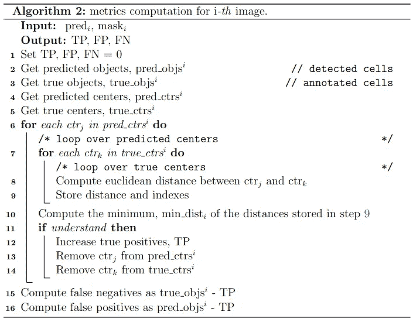
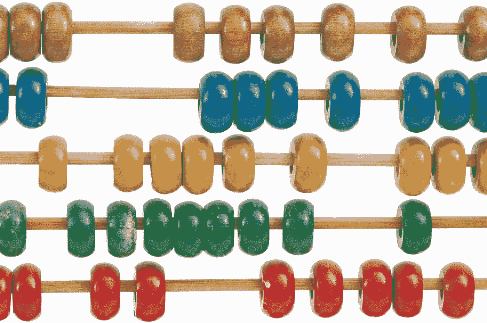

# 荧光神经元细胞数据集—第三部分

> 原文：<https://towardsdatascience.com/fluorescent-neuronal-cells-dataset-part-iii-287c2a4f1a22>

## 评估的基准指标

[斯科特·格雷厄姆](https://unsplash.com/@homajob?utm_source=medium&utm_medium=referral)在 [Unsplash](https://unsplash.com?utm_source=medium&utm_medium=referral) 上拍照

在本系列的第三篇也是最后一篇文章中，我们检查了一个特定于任务的指标列表，它非常适合对 [*荧光神经元细胞* ( *FNC* )](http://amsacta.unibo.it/6706/) 数据的分析。

如果您错过了第一部分，请查看更多关于 ***i)*** 数据是如何收集的以及它们代表了什么的详细信息:

  

与***ii)***FNC 数据相关的具体挑战:

  

模型评估和性能评估是数据分析管道中的关键步骤。当然，有各种方法可用于此目的。

鉴于这种多样性，需要记住的关键方面是**每种策略都强调模型的不同功能**。因此，性能可能会因参考指标的不同而有很大差异。

> 由于这个原因，我们必须明智地选择评估计划，以反映我们模型的最终用途。

在下文中，我们将讨论一些适用于 FNC 数据的指标。具体来说，我们根据学习任务考虑 3 种场景:*语义分割、对象检测*和*对象计数。*

# 细分指标

[扎克里·纳尔逊](https://unsplash.com/@zacharytnelson?utm_source=medium&utm_medium=referral)在 [Unsplash](https://unsplash.com?utm_source=medium&utm_medium=referral) 上的原始照片。作者添加的注释。

对于语义分割，我们可以采用标准的度量，例如 [**骰子系数**](https://en.wikipedia.org/wiki/S%C3%B8rensen%E2%80%93Dice_coefficient) 或 [**平均交集超过并集**](https://en.wikipedia.org/wiki/Jaccard_index) **。**

然而，它们可能被对边界单元的主观识别和注释中潜在的不准确性所破坏。因此，我们在解释这些指标时需要考虑到这一点。

噪声的主要来源来自注释过程。事实上，地面实况标签是用半自动方法产生的，包括自适应阈值和手动注释。前者生成具有锯齿状单元轮廓的遮罩，而后者呈现具有更平滑边界的对象。

因此，即使大部分细胞被正确识别，我们也可能在边界分割中观察到微小的重复错误。

因此，单一指标值不足以进行真实的评估。相反，一个彻底的评估需要一个更大的画面，并且必须适合分析的最终目标。

在实践中，当目标是精确细分时，建议追求更高的性能。相反，当最终的兴趣更多地在于识别对象时，我们可以放宽要求。

# 检测指标

阿诺·塞纳尔在 [Unsplash](https://unsplash.com?utm_source=medium&utm_medium=referral) 拍摄的照片

关于对象检测度量，可以采用常用的指标，如 [**F1 得分、精度和召回率**](https://en.wikipedia.org/wiki/Precision_and_recall) 。确定的关键要素是*真阳性、真阴性和假阳性的定义。*事实上，这必须根据我们数据的具体特征来定制*。*

在 FNC 的例子中，设计了一个专用算法。这使得预测对象和目标对象之间的关联具有合理的灵活性。

具体来说，将每个预测对象与相应基本事实标签中的所有像元进行比较，并与最接近的像元进行唯一链接。如果它们的质心距离小于平均像元直径(50 像素)，则预测的元素被视为匹配。因此，它增加了真正的正计数(TP)。

在这个过程的最后，所有没有匹配的真实对象都被认为是假阴性(FN)。同样，剩余的检测到的不与任何目标相关联的项目被认为是假阳性(FP)。

[作者图片](http://amsdottorato.unibo.it/10016/1/thesis_CLISSA_DSC.pdf)

对于检测指标，我们不会遇到之前描述的分割指标的相同缺陷。

尽管如此，边界细胞的存在使得我们的评估容易受到一些注释的主观性的影响。在这种情况下，目标和预测对象之间的不一致通常在操作员主观解释的范围内。

然而，这种一致性并没有被度量所捕捉。因此，我们观察到较低的性能，尽管结果与人类的判断完全一致。

总之，我们可以综合考虑所有指标，以全面了解我们模型的优势和劣势。

# 计数指标

克里斯·贾维斯在 [Unsplash](https://unsplash.com?utm_source=medium&utm_medium=referral) 上的照片

有几种评估模型计数能力的方法，各有利弊。建议的策略是综合利用不同的指标*从多个互补的角度评价结果*。

一种方法是简单地考虑基本事实掩膜中的像元数与预测像元数之间的差异。例如，我们可以考虑**绝对误差**来了解目标计数和预测计数之间的实际距离。

然而，根据目标单元的总数，给定的余量表示或多或少的严重误差。为此，我们可以添加**百分比误差**作为额外的评估要素。此外，这提供了我们是否高估/低估计数的信息。

虽然上述数量是直观的，但当计数分布的可变性较低时，它们可能会隐藏较差的性能。因此，我们可以通过查看 **R 决定系数**来补充评估。这可以理解为模型解释的方差部分。因此，它给出了我们的模型如何很好地捕捉现象的可变性的感觉。

总之，建议将这三个指标结合起来看，以更全面地了解我们模型的优势和劣势。

在本文中，我们检查了几个基准，用于评估使用*荧光神经元细胞*数据集训练的模型。

当然，最终的选择还是要看你分析的具体要求。此外，请记住，由于数据的自然干扰，纯指标值会受到限制。

> **现在我真的很想知道你的拍摄！**
> 
> 你认为这个列表是详尽的吗？你能想到更好的或互补的度量标准吗？
> 
> **在评论里告诉我吧！**

> *如果你喜欢这个题目，你可以在[* [*1*](http://amsdottorato.unibo.it/10016/1/thesis_CLISSA_DSC.pdf) *、* [*2*](https://rdcu.be/cB1Ds) *]中阅读更详细的讨论。此外，您还可以下载* [*数据集*](http://amsacta.unibo.it/6706/) *，用原论文的* [*代码*](https://github.com/robomorelli/cell_counting_yellow) *和* ***数据*** *进行实验。*

# 参考

[1] L. Clissa，[通过机器和深度学习支持科学研究:荧光显微镜和操作智能用例](http://amsdottorato.unibo.it/10016/) (2022)， *AlmaDL* [2] R .莫雷利等人，[通过 c-ResUnet](https://rdcu.be/cB1Ds) (2021)，*科学报告*