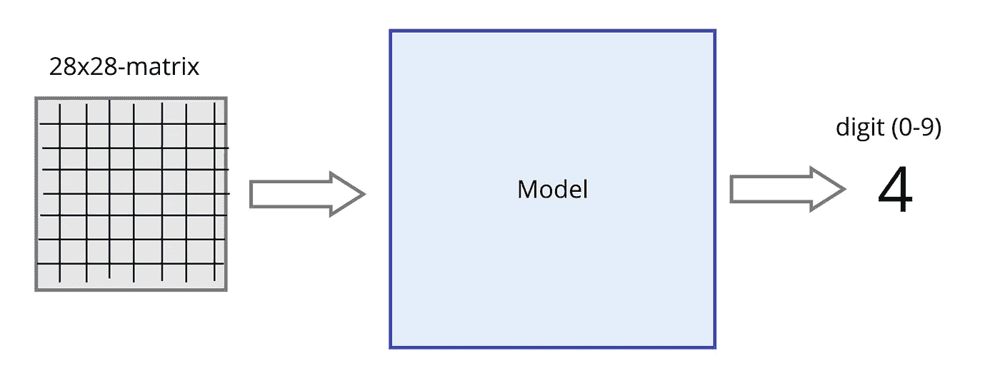
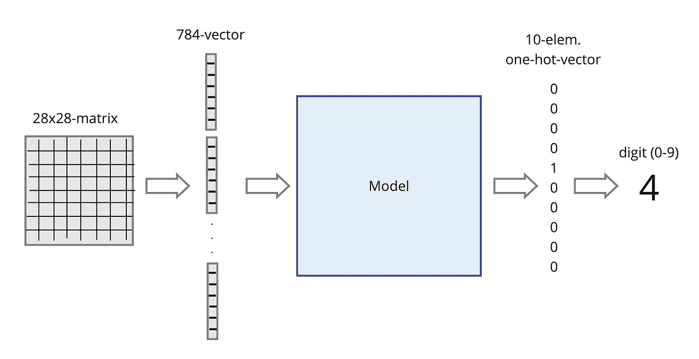
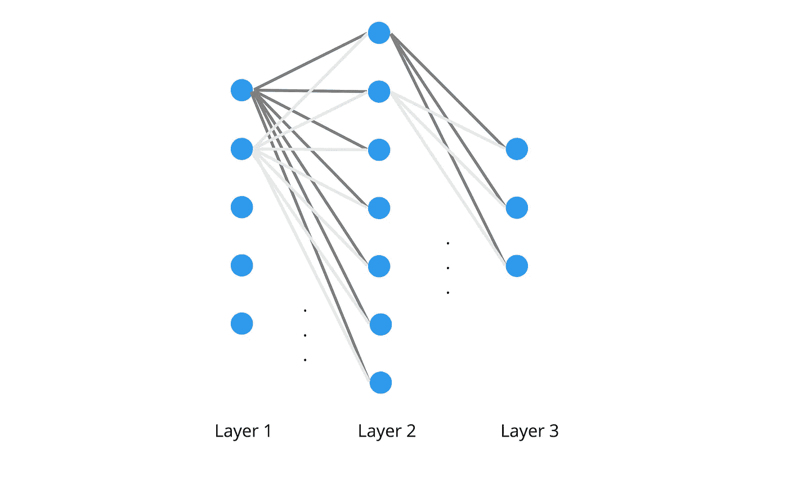

# MNIST——主题变奏曲

> 原文：<https://towardsdatascience.com/flux-jl-on-mnist-variations-of-a-theme-c3cd7a949f8c>


詹姆斯·奥尔在 [Unsplash](https://unsplash.com/?utm_source=unsplash&utm_medium=referral&utm_content=creditCopyText) 上拍照

## Flux.jl 是一个 ML-stack，提供轻量级组件来创建模型并训练它们。使用 MNIST 数据集，我们将看到通过将这些组件组合在一起，构建不同的数据集分类方法是多么容易。

# 概观

## Flux.jl

[Flux.jl](https://fluxml.ai/) 是一个 100%用 Julia 写的包。它旨在建立模型，这些模型通常使用基于自动微分的迭代方法进行训练。这类模型中最常见的可能是神经网络(NN ),它使用梯度下降算法(GD)的一种变体来训练。

与其他一些包含现成的“机器”来构建和训练模型的 ML 库相比，Flux 提供了一套轻量级的乐高积木，您可以根据自己的特定需求将它们组装在一起。

在本文中，我将展示这种类似 lego 的方法如何应用于构建几个 NN 模型(准确地说是 [*多层感知器*](https://en.wikipedia.org/wiki/Multilayer_perceptron) )来对图像进行分类，并实现 GD 算法的不同变体来训练它们。

## MNIST 数据集

为此，我们将使用众所周知的 [MNIST 数据集](http://yann.lecun.com/exdb/mnist/)，它由 70，000 张手写(和标记)数字图像组成。这些图像中的 60.000 个用作训练数据，剩余的 10.000 个实例将用于测试模型。每个图像由 28×28 灰度像素组成。

使用`MLDatasets`包可以轻松加载整个数据集:

第一个表达式(第 3 行)自动获取带有相应标签的 60.000 个训练图像，第 4 行的变体使用`split = :test`获取其余的用于测试。所以`train_x_raw`是一个 28x28x60000 元素的数组，`test_x_raw`经过这次运算后是一个 28x28x10000 元素的数组。标签存储在`train_y_raw`和`test_y_raw`中，它们分别是大小为 60.000 和 10.000 的数组，包含 0 到 9 之间的整数。

函数`convert2image`允许我们显示这样的图像。我们通过调用`convert2image(MNIST, train_x_raw[:,:,10])`得到例如第 10 个训练图像:


手写数字 4 的灰度图像[图片由作者提供]

相应的标签(4)在`train_y_raw[10]`。

这张图片(在`train_x_raw[:,:,10]`中)的数据只是一个 28x28 元素的矩阵，包含 0 到 1 之间的数字，每个数字代表一个灰色阴影。

# 模型

如上所述，我们的目标是创建能够对这些图像进行分类的不同模型。也就是说，我们的模型的输入将是一个手写数字的图像(以 28x28 矩阵的形式)，输出是一个 0 到 9 之间的数字，告诉我们图像包含哪个数字。



基本处理流程[图片由作者提供]

## 数据

不幸的是，神经网络既不直接处理矩阵，也不以我们想要的方式输出数字。所以我们必须对我们的数据做一些调整。

神经网络的**输入**必须是包含所有值的(列)向量。因此，我们必须转换我们的 28x28 矩阵，并将每张图片的 28 列堆叠在一起。结果是一个 784 元素的向量(28 x 28 = 784)。通量函数`flatten()`就是这样做的:

```
train_x = Flux.flatten(train_x_raw)
test_x  = Flux.flatten(test_x_raw)
```

这分别产生一个 784x60000 和一个 784x10000 元素的数组。

用于这种分类问题的 NN 的**输出**通常是所谓的独热向量。这是一个位向量(在我们的例子中有 10 个元素，因为我们有 10 个不同的类),其中正好有一位是 1，所有剩余的位都是 0。值为 1 的元素表示相应的类别，即如果第一位为 1，则表示“数字 0”，如果第四位为 1，则表示“数字 3”，依此类推。

通量函数`onehotbatch()`对整个标签阵列进行这种转换:

```
train_y = Flux.onehotbatch(train_y_raw, 0:9)
test_y  = Flux.onehotbatch(test_y_raw, 0:9)
```

自变量`0:9`告知必须由结果独热向量表示的数字的(可能)范围。这些语句的结果分别是 10x60000 和 10x10000 位数组。

因此，我们为图像预测调整的处理管道看起来像这样:



改编的处理流程[图片由作者提供]

*注意*:在现实世界的应用中，神经网络很少会产生“真正的”单热点向量。相反，将产生包含概率的向量，并且如果 NN 工作良好，这些值中的一个将接近 1，而所有其他值将接近 0。

## 多层感知器网络

我们想要使用的模型是所谓的*多层感知器网络* (MLP)。这些是“经典”神经网络，由几层神经元组成，其中一层的*每个*神经元连接到下一层的*所有*神经元(也称为*全连接*或*密集*网络):



一个三层感知器[图片由作者提供]

不同的 MLP 在

*   层数，
*   每层中神经元的数量
*   所谓的激活函数，其在传递到下一层之前应用于神经元的结果；这种激活功能可能因层而异。

## MNIST 分类模型

在我们的例子中，第一层中输入值的数量已经由输入数据固定(到 784)，最后一层必须有 10 个神经元(产生 10 个输出值)，因为我们有 10 个类。但是我们可以自由选择模型的其他特征。

为了简单起见，我选择了三个可以在互联网上其他地方找到的模型:一个来自格兰特·桑德森在他的 YouTube 频道“3Blue1Brown”上关于神经网络的精彩视频(“T10”在这里你可以找到第一个及其精彩的可视化)，第二个(改编自)来自我们主题的这个[深度处理](http://neuralnetworksanddeeplearning.com/chap1.html)，第三个来自 [Flux 文档](https://fluxml.ai/tutorials/2021/01/26/mlp.html)。

具体来说，我们有以下型号(我根据它们的主要特征命名)

*   **4LS** :一个 **4 层**模型，使用 16 个内层节点和**s 形**激活函数
*   **3LS** :一个**三层**模型，使用 60 个内层节点和 **sigmoid** 激活函数
*   **2LR** :使用内层 32 个节点和 **relu** 激活功能的 **2 层**模型

*旁注*:为了更接近 Flux 中的以下模型定义，我没有将输入和输出作为一个单独的层(在别处是这样做的)。

使用通量的方法，我们可以将这三个模型定义如下(在注释中，您可以看到每个模型的参数数量):

第三种模式(`model2LR`)仅在第一层使用`relu`-激活功能。在第二层上，没有指定这样的功能。这意味着使用默认流量(身份)。因此，该层可能会产生[-∞，∞]范围内的值，这不是我们想要的。因此，`softmax`-函数应用于结果，将它们标准化到从 0 到 1 的范围，并确保它们的总和为 1。

使用`sigmoid`-功能激活的前两个型号是相当“传统”的 NNs，而现在`sigmoid`已经大部分被`relu`取代。

# 梯度下降训练

训练这样的模型意味着找到最佳的参数值，以便该模型能够以高精度进行预测。

## 价值函数

为了测量一组特定的参数相对于这个目标的表现有多好，我们需要一个所谓的成本函数。该成本函数 *C* 将利用特定参数集做出的*预测* *ŷ* 与训练数据中的*实际类别 y* 进行比较，并在此基础上计算该“距离”(= *C(ŷ，y)* 的指标。即成本函数的结果越小，选择的参数越好。所以我们的目标是找到一组使成本函数最小的参数。

在这种情况下使用的典型成本函数是:

*   [均方误差](https://en.wikipedia.org/wiki/Mean_squared_error) ( *均方误差*
*   [交叉熵](https://en.wikipedia.org/wiki/Cross_entropy) ( *ce* )

*mse* 通常与具有`sigmoid`激活功能的型号一起使用，而 *ce* 通常与`relu`激活功能一起使用。这些配对背后的基本原理是，在这些星座中，可以保证成本函数是[凸的](https://en.wikipedia.org/wiki/Convex_function)，即它恰好有*个最小值*。因此，用于寻找(全局)最小值的算法将不会被可能的其他(局部)最小值分散注意力。

话虽如此，我不会隐瞒“*损失函数中局部最小值的存在在实践中似乎不是一个主要问题*”(这是“*某种程度上的理论谜团*”)，正如 LeCun 等人在他们关于“ [*基于梯度的学习应用于文档识别*](http://yann.lecun.com/exdb/publis/pdf/lecun-98.pdf) ”的论文中所写的那样。IEEE 的，1998 年 11 月)。因此，也使用其他配对。

## 梯度下降

用于训练模型的[梯度下降算法](https://en.wikipedia.org/wiki/Gradient_descent)的基本思想(即，为最小化成本函数 *C* 的模型找到一组参数)如下:

1.  从任意选择的一组参数开始 *W₀*
2.  在位置*w₀*(∇*c*(*w₀*):
    *w₁*=*w₀*–α∇*c*(*w₀)向 *C* 的[梯度](https://en.wikipedia.org/wiki/Gradient)的反方向移动一小步(α)，计算出一组新的“改良”参数 *W₁**

由于位置 *W₀* 处的 *C* (矢量)的梯度指向 *C* 最陡的方向，我们必须向相反方向移动以达到最小值(因此公式中为负)。

重复第 2 步，直到 *C* 向最小值收敛(或者直到我们有一组参数 *Wi* 为我们想要的应用提供足够的精度):


梯度下降算法的迭代步骤

步长α称为*学习率。*启发式选择。如果太大，算法可能会“超调”。如果太小，算法收敛非常慢。在实践中，用 0.1、0.01 和 0.001 这样的值进行实验并根据结果进行调整是一个好主意。

## Flux.jl 中的实现

那么，如何使用 Flux.jl 在 Julia 中实现这些概念呢？模型(`model4LS`、`model3LS`和`model2LR`)已经定义，训练数据已经可以使用(在`train_x`和`train_y`)。

剩下的是成本函数的定义(Flux 称之为*损失函数*)和梯度下降算法的实现。Flux 中每个 GD 实现的核心是`Flux.train!()`函数。它在 GD 的每次迭代中被调用，并计算模型参数的(稍微)改进版本(如上所述)。必须将以下参数传递给`train!()`:

*   *成本函数* `loss`
*   *模型参数* `params` ( *Wi* 来自最后一次迭代步骤或第一次运行时的初始参数)
*   *训练数据* `data`(在`train_x`和`train_y`中)
*   一个所谓的*优化器*`opt`；这是用于产生模型参数的新(改进)版本的公式，如上所示(梯度下降算法的*迭代步骤)。上面的公式是最基本的变体。近年来，已经开发出了更复杂的变体。与基本变体的主要区别在于，它们在每个迭代步骤上动态地调整学习速率α。
    除了我们在`Descent(α)`中得到的基本变体，我们将应用一个最先进的版本: [ADAM](https://en.wikipedia.org/wiki/Stochastic_gradient_descent#Adam) (=自适应矩估计)，它在`ADAM(α)`中可用。*

我们可以使用`Flux.params()`功能访问每个模型的参数:

```
params4LS = Flux.params(model4LS)
params3LS = Flux.params(model3LS)
params2LR = Flux.params(model2LR)
```

成本函数 *mse* 和 *ce* 也在 Flux 中预定义(如`Flux.Losses.mse()`和`Flux.Losses.crossentropy()`)。由于`train!()`期望一个可以直接传递训练数据(`train_x`和`train_y`)的成本函数，而两个预定义的损失函数期望基于`train_x`的模型预测作为它们的第一个参数，我们必须定义一些“转换”:

```
loss4LSmse(x,y) = Flux.Losses.mse(model4LS(x),y)
loss4LSce(x,y)  = Flux.Losses.crossentropy(model4LS(x),y)
loss3LSmse(x,y) = Flux.Losses.mse(model3LS(x),y)
loss3LSce(x,y)  = Flux.Losses.crossentropy(model3LS(x),y)
loss2LRce(x,y)  = Flux.Losses.crossentropy(model2LR(x),y)
```

由于 *mse* 成本函数不能很好地与使用`relu`的神经网络一起工作，我们只为 2LR 模型定义了基于 *ce* 的损失函数。

现在，我们可以通过调用这些函数来查看模型的初始(随机)参数损失有多大。例如，`loss4LSmse(x_train, y_train)`在我的环境中提供 0.2304102 的值。但是由于初始参数是随机选择的，如果你在电脑上尝试，你会得到另一个值。因此，这个值只是用于(相对)比较，以便查看在 GC 的一些迭代之后它会发生多大的变化。

# 实现梯度下降的变体

## 批量梯度下降

然后我们准备使用 Julia 和 Flux.jl 实现 GD 的第一个版本:

我们梯度下降的第一个版本`train_batch()`将训练数据`X`和`y`、损失函数`loss`、优化器`opt`、模型参数`params`和我们想要训练的迭代次数`epochs`作为参数。GD 的这个实现本质上是在每次迭代中调用`train!()`的 for 循环。

由于`train!()`期望训练数据被包装在数组的元组中，我们在第 2 行准备了这个结构。就是这样！

例如，为了使用 *mse* 成本函数和标准 GD 公式训练我们的 4LS 模型，在 100 次迭代中学习率为 0.1，我们必须写出:

```
train_batch(train_x, train_y, loss4LSmse, 
            Descent(0.1), params4LS, 100)
```

执行此语句后，我们应该看到损失值有所改善。在我的环境中，我通过调用`loss4LSmse(x_train, y_train)`得到一个值 0.12874180。所以我们可以在这 100 次迭代中减少一半的损失。

GD 的这种变体被称为*批次*梯度下降，因为在每次迭代中，损失函数的梯度在*完整的*训练数据集上进行评估。即所有 60.000 幅图像都用于计算该值(在每次迭代中！).

显然，这在计算上相当昂贵！因此，开发了 GD 的其他变体。

## 随机梯度下降

*随机*梯度下降算法在每次迭代中仅使用训练数据的单个(随机选择的)实例(即一个单个图像)来评估损失函数的梯度。这显然成本更低。

考虑到仅仅*一个*实例(而不是 60.000)当然不会产生损失函数的实际梯度。即合成向量不会指向该函数最陡的方向。但实际上，产生的矢量并没有那么差。

使用这种方法，我们不会得到到达最小值的最直接的路径，而是到达(或接近)那个点的曲折路径。即使我们没有直接达到最小值，结果通常也足够接近，并且我们以相当低的成本达到最小值。所以这通常是首选的变体。

实现如下所示:

## 小批量梯度下降

GD 的第三个变体是我们看到的前两个变体之间的一个很好的妥协。它既不作用于整个数据集，也不作用于每次迭代的单个实例，而是选择例如 100 个实例的随机样本，并在此基础上计算梯度。这个样品被称为*小批量*。

这个小批量的大小可以自由选择。因此，为此我们需要一个额外的参数`batchsize`:

我们在这里实现了一个简单的策略来提取小批量:在第 4 行中选择整个数据集内的一个随机位置，然后我们从该位置(第 5+6 行)开始提取一个大小为`batchsize`的小批量。

更高级的策略是随机选择小批量的所有实例。这可以通过使用焊剂`[DataLoader](https://fluxml.ai/Flux.jl/stable/data/mlutils/#DataLoader)`来实现。

GD 的第三个变体当然是最通用的实现，我们可以用`train_minibatch()`来表示前两个变体，如下所示(因此我们实际上只需要小批量 GD 的实现):

```
train_batch(X, y, loss, opt, params, epochs) = 
        train_minibatch(X, y, loss, opt, params, epochs, size(X)[2])train_stochastic(X, y, loss, opt, params, epochs) = 
        train_minibatch(X, y, loss, opt, params, epochs, 1)
```

# 结论

我们已经看到 Flux.jl 如何用于预处理数据和定义模型。此外，使用构建模块，如

*   损失函数
*   优化者
*   `train!()`-功能

我们可以很容易地实现 GD 算法的不同变体。

在后续文章中，我将结合不同的损失函数、优化器和其他参数来评估这里提出的模型，以了解需要花费多少努力来训练它们，以及从 MNIST 数据集中识别手写数字可以达到什么精度。所以，敬请期待！