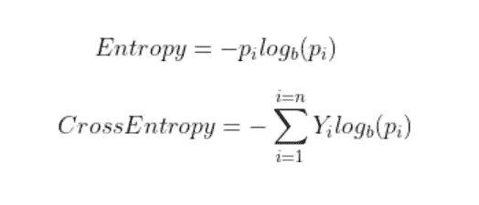
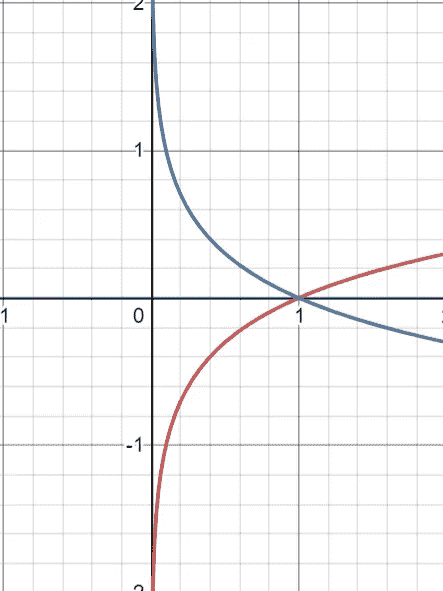
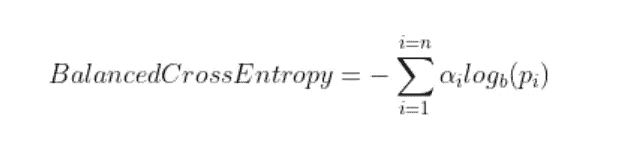
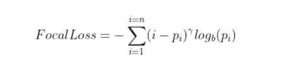
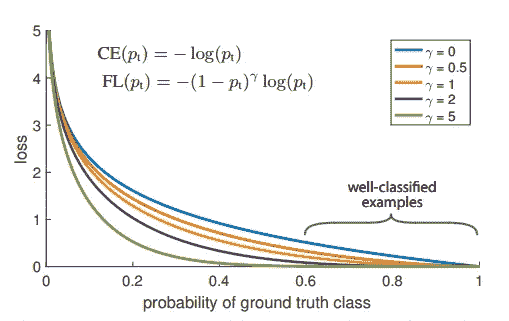

# 焦点损失:交叉熵的更好选择

> 原文：<https://towardsdatascience.com/focal-loss-a-better-alternative-for-cross-entropy-1d073d92d075>

## 据说焦点损失在许多情况下比交叉熵损失表现得更好。但是为什么交叉熵损失会失败，焦点损失如何解决这些问题，让我们在这篇文章中找到答案

梯度下降，由 [Unsplash](https://unsplash.com?utm_source=medium&utm_medium=referral) 上的 [Rostyslav Savchyn](https://unsplash.com/@ross_savchyn?utm_source=medium&utm_medium=referral) 拍摄

**损失函数**是计算预测值与实际值偏离程度的数学方程。较高的损失值表明模型存在重大误差，而较低的损失值表明预测相当准确。目标是尽可能减少损失函数。模型使用损失函数来学习可训练的参数，例如权重和偏差。因为参数的权重更新方程具有损失函数相对于权重或偏差的一阶导数，所以该函数的行为将对梯度下降过程产生显著影响。

权重更新公式，图片来源:作者

现在有很多损失函数可用。他们每个人都有不同的数学公式和不同的惩罚模型错误的方法。每种方法都有优点和缺点，在决定使用哪种功能之前，我们必须权衡利弊。

现在我们已经定义了损失函数，让我们来看一下分类交叉熵损失引起的问题以及焦点损失如何解决它们。

# 分类交叉熵损失

分类交叉熵损失传统上用于分类任务。顾名思义，这个的基础就是熵。在统计学中，熵是指系统的无序性。它量化了变量的模型预测值的不确定程度。所有概率估计的熵之和就是交叉熵。

交叉熵的表达式，图片来源:作者

其中 Y 是真实标签，p 是预测概率。

**注意**:上面显示的公式是针对离散变量的。在连续变量的情况下，求和应该用积分代替。

**对数图**清楚地表明总和将是负的，因为概率范围从 0 到 1。因此，我们添加一个减号来反转求和项的符号。log(x)和-log(x)的图形如下图(x)所示。

红色为 log(x ),蓝色为-log(x ),图片来源:作者。使用 Desmos 绘制的图表。

## 交叉熵损失表现不佳的情况

*   **阶级不平衡**继承过程中的偏见。多数类示例将主导损失函数和梯度下降，导致权重在模型的方向上更新，在预测多数类时变得更有信心，同时不太强调少数类。**平衡交叉熵**损耗处理这个问题。
*   分不清**难**和**易**的例子。困难的例子是那些模型反复出现巨大错误的例子，而简单的例子是那些容易分类的例子。因此，交叉熵损失未能更多地关注硬例子。

# 平衡交叉熵损失

平衡交叉熵损失为每个类别添加一个加权因子，用希腊字母 alpha，[0，1]表示。α可以是逆类频率或由交叉验证确定的超参数。alpha 参数取代了交叉熵方程中的实际标签项。

平衡交叉熵的表达式，图片来源:作者

尽管这个损失函数解决了类不平衡的问题，但是它不能区分难的和容易的例子。通过焦点丢失解决了问题。

# 焦点损失

焦点损失侧重于模型出错的例子，而不是它可以自信地预测的例子，确保对困难例子的预测随着时间的推移而提高，而不是对简单例子过于自信。

**这到底是怎么做到的？**焦损失通过所谓的**向下加权**来实现。向下加权是一种减少简单示例对损失函数的影响的技术，导致对困难示例的更多关注。这种技术可以通过向交叉熵损失添加调制因子来实现。

表情为焦损，图片来源:作者

其中，γ (Gamma)是使用交叉验证调整的**聚焦参数**。下图显示了不同γ值下焦损失的表现。

向下加权随着γ的增加而增加，图片来源:焦损失研究论文

## 伽玛参数是如何工作的？

*   在错误分类样本的情况下，pi 很小，使得调制因子近似或非常接近 1。这使得损失函数不受影响。因此，它表现为交叉熵损失。
*   随着模型的置信度增加，即 pi → 1，调制因子将趋向于 0，从而降低了分类良好的示例的损失值。聚焦参数γ ≥ 1 将重新调整调制因子，使得简单的例子比困难的例子权重更低，减少它们对损失函数的影响。例如，假设预测概率为 0.9 和 0.6。考虑到γ = 2，为 0.9 计算的损耗值为 4.5e-4，向下加权系数为 100，为 0.6 计算的损耗值为 3.5e-2，向下加权系数为 6.25。从实验来看，γ = 2 对于焦损失论文的作者来说效果最好。
*   当γ = 0 时，焦损相当于交叉熵。

在实践中，我们使用聚焦损失的α平衡变体**，其继承了**加权因子** α和**聚焦参数** γ的特征，产生比非平衡形式稍好的精度。**

α平衡焦损失的表达式，图片来源:作者

震源损失自然地解决了类别不平衡的问题，因为来自多数类别的样本通常容易预测，而来自少数类别的样本则很难预测，这是因为缺少来自支配损失和梯度过程的多数类别的数据或样本。由于这种相似性，焦点损失可能能够解决这两个问题。

感谢您阅读这篇文章😃。祝你有愉快的一天。